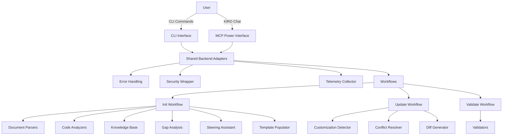

# Architecture Overview

## System Diagram

## Component Responsibilities

### CLI Interface (cli.py)
- **Responsibility:** Parse command-line arguments, orchestrate workflows, display results
- **Interface:** Typer commands (main, steering init/update/validate)
- **Dependencies:** typer, validators, generator, steering workflows

### MCP Power Interface (hiveforge-power)
- **Responsibility:** Provide MCP tools for KIRO IDE integration
- **Interface:** FastMCP server with 6 tools (init_steering, update_steering, validate_steering, reset_steering, discover_docs, rollback_steering)
- **Dependencies:** fastmcp, shared backend adapters

### Shared Backend Adapters (steering/shared/)
- **Responsibility:** Unified interface for both CLI and Power, error handling, security, telemetry
- **Interface:** Adapter functions that wrap workflow execution
- **Dependencies:** workflows, error_handling, security, telemetry

### Document Parsers (steering/parsers/)
- **Responsibility:** Parse markdown, PDF, and image artifacts into structured data
- **Interface:** parse() methods returning parsed content
- **Dependencies:** markdown, PyPDF2, pytesseract

### Code Analyzers (steering/analyzers/)
- **Responsibility:** Extract tech stack, architecture, conventions from codebase
- **Interface:** analyze() methods returning analysis results
- **Dependencies:** pathspec, language_detector, tech_stack_extractor, architecture_inferrer

### Knowledge Base (steering/knowledge_base.py)
- **Responsibility:** Store and retrieve gathered information with token limiting
- **Interface:** search(), get_tech_stack(), get_conventions()
- **Dependencies:** None (in-memory storage)

### Gap Analysis Engine (steering/gap_analysis.py)
- **Responsibility:** Identify missing information by comparing knowledge base against templates
- **Interface:** analyze_gaps() returning prioritized questions
- **Dependencies:** knowledge_base, templates

### Steering Assistant (steering/agents/steering_assistant.py)
- **Responsibility:** Conduct AI conversations to gather missing information
- **Interface:** ask_questions() with batching and caching
- **Dependencies:** openai, response_cache

### Template Populator (steering/template_populator.py)
- **Responsibility:** Fill steering file templates with gathered information
- **Interface:** populate() returning completed steering files
- **Dependencies:** templates, knowledge_base

### Validators (steering/validators/)
- **Responsibility:** Check steering files for completeness and consistency
- **Interface:** validate() returning validation report
- **Dependencies:** validation_rules.yaml

## Data Flow

### Init Workflow
1. User runs `hiveforge steering init`
2. CLI parses arguments, calls InitWorkflow
3. InitWorkflow creates staging directory
4. Document parsers read artifacts from .kiro/onboarding/
5. Code analyzers extract information from codebase (if --analyze-code)
6. Knowledge base aggregates all information
7. Gap analysis identifies missing information
8. Steering assistant asks questions to fill gaps
9. Template populator generates steering files
10. Validators check completeness
11. Files written to .kiro/steering/

### Update Workflow
1. User runs `hiveforge steering update`
2. UpdateWorkflow parses existing steering files
3. Document parsers read new artifacts
4. Customization detector identifies user edits
5. Gap analysis finds new missing information
6. Steering assistant gathers new information
7. Conflict resolver detects conflicts
8. Diff generator shows proposed changes
9. User approves changes
10. Files updated in .kiro/steering/

## Key Decisions

| Decision | Rationale | Trade-offs |
|----------|-----------|------------|
| Shared Backend Architecture | Single source of truth for CLI and Power | More abstraction layers, but easier maintenance |
| Modular Component Design | Clear separation of concerns, easy testing | More files, but better maintainability |
| Local Code Analysis | No LLM costs, faster, deterministic | Less sophisticated than LLM analysis |
| Token Limiting | Control API costs, predictable performance | May require multiple API calls for complex projects |
| Response Caching | Avoid redundant API calls, consistent answers | Cache invalidation complexity |
| File-Based Storage | Simple, no database needed | Not suitable for concurrent access |

## Scalability Considerations
- **Code Analysis**: Automatic sampling for codebases >10k files
- **Token Usage**: Hard limits prevent excessive API costs (4000 tokens context, 2000 tokens per template)
- **Caching**: Response cache reduces redundant LLM calls
- **Error Handling**: Graceful degradation continues with partial results
- **Bottlenecks**: LLM API rate limiting (handled with exponential backoff)