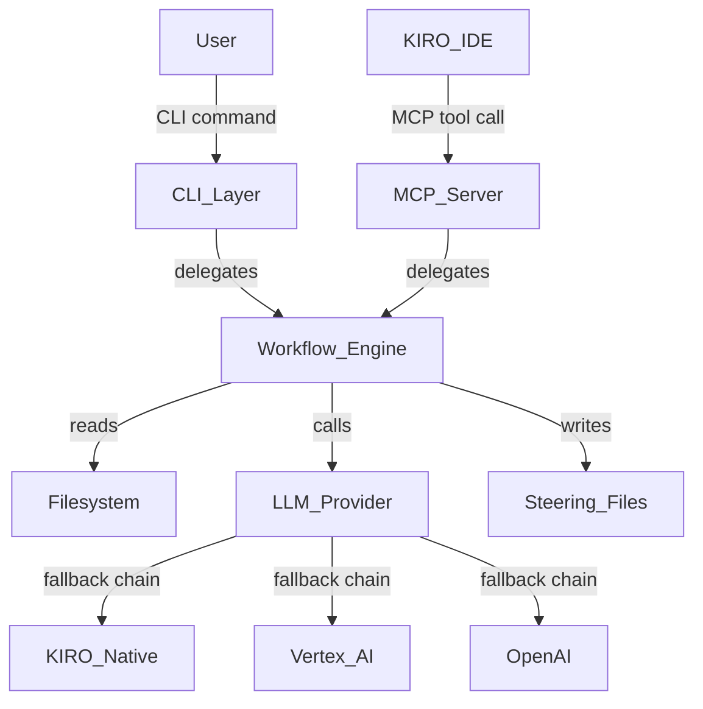

# Architecture Overview

## System Diagram

## Component Responsibilities

### CLI Layer (`hiveforge/steering/cli.py`)
- **Responsibility:** Parses user commands (`init`, `update`, `validate`, `discover`) and maps them to workflow execution
- **Interface:** Typer CLI commands with typed options and arguments
- **Dependencies:** Workflow Engine, SteeringConfig models

### MCP Server (`hiveforge/steering/mcp_server.py`)
- **Responsibility:** Exposes steering operations as MCP tools callable from KIRO IDE
- **Interface:** FastMCP tool definitions matching CLI capabilities
- **Dependencies:** Workflow Engine, same config models as CLI

### Workflow Engine
- **Responsibility:** Orchestrates the full steering file lifecycle — discovery, analysis, gap detection, generation, validation
- **Interface:** `InitWorkflow`, `AutonomousWorkflow`, `UpdateWorkflow` classes
- **Dependencies:** All analyzers, agents, validators, LLM provider

### Steering Assistant (`agents/steering_assistant.py`)
- **Responsibility:** Conducts interactive Q&A to fill knowledge gaps; generates file content via LLM or [INFERRED] fallback
- **Interface:** `conduct_conversation()`, `generate_file(filename, context)`
- **Dependencies:** LLMProvider, KnowledgeBase, GapAnalysis

### Code Analyzer (`analyzers/code_analyzer.py`)
- **Responsibility:** Performs AST-based analysis of the project codebase to extract tech stack, architecture patterns, and conventions
- **Interface:** `analyze(project_root)` → `CodeAnalysisResult`
- **Dependencies:** Python `ast` module, `pathspec`

### LLM Provider (`llm/provider.py`)
- **Responsibility:** Abstracts LLM access with automatic fallback chain (KIRO Native → Vertex AI → OpenAI)
- **Interface:** `complete(system_prompt, user_prompt, ...)` → `str`
- **Dependencies:** KIRO ctx.sample(), google-cloud-aiplatform, openai

### Template Populator (`template_populator.py`)
- **Responsibility:** Replaces placeholders in steering file templates with gathered knowledge
- **Interface:** `populate(template_name, knowledge)`, `populate_all(knowledge)`
- **Dependencies:** Templates module, knowledge dict from workflow

### Validators (`validators/`)
- **Responsibility:** Checks generated steering files for placeholder completeness, structural integrity, and cross-file consistency
- **Interface:** `validate_all(steering_dir)` → `ValidationReport`
- **Dependencies:** Validation rules YAML, optional LLM for semantic checks

### Drift Detector (`detectors/drift_detector.py`)
- **Responsibility:** Compares existing steering files against current codebase to detect documentation drift
- **Interface:** `detect(steering_dir, project_root)` → `DriftReport`
- **Dependencies:** Code Analyzer, steering file reader

## Data Flow

### `hiveforge steering init` (Interactive Mode)
1. CLI parses options → creates `SteeringConfig` → instantiates `InitWorkflow`
2. Workflow creates staging directory, backs up existing files
3. Code analyzer scans project → produces `CodeAnalysisResult`
4. Document parser reads `.kiro/onboarding/` artifacts → builds `KnowledgeBase`
5. Gap analyzer compares knowledge against template requirements → produces `GapAnalysis` with questions
6. Steering Assistant conducts batched Q&A conversation → populates `gathered_info`
7. Template Populator merges knowledge + gathered_info → produces populated markdown files
8. Files written to `.kiro/steering/`
9. Validator checks all files → produces `ValidationReport`

### `hiveforge steering init --analyze-code` (Autonomous Mode)
- Same as above but Step 6 uses `AutonomousWorkflow._generate_files_autonomously()`
- LLM generates content directly; falls back to `[INFERRED]` markers if unavailable

## Key Decisions

| Decision | Rationale | Trade-offs |
|----------|-----------|------------|
| Filesystem-only storage | Eliminates infrastructure dependency; steering files live in the repo | No cross-project sharing or team sync |
| LLM fallback chain | Works in any environment without mandatory API keys | Reduced quality without LLM; [INFERRED] markers require manual review |
| Typer + FastMCP dual interface | Same workflow logic serves both CLI and KIRO IDE | Two entry points to maintain; MCP mode has different interactive constraints |
| Python AST for code analysis | Deep, accurate analysis without external tools | Python-only; other languages get limited analysis |
| Template-based generation | Consistent structure; easy to validate | Templates can become stale; placeholder replacement is brittle |

## Scalability Considerations
- Token budget management (`token_budget.py`) prevents LLM context overflow on large codebases
- Scalable discovery (`scalable_discovery.py`) handles large repos with file count limits
- Response caching (`response_cache.py`) avoids redundant LLM calls during update cycles
- Sequential file generation in autonomous mode passes previous files as context to maintain consistency
