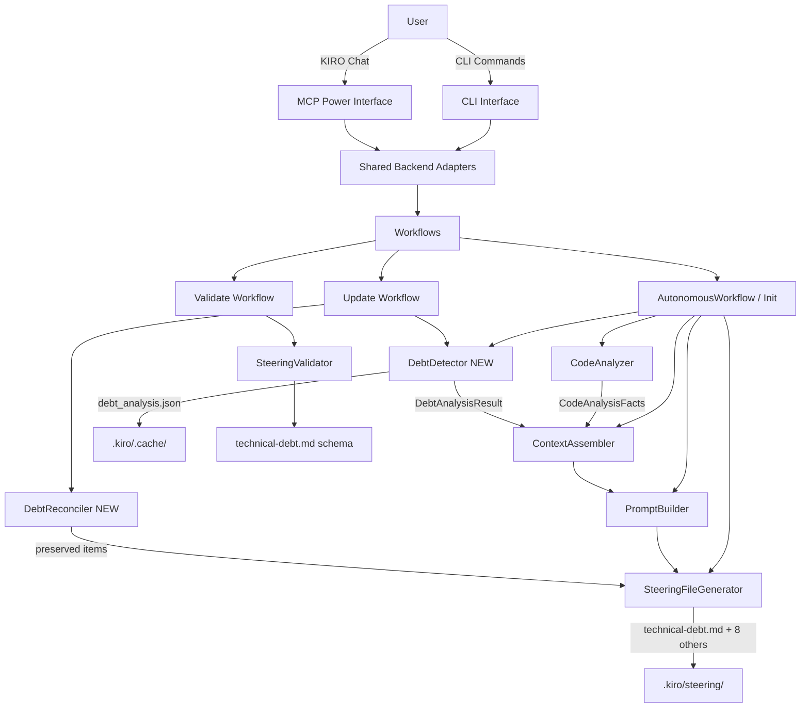

# Design Document: Code Review and Technical Debt Tracking

## Overview

This feature extends HiveForge v3.0.0 to generate a 9th steering file (`technical-debt.md`) that
tracks technical debt items discovered through static analysis of the codebase. It introduces a new
`DebtDetector` component that runs alongside the existing `CodeAnalyzer` and feeds structured debt
facts into the LLM-primary synthesis pipeline.

**What changes:**
- New `DebtDetector` component (`steering/detectors/debt_detector.py`)
- New data models: `DebtItem`, `DebtAnalysisResult`, `DebtCategory`, `DebtPriority`, `DebtStatus`
- `GENERATION_ORDER` in both `SteeringFileGenerator` and `AutonomousWorkflow` gains `technical-debt.md`
- `SteeringFileGenerator.generate_all_files()` accepts an optional `debt_facts` parameter
- `SteeringFileGenerator._schema_sections()` gains a schema entry for `technical-debt.md`
- `WorkflowState` gains an optional `debt_analysis` field
- `SteeringConfig` gains a `skip_debt_detection: bool = False` flag
- `AutonomousWorkflow._step_generate_files_autonomously()` runs `DebtDetector` and passes results
- CLI gains `--skip-debt-detection` flag
- MCP tool responses include a `debt_summary` metadata field

**What does not change:**
- The LLM-primary pipeline architecture (InputResolver → CodeAnalyzer → ContextAssembler →
  PromptBuilder → SteeringFileGenerator) is unchanged
- The atomic write guarantee: all 9 files succeed or none are written
- The `DriftDetector`, `CodeAnalyzer`, and all existing steering file schemas are unchanged
- The `CustomizationDetector` pattern for preserving user edits is reused as-is

---

## Architecture



---

## Components and Interfaces

### New Components

| Component | Path | Responsibility |
|-----------|------|----------------|
| `DebtDetector` | `steering/detectors/debt_detector.py` | Static analysis for DRY violations, test gaps, architecture smells, performance risks |
| `DebtReconciler` | `steering/detectors/debt_reconciler.py` | Merges new analysis results with existing `technical-debt.md`, preserving manual edits |

### Modified Components

| Component | Change |
|-----------|--------|
| `SteeringFileGenerator` | Add `technical-debt.md` to `GENERATION_ORDER`; add schema; accept `debt_facts` param |
| `AutonomousWorkflow` | Add `technical-debt.md` to `GENERATION_ORDER`; run `DebtDetector` in step 7 |
| `models.py` | Add `DebtItem`, `DebtAnalysisResult`, `DebtCategory`, `DebtPriority`, `DebtStatus`; extend `WorkflowState` and `SteeringConfig` |
| `cli.py` | Add `--skip-debt-detection` flag |
| MCP tool wrappers | Include `debt_summary` in response metadata |

---

## Data Models

```python
from dataclasses import dataclass, field
from enum import Enum
from typing import List, Optional


class DebtCategory(Enum):
    ARCHITECTURE = "Architecture"
    CODE_QUALITY  = "Code Quality"
    TESTS         = "Tests"
    PERFORMANCE   = "Performance"


class DebtPriority(Enum):
    CRITICAL = "Critical"
    HIGH     = "High"
    MEDIUM   = "Medium"
    LOW      = "Low"


class DebtStatus(Enum):
    ACTIVE      = "Active"
    IN_PROGRESS = "In Progress"
    RESOLVED    = "Resolved"
    DEFERRED    = "Deferred"


class DebtEffort(Enum):
    LOW    = "L"
    MEDIUM = "M"
    HIGH   = "H"


class DebtRisk(Enum):
    LOW    = "L"
    MEDIUM = "M"
    HIGH   = "H"


@dataclass
class DebtRecommendation:
    """One resolution option for a debt item."""
    title: str           # e.g. "Extract shared helper"
    description: str     # actionable steps
    trade_offs: str      # risks / downsides
    is_recommended: bool = False


@dataclass
class DebtItem:
    """
    A single tracked technical debt issue.

    id is a stable hash of (category, file_path, line_number) so it
    survives re-runs as long as the code location is unchanged.
    """
    id: str                              # sha256[:12] of (category + location)
    category: DebtCategory
    description: str
    location: str                        # "path/to/file.py:42" or "path/to/file.py"
    priority: DebtPriority
    effort: DebtEffort
    risk: DebtRisk
    status: DebtStatus
    confidence: float                    # 0.0–1.0
    recommendations: List[DebtRecommendation] = field(default_factory=list)
    detected_at: Optional[str] = None   # ISO-8601 timestamp
    resolved_at: Optional[str] = None   # ISO-8601 timestamp, set when moved to Resolved


@dataclass
class DebtMetrics:
    total_active: int = 0
    by_category: dict = field(default_factory=dict)   # DebtCategory.value → int
    by_priority: dict = field(default_factory=dict)   # DebtPriority.value → int
    last_updated: Optional[str] = None                # ISO-8601 timestamp


@dataclass
class DebtAnalysisResult:
    """Complete output of DebtDetector.detect()."""
    items: List[DebtItem] = field(default_factory=list)
    metrics: DebtMetrics = field(default_factory=DebtMetrics)
    sampled: bool = False          # True when sampling was applied (>10k files)
    analysis_time_s: float = 0.0

    def to_json_dict(self) -> dict:
        """JSON-serializable dict for LLM context injection (≤1000 tokens)."""
        ...

    def active_items(self) -> List[DebtItem]:
        return [i for i in self.items if i.status != DebtStatus.RESOLVED]

    def resolved_items(self) -> List[DebtItem]:
        return [i for i in self.items if i.status == DebtStatus.RESOLVED]
```

### Extended Existing Models

```python
# models.py additions

@dataclass
class WorkflowState:
    # ... existing fields ...
    debt_analysis: Optional[DebtAnalysisResult] = None   # NEW


@dataclass
class SteeringConfig:
    # ... existing fields ...
    skip_debt_detection: bool = False                    # NEW
```

---

## Component Interfaces

### `DebtDetector`

```python
class DebtDetector:
    """
    Analyzes a codebase for technical debt using local static analysis.
    Respects .gitignore via pathspec. Caches results in
    .kiro/.cache/debt_analysis.json.
    """

    CACHE_FILE = ".kiro/.cache/debt_analysis.json"
    LARGE_CODEBASE_THRESHOLD = 10_000   # files
    SAMPLE_SIZE = 2_000                 # files when sampling

    def __init__(
        self,
        project_root: Path,
        conventions_content: Optional[str] = None,
        logger_instance: Optional[logging.Logger] = None,
    ) -> None: ...

    def detect(self) -> DebtAnalysisResult:
        """
        Run all detectors and return aggregated results.
        Uses cache when available and codebase is unchanged.
        """
        ...

    # --- Sub-detectors (each returns List[DebtItem]) ---

    def _detect_dry_violations(self, files: List[Path]) -> List[DebtItem]:
        """AST-based repeated function/class body detection."""
        ...

    def _detect_test_gaps(self, files: List[Path]) -> List[DebtItem]:
        """File-to-test ratio analysis; uncovered public functions."""
        ...

    def _detect_architecture_smells(self, files: List[Path]) -> List[DebtItem]:
        """Circular import detection; god class detection (>500 LOC classes)."""
        ...

    def _detect_performance_risks(self, files: List[Path]) -> List[DebtItem]:
        """Regex pattern matching for N+1 patterns, unbounded loops."""
        ...

    # --- Helpers ---

    def _load_gitignore(self) -> Optional[pathspec.PathSpec]: ...
    def _collect_files(self) -> List[Path]: ...
    def _apply_sampling(self, files: List[Path]) -> List[Path]: ...
    def _load_cache(self) -> Optional[DebtAnalysisResult]: ...
    def _save_cache(self, result: DebtAnalysisResult) -> None: ...
    def _make_item_id(self, category: DebtCategory, location: str) -> str: ...
    def _apply_conventions_preferences(self, items: List[DebtItem]) -> List[DebtItem]: ...
```

### `DebtReconciler`

```python
class DebtReconciler:
    """
    Merges a fresh DebtAnalysisResult with the existing technical-debt.md,
    preserving manually added items and user edits.
    """

    def reconcile(
        self,
        existing_content: str,
        new_result: DebtAnalysisResult,
    ) -> DebtAnalysisResult:
        """
        Returns a merged DebtAnalysisResult where:
        - Items present in existing_content but absent from new_result
          are preserved with their current status (manual items kept Active,
          auto-detected items moved to Resolved).
        - User-edited descriptions/priorities from existing_content override
          the freshly detected values for matching item IDs.
        - New items from new_result are added with status=Active.
        """
        ...

    def _parse_existing_items(self, content: str) -> List[DebtItem]: ...
    def _is_manually_added(self, item: DebtItem, detected_ids: set) -> bool: ...
```

### Modified `SteeringFileGenerator`

```python
# steering_file_generator.py

GENERATION_ORDER: List[str] = [
    "project-vision.md",
    "tech-stack.md",
    "architecture.md",
    "conventions.md",
    "agents.md",
    "workflows.md",
    "security.md",
    "testing.md",
    "technical-debt.md",   # NEW — generated last so it can reference all others
]

async def generate_all_files(
    self,
    context_assembler: ContextAssembler,
    prompt_builder: PromptBuilder,
    output_dir: Path,
    *,
    use_case: UseCase,
    source_docs: List[ParsedDocument],
    code_facts: CodeAnalysisFacts,
    existing_steering: Dict[str, str],
    delta: Optional[DeltaReport] = None,
    user_intent: Optional[str] = None,
    template_contents: Optional[Dict[str, str]] = None,
    debt_facts: Optional[DebtAnalysisResult] = None,   # NEW
) -> GenerationResult: ...

def _schema_sections(self, template_name: str) -> List[str]:
    # Existing schemas unchanged, plus:
    # "technical-debt.md": [
    #     "Overview", "Debt Categories", "Active Debt Items",
    #     "Resolved Debt Items", "Debt Metrics",
    # ]
    ...
```

### Modified `AutonomousWorkflow`

```python
GENERATION_ORDER = [
    "project-vision.md",
    "tech-stack.md",
    "architecture.md",
    "conventions.md",
    "api-standards.md",
    "db-standards.md",
    "qa-standards.md",
    "ui-standards.md",
    "technical-debt.md",   # NEW
]

async def _step_generate_files_autonomously(self) -> None:
    # ... existing pipeline setup ...

    # NEW: run DebtDetector unless skipped
    debt_facts: Optional[DebtAnalysisResult] = None
    if not self.config.skip_debt_detection:
        conventions_content = existing_steering.get("conventions.md")
        detector = DebtDetector(
            project_root=self.project_root,
            conventions_content=conventions_content,
        )
        try:
            debt_facts = detector.detect()
            self.state.debt_analysis = debt_facts
        except Exception as e:
            logger.warning("DebtDetector failed (%s), continuing without debt facts", e)

    result = await generator.generate_all_files(
        ...,
        debt_facts=debt_facts,   # NEW
    )
```

---

## Data Flow

### Init Workflow (with Debt Detection)

```
User: hiveforge steering init
  │
  ├─ AutonomousWorkflow.execute()
  │    ├─ Step 3: CodeAnalyzer.analyze() → CodeAnalysisFacts
  │    ├─ Step 3b: DebtDetector.detect() → DebtAnalysisResult  [NEW]
  │    │           └─ cache → .kiro/.cache/debt_analysis.json
  │    ├─ Step 4: DocumentParser.parse_all() → source_docs
  │    ├─ Step 7: SteeringFileGenerator.generate_all_files(
  │    │              code_facts=..., debt_facts=...,           [NEW param]
  │    │              ...)
  │    │    ├─ For files 1–8: ContextAssembler.assemble() (unchanged)
  │    │    └─ For technical-debt.md (file 9):
  │    │         ContextAssembler.assemble(
  │    │             template_name="technical-debt.md",
  │    │             debt_facts=debt_facts,                     [NEW field]
  │    │             existing_steering includes conventions.md,
  │    │                 qa-standards.md, architecture.md
  │    │         )
  │    │         → PromptBuilder.build() injects debt_facts JSON
  │    │         → LLM generates technical-debt.md draft
  │    │         → _validate_draft() + _check_duplicate_paragraphs()
  │    │         → atomic write of all 9 files
  │    └─ Step 9: SteeringValidator checks all 9 files
```

### Update Workflow (with Debt Reconciliation)

```
User: hiveforge steering update
  │
  ├─ UpdateWorkflow.execute()
  │    ├─ Read existing .kiro/steering/technical-debt.md
  │    ├─ DebtDetector.detect() → fresh DebtAnalysisResult
  │    ├─ DebtReconciler.reconcile(
  │    │      existing_content=technical-debt.md,
  │    │      new_result=fresh_result
  │    │  ) → merged DebtAnalysisResult
  │    │    ├─ Manually added items → preserved (Active)
  │    │    ├─ Auto-detected items no longer present → Resolved
  │    │    ├─ User-edited descriptions/priorities → kept
  │    │    └─ New items → added (Active)
  │    └─ SteeringFileGenerator regenerates technical-debt.md
  │         with merged result as debt_facts
```

---

## Debt Detection Algorithms

### DRY Violations (Code Quality)

Uses Python's `ast` module to extract function and method bodies. Two functions are flagged as
duplicates when their normalized AST subtrees (variable names stripped) have a Jaccard similarity
≥ 0.85 and both bodies are ≥ 10 statements. Only Python files are analyzed in v3.1; other
languages fall back to line-hash comparison on blocks of ≥ 15 consecutive non-blank lines.

```
for each .py file:
    parse AST
    for each FunctionDef / AsyncFunctionDef:
        normalize body (rename all Name nodes to "_")
        compute body_hash = sha256(ast.dump(normalized_body))
    group functions by body_hash
    for groups with size > 1:
        emit DebtItem(category=CODE_QUALITY, priority=MEDIUM,
                      location="file.py:line", ...)
```

### Test Gaps (Tests)

Compares source files against test files using the naming convention `test_{module}.py`.

```
source_files = {f for f in files if not is_test_file(f)}
test_files   = {f for f in files if is_test_file(f)}

for each source_file:
    expected_test = "test_" + source_file.stem + ".py"
    if expected_test not in test_files:
        emit DebtItem(category=TESTS, priority=HIGH, ...)

    else:
        # Check for untested public functions
        public_fns = extract_public_functions(source_file)  # via AST
        tested_fns = extract_called_names(test_file)        # via AST
        for fn in public_fns - tested_fns:
            emit DebtItem(category=TESTS, priority=MEDIUM,
                          location="source_file.py:fn_line", ...)
```

Priority escalation: if `conventions.md` contains "Tested > Assumed" or specifies minimum
coverage, untested public functions are escalated to HIGH.

### Architecture Smells (Architecture)

Two heuristics are applied:

**God class detection** — any class with > 500 lines of code (measured by
`end_lineno - lineno` in the AST `ClassDef` node) is flagged.

**Circular import detection** — builds a directed import graph by scanning `import` and
`from ... import` statements across all Python files. Tarjan's SCC algorithm identifies cycles.
Each cycle is one `DebtItem`.

```
import_graph = build_import_graph(files)   # {module: set[imported_modules]}
sccs = tarjan_scc(import_graph)
for scc in sccs where len(scc) > 1:
    emit DebtItem(category=ARCHITECTURE, priority=HIGH,
                  description=f"Circular import: {' → '.join(scc)}", ...)

for each ClassDef where (end_lineno - lineno) > 500:
    emit DebtItem(category=ARCHITECTURE, priority=MEDIUM,
                  description=f"God class: {class_name} ({loc} LOC)", ...)
```

### Performance Risks (Performance)

Regex-based pattern matching on raw source text (no AST required, so works across languages):

| Pattern | Description | Priority |
|---------|-------------|----------|
| `for .+ in .+:\n.*\.query\(` | N+1 query in loop | HIGH |
| `while True:` without `break` within 20 lines | Unbounded loop | HIGH |
| `\+ =` inside a loop on a string variable | String concatenation in loop | MEDIUM |
| `\[.*\]` inside a loop assigned to a growing list | List allocation in loop | LOW |

Each match emits a `DebtItem` with `location="file.py:line_number"`.

---

## Update Workflow: Debt Reconciliation

The `DebtReconciler` parses the existing `technical-debt.md` to extract `DebtItem` objects by
reading the structured markdown table rows in each section. It uses item `id` (the stable hash) as
the primary key for matching.

**Reconciliation rules (in priority order):**

1. **User-edited items** — if an item's `id` exists in both the existing file and the new
   analysis, but the description or priority in the existing file differs from the detected value,
   the existing file's values are kept. This preserves intentional human overrides.

2. **Manually added items** — items present in the existing file whose `id` does not appear in
   the new analysis result are treated as manually added. They are preserved with their current
   status unchanged.

3. **Auto-resolved items** — items that were previously auto-detected (their `id` was in the last
   cached analysis) but are absent from the new analysis are moved to `Resolved` with
   `resolved_at` set to the current timestamp.

4. **New items** — items in the new analysis result whose `id` does not appear in the existing
   file are added with `status=Active` and `detected_at` set to the current timestamp.

5. **Historical resolved items** — items already in the `Resolved Debt Items` section are always
   preserved verbatim (requirement 10.2).

---

## `technical-debt.md` Template Schema

```markdown
---
inclusion: always
priority: 3
---

# Technical Debt

> Last updated: {ISO-8601 timestamp}

## Overview

{LLM-generated summary of overall debt health, key themes, and recommended focus areas.
Falls back to "No technical debt detected" when items list is empty.}

## Debt Categories

{Brief description of each of the four categories and how many active items exist in each.}

## Active Debt Items

### Architecture

| ID | Description | Priority | Effort | Risk | Status |
|----|-------------|----------|--------|------|--------|
| {id} | {description} | {priority} | {effort} | {risk} | {status} |

> Recommendations for each item listed below the table.

### Code Quality

{same table structure}

### Tests

{same table structure}

### Performance

{same table structure}

## Resolved Debt Items

| ID | Description | Category | Resolved At |
|----|-------------|----------|-------------|
| {id} | {description} | {category} | {resolved_at} |

## Debt Metrics

| Metric | Value |
|--------|-------|
| Total Active Items | {n} |
| Architecture | {n} |
| Code Quality | {n} |
| Tests | {n} |
| Performance | {n} |
| Critical | {n} |
| High | {n} |
| Medium | {n} |
| Low | {n} |
```

The `ContextAssembler` injects `debt_facts.to_json_dict()` as a new `debt_facts` field in the
`GenerationContext` when `template_name == "technical-debt.md"`. The `PromptBuilder` serializes
this to JSON and appends it to the user prompt under a `## Detected Debt Facts` heading, alongside
the existing `conventions.md`, `qa-standards.md`, and `architecture.md` content from
`existing_steering`.

---

## Error Handling

| Failure Scenario | Behavior |
|-----------------|----------|
| `DebtDetector` raises any exception | Log warning; set `debt_facts=None`; continue generation with placeholder content |
| Unparseable file during analysis | Skip file; log `WARNING: skipping {path}: {error}` |
| LLM unavailable | `SteeringFileGenerator` raises `LLMUnavailableError`; `technical-debt.md` gets `[INFERRED]` markers via fallback path |
| Cache file corrupt | Delete cache; re-run analysis |
| `DebtReconciler` parse error on existing file | Log warning; treat existing file as having no prior items; proceed with fresh analysis |
| Atomic write failure (any of 9 files) | All writes rolled back; `GenerationResult(success=False)` returned |
| `--skip-debt-detection` flag set | `DebtDetector` not instantiated; `debt_facts=None` passed to generator; `technical-debt.md` generated with placeholder content |

---

## Testing Strategy

### Unit Tests

Focus on specific examples and edge cases:

- `DebtDetector` with a synthetic codebase containing known violations (one test per detector type)
- `DebtReconciler` with a hand-crafted `technical-debt.md` containing manual items
- `_schema_sections("technical-debt.md")` returns all 5 required section names
- `DebtItem.id` stability: same input produces same hash across calls
- `DebtAnalysisResult.to_json_dict()` output fits within 1000 tokens
- Empty codebase produces `DebtAnalysisResult` with zero items and no exceptions
- Unparseable `.py` file is skipped without raising

### Property-Based Tests

Use `hypothesis` (Python PBT library). Each test runs a minimum of 100 iterations.

Tag format: `# Feature: code-review-and-debt-tracking, Property {N}: {property_text}`

---

## Correctness Properties

*A property is a characteristic or behavior that should hold true across all valid executions of a
system — essentially, a formal statement about what the system should do. Properties serve as the
bridge between human-readable specifications and machine-verifiable correctness guarantees.*

### Property 1: technical-debt.md is always generated during init

*For any* valid project root and `SteeringConfig` where `skip_debt_detection` is False or True,
running the init workflow should produce a `files_written` list that includes `technical-debt.md`.

**Validates: Requirements 1.1, 5.1**

---

### Property 2: technical-debt.md always contains required sections

*For any* generated `technical-debt.md` content, the file should contain all five required
sections: Overview, Debt Categories, Active Debt Items, Resolved Debt Items, and Debt Metrics.

**Validates: Requirements 1.3, 10.1**

---

### Property 3: technical-debt.md always contains valid YAML frontmatter

*For any* generated `technical-debt.md`, parsing its YAML frontmatter should yield
`inclusion == "always"` and `priority == 3`.

**Validates: Requirements 1.2**

---

### Property 4: DebtItem fields are always valid

*For any* `DebtItem` produced by `DebtDetector.detect()`, all enum fields (`category`, `priority`,
`effort`, `risk`, `status`) must be valid enum members, `confidence` must be in `[0.0, 1.0]`, and
`recommendations` must contain at least two entries.

**Validates: Requirements 2.7, 2.8, 3.1, 3.2, 3.4, 3.5, 4.1, 8.1**

---

### Property 5: DebtItem IDs are stable across re-runs

*For any* codebase and any `DebtItem` produced by two successive calls to `DebtDetector.detect()`
on the same unchanged code, the `id` field of matching items must be identical.

**Validates: Requirements 2.7** (stable identity is required for reconciliation)

---

### Property 6: DebtDetector produces no items from gitignore-excluded paths

*For any* codebase with a `.gitignore` file, no `DebtItem.location` produced by
`DebtDetector.detect()` should reference a path that matches the `.gitignore` patterns.

**Validates: Requirements 2.6**

---

### Property 7: Manual debt items survive an update cycle

*For any* `technical-debt.md` containing manually added items (IDs not present in the fresh
analysis), after running `DebtReconciler.reconcile()`, all manually added items must still be
present in the returned `DebtAnalysisResult`.

**Validates: Requirements 4.4, 4.5**

---

### Property 8: Auto-resolved items are moved, not deleted

*For any* `DebtAnalysisResult` where a previously detected item (by ID) is absent from the new
analysis, `DebtReconciler.reconcile()` must include that item in `resolved_items()` with
`status == DebtStatus.RESOLVED`, not remove it entirely.

**Validates: Requirements 4.3, 10.2**

---

### Property 9: Atomic write guarantee holds for 9 files

*For any* generation run where any single file (including `technical-debt.md`) fails validation,
`GenerationResult.files_written` must be empty and no files must be written to disk.

**Validates: Requirements 5.4**

---

### Property 10: Debt analysis cache round-trip

*For any* `DebtAnalysisResult`, serializing it to `.kiro/.cache/debt_analysis.json` and
deserializing it should produce an equivalent result (same item IDs, categories, priorities).

**Validates: Requirements 12.4**

---

### Property 11: Context assembly includes cross-reference steering files

*For any* call to `ContextAssembler.assemble()` with `template_name="technical-debt.md"` and
`existing_steering` containing `conventions.md`, `qa-standards.md`, and `architecture.md`, the
returned `GenerationContext.existing_steering` must include all three files.

**Validates: Requirements 9.1**

---

### Property 12: DRY violation detection is monotone

*For any* codebase, adding a verbatim copy of an existing function to a new file should result in
`DebtDetector.detect()` returning at least one additional `DebtItem` with
`category == DebtCategory.CODE_QUALITY` compared to the baseline run.

**Validates: Requirements 2.1**

---

### Property 13: Test gap detection is monotone

*For any* codebase, removing the test file for a module that has public functions should result in
`DebtDetector.detect()` returning at least one additional `DebtItem` with
`category == DebtCategory.TESTS` compared to the baseline run.

**Validates: Requirements 2.2**
