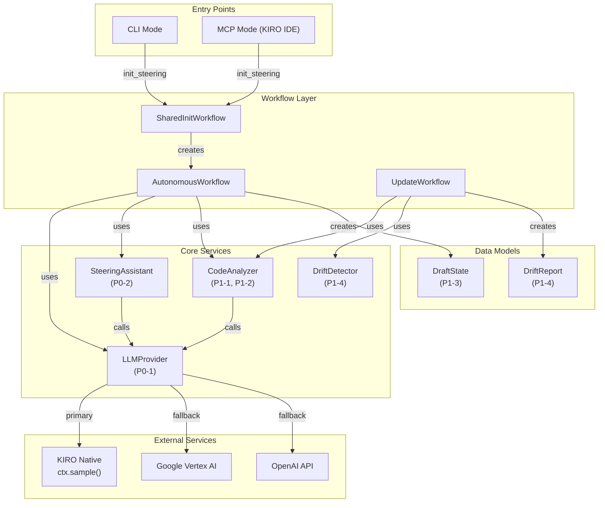
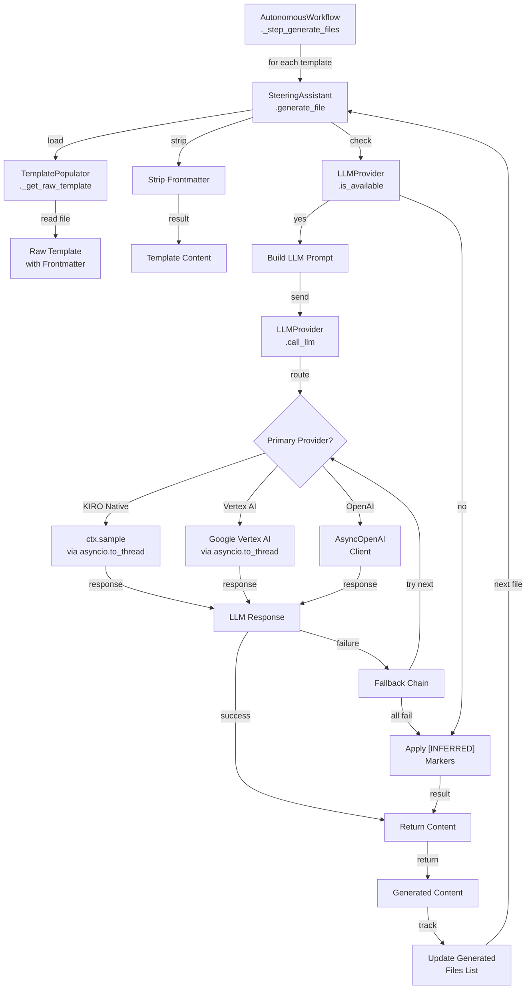
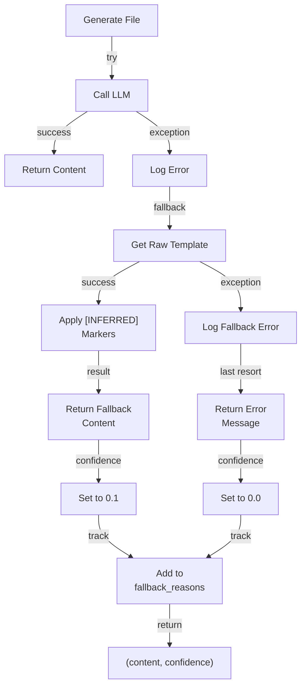
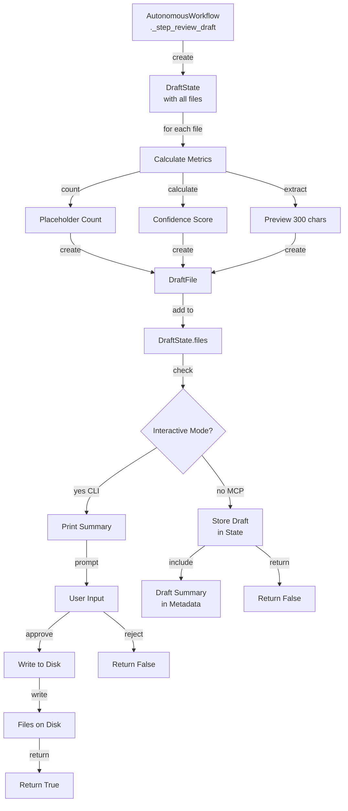
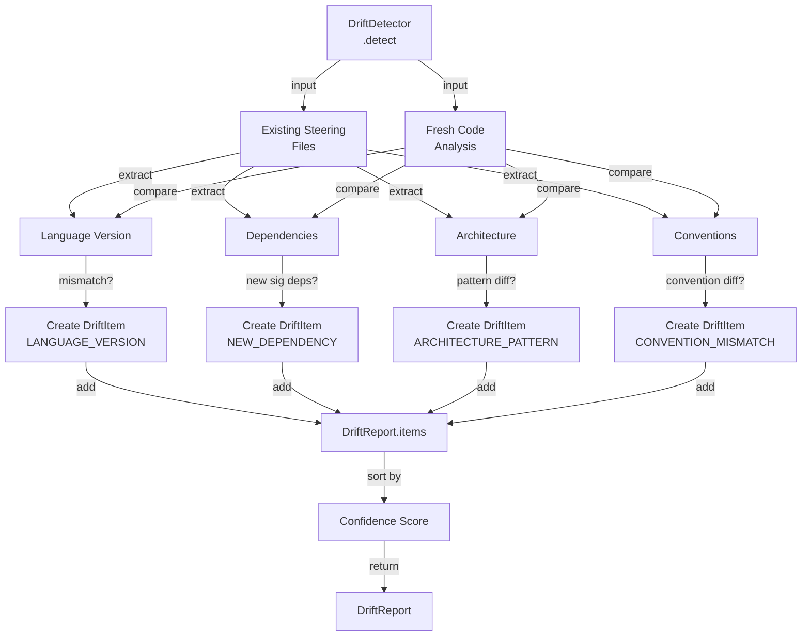

# HiveForge Steering System Improvements - Design Document

## Overview

This design document specifies the implementation approach for 13 requirements across P0 (critical), P1 (important), and P2 (enhancement) priority levels. The improvements enable autonomous steering file generation with LLM synthesis, proper error handling with fallback markers, drift detection for updates, and project-type-aware templates.

## System Architecture

### High-Level Architecture Diagram



### Component Interaction Diagram

```mermaid
sequenceDiagram
    participant User
    participant SharedInit
    participant AutonomousWF
    participant CodeAnalyzer
    participant LLMProvider
    participant SteeringAssistant
    participant DraftState
    
    User->>SharedInit: init_steering(project_root, interactive=False)
    SharedInit->>AutonomousWF: create with ctx, config
    
    AutonomousWF->>CodeAnalyzer: analyze()
    CodeAnalyzer-->>AutonomousWF: CodeAnalysisResult
    
    AutonomousWF->>AutonomousWF: _filter_files_for_project_type()
    
    loop For each template file
        AutonomousWF->>SteeringAssistant: generate_file(filename, context)
        SteeringAssistant->>LLMProvider: is_available()
        
        alt LLM Available
            SteeringAssistant->>LLMProvider: call_llm(prompt)
            LLMProvider->>LLMProvider: route to primary/fallback
            LLMProvider-->>SteeringAssistant: response
            SteeringAssistant-->>AutonomousWF: populated_content
        else LLM Unavailable
            SteeringAssistant->>SteeringAssistant: apply [INFERRED] markers
            SteeringAssistant-->>AutonomousWF: fallback_content
        end
    end
    
    AutonomousWF->>DraftState: create with all files
    AutonomousWF->>AutonomousWF: _step_review_draft()
    
    alt Interactive Mode
        AutonomousWF->>User: print draft summary
        User->>AutonomousWF: approve/reject
        AutonomousWF->>AutonomousWF: write files to disk
    else Non-Interactive Mode
        AutonomousWF->>DraftState: store draft
        AutonomousWF-->>User: return with draft in metadata
    end


## P0: Critical Fixes Design

### P0-1: LLMProvider Architecture

#### Class Structure

```python
# hiveforge/steering/llm/provider.py

from dataclasses import dataclass
from typing import Optional, Dict, Any
from enum import Enum
import asyncio
import json
from pathlib import Path

class ProviderType(Enum):
    KIRO_NATIVE = "kiro_native"
    VERTEX_AI = "vertex_ai"
    OPENAI = "openai"
    NONE = "none"

@dataclass
class LLMConfig:
    """Configuration for LLM provider"""
    provider_type: ProviderType
    api_key: Optional[str] = None
    project_id: Optional[str] = None  # For Vertex AI
    model: str = "gpt-4"
    temperature: float = 0.1
    max_tokens: int = 2000

class LLMProvider:
    """
    Routes LLM calls to available providers with priority:
    1. KIRO native (ctx.sample()) - primary for MCP mode
    2. Google Vertex AI
    3. OpenAI
    4. None (fallback to [INFERRED] markers)
    """
    
    def __init__(self, ctx: Optional[Any] = None):
        """
        Initialize LLMProvider with optional KIRO context.
        
        Args:
            ctx: KIRO context object (available in MCP mode)
        """
        self.ctx = ctx
        self.config = self._load_config()
        self.primary_provider = self._determine_primary_provider()
        self.logger = logging.getLogger(__name__)
    
    def _load_config(self) -> LLMConfig:
        """
        Load configuration from:
        1. Environment variables (highest priority)
        2. ~/.hiveforge/llm_config.json
        3. Defaults
        """
        # Check environment variables first
        if os.getenv("HIVEFORGE_LLM_PROVIDER") == "vertex":
            return LLMConfig(
                provider_type=ProviderType.VERTEX_AI,
                project_id=os.getenv("GOOGLE_CLOUD_PROJECT"),
                api_key=os.getenv("GOOGLE_APPLICATION_CREDENTIALS")
            )
        elif os.getenv("HIVEFORGE_LLM_PROVIDER") == "openai":
            return LLMConfig(
                provider_type=ProviderType.OPENAI,
                api_key=os.getenv("OPENAI_API_KEY")
            )
        
        # Check config file
        config_path = Path.home() / ".hiveforge" / "llm_config.json"
        if config_path.exists():
            with open(config_path) as f:
                config_dict = json.load(f)
                return LLMConfig(**config_dict)
        
        # Default: no external provider
        return LLMConfig(provider_type=ProviderType.NONE)
    
    def _determine_primary_provider(self) -> ProviderType:
        """Determine which provider to use based on context and config"""
        if self.ctx is not None:
            return ProviderType.KIRO_NATIVE
        
        if self.config.provider_type != ProviderType.NONE:
            return self.config.provider_type
        
        return ProviderType.NONE
    
    def is_available(self) -> bool:
        """Check if any LLM provider is available and accessible"""
        try:
            if self.primary_provider == ProviderType.KIRO_NATIVE:
                return self.ctx is not None
            elif self.primary_provider == ProviderType.VERTEX_AI:
                return self._check_vertex_ai_available()
            elif self.primary_provider == ProviderType.OPENAI:
                return self._check_openai_available()
            return False
        except Exception as e:
            self.logger.warning(f"Error checking LLM availability: {e}")
            return False
    
    async def complete(
        self,
        system_prompt: str,
        user_prompt: str,
        max_tokens: int = 2000,
        temperature: float = 0.3,
        json_mode: bool = False,
    ) -> Optional[str]:
        """
        Call LLM with fallback chain.
        
        Args:
            system_prompt: System instruction for the LLM
            user_prompt: User message/prompt
            max_tokens: Maximum tokens in response
            temperature: Sampling temperature (0.0-1.0)
            json_mode: Whether to request JSON response format
        
        Returns:
            LLM response string, or None if all providers fail
        """
        try:
            if self.primary_provider == ProviderType.KIRO_NATIVE:
                return await self._call_kiro_native(system_prompt, user_prompt, max_tokens)
            elif self.primary_provider == ProviderType.VERTEX_AI:
                return await self._call_vertex_ai(system_prompt, user_prompt, max_tokens, temperature, json_mode)
            elif self.primary_provider == ProviderType.OPENAI:
                return await self._call_openai(system_prompt, user_prompt, max_tokens, temperature, json_mode)
        except Exception as e:
            self.logger.warning(f"LLM call failed with {self.primary_provider}: {e}")
            return await self._fallback_chain(system_prompt, user_prompt, max_tokens, temperature, json_mode)
        
        return None
    
    async def _call_kiro_native(
        self,
        system_prompt: str,
        user_prompt: str,
        max_tokens: int
    ) -> Optional[str]:
        """Call KIRO native LLM via ctx.sample()"""
        if self.ctx is None:
            return None
        
        try:
            # ctx.sample() is async in FastMCP
            response = await self.ctx.sample(
                messages=[{"role": "user", "content": user_prompt}],
                system_prompt=system_prompt,
                max_tokens=max_tokens
            )
            return response.text
        except Exception as e:
            self.logger.warning(f"KIRO native call failed: {e}")
            raise
    
    async def _call_vertex_ai(
        self,
        system_prompt: str,
        user_prompt: str,
        max_tokens: int,
        temperature: float,
        json_mode: bool
    ) -> Optional[str]:
        """Call Google Vertex AI API"""
        try:
            from google.cloud import aiplatform
            from vertexai.generative_models import GenerativeModel, GenerationConfig
            
            # Initialize Vertex AI
            aiplatform.init(project=self.config.project_id)
            
            # Create model instance
            model = GenerativeModel(
                model_name="gemini-pro",
                system_instruction=system_prompt
            )
            
            # Configure generation
            gen_config = GenerationConfig(
                max_output_tokens=max_tokens,
                temperature=temperature,
                response_mime_type="application/json" if json_mode else "text/plain"
            )
            
            # Call model in thread to avoid blocking (Vertex SDK is sync)
            response = await asyncio.to_thread(
                model.generate_content,
                user_prompt,
                generation_config=gen_config
            )
            
            return response.text
        except Exception as e:
            self.logger.warning(f"Vertex AI call failed: {e}")
            raise
    
    async def _call_openai(
        self,
        system_prompt: str,
        user_prompt: str,
        max_tokens: int,
        temperature: float,
        json_mode: bool
    ) -> Optional[str]:
        """Call OpenAI API with AsyncOpenAI client"""
        try:
            from openai import AsyncOpenAI
            
            client = AsyncOpenAI(api_key=self.config.api_key)
            
            messages = [
                {"role": "system", "content": system_prompt},
                {"role": "user", "content": user_prompt}
            ]
            
            kwargs = {
                "model": self.config.model,
                "messages": messages,
                "temperature": temperature,
                "max_tokens": max_tokens
            }
            
            if json_mode:
                kwargs["response_format"] = {"type": "json_object"}
            
            response = await client.chat.completions.create(**kwargs)
            
            return response.choices[0].message.content
        except Exception as e:
            self.logger.warning(f"OpenAI call failed: {e}")
            raise
    
    async def _fallback_chain(
        self,
        system_prompt: str,
        user_prompt: str,
        max_tokens: int,
        temperature: float,
        json_mode: bool
    ) -> Optional[str]:
        """Try remaining providers in priority order"""
        providers = [
            (ProviderType.VERTEX_AI, self._call_vertex_ai),
            (ProviderType.OPENAI, self._call_openai)
        ]
        
        for provider_type, call_func in providers:
            if provider_type == self.primary_provider:
                continue  # Already tried
            
            try:
                self.logger.info(f"Falling back to {provider_type.value}")
                return await call_func(system_prompt, user_prompt, max_tokens, temperature, json_mode)
            except Exception as e:
                self.logger.warning(f"Fallback {provider_type.value} failed: {e}")
                continue
        
        return None
    
    def _check_vertex_ai_available(self) -> bool:
        """Check if Vertex AI is configured and accessible"""
        try:
            from google.cloud import aiplatform
            return self.config.project_id is not None
        except ImportError:
            return False
    
    def _check_openai_available(self) -> bool:
        """Check if OpenAI is configured and accessible"""
        try:
            from openai import AsyncOpenAI
            return self.config.api_key is not None
        except ImportError:
            return False
```

#### Configuration File Format

```json
{
  "provider_type": "vertex_ai",
  "project_id": "my-gcp-project",
  "model": "gemini-pro",
  "temperature": 0.1,
  "max_tokens": 2000
}
```

#### Integration Points

**CRITICAL: ctx Parameter Threading**

The `ctx` parameter must be threaded through the entire workflow chain to enable KIRO native LLM access in MCP mode:

```
init_steering.py (entry point)
  ↓ receives ctx: Context from FastMCP
  ↓ passes to
SharedInitWorkflow.__init__(ctx=ctx)
  ↓ stores self.ctx = ctx
  ↓ passes to
AutonomousWorkflow.__init__(ctx=ctx)
  ↓ stores self.ctx = ctx
  ↓ passes to
SteeringAssistant.__init__(ctx=ctx)
  ↓ creates
LLMProvider(ctx=ctx)
  ↓ uses ctx.sample() for LLM calls
```

**Required Changes:**

1. **init_steering.py**: Already receives `ctx` parameter from FastMCP
2. **SharedInitWorkflow.__init__**: Add `ctx=None` parameter, store as `self.ctx`
3. **AutonomousWorkflow.__init__**: Add `ctx=None` parameter, store as `self.ctx`
4. **SteeringAssistant.__init__**: Add `ctx=None` parameter, pass to `LLMProvider(ctx=ctx)`
5. **All async methods**: Mark as `async def` and use `await` for LLM calls

**Async Method Chain:**

```python
# All these methods must be async def:
async def generate_file(...)  # SteeringAssistant
async def _generate_single_file(...)  # AutonomousWorkflow
async def _step_generate_files_autonomously(...)  # AutonomousWorkflow
```

- **SharedInitWorkflow**: Receives `ctx` parameter and passes to `AutonomousWorkflow`
- **AutonomousWorkflow**: Creates `LLMProvider(ctx)` and passes to `SteeringAssistant`
- **SteeringAssistant**: Calls `llm_provider.complete()` for file generation
- **CodeAnalyzer**: Calls `llm_provider.complete()` for project classification (P2-2)


### P0-2: SteeringAssistant.generate_file() Implementation

#### Method Signature and Flow

```python
# hiveforge/steering/agents/steering_assistant.py

class SteeringAssistant:
    """Generates steering file content using LLM synthesis"""
    
    def __init__(
        self,
        project_root: Path,
        llm_provider: LLMProvider,
        code_analysis: CodeAnalysisResult
    ):
        self.project_root = project_root
        self.llm_provider = llm_provider
        self.code_analysis = code_analysis
        self.logger = logging.getLogger(__name__)
        self.generated_files: List[str] = []  # Track last 3 for context
    
    async def generate_file(
        self,
        filename: str,
        context: Dict[str, Any]
    ) -> str:
        """
        Generate steering file content using LLM synthesis.
        
        Args:
            filename: Name of steering file (e.g., 'tech-stack.md')
            context: Knowledge base context including code analysis
        
        Returns:
            Populated markdown string (never empty)
        
        Raises:
            FileNotFoundError: If template not found
        """
        try:
            # Step 1: Load raw template with frontmatter
            raw_template = self._get_raw_template(filename)
            
            # Step 2: Strip YAML frontmatter
            template_content = self._strip_frontmatter(raw_template)
            
            # Step 3: Build LLM prompt
            prompt = self._build_llm_prompt(
                filename,
                template_content,
                context
            )
            
            # Step 4: Call LLM if available
            if self.llm_provider.is_available():
                response = await self.llm_provider.call_llm(
                    prompt=prompt,
                    system_prompt=self._get_system_prompt(),
                    temperature=0.1
                )
                
                if response:
                    self.logger.info(
                        f"Generated {filename}: {len(response)} chars"
                    )
                    self._track_generated_file(response)
                    return response
            
            # Step 5: Fallback to [INFERRED] markers
            self.logger.warning(
                f"LLM unavailable for {filename}, using [INFERRED] markers"
            )
            fallback_content = self._apply_inferred_markers(template_content)
            return fallback_content
            
        except Exception as e:
            self.logger.error(
                f"Error generating {filename}: {type(e).__name__}: {e}"
            )
            # Return template with [INFERRED] markers as last resort
            return self._apply_inferred_markers(raw_template)
    
    def _get_raw_template(self, template_name: str) -> str:
        """
        Load raw template content including frontmatter.
        
        Args:
            template_name: Template filename (e.g., 'tech-stack.md')
        
        Returns:
            Complete template file content as string
        
        Raises:
            FileNotFoundError: If template not found
            ValueError: If template_name is invalid
        """
        template_path = self._resolve_template_path(template_name)
        
        if not template_path.exists():
            available = self._list_available_templates()
            raise FileNotFoundError(
                f"Template {template_name} not found. "
                f"Available: {', '.join(available)}"
            )
        
        try:
            with open(template_path, 'r', encoding='utf-8') as f:
                return f.read()
        except Exception as e:
            raise FileNotFoundError(
                f"Cannot read template {template_path}: {e}"
            )
    
    def _strip_frontmatter(self, content: str) -> str:
        """
        Remove YAML frontmatter from template.
        
        Frontmatter is between first and second '---' delimiters.
        """
        lines = content.split('\n')
        
        if not lines or lines[0].strip() != '---':
            return content  # No frontmatter
        
        # Find closing ---
        for i in range(1, len(lines)):
            if lines[i].strip() == '---':
                return '\n'.join(lines[i+1:])
        
        return content  # Malformed frontmatter, return as-is
    
    def _build_llm_prompt(
        self,
        filename: str,
        template_content: str,
        context: Dict[str, Any]
    ) -> str:
        """
        Build comprehensive LLM prompt with context.
        
        Includes:
        - Template with placeholders
        - Code analysis summary
        - Last 3 generated files (for consistency)
        """
        recent_files = '\n\n'.join(self.generated_files[-3:])
        
        prompt = f"""
# Task: Generate Steering File

## File: {filename}

## Template (replace all {{placeholders}} with real content):
{template_content}

## Project Context:
{self._format_context(context)}

## Previously Generated Files (for consistency):
{recent_files if recent_files else '(none yet)'}

## Instructions:
1. Replace ALL {{placeholder}} text with real, specific content
2. Use the project context to make accurate, detailed entries
3. Maintain consistency with previously generated files
4. Output ONLY the final Markdown (no explanations)
5. Never leave {{placeholder}} text in your output
"""
        return prompt
    
    def _format_context(self, context: Dict[str, Any]) -> str:
        """Format code analysis context for LLM"""
        parts = []
        
        if 'languages' in context:
            parts.append(f"Languages: {', '.join(context['languages'])}")
        
        if 'dependencies' in context:
            deps = context['dependencies'][:10]  # Limit to 10
            parts.append(f"Key Dependencies: {', '.join(deps)}")
        
        if 'architecture' in context:
            parts.append(f"Architecture: {context['architecture']}")
        
        if 'mcp_tools' in context:
            tools = context['mcp_tools'][:5]  # Limit to 5
            parts.append(f"MCP Tools: {', '.join(tools)}")
        
        return '\n'.join(parts)
    
    def _get_system_prompt(self) -> str:
        """System prompt for LLM"""
        return (
            "You are a technical documentation expert generating a KIRO "
            "steering file. Your task is to populate templates with "
            "accurate, project-specific content. Replace ALL {placeholder} "
            "text with real content. Output ONLY the final Markdown. "
            "Never leave {placeholder} text in your output."
        )
    
    def _apply_inferred_markers(self, template_content: str) -> str:
        """
        Replace placeholders with [INFERRED] markers.
        
        Pattern: {placeholder} → [INFERRED: placeholder]
        """
        import re
        
        def replace_placeholder(match):
            placeholder = match.group(1)
            return f"[INFERRED: {placeholder}]"
        
        return re.sub(r'\{([^}]+)\}', replace_placeholder, template_content)
    
    def _track_generated_file(self, content: str) -> None:
        """Track generated file for context in subsequent files"""
        # Keep last 3 files for context
        self.generated_files.append(content[:500])  # First 500 chars
        if len(self.generated_files) > 3:
            self.generated_files.pop(0)
    
    def _resolve_template_path(self, template_name: str) -> Path:
        """Resolve template path (handles variants)"""
        # Try project-type-specific variant first
        project_type = self.code_analysis.project_type
        variant_path = (
            self.project_root / 'templates' / 'steering' /
            f"{template_name}.{project_type}.md"
        )
        if variant_path.exists():
            return variant_path
        
        # Fall back to generic template
        generic_path = (
            self.project_root / 'templates' / 'steering' / template_name
        )
        return generic_path
    
    def _list_available_templates(self) -> List[str]:
        """List available template files"""
        template_dir = self.project_root / 'templates' / 'steering'
        if not template_dir.exists():
            return []
        
        return [f.name for f in template_dir.glob('*.md')]
```

#### Integration with AutonomousWorkflow

```python
# In AutonomousWorkflow._generate_single_file()

async def _generate_single_file(
    self,
    filename: str,
    steering_assistant: SteeringAssistant
) -> Tuple[str, str, float]:
    """
    Generate single steering file.
    
    Returns:
        (filename, content, confidence_score)
    """
    try:
        context = {
            'languages': self.code_analysis.languages,
            'dependencies': self.code_analysis.dependencies,
            'architecture': self.code_analysis.architecture_pattern,
            'mcp_tools': self.code_analysis.mcp_tools,
        }
        
        content = await steering_assistant.generate_file(filename, context)
        
        # Calculate confidence based on placeholder count
        placeholder_count = len(re.findall(r'\{[^}]+\}', content))
        confidence = max(0.1, 1.0 - (placeholder_count * 0.1))
        
        return (filename, content, confidence)
    
    except Exception as e:
        self.logger.error(f"Failed to generate {filename}: {e}")
        # Return template with [INFERRED] markers
        template = steering_assistant._get_raw_template(filename)
        fallback = steering_assistant._apply_inferred_markers(template)
        return (filename, fallback, 0.1)
```


### P0-3: Fix AutonomousWorkflow Silent Failures

#### Error Handling Strategy

```python
# In AutonomousWorkflow

class AutonomousWorkflow:
    """Generates steering files autonomously with proper error handling"""
    
    def __init__(self, config: SteeringConfig, code_analysis: CodeAnalysisResult):
        self.config = config
        self.code_analysis = code_analysis
        self.fallback_reasons: List[str] = []
        self.logger = logging.getLogger(__name__)
    
    async def _step_generate_files_autonomously(self) -> bool:
        """
        Generate all steering files with fallback handling.
        
        Returns:
            True if all files generated successfully, False if any fallbacks used
        """
        self.generated_files = {}
        self.confidence_scores = {}
        
        for filename in self.config.template_files:
            try:
                content, confidence = await self._generate_file_with_fallback(
                    filename
                )
                
                self.generated_files[filename] = content
                self.confidence_scores[filename] = confidence
                
            except Exception as e:
                self.logger.error(
                    f"Unhandled exception generating {filename}: "
                    f"{type(e).__name__}: {e}"
                )
                # Apply fallback
                content, confidence = self._apply_fallback(filename, str(e))
                self.generated_files[filename] = content
                self.confidence_scores[filename] = confidence
        
        # Verify no empty files
        for filename, content in self.generated_files.items():
            if not content or not content.strip():
                self.logger.error(f"Generated empty file: {filename}")
                self.generated_files[filename] = (
                    f"[GENERATION FAILED — please fill manually]\n\n"
                    f"File: {filename}"
                )
                self.confidence_scores[filename] = 0.0
        
        return len(self.fallback_reasons) == 0
    
    async def _generate_file_with_fallback(
        self,
        filename: str
    ) -> Tuple[str, float]:
        """
        Generate file with automatic fallback on failure.
        
        Returns:
            (content, confidence_score)
        """
        try:
            context = self._build_context_for_file(filename)
            content = await self.steering_assistant.generate_file(
                filename,
                context
            )
            
            # Verify content is not empty
            if not content or not content.strip():
                raise ValueError("LLM returned empty content")
            
            # Calculate confidence
            placeholder_count = len(re.findall(r'\{[^}]+\}', content))
            confidence = max(0.1, 1.0 - (placeholder_count * 0.1))
            
            return (content, confidence)
        
        except Exception as e:
            self.logger.warning(
                f"Generation failed for {filename}: {type(e).__name__}: {e}"
            )
            return self._apply_fallback(filename, str(e))
    
    def _apply_fallback(
        self,
        filename: str,
        error_reason: str
    ) -> Tuple[str, float]:
        """
        Apply [INFERRED] marker fallback.
        
        Returns:
            (fallback_content, confidence_score)
        """
        try:
            # Get raw template
            template = self.steering_assistant._get_raw_template(filename)
            
            # Apply [INFERRED] markers
            fallback_content = (
                self.steering_assistant._apply_inferred_markers(template)
            )
            
            # Track fallback reason
            reason = f"{filename}: {error_reason}"
            self.fallback_reasons.append(reason)
            
            self.logger.info(
                f"Applied [INFERRED] fallback for {filename}"
            )
            
            return (fallback_content, 0.1)  # Very low confidence
        
        except Exception as e:
            # Last resort: return template with error message
            self.logger.error(
                f"Fallback failed for {filename}: {type(e).__name__}: {e}"
            )
            
            error_content = (
                f"[GENERATION FAILED — please fill manually]\n\n"
                f"Error: {error_reason}\n"
                f"Fallback Error: {str(e)}"
            )
            
            self.fallback_reasons.append(
                f"{filename}: {error_reason} (fallback also failed)"
            )
            
            return (error_content, 0.0)
    
    def _build_context_for_file(self, filename: str) -> Dict[str, Any]:
        """Build context for specific file"""
        return {
            'languages': self.code_analysis.languages,
            'dependencies': self.code_analysis.dependencies[:10],
            'architecture': self.code_analysis.architecture_pattern,
            'mcp_tools': self.code_analysis.mcp_tools,
            'cli_commands': self.code_analysis.cli_commands,
            'project_type': self.code_analysis.project_type,
        }
```

### P0-4: Fix input() Blocking in MCP Mode

#### Configuration and Guard Pattern

```python
# hiveforge/steering/models.py

@dataclass
class SteeringConfig:
    """Configuration for steering workflow"""
    project_root: Path
    template_files: List[str]
    interactive: bool = True  # NEW: controls user prompts
    output_dir: Path = None
    
    def __post_init__(self):
        if self.output_dir is None:
            self.output_dir = self.project_root / '.kiro' / 'steering'

# hiveforge/steering/workflows/init_workflow.py

class SharedInitWorkflow:
    """Shared initialization for steering workflows"""
    
    def __init__(
        self,
        project_root: Path,
        ctx: Optional[Any] = None,  # KIRO context
        interactive: Optional[bool] = None
    ):
        self.project_root = project_root
        self.ctx = ctx
        
        # Determine interactive mode
        if interactive is not None:
            self.interactive = interactive
        elif ctx is not None:
            # MCP mode: non-interactive by default
            self.interactive = False
        else:
            # CLI mode: interactive by default
            self.interactive = True
        
        self.logger = logging.getLogger(__name__)
    
    def create_config(self) -> SteeringConfig:
        """Create config with interactive flag"""
        return SteeringConfig(
            project_root=self.project_root,
            template_files=self._get_template_files(),
            interactive=self.interactive
        )
    
    def _step_check_existing_files(self) -> bool:
        """
        Check for existing steering files.
        
        In non-interactive mode: auto-backup and proceed
        In interactive mode: prompt user
        """
        existing_files = self._find_existing_steering_files()
        
        if not existing_files:
            return True
        
        if not self.interactive:
            # Non-interactive: auto-backup
            self.logger.info(
                "Non-interactive mode: auto-backing up existing files "
                "and proceeding"
            )
            self._backup_existing_files(existing_files)
            return True
        
        # Interactive: prompt user
        print(f"\nFound {len(existing_files)} existing steering files:")
        for f in existing_files:
            print(f"  - {f}")
        
        response = input("\nBackup and regenerate? (y/n): ").strip().lower()
        
        if response == 'y':
            self._backup_existing_files(existing_files)
            return True
        else:
            self.logger.info("User chose not to regenerate")
            return False
    
    def _backup_existing_files(self, files: List[Path]) -> None:
        """Backup existing steering files"""
        timestamp = datetime.now().strftime("%Y%m%d_%H%M%S")
        backup_dir = self.project_root / '.kiro' / f'steering_backup_{timestamp}'
        backup_dir.mkdir(parents=True, exist_ok=True)
        
        for file_path in files:
            backup_path = backup_dir / file_path.name
            shutil.copy2(file_path, backup_path)
        
        self.logger.info(f"Backed up files to {backup_dir}")

# Guard pattern for all input() calls

class AutonomousWorkflow:
    """Autonomous steering generation"""
    
    async def _step_review_draft(self) -> bool:
        """
        Review generated files before writing.
        
        Interactive mode: prompt user for approval
        Non-interactive mode: store draft for later review
        """
        draft = self._create_draft_state()
        
        if self.config.interactive:
            # CLI mode: print summary and prompt
            self._print_draft_summary(draft)
            response = input("\nApprove and write files? (y/n): ").strip().lower()
            
            if response == 'y':
                self._write_files_to_disk(draft)
                return True
            else:
                self.logger.info("User rejected draft")
                return False
        else:
            # MCP mode: store draft for IDE review
            self.state.draft = draft
            self.logger.info("Draft stored for IDE review (non-interactive mode)")
            return False
```


## P1: Important Improvements Design

### P1-1: CodeAnalyzer.extract_public_api()

#### Implementation

```python
# hiveforge/steering/analyzers/code_analyzer.py

from dataclasses import dataclass
from typing import List, Optional
import ast
import re

@dataclass
class MCPToolInfo:
    """Information about an MCP tool"""
    name: str
    docstring: str
    parameters: List[str]

@dataclass
class CLICommandInfo:
    """Information about a CLI command"""
    name: str
    help_text: str
    parameters: List[str]

@dataclass
class PublicAPIInfo:
    """Extracted public API information"""
    mcp_tools: List[MCPToolInfo]
    cli_commands: List[CLICommandInfo]
    public_classes: List[str]

class CodeAnalyzer:
    """Analyzes codebase for steering file generation"""
    
    def extract_public_api(self) -> PublicAPIInfo:
        """
        Extract MCP tools, CLI commands, and public classes.
        
        Returns:
            PublicAPIInfo with all extracted API elements
        """
        mcp_tools = []
        cli_commands = []
        public_classes = []
        
        # Scan Python files (max 50 to avoid timeout)
        python_files = list(self.project_root.rglob('*.py'))[:50]
        
        for file_path in python_files:
            if self._should_exclude_path(file_path):
                continue
            
            try:
                with open(file_path, 'r', encoding='utf-8') as f:
                    content = f.read()
                
                tree = ast.parse(content)
                
                # Extract MCP tools
                mcp_tools.extend(self._extract_mcp_tools(tree, file_path))
                
                # Extract CLI commands
                cli_commands.extend(self._extract_cli_commands(tree, file_path))
                
                # Extract public classes
                public_classes.extend(self._extract_public_classes(tree))
            
            except SyntaxError:
                self.logger.warning(f"Syntax error in {file_path}, skipping")
                continue
            except Exception as e:
                self.logger.warning(f"Error parsing {file_path}: {e}")
                continue
        
        return PublicAPIInfo(
            mcp_tools=mcp_tools,
            cli_commands=cli_commands,
            public_classes=public_classes
        )
    
    def _extract_mcp_tools(
        self,
        tree: ast.AST,
        file_path: Path
    ) -> List[MCPToolInfo]:
        """Extract @mcp.tool() decorated functions"""
        tools = []
        
        for node in ast.walk(tree):
            if not isinstance(node, ast.FunctionDef):
                continue
            
            # Check for @mcp.tool() decorator
            has_mcp_decorator = any(
                (isinstance(dec, ast.Attribute) and
                 dec.attr == 'tool' and
                 isinstance(dec.value, ast.Name) and
                 dec.value.id == 'mcp')
                or
                (isinstance(dec, ast.Call) and
                 isinstance(dec.func, ast.Attribute) and
                 dec.func.attr == 'tool')
                for dec in node.decorator_list
            )
            
            if not has_mcp_decorator:
                continue
            
            # Extract docstring (first line only)
            docstring = ast.get_docstring(node) or ""
            docstring = docstring.split('\n')[0][:120]
            
            # Extract parameters (exclude self, ctx)
            parameters = [
                arg.arg for arg in node.args.args
                if arg.arg not in ('self', 'ctx')
            ]
            
            tools.append(MCPToolInfo(
                name=node.name,
                docstring=docstring,
                parameters=parameters
            ))
        
        return tools
    
    def _extract_cli_commands(
        self,
        tree: ast.AST,
        file_path: Path
    ) -> List[CLICommandInfo]:
        """Extract @command() or @click.command() decorated functions"""
        commands = []
        
        for node in ast.walk(tree):
            if not isinstance(node, ast.FunctionDef):
                continue
            
            # Check for @command() or @click.command() decorator
            has_command_decorator = any(
                (isinstance(dec, ast.Name) and dec.id == 'command')
                or
                (isinstance(dec, ast.Call) and
                 isinstance(dec.func, ast.Name) and
                 dec.func.id == 'command')
                or
                (isinstance(dec, ast.Attribute) and
                 dec.attr == 'command')
                for dec in node.decorator_list
            )
            
            if not has_command_decorator:
                continue
            
            # Extract docstring
            docstring = ast.get_docstring(node) or ""
            help_text = docstring.split('\n')[0][:120]
            
            # Extract parameters
            parameters = [
                arg.arg for arg in node.args.args
                if arg.arg not in ('self', 'ctx')
            ]
            
            commands.append(CLICommandInfo(
                name=node.name,
                help_text=help_text,
                parameters=parameters
            ))
        
        return commands
    
    def _extract_public_classes(self, tree: ast.AST) -> List[str]:
        """Extract non-private classes with docstrings"""
        classes = []
        
        for node in ast.walk(tree):
            if not isinstance(node, ast.ClassDef):
                continue
            
            # Skip private classes
            if node.name.startswith('_'):
                continue
            
            # Only include if has docstring
            if ast.get_docstring(node):
                classes.append(node.name)
        
        return classes
```

### P1-2: CodeAnalyzer._heuristic_classify()

#### Implementation

```python
class CodeAnalyzer:
    """Analyzes codebase for steering file generation"""
    
    def _heuristic_classify(
        self,
        languages: List[str]
    ) -> Dict[str, Any]:
        """
        Classify project type using heuristics.
        
        Returns:
            Dict with keys: project_type, has_frontend, has_database,
            has_rest_api, primary_language, one_line_description,
            key_capabilities
        """
        # Extract public API (for MCP/CLI detection)
        public_api = self.extract_public_api()
        
        # Detect project type
        project_type = self._detect_project_type(public_api, languages)
        
        # Detect features
        has_frontend = self._detect_frontend()
        has_database = self._detect_database()
        has_rest_api = self._detect_rest_api()
        
        # Determine primary language
        primary_language = languages[0] if languages else "Unknown"
        
        return {
            'project_type': project_type,
            'has_frontend': has_frontend,
            'has_database': has_database,
            'has_rest_api': has_rest_api,
            'primary_language': primary_language,
            'one_line_description': '[INFERRED: project description]',
            'key_capabilities': [
                '[INFERRED: capability 1]',
                '[INFERRED: capability 2]',
                '[INFERRED: capability 3]'
            ]
        }
    
    def _detect_project_type(
        self,
        public_api: PublicAPIInfo,
        languages: List[str]
    ) -> str:
        """Detect project type from code patterns"""
        # Check for MCP server
        if self._detect_mcp(public_api):
            if self._detect_cli(public_api):
                return "cli_and_mcp"
            return "mcp_server"
        
        # Check for CLI tool
        if self._detect_cli(public_api):
            return "cli_tool"
        
        # Check for web app
        if self._detect_frontend():
            return "web_app"
        
        # Default to library
        return "library"
    
    def _detect_mcp(self, public_api: PublicAPIInfo) -> bool:
        """Check if project is MCP server"""
        # Check for mcp_server directory
        if (self.project_root / 'mcp_server').exists():
            return True
        
        # Check for @mcp.tool() decorators
        return len(public_api.mcp_tools) > 0
    
    def _detect_cli(self, public_api: PublicAPIInfo) -> bool:
        """Check if project has CLI commands"""
        return len(public_api.cli_commands) > 0
    
    def _detect_frontend(self) -> bool:
        """Check if project has frontend"""
        frontend_indicators = [
            'src/components',
            'src/pages',
            'src/ui',
            'app/components',
        ]
        
        for indicator in frontend_indicators:
            if (self.project_root / indicator).exists():
                return True
        
        # Check for .tsx files
        tsx_files = list(self.project_root.rglob('*.tsx'))
        return len(tsx_files) > 0
    
    def _detect_database(self) -> bool:
        """Check if project has database (project root only)"""
        db_indicators = [
            'migrations',
            'prisma',
            'alembic.ini',
        ]
        
        for indicator in db_indicators:
            if (self.project_root / indicator).exists():
                return True
        
        # Check for models.py at project root only
        if (self.project_root / 'models.py').exists():
            return True
        
        return False
    
    def _detect_rest_api(self) -> bool:
        """Check if project has REST API"""
        api_indicators = [
            'src/api',
            'routes',
            'endpoints',
        ]
        
        for indicator in api_indicators:
            if (self.project_root / indicator).exists():
                return True
        
        return False
```

### P1-3: DraftState and Review Step

#### Data Models

```python
# hiveforge/steering/models.py

@dataclass
class DraftFile:
    """Single file in draft state"""
    filename: str
    content: str
    confidence: float
    placeholder_count: int
    preview: str  # First 300 chars
    
    def to_dict(self) -> Dict[str, Any]:
        """Convert to dict for JSON serialization"""
        return {
            'filename': self.filename,
            'confidence': self.confidence,
            'placeholder_count': self.placeholder_count,
            'preview': self.preview,
        }

@dataclass
class DraftState:
    """State of generated files awaiting review"""
    files: List[DraftFile]
    created_at: datetime
    is_approved: bool = False
    
    def summary(self) -> str:
        """Generate summary for display"""
        lines = ["# Draft Summary\n"]
        
        for file in self.files:
            lines.append(f"## {file.filename}")
            lines.append(f"- Confidence: {file.confidence:.1%}")
            lines.append(f"- Placeholders: {file.placeholder_count}")
            lines.append(f"- Preview: {file.preview}...\n")
        
        return '\n'.join(lines)
```

#### Review Step Implementation

```python
class AutonomousWorkflow:
    """Autonomous steering generation"""
    
    async def _step_review_draft(self) -> bool:
        """
        Review generated files before writing.
        
        Returns:
            True if files written, False if stored for later review
        """
        # Create draft state
        draft_files = []
        for filename, content in self.generated_files.items():
            placeholder_count = len(re.findall(r'\{[^}]+\}', content))
            confidence = self.confidence_scores.get(filename, 0.1)
            preview = content[:300].replace('\n', ' ')
            
            draft_files.append(DraftFile(
                filename=filename,
                content=content,
                confidence=confidence,
                placeholder_count=placeholder_count,
                preview=preview
            ))
        
        draft = DraftState(
            files=draft_files,
            created_at=datetime.now()
        )
        
        if self.config.interactive:
            # CLI mode: print summary and prompt
            print(draft.summary())
            response = input("\nApprove and write files? (y/n): ").strip().lower()
            
            if response == 'y':
                self._write_draft_to_disk(draft)
                draft.is_approved = True
                return True
            else:
                self.logger.info("User rejected draft")
                return False
        else:
            # MCP mode: store draft for IDE review
            self.state.draft = draft
            self.logger.info("Draft stored for IDE review")
            
            # CRITICAL: Include draft summary in result metadata
            # This is how KIRO IDE receives the draft for display
            self.result.metadata['draft_summary'] = draft.summary()
            self.result.metadata['draft_files'] = [
                f.to_dict() for f in draft.files
            ]
            
            # Return False to prevent writing files
            # User must call update_steering(apply_draft=True) to write
            return False
            # Include draft summary in result metadata
            self.result.metadata['draft_summary'] = draft.summary()
            self.result.metadata['draft_files'] = [
                f.to_dict() for f in draft.files
            ]
            
            return False
    
    def _write_draft_to_disk(self, draft: DraftState) -> None:
        """Write draft files to disk"""
        output_dir = self.config.output_dir
        output_dir.mkdir(parents=True, exist_ok=True)
        
        for file in draft.files:
            file_path = output_dir / file.filename
            with open(file_path, 'w', encoding='utf-8') as f:
                f.write(file.content)
            
            self.logger.info(f"Wrote {file_path}")
```

#### Workflow Integration Details

**CRITICAL: Where `_step_review_draft()` is called:**

```python
# In AutonomousWorkflow.execute():
async def execute(self) -> WorkflowResult:
    """Execute autonomous workflow"""
    
    # Step 1: Analyze code
    self.code_analysis = await self.code_analyzer.analyze()
    
    # Step 2: Generate all files
    success = await self._step_generate_files_autonomously()
    
    # Step 3: Review draft (INSERTED HERE - before writing)
    if not await self._step_review_draft():
        # Draft not approved - return without writing files
        return WorkflowResult(
            status="draft_ready",
            metadata=self.result.metadata  # Contains draft_summary
        )
    
    # Step 4: Write files (only if approved in CLI or skipped in MCP)
    self._step_write_files()
    
    return WorkflowResult(status="success")
```

**How `WorkflowResult.metadata["draft_summary"]` gets populated:**

The `_step_review_draft()` method populates `self.result.metadata` directly:
- In MCP mode: Adds `draft_summary` and `draft_files` to metadata
- In CLI mode: Writes files immediately if approved, no metadata needed

**What calls `update_steering(apply_draft=True)` in MCP mode:**

```python
# In init_steering.py MCP tool:
@mcp.tool()
async def update_steering(
    ctx: Context,
    apply_draft: bool = False
) -> str:
    """Update steering files or apply pending draft"""
    
    if apply_draft:
        # Read draft from workflow state
        workflow = get_workflow_instance()  # Retrieve stored workflow
        draft = workflow.state.draft
        
        if not draft:
            return "No draft available to apply"
        
        # Write draft files to disk
        workflow._write_draft_to_disk(draft)
        
        return f"Applied draft: {len(draft.files)} files written"
    
    # Otherwise run normal update workflow
    workflow = UpdateWorkflow(...)
    return await workflow.execute()
```

### P1-4: DriftDetector Implementation

#### Data Models and Detection Logic

```python
# hiveforge/steering/drift/detector.py

from dataclasses import dataclass
from typing import List, Dict, Any
from enum import Enum

class DriftCategory(Enum):
    """Categories of drift between steering files and codebase"""
    LANGUAGE_VERSION = "language_version"
    NEW_DEPENDENCY = "new_dependency"
    ARCHITECTURE_PATTERN = "architecture_pattern"
    CONVENTION_MISMATCH = "convention_mismatch"

@dataclass
class DriftItem:
    """Single drift detection result"""
    category: DriftCategory
    description: str
    confidence: float  # 0.0-1.0
    suggested_action: str

@dataclass
class DriftReport:
    """Report of all detected drift"""
    items: List[DriftItem]
    detected_at: datetime
    
    def has_drift(self) -> bool:
        """Check if any drift detected"""
        return len(self.items) > 0
    
    def by_severity(self) -> List[DriftItem]:
        """Return items sorted by confidence (highest first)"""
        return sorted(self.items, key=lambda x: x.confidence, reverse=True)

class DriftDetector:
    """Detects drift between steering files and codebase"""
    
    # Architecturally significant dependencies
    SIGNIFICANT_DEPS = {
        'fastapi', 'flask', 'django', 'sqlalchemy', 'prisma',
        'redis', 'celery', 'pydantic', 'pytest', 'asyncio',
        'aiohttp', 'requests', 'numpy', 'pandas', 'torch',
        'tensorflow', 'scikit-learn', 'plotly', 'streamlit'
    }
    
    def __init__(self, logger=None):
        self.logger = logger or logging.getLogger(__name__)
    
    def detect(
        self,
        existing_files: Dict[str, str],
        code_analysis: CodeAnalysisResult
    ) -> DriftReport:
        """
        Detect drift between steering files and codebase.
        
        Args:
            existing_files: Dict of filename -> content from steering files
            code_analysis: Fresh code analysis result
        
        Returns:
            DriftReport with detected drift items
        """
        items = []
        
        # Check language version
        items.extend(self._check_language_version(
            existing_files.get('tech-stack.md', ''),
            code_analysis
        ))
        
        # Check dependencies
        items.extend(self._check_dependencies(
            existing_files.get('tech-stack.md', ''),
            code_analysis
        ))
        
        # Check architecture pattern
        items.extend(self._check_architecture(
            existing_files.get('architecture.md', ''),
            code_analysis
        ))
        
        # Check naming conventions
        items.extend(self._check_conventions(
            existing_files.get('conventions.md', ''),
            code_analysis
        ))
        
        return DriftReport(
            items=items,
            detected_at=datetime.now()
        )
    
    def _check_language_version(
        self,
        tech_stack_content: str,
        code_analysis: CodeAnalysisResult
    ) -> List[DriftItem]:
        """Check if Python version in tech-stack.md matches pyproject.toml"""
        items = []
        
        # Extract version from tech-stack.md
        match = re.search(r'Python\s+(\d+\.\d+)', tech_stack_content)
        if not match:
            return items
        
        documented_version = match.group(1)
        
        # Extract version from code analysis
        if code_analysis.python_version:
            if documented_version != code_analysis.python_version:
                items.append(DriftItem(
                    category=DriftCategory.LANGUAGE_VERSION,
                    description=(
                        f"Python version mismatch: "
                        f"tech-stack.md says {documented_version}, "
                        f"pyproject.toml has {code_analysis.python_version}"
                    ),
                    confidence=0.95,
                    suggested_action=(
                        f"Update tech-stack.md to Python {code_analysis.python_version}"
                    )
                ))
        
        return items
    
    def _check_dependencies(
        self,
        tech_stack_content: str,
        code_analysis: CodeAnalysisResult
    ) -> List[DriftItem]:
        """Check for new significant dependencies"""
        items = []
        
        # Extract documented dependencies
        documented_deps = set(re.findall(
            r'\|\s*(\w+)\s*\|',
            tech_stack_content
        ))
        
        # Get current significant dependencies
        current_deps = {
            dep.name.lower() for dep in code_analysis.dependencies
            if dep.name.lower() in self.SIGNIFICANT_DEPS
        }
        
        # Find new dependencies
        new_deps = current_deps - documented_deps
        
        for dep in new_deps:
            items.append(DriftItem(
                category=DriftCategory.NEW_DEPENDENCY,
                description=f"New significant dependency detected: {dep}",
                confidence=0.85,
                suggested_action=f"Add {dep} to tech-stack.md dependencies table"
            ))
        
        return items
    
    def _check_architecture(
        self,
        architecture_content: str,
        code_analysis: CodeAnalysisResult
    ) -> List[DriftItem]:
        """Check if architecture pattern matches code"""
        items = []
        
        # Extract documented pattern
        documented_pattern = None
        if 'microservices' in architecture_content.lower():
            documented_pattern = 'microservices'
        elif 'monolith' in architecture_content.lower():
            documented_pattern = 'monolith'
        elif 'serverless' in architecture_content.lower():
            documented_pattern = 'serverless'
        
        # Get detected pattern
        detected_pattern = code_analysis.architecture_pattern
        
        if documented_pattern and detected_pattern:
            if documented_pattern != detected_pattern:
                items.append(DriftItem(
                    category=DriftCategory.ARCHITECTURE_PATTERN,
                    description=(
                        f"Architecture pattern mismatch: "
                        f"docs say {documented_pattern}, "
                        f"code shows {detected_pattern}"
                    ),
                    confidence=0.75,
                    suggested_action=(
                        f"Review and update architecture.md "
                        f"to reflect {detected_pattern} pattern"
                    )
                ))
        
        return items
    
    def _check_conventions(
        self,
        conventions_content: str,
        code_analysis: CodeAnalysisResult
    ) -> List[DriftItem]:
        """Check if naming conventions match code"""
        items = []
        
        # This is a simplified check - in practice would analyze actual code
        # For now, just check if conventions.md mentions Python conventions
        
        if 'python' in conventions_content.lower():
            # Verify snake_case is mentioned
            if 'snake_case' not in conventions_content.lower():
                items.append(DriftItem(
                    category=DriftCategory.CONVENTION_MISMATCH,
                    description="Python conventions missing snake_case mention",
                    confidence=0.70,
                    suggested_action="Add snake_case naming convention to conventions.md"
                ))
        
        return items
```


## P2: Enhancements Design

### P2-1: Template Variants by Project Type

#### Template Selection Logic

```python
# hiveforge/steering/workflows/autonomous_workflow.py

class AutonomousWorkflow:
    """Autonomous steering generation with project-type awareness"""
    
    async def _step_generate_files_autonomously(self) -> bool:
        """Generate files with project-type filtering"""
        
        # Classify project
        classification = self.code_analysis._heuristic_classify(
            self.code_analysis.languages
        )
        project_type = classification['project_type']
        
        # Filter templates for project type
        template_files = self._filter_files_for_project_type(
            self.config.template_files,
            project_type,
            classification
        )
        
        self.logger.info(
            f"Project type: {project_type}. "
            f"Generating {len(template_files)} templates"
        )
        
        # Generate each template
        for filename in template_files:
            content, confidence = await self._generate_file_with_fallback(
                filename
            )
            self.generated_files[filename] = content
            self.confidence_scores[filename] = confidence
        
        return len(self.fallback_reasons) == 0
    
    def _filter_files_for_project_type(
        self,
        template_files: List[str],
        project_type: str,
        classification: Dict[str, Any]
    ) -> List[str]:
        """
        Filter templates based on project type.
        
        Returns:
            List of applicable template filenames
        """
        filtered = []
        
        for filename in template_files:
            # Always include core files
            if filename in ['project-vision.md', 'conventions.md']:
                filtered.append(filename)
                continue
            
            # Skip UI standards for non-web projects
            if filename == 'ui-standards.md':
                if not classification['has_frontend']:
                    self.logger.info(
                        f"Skipping {filename} for {project_type} "
                        "(no frontend)"
                    )
                    continue
            
            # Skip DB standards for projects without database
            if filename == 'db-standards.md':
                if not classification['has_database']:
                    self.logger.info(
                        f"Skipping {filename} for {project_type} "
                        "(no database)"
                    )
                    continue
            
            # Use project-type-specific variant if available
            variant_name = f"{filename}.{project_type}.md"
            if self._template_variant_exists(variant_name):
                filtered.append(variant_name)
                self.logger.info(
                    f"Using variant: {variant_name}"
                )
            else:
                filtered.append(filename)
        
        return filtered
    
    def _template_variant_exists(self, variant_name: str) -> bool:
        """Check if template variant exists"""
        template_dir = self.project_root / 'templates' / 'steering'
        return (template_dir / variant_name).exists()
```

#### Template Variant Examples

```markdown
# tech-stack.md.cli_tool.md (CLI-specific variant)

## Core Technologies

### Backend
- **Language:** {Python version}
- **Framework:** {CLI framework}
- **Runtime:** {Runtime}

### Database
- **Primary:** {Database if applicable}

## Key Dependencies
| Purpose | Library | Version | Notes |
|---------|---------|---------|-------|
| CLI | {library} | {version} | {why} |
| Testing | {library} | {version} | {why} |

# Note: No Frontend section for CLI tools
```

```markdown
# api-standards.md.mcp_server.md (MCP-specific variant)

## MCP Tool Naming
- Use descriptive names: `analyze_code`, `generate_docs`
- Prefix with domain: `steering_analyze`, `steering_generate`

## Tool Parameters
- Always include `ctx` parameter for KIRO context
- Use type hints for all parameters
- Document parameter purpose in docstring

## Response Format
- Return structured data (dict or dataclass)
- Include error information in response
- Never raise exceptions (return error in response)

## Tool Registration
- Decorate with `@mcp.tool()`
- Include docstring with tool description
- Register in `__init__.py`
```

### P2-2: LLM-Based Project Classification Enrichment

#### Implementation

```python
class CodeAnalyzer:
    """Analyzes codebase for steering file generation"""
    
    async def classify_project_with_llm(
        self,
        llm_provider: LLMProvider
    ) -> Dict[str, Any]:
        """
        Enrich project classification with LLM.
        
        First runs heuristic classification, then uses LLM to add
        one_line_description and key_capabilities.
        """
        # Get base classification
        base_classification = self._heuristic_classify(self.languages)
        
        if not llm_provider.is_available():
            self.logger.info("LLM unavailable, using heuristic classification only")
            return base_classification
        
        try:
            # Build prompt for LLM enrichment
            prompt = self._build_classification_prompt(base_classification)
            
            response = await llm_provider.call_llm(
                prompt=prompt,
                system_prompt=(
                    "You are a code analysis expert. Analyze the project "
                    "and respond with JSON containing: project_type, "
                    "has_frontend, has_database, has_rest_api, "
                    "primary_language, one_line_description, "
                    "key_capabilities (list of 3 strings)"
                ),
                temperature=0.1
            )
            
            if response:
                enriched = self._parse_classification_response(response)
                return enriched
        
        except Exception as e:
            self.logger.warning(f"LLM enrichment failed: {e}")
        
        return base_classification
    
    def _build_classification_prompt(
        self,
        base_classification: Dict[str, Any]
    ) -> str:
        """Build prompt for LLM classification enrichment"""
        return f"""
Analyze this project and provide enriched classification:

Base Classification:
- Project Type: {base_classification['project_type']}
- Has Frontend: {base_classification['has_frontend']}
- Has Database: {base_classification['has_database']}
- Has REST API: {base_classification['has_rest_api']}
- Primary Language: {base_classification['primary_language']}

Code Summary:
- Languages: {', '.join(self.languages)}
- Dependencies: {', '.join([d.name for d in self.dependencies[:10]])}
- Architecture: {self.architecture_pattern}

Provide JSON response with:
{{
  "project_type": "...",
  "has_frontend": true/false,
  "has_database": true/false,
  "has_rest_api": true/false,
  "primary_language": "...",
  "one_line_description": "...",
  "key_capabilities": ["...", "...", "..."]
}}
"""
    
    def _parse_classification_response(self, response: str) -> Dict[str, Any]:
        """Parse JSON response from LLM"""
        try:
            import json
            # Extract JSON from response
            json_match = re.search(r'\{.*\}', response, re.DOTALL)
            if json_match:
                data = json.loads(json_match.group())
                return data
        except Exception as e:
            self.logger.warning(f"Failed to parse classification response: {e}")
        
        # Return base classification on parse failure
        return self._heuristic_classify(self.languages)
```

### P2-3: LLM-Based Gap Analysis Section Classification

#### Implementation

```python
class GapAnalysisEngine:
    """Analyzes gaps in steering files"""
    
    async def _classify_section_with_llm(
        self,
        section_name: str,
        available_context: str,
        llm_provider: LLMProvider
    ) -> str:
        """
        Use LLM to classify if section can be filled from context.
        
        Returns:
            Classification: 'complete', 'ambiguous', or 'missing'
        """
        if not llm_provider.is_available():
            return self._classify_section_heuristic(section_name, available_context)
        
        try:
            prompt = f"""
Analyze if this section can be filled from available context:

Section: {section_name}
Available Context (max 800 chars):
{available_context[:800]}

Respond with JSON:
{{
  "classification": "complete" | "partial" | "missing",
  "reason": "..."
}}

- "complete": Section can be fully filled from context
- "partial": Section can be partially filled, needs some inference
- "missing": Section cannot be filled from context
"""
            
            response = await llm_provider.call_llm(
                prompt=prompt,
                system_prompt=(
                    "You are a documentation analyzer. Classify whether "
                    "a section can be filled from available context."
                ),
                temperature=0.1
            )
            
            if response:
                classification = self._parse_gap_classification(response)
                return classification
        
        except Exception as e:
            self.logger.warning(f"LLM gap classification failed: {e}")
        
        return self._classify_section_heuristic(section_name, available_context)
    
    def _parse_gap_classification(self, response: str) -> str:
        """Parse gap classification from LLM response"""
        try:
            import json
            json_match = re.search(r'\{.*\}', response, re.DOTALL)
            if json_match:
                data = json.loads(json_match.group())
                classification = data.get('classification', 'missing')
                
                # Map to internal classification
                if classification == 'complete':
                    return 'complete'
                elif classification == 'partial':
                    return 'ambiguous'
                else:
                    return 'missing'
        except Exception as e:
            self.logger.warning(f"Failed to parse gap classification: {e}")
        
        return 'missing'
```

### P2-4: Unify Template Directories

#### CI Configuration

```yaml
# .github/workflows/template-sync.yml

name: Template Sync Check

on: [push, pull_request]

jobs:
  check-template-sync:
    runs-on: ubuntu-latest
    steps:
      - uses: actions/checkout@v3
      
      - name: Check template sync
        run: |
          src_dir="src/hiveforge/templates/steering"
          hf_dir="hiveforge-power/hiveforge/templates/steering"
          
          if [ ! -d "$src_dir" ] || [ ! -d "$hf_dir" ]; then
            echo "Template directories not found"
            exit 1
          fi
          
          # Compare files
          diff -r "$src_dir" "$hf_dir" > /tmp/diff.txt || true
          
          if [ -s /tmp/diff.txt ]; then
            echo "Template directories are out of sync:"
            cat /tmp/diff.txt
            exit 1
          fi
          
          echo "Template directories are in sync"
```

#### Resolution Strategy

```python
# hiveforge/steering/templates/loader.py

class TemplateLoader:
    """Loads steering templates from canonical location"""
    
    CANONICAL_LOCATION = Path(__file__).parent / 'steering'
    
    @classmethod
    def get_template_dir(cls) -> Path:
        """
        Get canonical template directory.
        
        Resolves to hiveforge-power/hiveforge/templates/steering
        """
        # Check if running from hiveforge-power
        if cls.CANONICAL_LOCATION.exists():
            return cls.CANONICAL_LOCATION
        
        # Fallback to src/ (for backwards compatibility)
        fallback = Path(__file__).parent.parent.parent / 'src' / 'hiveforge' / 'templates' / 'steering'
        if fallback.exists():
            return fallback
        
        raise FileNotFoundError("Template directory not found")
    
    @classmethod
    def load_template(cls, template_name: str) -> str:
        """Load template from canonical location"""
        template_dir = cls.get_template_dir()
        template_path = template_dir / template_name
        
        if not template_path.exists():
            raise FileNotFoundError(f"Template {template_name} not found")
        
        with open(template_path, 'r', encoding='utf-8') as f:
            return f.read()
```


## Data Flow Diagrams

### File Generation Flow



### Error Handling and Fallback Flow



### Draft Review and Approval Flow



### Drift Detection Flow



## Integration Points

### With Existing Code

1. **CodeAnalyzer Integration**
   - `extract_public_api()` uses existing AST parsing infrastructure
   - `_heuristic_classify()` extends existing `analyze()` method
   - Returns `PublicAPIInfo` dataclass (new)

2. **SteeringAssistant Integration**
   - New `generate_file()` method added to existing class
   - Uses existing template loading infrastructure
   - Calls new `LLMProvider` for content generation

3. **AutonomousWorkflow Integration**
   - New `_step_generate_files_autonomously()` replaces placeholder generation
   - New `_step_review_draft()` added before file writing
   - Passes `ctx` parameter through workflow chain

4. **SharedInitWorkflow Integration**
   - Receives `ctx` parameter from entry point
   - Passes to `AutonomousWorkflow` constructor
   - Sets `interactive=False` for MCP mode

### Configuration Flow

```
init_steering.py (entry point)
  ↓ ctx parameter
SharedInitWorkflow
  ↓ creates config with interactive flag
SteeringConfig
  ↓ passed to
AutonomousWorkflow
  ↓ creates
LLMProvider(ctx)
  ↓ passed to
SteeringAssistant
  ↓ calls
LLMProvider.call_llm()
```

## Testing Strategy

### Unit Tests

1. **LLMProvider Tests**
   - Test provider routing logic
   - Test config loading from file and env vars
   - Test fallback chain on provider failure
   - Mock external APIs (Vertex AI, OpenAI)

2. **SteeringAssistant Tests**
   - Test template loading and frontmatter stripping
   - Test [INFERRED] marker application
   - Test LLM prompt building
   - Test confidence score calculation

3. **CodeAnalyzer Tests**
   - Test MCP tool extraction via AST
   - Test CLI command detection
   - Test project type classification
   - Test database/frontend/API detection

4. **DriftDetector Tests**
   - Test language version comparison
   - Test dependency drift detection
   - Test architecture pattern matching
   - Test confidence score assignment

5. **DraftState Tests**
   - Test draft file creation
   - Test summary generation
   - Test JSON serialization

### Integration Tests

1. **End-to-End Workflow**
   - Test full steering generation in CLI mode
   - Test full steering generation in MCP mode
   - Test draft review and approval
   - Test file writing to disk

2. **Error Handling**
   - Test LLM failure fallback
   - Test template not found handling
   - Test malformed frontmatter handling
   - Test empty file prevention

3. **Configuration**
   - Test interactive flag propagation
   - Test input() guard patterns
   - Test auto-backup in non-interactive mode

### Property-Based Tests

1. **Invariants**
   - Confidence scores always 0.0-1.0
   - Generated files never empty
   - Placeholder count never negative
   - Drift items sorted by confidence

2. **Idempotence**
   - Multiple calls to `_heuristic_classify()` produce same result
   - Multiple calls to `DriftDetector.detect()` produce same result

3. **Metamorphic Properties**
   - Number of generated files = number of selected templates
   - Confidence decreases as placeholder count increases
   - Drift item count increases as code diverges

## Performance Considerations

### LLM Call Optimization

- **Token Budget**: Cap context to last 3 generated files
- **Async Execution**: All LLM calls non-blocking via `asyncio.to_thread()`
- **Timeout**: 10 seconds per file generation
- **Caching**: Consider caching LLM responses for identical prompts

### Code Analysis Optimization

- **File Scanning**: Limit to 50 Python files for AST parsing
- **Dependency Filtering**: Only track significant dependencies
- **Database Detection**: Check project root only (not subdirectories)

### Memory Management

- **Draft State**: Store only first 300 chars of each file for preview
- **Generated Files**: Keep last 3 for context (not all)
- **Logging**: Use lazy string formatting to avoid unnecessary allocations

## Security Considerations

### LLM Integration

- **API Keys**: Load from environment variables or `~/.hiveforge/llm_config.json`
- **Prompt Injection**: Sanitize user input in prompts
- **Response Validation**: Validate LLM responses before using

### File Operations

- **Path Traversal**: Validate template paths are within project root
- **Permissions**: Check write permissions before creating files
- **Backups**: Always backup existing files before overwriting

### Configuration

- **Secrets**: Never log API keys or credentials
- **Config File**: Restrict permissions on `~/.hiveforge/llm_config.json` to 0600

## Deployment Considerations

### Optional Dependencies

```toml
# pyproject.toml

[project.optional-dependencies]
vertex = ["google-cloud-aiplatform>=1.0.0"]
openai = ["openai>=1.0.0"]
all-llm = ["google-cloud-aiplatform>=1.0.0", "openai>=1.0.0"]
```

### Environment Variables

```bash
# For Vertex AI
export HIVEFORGE_LLM_PROVIDER=vertex
export GOOGLE_CLOUD_PROJECT=my-project
export GOOGLE_APPLICATION_CREDENTIALS=/path/to/credentials.json

# For OpenAI
export HIVEFORGE_LLM_PROVIDER=openai
export OPENAI_API_KEY=sk-...
```

### Configuration File

```json
# ~/.hiveforge/llm_config.json
{
  "provider_type": "vertex_ai",
  "project_id": "my-gcp-project",
  "model": "gemini-pro",
  "temperature": 0.1,
  "max_tokens": 2000
}
```

## Success Metrics

1. **File Generation Success Rate**: 100% of steering files have content
2. **Placeholder Coverage**: ≥95% of placeholders replaced (when LLM available)
3. **Fallback Reliability**: 100% of files have [INFERRED] markers (never crash)
4. **MCP Mode Stability**: No input() calls block; workflows complete ≤30 seconds
5. **Drift Detection Accuracy**: ≥90% of detected drift items are actionable
6. **Template Applicability**: ≥95% of sections relevant to project type
7. **Code Coverage**: ≥80% test coverage for all new methods
8. **Performance**: LLM calls ≤10 seconds per file; total workflow ≤2 minutes

