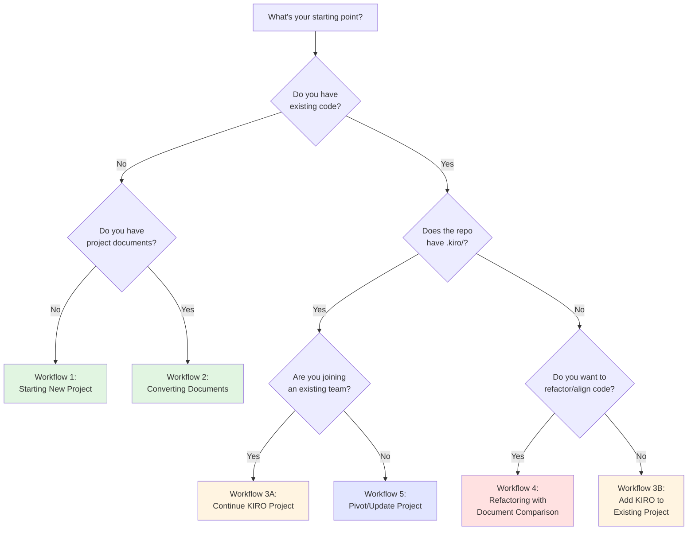
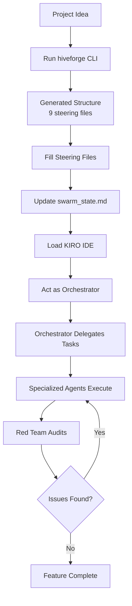
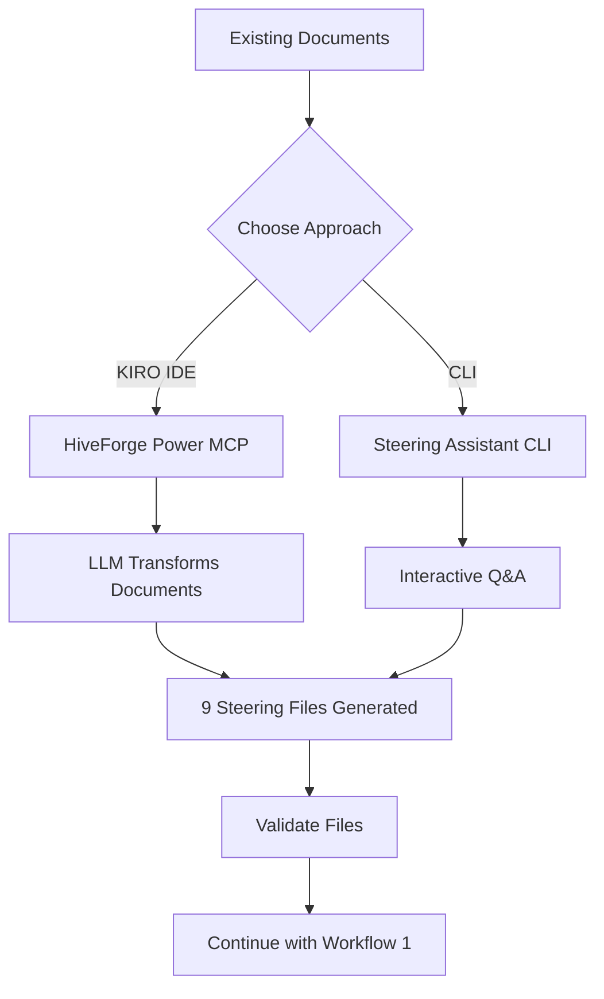
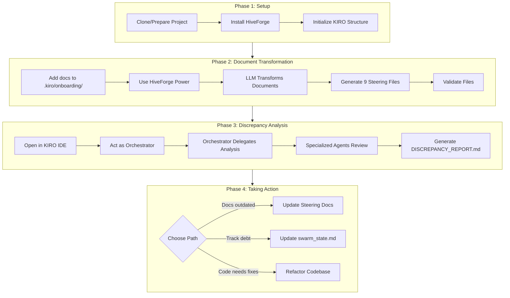
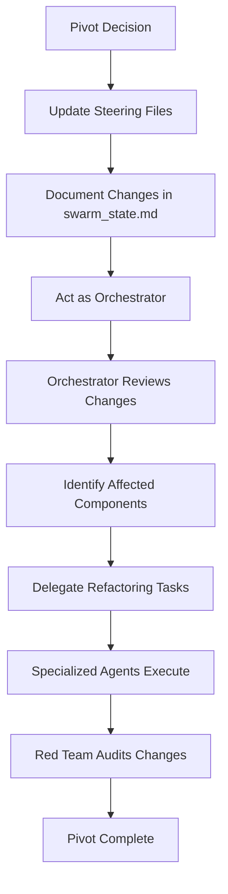

# 🔄 HiveForge Workflow Guide

**Version:** 3.0.0  
**Last Updated:** February 2026

This guide explains how to use HiveForge and KIRO Methodology v05 in real-world scenarios, from initial project setup to ongoing development and refactoring.

---

## Table of Contents

1. [Overview](#overview)
2. [Decision Tree: Choosing Your Workflow](#decision-tree-choosing-your-workflow)
3. [Workflow 1: Starting a New Project](#workflow-1-starting-a-new-project)
4. [Workflow 2: Converting Existing Documents](#workflow-2-converting-existing-documents)
5. [Workflow 3: Integrating with Existing Codebase](#workflow-3-integrating-with-existing-codebase)
6. [Workflow 4: Refactoring with Document Comparison](#workflow-4-refactoring-with-document-comparison)
7. [Workflow 5: Pivoting/Updating Project](#workflow-5-pivotingupdating-project)
8. [Best Practices](#best-practices)
9. [Troubleshooting](#troubleshooting)

---

## Overview

KIRO Methodology v05 uses a **multi-agent architecture** where specialized AI agents collaborate on your project. HiveForge v3.0.0 provides:

- **9 Steering Files** - Including technical debt tracking (new in v3.0.0)
- **7 Specialized Agents** - Orchestrator, Data Architect, Backend Engineer, Frontend Engineer, QA Engineer, DevOps Engineer, Red Team
- **LLM-Primary Synthesis** - Direct LLM generation with hallucination detection
- **Technical Debt Detection** - Automatic detection of DRY violations, test gaps, architecture smells, performance risks
- **Swarm State Management** - Central document tracking project status and decisions
- **Permission-Based Security** - Agents can only modify files within their domain

### Key Benefits

- 🎯 **Clear Separation of Concerns** - Each agent focuses on their expertise
- 🔒 **Built-in Safety** - Orchestrator can't accidentally modify source code
- 📚 **Knowledge Continuity** - Steering files prevent context loss
- 🔄 **Iterative Refinement** - Red Team provides continuous feedback
- 🤝 **Collaborative AI** - Multiple agents work together on complex projects
- 🔍 **Automatic Debt Tracking** - Technical debt detected and tracked automatically

---

## Decision Tree: Choosing Your Workflow

Use this decision tree to determine which workflow best fits your situation:



### Quick Reference

| Scenario | Workflow | Best Approach |
|----------|----------|---------------|
| New project from scratch | Workflow 1 | CLI + KIRO IDE |
| Have PRD/specs/design docs | Workflow 2 | KIRO IDE + HiveForge Power |
| Joining existing KIRO project | Workflow 3A | Clone → Review → Continue |
| Adding KIRO to existing code | Workflow 3B | CLI + Steering Assistant |
| Refactoring to match docs | Workflow 4 | KIRO IDE + Orchestrator |
| Changing project direction | Workflow 5 | Update steering → Delegate |

---

## Workflow 1: Starting a New Project

**Scenario:** You have a project idea and want to start fresh with KIRO methodology.

### Process Flow



### CLI Approach

#### Step 1: Initialize Project

```bash
mkdir my-awesome-app
cd my-awesome-app
hiveforge -n my-awesome-app
```

**Result:**
```
my-awesome-app/
├── .kiro/
│   ├── agents/          # 7 agent definitions
│   └── steering/        # 9 steering files (v3.0.0)
│       ├── project-vision.md
│       ├── tech-stack.md
│       ├── conventions.md
│       ├── architecture.md
│       ├── db-standards.md
│       ├── api-standards.md
│       ├── ui-standards.md
│       ├── qa-standards.md
│       └── technical-debt.md  # NEW in v3.0.0
├── .swarm/
│   ├── plan/
│   └── audit_logs/
└── swarm_state.md
```

#### Step 2: Fill Steering Files

Edit each steering file with your project specifics. Start with the essentials:

**`.kiro/steering/project-vision.md`**
```markdown
# Project Vision

## Problem Statement
Users struggle to manage tasks across multiple tools...

## Solution
AI-powered task management that learns from workflow patterns...

## Target Users
- Busy professionals
- Small teams (5-20 people)
```

**`.kiro/steering/tech-stack.md`**
```markdown
# Tech Stack

## Backend
- Framework: FastAPI
- Database: PostgreSQL 15
- ORM: SQLAlchemy 2.0

## Frontend
- Framework: React 18 + TypeScript
- Styling: TailwindCSS
```

**Repeat for all 9 steering files** (or fill as needed during development).

#### Step 3: Update Swarm State

Edit `swarm_state.md` with project context:

```markdown
## 1. Project Identity & Context

**Project Name:** my-awesome-app
**Brief Description:** AI-powered task management for busy professionals
**Target Users:** Professionals, small teams, remote workers
**Core Value Proposition:** Learn from workflow patterns to suggest optimal task prioritization
```

### KIRO IDE Approach

#### Step 1: Load Project in KIRO IDE

After running `hiveforge -n my-awesome-app`, open the project in KIRO IDE.

#### Step 2: Act as Orchestrator

```
I need to build the user authentication system. Please plan and delegate.
```

**Orchestrator Response:**
```
I'll delegate this to:
1. Data Architect - Design user/session tables
2. Backend Engineer - Implement JWT auth endpoints
3. QA Engineer - Write integration tests
4. Red Team - Review security

Creating delegation tree in swarm_state.md...
```

---

## Workflow 2: Converting Existing Documents

**Scenario:** You have existing PRD, specs, or vision documents and want to use KIRO methodology.

### Process Flow



### KIRO IDE Approach (Recommended)

**Uses HiveForge Power (MCP tool) with LLM - minimal user input required!**

#### Step 1: Place Documents

```bash
# Create onboarding folder
mkdir -p .kiro/onboarding

# Add your documents
cp /path/to/docs/*.md .kiro/onboarding/
cp /path/to/docs/*.pdf .kiro/onboarding/
```

#### Step 2: Use HiveForge Power in KIRO Chat

**Basic usage:**
```
Initialize steering files for my project
```

**With custom source document location:**
```
Initialize steering files for my project using documents from _DEVELOPMENT/
```

**With dry-run to preview:**
```
Initialize steering files in dry-run mode to preview what would be created
```

**What happens:**
- KIRO invokes the HiveForge Power's `init_steering` MCP tool
- The tool reads all documents in the specified folder
- LLM transforms them into properly formatted steering files
- Files are saved to `.kiro/steering/`
- Technical debt analysis runs automatically (v3.0.0)

**Advantages:**
- ✅ Uses LLM for intelligent extraction
- ✅ No manual Q&A required
- ✅ Supports custom document locations
- ✅ Can preview with dry-run mode
- ✅ Automatic confidence scoring
- ✅ Automatic technical debt detection

### CLI Approach (Alternative)

**Only use if you cannot access KIRO IDE. Requires answering many questions manually.**

#### Step 1: Place Documents

```bash
mkdir -p .kiro/onboarding
cp /path/to/docs/*.md .kiro/onboarding/
```

#### Step 2: Run Steering Assistant

```bash
# Generate steering files with code analysis
hiveforge steering init --analyze-code

# Skip technical debt detection (faster)
hiveforge steering init --analyze-code --skip-debt-detection
```

**What this does:**
- Analyzes codebase (local Python, no LLM)
- Parses documents from `.kiro/onboarding/`
- **Asks you MANY questions** via terminal Q&A
- Populates steering templates
- Runs technical debt detection (unless skipped)

**Downsides:**
- No LLM - you must answer every question
- Tedious and time-consuming
- Error-prone

**We strongly recommend the KIRO IDE approach!**

### Validation

```bash
# Validate generated files
hiveforge steering validate --strict

# Expected output:
# ✓ project-vision.md: PASS
# ✓ tech-stack.md: PASS
# ✓ technical-debt.md: PASS
# ...
# Summary: All files passed validation
```

---

## Workflow 3: Integrating with Existing Codebase

**Scenario:** You're working with an existing GitHub repository and want to use KIRO methodology.

### Scenario 3A: Continuing Work on KIRO-Enabled Repository

**Starting Point:** Repository already has `.kiro/` directory with agents and steering files.

#### CLI + IDE Approach

**Step 1: Install HiveForge**

See [INSTALLATION_GUIDE.md](../INSTALLATION_GUIDE.md) for detailed instructions.

```bash
# Clone HiveForge repository
git clone https://github.com/asoshnin/HiveForge.git
cd HiveForge

# Create and activate virtual environment
python3 -m venv venv
source venv/bin/activate  # macOS/Linux
# OR: venv\Scripts\activate.bat  # Windows

# Install HiveForge
pip install -e .

# Verify installation
hiveforge --help
```

**Step 2: Clone Your Project Repository**

```bash
cd ~/projects
git clone https://github.com/youruser/existing-project.git
cd existing-project
```

**Expected structure:**
```
existing-project/
├── .kiro/
│   ├── agents/          # 7 agent definitions
│   └── steering/        # 9 steering files (v3.0.0)
├── .swarm/
│   ├── plan/
│   └── audit_logs/
├── swarm_state.md
├── src/
└── tests/
```

**Step 3: Review Project Context**

```bash
# Review project vision
cat .kiro/steering/project-vision.md

# Review tech stack
cat .kiro/steering/tech-stack.md

# Review current state
cat swarm_state.md

# Check technical debt (v3.0.0)
cat .kiro/steering/technical-debt.md
```

**Step 4: Load KIRO IDE and Continue Development**

```
I'm continuing work on this project. According to swarm_state.md, we were working on [feature X]. What's the current status and what should we work on next?
```

### Scenario 3B: Adding KIRO to Existing Non-KIRO Repository

**Starting Point:** Repository exists but doesn't have `.kiro/` directory yet.

#### CLI Approach

**Step 1: Clone Repository**

```bash
cd ~/projects
git clone https://github.com/youruser/existing-project.git
cd existing-project
```

**Step 2: Initialize KIRO Structure**

```bash
# Initialize KIRO in existing repository
hiveforge -n existing-project
```

**Result:**
```
existing-project/
├── src/                 # Your existing code (unchanged)
├── tests/               # Your existing tests (unchanged)
├── .kiro/               # NEW: KIRO structure
│   ├── agents/          # 7 agent definitions
│   └── steering/        # 9 steering files (templates)
├── .swarm/              # NEW: Planning & logs
└── swarm_state.md       # NEW: State tracking
```

**Step 3: Generate Steering Files with Code Analysis**

```bash
# Analyze codebase and generate steering files
hiveforge steering init --analyze-code

# Skip technical debt detection for faster init
hiveforge steering init --analyze-code --skip-debt-detection
```

**What the Steering Assistant does:**
1. Scans your codebase to detect:
   - Programming languages and versions
   - Frameworks and libraries
   - Architecture patterns
   - Coding conventions
   - Technical debt (v3.0.0)

2. Asks clarifying questions about:
   - Project vision and goals
   - Target users
   - Missing technical details
   - Development standards

3. Generates 9 comprehensive steering files

#### KIRO IDE Approach (Recommended)

**Step 1: Initialize KIRO Structure**

```bash
hiveforge -n existing-project
```

**Step 2: Use HiveForge Power in KIRO IDE**

```
Initialize steering files for my project
```

**Advantages:**
- Uses LLM for intelligent analysis
- Minimal manual input required
- Automatic technical debt detection
- Confidence scoring for generated content

**Step 3: Commit KIRO Structure**

```bash
# Add KIRO files to git
git add .kiro/ .swarm/ swarm_state.md

# Commit
git commit -m "feat: adopt KIRO Methodology v05

- Initialize KIRO structure with hiveforge
- Generate steering files with code analysis
- Document current architecture and technical debt
- Identify improvement priorities"

# Push to GitHub
git push origin main
```

---

## Workflow 4: Refactoring with Document Comparison

**Scenario:** You have original project documentation and want to identify discrepancies between documented intent and actual implementation.

### Process Flow



### Phase 1: Setup

**Step 1: Prepare Clean Working Directory**

```bash
# Ensure fresh clone
rm -rf ~/projects/my-project
git clone https://github.com/username/my-project.git
cd my-project
```

**Step 2: Initialize HiveForge**

```bash
hiveforge -n my-project
```

### Phase 2: Document Transformation

**Step 1: Add Original Documents**

```bash
# Create onboarding folder
mkdir -p .kiro/onboarding

# Copy your original documents
cp /path/to/original/docs/*.md .kiro/onboarding/
cp /path/to/original/docs/*.pdf .kiro/onboarding/
```

**Supported formats:** Markdown (.md), PDF (.pdf), Images (.png, .jpg with OCR)

**Step 2: Use KIRO IDE + HiveForge Power (RECOMMENDED)**

```
Initialize steering files for my project
```

**Or with custom source document location:**

```
Initialize steering files for my project using documents from _DEVELOPMENT/
```

**What happens:**
- KIRO invokes HiveForge Power's `init_steering` MCP tool
- Reads all documents in specified folder
- LLM transforms them into steering files
- Technical debt analysis runs automatically
- Files saved to `.kiro/steering/`

**Step 3: Validate Steering Files**

```bash
hiveforge steering validate --strict
```

### Phase 3: Manual Discrepancy Analysis (KIRO IDE)

**⚠️ Important:** HiveForge does NOT have built-in discrepancy analysis. You need KIRO IDE + Orchestrator for gap analysis.

**Step 1: Open Project in KIRO IDE**

Load the project in KIRO IDE. Steering files from `.kiro/steering/` are automatically loaded.

**Step 2: Act as Orchestrator**

Use this prompt in KIRO chat:

```
I have steering documents in .kiro/steering/ that describe the intended system design.
I need you to analyze the actual codebase and compare it against these steering documents.

Please:
1. Read all steering files in .kiro/steering/
2. Analyze the actual code implementation in src/
3. Create a comprehensive discrepancy report that identifies:
   - Features described in steering docs but not implemented in code
   - Code that doesn't match the documented design
   - Architectural differences between docs and implementation
   - Convention violations
   - Missing components
   - Technical debt items

Save the report to: DISCREPANCY_REPORT.md in the project root directory

Delegate this analysis to appropriate specialized agents (Backend Engineer, Frontend Engineer, Data Architect, QA Engineer, Red Team).
```

**Step 3: Orchestrator Delegation Flow**

The Orchestrator follows this workflow:

1. **Phase 1: Document Understanding**
   - Reads all 9 steering files
   - Extracts requirements, standards, and expectations
   - Creates checklist of items to verify in code

2. **Phase 2: Code Analysis (Parallel)**
   - Backend Engineer → Analyzes API/services against standards
   - Frontend Engineer → Analyzes components/pages against standards
   - Data Architect → Analyzes database schema against standards
   - QA Engineer → Analyzes tests/coverage against standards

3. **Phase 3: Cross-Cutting Concerns**
   - Red Team → Audits findings for security issues and risks

4. **Phase 4: Report Compilation**
   - Orchestrator → Aggregates all findings
   - Prioritizes issues (Critical, Warning, Info)
   - Generates `DISCREPANCY_REPORT.md`

**Step 4: Expected Output**

**Location:** `DISCREPANCY_REPORT.md` in project root

**Report Structure:**

```markdown
# Discrepancy Report

## Executive Summary
- Total issues found: 12
- Critical: 3
- Warnings: 5
- Info: 4

## Critical Issues

### 1. Authentication Not Implemented
**Steering Doc:** architecture.md specifies JWT authentication
**Actual Code:** No authentication endpoints found in src/api/
**Impact:** Security vulnerability, feature gap
**Recommendation:** Implement JWT auth middleware (Priority: HIGH)

### 2. Test Coverage Below Target
**Steering Doc:** qa-standards.md requires 80% coverage
**Actual Code:** Current coverage is 45%
**Impact:** Quality risk
**Recommendation:** Add unit tests for core modules (Priority: MEDIUM)

## Convention Violations

### 1. Naming Convention Mismatch
**Steering Doc:** conventions.md specifies snake_case
**Actual Code:** Found camelCase in src/utils/helper.js
**Files affected:** src/utils/helper.js, src/api/user.js
**Recommendation:** Refactor to snake_case (Priority: LOW)
```

### Phase 4: Taking Action

Based on the discrepancy report, choose one of three paths:

#### Path 1: Update Steering Documents

Choose this when the code is correct and the documentation is outdated.

```bash
# Option A: Manual edit
nano .kiro/steering/architecture.md

# Option B: Use update workflow
hiveforge steering update

# Option C: Validate after changes
hiveforge steering validate --strict
```

#### Path 2: Update swarm_state.md

Choose this when you want to acknowledge technical debt and plan future work.

```bash
# Edit swarm_state.md to document discrepancies
nano swarm_state.md
```

Add a section like:

```markdown
## Technical Debt Log

### 2026-02-25: Discrepancy Analysis Findings

**Critical Items:**
1. Authentication not implemented - Priority: HIGH
2. Test coverage at 45% (target: 80%) - Priority: MEDIUM

**Planned Actions:**
- Week 1: Implement JWT authentication
- Week 2: Increase test coverage to 80%
```

#### Path 3: Refactor Codebase

Choose this when the documentation is correct and the code needs fixing.

**Prompt for Orchestrator:**

```
Based on DISCREPANCY_REPORT.md, I need to refactor the codebase to match steering documents.

Please:
1. Review the discrepancy report
2. Create a prioritized refactoring plan
3. Delegate tasks to specialized agents
4. Track progress in swarm_state.md

Focus on:
- Critical security issues (authentication)
- Convention violations
- Missing components
```

**Orchestrator will delegate:**
- Backend Engineer: Fix API endpoints, add authentication
- Frontend Engineer: Fix component patterns
- Data Architect: Update database schema
- QA Engineer: Increase test coverage
- Red Team: Verify fixes

---

## Workflow 5: Pivoting/Updating Project

**Scenario:** You need to change direction (pivot) or update project requirements.

### Process Flow



### Step-by-Step

#### Step 1: Update Steering Files

**Example Pivot:** Changing from email/password auth to OAuth

**Update `.kiro/steering/tech-stack.md`:**
```diff
## Authentication
- - Email/password with JWT
+ - OAuth 2.0 (Google, GitHub)
+ - Library: Authlib
```

**Update `.kiro/steering/architecture.md`:**
```diff
## Authentication Service
- - JWT token generation
- - Password hashing with bcrypt
+ - OAuth provider integration
+ - Token refresh mechanism
```

#### Step 2: Document in Swarm State

**In `swarm_state.md`:**
```markdown
## 2. Project Evolution Log

### 2026-02-25: Pivot to OAuth Authentication
**Reason:** User feedback - prefer social login over email/password
**Impact:**
- Remove: User password storage, JWT generation
- Add: OAuth provider integration, token refresh
- Affected: Backend auth endpoints, frontend login UI, database schema

**Steering Files Updated:**
- tech-stack.md: Added Authlib
- architecture.md: Updated auth flow
- db-standards.md: Removed password fields
- api-standards.md: Updated auth endpoints
```

#### Step 3: Delegate Refactoring

**Act as Orchestrator in KIRO IDE:**
```
We're pivoting from email/password to OAuth. I've updated the steering files. Please review and delegate the necessary refactoring.
```

**Orchestrator Response:**
```
Pivot acknowledged. Delegating:

1. Data Architect: Remove password fields, add OAuth token storage
2. Backend Engineer: Implement OAuth flow, update auth endpoints
3. Frontend Engineer: Replace login form with OAuth buttons
4. QA Engineer: Update auth tests, add OAuth integration tests
5. Red Team: Security review of OAuth implementation

Creating delegation tree...
```

#### Step 4: Preserve History

**Commit steering file changes:**
```bash
git add .kiro/steering/
git commit -m "docs: pivot to OAuth authentication

- Updated tech-stack.md with Authlib
- Updated architecture.md with OAuth flow
- Updated db-standards.md to remove password storage
- Updated api-standards.md with new auth endpoints"
```

---

## Best Practices

### 1. Keep Steering Files Updated

✅ **Do:**
- Update steering files **before** making code changes
- Commit steering file changes separately
- Use version control for steering files
- Review technical-debt.md regularly (v3.0.0)

❌ **Don't:**
- Let steering files become outdated
- Make code changes without updating docs
- Skip documenting pivots
- Ignore technical debt warnings

### 2. Use Swarm State as Single Source of Truth

✅ **Do:**
- Document all major decisions in swarm_state.md
- Update delegation tree as work progresses
- Track technical debt and blockers
- Reference technical-debt.md for debt items

❌ **Don't:**
- Keep decisions in separate documents
- Forget to update swarm state
- Let delegation tree become stale
- Ignore debt metrics

### 3. Respect Agent Boundaries

✅ **Do:**
- Always start with Orchestrator for planning
- Let specialized agents handle their domains
- Use Red Team for continuous audits
- Follow toolsSettings permissions

❌ **Don't:**
- Skip Orchestrator and jump to implementation
- Let Orchestrator write code (violates toolsSettings)
- Ignore Red Team feedback
- Override agent permissions

### 4. Iterate and Refine

✅ **Do:**
- Start with minimal steering files, refine over time
- Use Red Team feedback to improve standards
- Update conventions based on learnings
- Run debt detection regularly

❌ **Don't:**
- Try to perfect steering files upfront
- Ignore lessons learned
- Resist changing conventions
- Skip technical debt analysis

### 5. Leverage v3.0.0 Features

✅ **Do:**
- Use automatic technical debt detection
- Review debt metrics in technical-debt.md
- Prioritize debt items by risk and effort
- Use LLM-primary synthesis for document transformation
- Enable confidence scoring for generated content

❌ **Don't:**
- Skip debt detection with `--skip-debt-detection` unless necessary
- Ignore high-priority debt items
- Disable hallucination guardrails
- Skip validation after generation

---

## Troubleshooting

### Common Issues

#### "hiveforge: command not found"

**Solution:** HiveForge not installed or venv not activated.
```bash
# Activate virtual environment
source venv/bin/activate  # macOS/Linux
venv\Scripts\activate.bat  # Windows

# If still not found, reinstall
cd /path/to/HiveForge
pip install -e .
```

#### ".kiro/ directory already exists"

**Solution:** Use `--force` flag to overwrite.
```bash
hiveforge -n my-project --force
```

#### "Steering files are empty or have placeholders"

**Solution:** Use HiveForge Power in KIRO IDE or Steering Assistant CLI.
```bash
# CLI approach
hiveforge steering init --analyze-code

# Or KIRO IDE approach (recommended)
# In KIRO chat: "Initialize steering files for my project"
```

#### "Can't understand the codebase"

**Solution:** Use code analysis and review generated steering files.
```bash
# Generate with code analysis
hiveforge steering init --analyze-code

# Review generated files
cat .kiro/steering/architecture.md
cat .kiro/steering/tech-stack.md
cat .kiro/steering/technical-debt.md
```

#### "Technical debt detection is slow"

**Solution:** Skip debt detection for faster init.
```bash
hiveforge steering init --analyze-code --skip-debt-detection
```

**Note:** You can run debt detection later:
```bash
hiveforge steering update
```

#### "Validation fails with false positives"

**Solution:** Use normal mode instead of strict mode.
```bash
# Normal validation (warnings don't fail)
hiveforge steering validate

# Strict validation (warnings fail)
hiveforge steering validate --strict
```

---

## Tool Usage Matrix

| Task | Tool | Command/Action | Notes |
|------|------|----------------|-------|
| Install HiveForge | Terminal | `pip install -e .` | From source |
| Initialize project | HiveForge CLI | `hiveforge -n project-name` | Creates structure |
| **Transform documents** | **KIRO IDE** | **"Initialize steering files"** | **Recommended (uses LLM)** |
| Transform documents (alt) | HiveForge CLI | `hiveforge steering init --analyze-code` | Manual Q&A |
| Update steering docs | HiveForge CLI | `hiveforge steering update` | Preserves customizations |
| Validate steering docs | HiveForge CLI | `hiveforge steering validate --strict` | CI/CD ready |
| Analyze discrepancies | KIRO IDE | Act as Orchestrator | Manual workflow |
| Refactor code | KIRO IDE | Delegate via Orchestrator | Agent-based |
| Skip debt detection | HiveForge CLI | `--skip-debt-detection` | Faster init |

**Legend:**
- ✅ HiveForge CLI - Automated feature
- ⚠️ KIRO IDE - LLM-powered (recommended)
- 📝 Manual - User must do manually

---

## Common Questions

### Q: Do I need to fill all 9 steering files before starting?

**A:** No! Start with the essentials:
1. `project-vision.md` - Know what you're building
2. `tech-stack.md` - Know your technologies
3. `conventions.md` - Basic code style

Fill others as needed during development. The 9th file (`technical-debt.md`) is generated automatically.

### Q: Can I add custom steering files?

**A:** Yes! Add files like:
- `security-standards.md`
- `deployment-standards.md`
- `monitoring-standards.md`

Just ensure all agents reference them.

### Q: What if my project doesn't fit the templates?

**A:** Adapt the templates! They're guidelines, not strict rules. Modify to fit your project's needs.

### Q: How do I handle multiple projects?

**A:** Each project gets its own `.kiro/` directory. You can reuse steering file patterns across projects.

### Q: What's new in v3.0.0?

**A:** v3.0.0 introduces:
- **9th steering file:** `technical-debt.md` with automatic debt detection
- **LLM-primary synthesis:** Direct LLM generation with hallucination detection
- **Technical debt detection:** DRY violations, test gaps, architecture smells, performance risks
- **Confidence scoring:** Know which content is from documents vs. inferred
- **257+ tests:** Comprehensive test coverage including property-based tests

### Q: How does technical debt detection work?

**A:** The DebtDetector uses local static analysis to detect:
- **DRY violations:** AST-based function body hashing (Python), line-hash fallback (other languages)
- **Test gaps:** File-to-test ratio analysis, untested public functions
- **Architecture smells:** Circular imports (Tarjan's SCC), god classes (>500 lines)
- **Performance risks:** N+1 queries, unbounded loops, string concatenation in loops

See [TECHNICAL_DEBT_IMPLEMENTATION.md](../hiveforge-power/docs/TECHNICAL_DEBT_IMPLEMENTATION.md) for details.

### Q: Can I skip technical debt detection?

**A:** Yes, use the `--skip-debt-detection` flag:
```bash
hiveforge steering init --analyze-code --skip-debt-detection
```

This is useful for faster init when debt analysis is not needed. You can run it later with `hiveforge steering update`.

### Q: Why should I use KIRO IDE + HiveForge Power instead of CLI?

**A:** The CLI approach does NOT use LLM - it requires manual Q&A. The KIRO IDE approach uses HiveForge Power (MCP tool) which leverages LLM for automatic transformation.

| Aspect | CLI Approach | KIRO IDE + Power |
|--------|--------------|------------------|
| LLM Used | ❌ No | ✅ Yes |
| User Input | Many questions | Minimal |
| Time | Slow (Q&A) | Fast (automated) |
| Quality | Depends on answers | LLM extracts from docs |
| Debt Detection | ✅ Yes | ✅ Yes |

**Recommendation:** Always use KIRO IDE + HiveForge Power for document transformation!

### Q: Does HiveForge compare steering docs against code automatically?

**A:** **NO** - This is a critical limitation.

HiveForge only:
- Creates steering documents from artifacts and code analysis
- Validates steering document completeness
- Updates steering documents with new information
- Detects technical debt in code

For discrepancy analysis: Use KIRO IDE + Orchestrator (Workflow 4).

---

## Summary

**KIRO Methodology Workflows:**

1. **New Project:** `hiveforge` → Fill steering files → Develop with agents
2. **Existing Docs:** Convert to steering files → `hiveforge` → Develop
3. **Existing Code:** `hiveforge` → Generate steering files → Improve iteratively
4. **Refactoring:** Transform docs → Analyze discrepancies → Refactor code
5. **Pivot:** Update steering files → Document in swarm state → Delegate refactoring

**Key Principles:**
- Steering files = Project standards (9 files in v3.0.0)
- Swarm state = Decision history
- Orchestrator = Planning & delegation
- Specialized agents = Implementation
- Red Team = Quality assurance
- Technical debt = Tracked automatically

**v3.0.0 Highlights:**
- 9th steering file: `technical-debt.md`
- Automatic debt detection (DRY, tests, architecture, performance)
- LLM-primary synthesis with hallucination detection
- 257+ tests with property-based testing
- Confidence scoring for generated content

---

<div align="center">

**Ready to start?** Check out the [Quick Start Guide](../QUICKSTART.md)

**Need help?** See [Troubleshooting](./troubleshooting.md) or [open an issue](https://github.com/asoshnin/HiveForge/issues)

**Learn more:** [README](../README.md) | [CHANGELOG](../CHANGELOG.md) | [CONTRIBUTING](../CONTRIBUTING.md)

</div>
