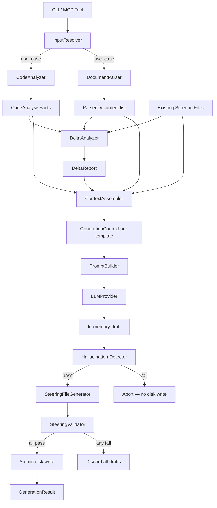

# Design Document: LLM-Primary Steering Synthesis

## Overview

This design describes the architectural refactor of HiveForge's steering file generation pipeline from a regex-based `TemplatePopulator` fallback system to an LLM-primary synthesis engine.

The current pipeline is inverted: `TemplatePopulator` is the de-facto primary path (producing garbage output — unfilled placeholders, copy-pasted paragraphs, content bleeding across sections), and LLM is an optional afterthought reached only when explicitly configured. The fix is a fundamental inversion: every steering file is generated by an LLM call, with Python code responsible only for preparing structured context and writing validated output atomically to disk.

### What Changes

- `CodeAnalyzer.to_summary()` prose output → `CodeAnalysisFacts` structured dataclass
- `TemplatePopulator` regex path → removed from primary generation path entirely
- `SteeringAssistant.generate_file()` ad-hoc LLM call → replaced by `SteeringFileGenerator` with transactional semantics
- `AutonomousWorkflow` orchestration → refactored to use the new pipeline
- Five new components introduced: `CodeAnalysisFacts`, `ContextAssembler`, `SteeringFileGenerator`, `DeltaAnalyzer`, `PromptBuilder`

### What Does Not Change

- `LLMProvider` priority chain (KIRO native → Vertex AI → OpenAI)
- `CodeAnalyzer` local analysis logic (AST, regex, language detection)
- Template structure (8 files, section names)
- `SteeringValidator` post-generation validation
- `BackupManager` and rollback capability
- MCP tool interface (`init_steering`, `update_steering`, etc.)

---

## Architecture

### Pipeline Overview



### Component Responsibilities

| Component | Responsibility | New / Modified |
|---|---|---|
| `InputResolver` | Determines use case, resolves source folder path | New |
| `CodeAnalyzer` | Local AST/regex analysis of codebase | Modified (output format only) |
| `DocumentParser` | Reads source docs from bounded folder | Modified (scope enforcement) |
| `DeltaAnalyzer` | Three-way diff: docs vs code vs steering | New |
| `ContextAssembler` | Token-budgeted context per template | New |
| `PromptBuilder` | Constructs structured LLM prompt per template | New |
| `LLMProvider` | Routes LLM calls (KIRO → Vertex → OpenAI) | Unchanged |
| `SteeringFileGenerator` | Transactional orchestration of all 8 files | New |
| `SteeringValidator` | Post-generation validation | Unchanged |
| `BackupManager` | Backup and rollback | Unchanged |

### Generation Pipeline (Sequential)

The 8 steering files are generated in a fixed order so each file can receive rolling summaries of previously generated files as cross-file context:

1. `project-vision.md`
2. `tech-stack.md`
3. `architecture.md`
4. `conventions.md`
5. `agents.md`
6. `workflows.md`
7. `security.md`
8. `testing.md`

---

## Components and Interfaces

### InputResolver

Determines the applicable use case and resolves the source folder path.

```python
class InputResolver:
    def resolve(
        self,
        source_folder: Path | None,
        project_root: Path,
        steering_dir: Path,
    ) -> tuple[UseCase, Path | None]:
        ...
```

Use case determination logic:

| Source docs present | Codebase present | Existing steering | Use case |
|---|---|---|---|
| Yes | No | No | `new_from_docs` |
| No | Yes | No | `reverse_engineer` |
| Yes | Yes | Yes | `drift_correction` |
| Any | Any | Broken/partial | `error_recovery` |
| Yes (includes intent doc) | Any | Any | `pivot` |

### CodeAnalyzer (modified output)

The existing `CodeAnalyzer` class retains all AST and regex parsing logic. The only change is the addition of a `to_facts()` method that returns a `CodeAnalysisFacts` dataclass instead of prose. The existing `to_summary()` method is preserved for backward compatibility but deprecated.

```python
class CodeAnalyzer:
    def to_facts(self) -> CodeAnalysisFacts:
        """Returns structured facts dataclass. Replaces to_summary() as primary output."""
        ...
    
    def _log_progress(self, message: str) -> None:
        """Emits real-time CLI progress during deep directory traversal."""
        ...
```

### DocumentParser (modified scope)

The `DocumentParser` is modified to enforce bounded source document scope. It reads exclusively from the designated source folder and raises `SourceFolderError` if asked to read outside it.

```python
class DocumentParser:
    def __init__(self, source_folder: Path):
        self._source_folder = source_folder.resolve()
    
    def parse_all(self) -> list[ParsedDocument]:
        """Reads all documents from source_folder only. Never scans project tree."""
        ...
```

### DeltaAnalyzer

Computes three-way structural differences between design documents, `CodeAnalysisFacts`, and existing steering files.

```python
class DeltaAnalyzer:
    def analyze(
        self,
        source_docs: list[ParsedDocument],
        code_facts: CodeAnalysisFacts,
        existing_steering: dict[str, str],
    ) -> DeltaReport:
        """
        Detects structural drift only: technology mismatches, dependency changes.
        Does NOT detect behavioral or architectural boundary violations.
        Design docs are preferred over code when they diverge.
        """
        ...
```

### ContextAssembler

Enforces strict per-template token budgets and produces a `GenerationContext` per template.

```python
class ContextAssembler:
    TOKEN_BUDGET = 8_000
    BUDGET_SOURCE_DOCS = 4_000
    BUDGET_CODE_FACTS = 2_000
    BUDGET_EXISTING_STEERING = 1_000
    BUDGET_PREV_GENERATED = 1_000

    def assemble(
        self,
        template_name: str,
        template_schema: list[str],
        use_case: UseCase,
        source_docs: list[ParsedDocument],
        code_facts: CodeAnalysisFacts,
        existing_steering: dict[str, str],
        previously_generated: dict[str, str],
        delta: DeltaReport | None,
        user_intent: str | None,
    ) -> GenerationContext:
        """
        Filters source docs by keyword relevance to template schema.
        Uses rolling summaries for previously generated files.
        Truncates lower-priority sections if budget exceeded:
          previously_generated → existing_steering → code_facts
        """
        ...
```

### PromptBuilder

Constructs one structured LLM prompt (system + user) per template from a `GenerationContext`.

```python
class PromptBuilder:
    def build(
        self,
        template_name: str,
        template_content: str,
        context: GenerationContext,
    ) -> tuple[str, str]:
        """
        Returns (system_prompt, user_prompt).
        
        System prompt instructs:
        - Fill every section independently
        - Write N/A for absent information
        - Write [NOT FOUND] for expected-but-absent fields
        - No content repeated across sections
        - Output only final Markdown, no preamble
        
        User prompt includes:
        - Template section schema
        - Source document content (filtered)
        - Code facts (JSON)
        - Existing steering content (truncated)
        - DeltaReport (if drift_correction or update use case)
        - User intent (if provided)
        - Previously generated file summaries
        """
        ...
    
    def build_simplified(
        self,
        template_name: str,
        template_content: str,
        context: GenerationContext,
    ) -> tuple[str, str]:
        """Simplified prompt for retry on empty/malformed response."""
        ...
```

### SteeringFileGenerator

Orchestrates transactional generation of all 8 steering files.

```python
class SteeringFileGenerator:
    def __init__(self, llm_provider: LLMProvider):
        if not llm_provider.is_available():
            raise LLMUnavailableError(
                "No LLM provider configured. Run `hiveforge config llm` to set one up."
            )
    
    async def generate_all_files(
        self,
        context_assembler: ContextAssembler,
        prompt_builder: PromptBuilder,
        output_dir: Path,
    ) -> GenerationResult:
        """
        1. Generate all 8 files in memory (fixed sequential order)
        2. Validate each draft (hallucination detection + SteeringValidator)
        3. If all pass: atomic write to output_dir
        4. If any fail: discard all, return GenerationResult(success=False)
        """
        ...
    
    def _validate_draft(
        self,
        template_name: str,
        draft: str,
        code_facts: CodeAnalysisFacts,
    ) -> list[str]:
        """
        Deterministic string-matching hallucination detection.
        Checks: database name, backend framework.
        Returns list of validation errors (empty = pass).
        """
        ...
    
    def _check_duplicate_paragraphs(self, draft: str) -> list[str]:
        """Detects verbatim paragraph duplication across sections."""
        ...
```

---

## Data Models

New models to be added to `models.py` (or a new `models_v2.py` if preferred to avoid merge conflicts):

```python
from __future__ import annotations
from dataclasses import dataclass, field
from typing import Literal

UseCase = Literal[
    "new_from_docs",
    "reverse_engineer",
    "drift_correction",
    "error_recovery",
    "pivot",
    "update",
]


@dataclass
class NamingConventions:
    variables: str = ""       # e.g. "snake_case"
    classes: str = ""         # e.g. "PascalCase"
    constants: str = ""       # e.g. "UPPER_SNAKE_CASE"
    functions: str = ""       # e.g. "snake_case"


@dataclass
class CodeAnalysisFacts:
    """
    JSON-serializable structured output of CodeAnalyzer.
    Replaces to_summary() prose as the primary output format.
    Serializes to ≤2,000 tokens when injected into an LLM prompt.
    """
    primary_language: str
    frameworks: list[str]
    dependencies: list[Dependency]          # reuses existing Dependency model
    architecture_pattern: str
    has_tests: bool
    test_framework: str | None
    api_type: str | None                    # "REST", "MCP", "CLI", None
    database: str | None
    entry_points: list[str]
    naming_conventions: NamingConventions
    directory_structure: str               # compact tree representation

    def to_json_dict(self) -> dict:
        """Returns JSON-serializable dict for LLM injection."""
        ...


@dataclass
class GenerationContext:
    """
    Token-budgeted inputs for a single template's LLM prompt.
    Produced by ContextAssembler.
    """
    template_name: str
    use_case: UseCase
    source_docs: list[ParsedDocument]       # filtered to template-relevant content
    code_facts: CodeAnalysisFacts
    existing_steering: dict[str, str]       # truncated to budget
    previously_generated_summaries: dict[str, str]  # rolling summaries
    delta: DeltaReport | None
    user_intent: str | None


@dataclass
class DeltaReport:
    """
    Three-way structural diff produced by DeltaAnalyzer.
    Structural drift only: technology mismatches, dependency changes.
    """
    doc_vs_code: list[str]          # divergences between design docs and codebase
    steering_vs_code: list[str]     # drifts between steering files and codebase
    steering_vs_docs: list[str]     # conflicts between steering files and design docs
    missing_in_all: list[str]       # gaps absent from all three sources


@dataclass
class GenerationResult:
    """Output of SteeringFileGenerator.generate_all_files()."""
    success: bool
    files_written: list[str]        # empty on failure
    validation_errors: list[str]    # populated on failure


class LLMUnavailableError(Exception):
    """Raised when no LLM provider is configured in CLI mode."""
    pass
```

---

## Correctness Properties

*A property is a characteristic or behavior that should hold true across all valid executions of a system — essentially, a formal statement about what the system should do. Properties serve as the bridge between human-readable specifications and machine-verifiable correctness guarantees.*

### Property 1: LLM called for every template

*For any* set of 8 steering templates, calling `SteeringFileGenerator.generate_all_files()` with an available `LLMProvider` should result in exactly 8 LLM calls — one per template — with no regex substitution path taken.

**Validates: Requirements 1.1**

---

### Property 2: Retry once on empty or malformed response

*For any* template where `LLMProvider.complete()` returns an empty string or syntactically malformed Markdown, `SteeringFileGenerator` should invoke `PromptBuilder.build_simplified()` exactly once before treating the attempt as failed. The simplified prompt path should never be triggered by a hallucination error.

**Validates: Requirements 1.3, 6.5**

---

### Property 3: Prompt contains all required context fields

*For any* template name and any `GenerationContext`, the prompt produced by `PromptBuilder.build()` should contain all of: the template section schema, source document content, code facts, existing steering content, delta report (when present), and user intent (when present).

**Validates: Requirements 1.4**

---

### Property 4: Prompt contains all required instruction strings

*For any* template and context, the system prompt produced by