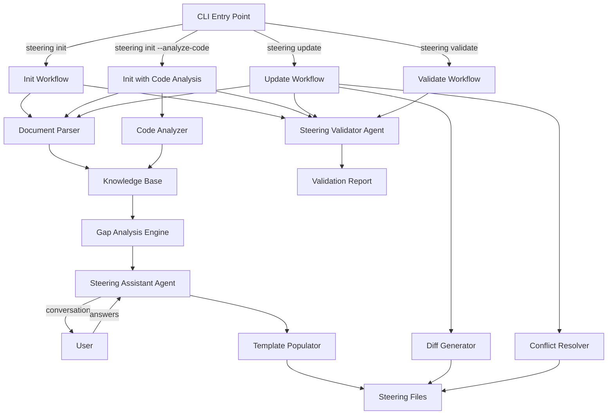
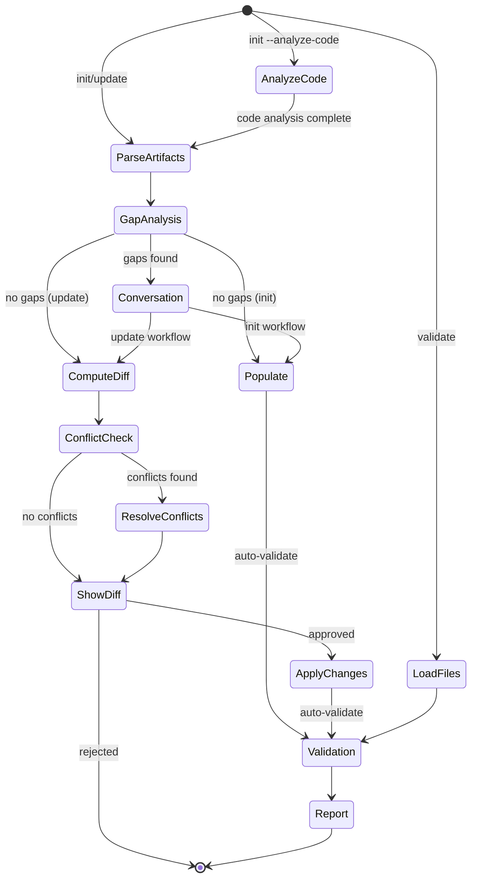

# Design Document: Steering Assistant

## Overview

The Steering Assistant is a comprehensive system for creating and maintaining HiveForge steering files throughout a project's lifecycle. It consists of two primary agents (Steering_Assistant and Steering_Validator) and supports three distinct workflows: initial creation (init), updates to existing files (update), and standalone validation (validate).

The system parses multi-format artifacts (markdown, PDF, images), analyzes existing codebases to extract project information, performs intelligent gap analysis, engages in token-efficient conversations, and generates or updates steering files while preserving user customizations. The validator ensures completeness, consistency, and flags conflicts.

A key capability is importing existing projects into HiveForge by analyzing source code, dependency files, configuration files, and documentation to automatically infer technology stack, architecture patterns, and coding conventions.

## Architecture

### High-Level Component Diagram



### Workflow State Machine



## Components and Interfaces

### 1. CLI Command Handler

**Responsibility:** Parse command-line arguments and route to appropriate workflow

**Interface:**
```python
class SteeringCLI:
    def steering_init(
        research: bool = False,
        skip_validation: bool = False,
        interactive: bool = True,
        analyze_code: bool = False
    ) -> int:
        """Initialize steering files from scratch, optionally analyzing existing codebase"""
        
    def steering_update(
        research: bool = False,
        skip_validation: bool = False,
        interactive: bool = True
    ) -> int:
        """Update existing steering files"""
        
    def steering_validate(
        strict: bool = False
    ) -> int:
        """Validate steering files standalone"""
```

**Dependencies:** typer, pathlib, workflow orchestrators

### 2. Document Parser

**Responsibility:** Extract text content from multiple document formats

**Interface:**
```python
class DocumentParser:
    def parse_markdown(file_path: Path) -> ParsedDocument:
        """Extract content from markdown files"""
        
    def parse_pdf(file_path: Path) -> ParsedDocument:
        """Extract text from PDF using PyPDF2 or pdfplumber"""
        
    def parse_image(file_path: Path) -> ParsedDocument:
        """Extract text from images using OCR (pytesseract)"""
        
    def parse_directory(dir_path: Path) -> List[ParsedDocument]:
        """Parse all supported files in directory"""
        
class ParsedDocument:
    file_path: Path
    content: str
    metadata: Dict[str, Any]
    parse_errors: List[str]
```

**Dependencies:** pathlib, PyPDF2/pdfplumber, pytesseract/Pillow, markdown parsers

### 3. Code Analyzer

**Responsibility:** Analyze existing codebase to extract project information for steering file generation using LOCAL algorithms only (no LLM calls)

**Interface:**
```python
class CodeAnalyzer:
    def __init__(self, project_root: Path):
        """Initialize with project root directory"""
        
    def analyze() -> CodeAnalysisResult:
        """Perform comprehensive code analysis using local algorithms"""
        
    def detect_languages() -> List[LanguageInfo]:
        """Detect programming languages using file extensions and line counting"""
        
    def extract_tech_stack() -> TechStackInfo:
        """Extract technology stack from dependency files using parsers"""
        
    def infer_architecture() -> ArchitectureInfo:
        """Infer architecture patterns from directory structure using pattern matching"""
        
    def extract_conventions() -> ConventionsInfo:
        """Extract coding conventions using AST parsing and regex"""
        
    def parse_config_files() -> Dict[str, Any]:
        """Parse configuration files using format-specific parsers"""
        
    def get_summary_for_llm(max_tokens: int = 2000) -> str:
        """Get token-limited summary of findings for LLM context"""
        
class CodeAnalysisResult:
    languages: List[LanguageInfo]
    tech_stack: TechStackInfo
    architecture: ArchitectureInfo
    conventions: ConventionsInfo
    documentation: List[ParsedDocument]
    confidence_scores: Dict[str, float]
    
    def to_summary(self, max_tokens: int) -> str:
        """Convert to token-limited summary for LLM"""
    
class LanguageInfo:
    name: str
    version: Optional[str]
    file_count: int
    line_count: int
    percentage: float
    
class TechStackInfo:
    backend_framework: Optional[str]
    frontend_framework: Optional[str]
    database: Optional[str]
    cache: Optional[str]
    dependencies: List[Dependency]
    
class ArchitectureInfo:
    pattern: str  # "monolithic", "microservices", "layered", etc.
    directory_structure: Dict[str, str]
    key_components: List[str]
    
class ConventionsInfo:
    naming_style: Dict[str, str]  # "variables": "snake_case", etc.
    formatting: Dict[str, Any]
    documentation_style: str
    test_framework: Optional[str]
```

**Dependencies:** pathlib, ast (Python), tree-sitter (multi-language parsing), gitignore parser

**Token Efficiency Strategy:**
- ALL analysis is performed locally using AST parsing, regex, and file system operations
- NO LLM API calls during code analysis phase
- Results are summarized to max 2000 tokens before being sent to LLM
- Deduplication of similar findings to reduce token count
- Cache results in `.kiro/.cache/code_analysis.json` for reuse

**Analysis Strategies:**

1. **Language Detection**:
   - Count files by extension (.py, .js, .ts, .go, .rs, .java, etc.)
   - Parse shebang lines (#!/usr/bin/env python3)
   - Check for language-specific markers (package.json, go.mod, Cargo.toml)
   - Calculate percentage by line count
   - Detect versions from: package.json (engines.node), .python-version, go.mod (go directive), rust-toolchain

2. **Tech Stack Extraction**:
   - Parse dependency files:
     - JavaScript/TypeScript: package.json (dependencies, devDependencies)
     - Python: requirements.txt, Pipfile, pyproject.toml, setup.py
     - Go: go.mod
     - Rust: Cargo.toml
     - Java: pom.xml, build.gradle
     - Ruby: Gemfile
   - Identify frameworks from imports/dependencies (express, fastapi, react, vue, django)
   - Detect databases from connection strings, ORM imports, or docker-compose.yml
   - Extract versions from dependency specifications

3. **Architecture Inference**:
   - Analyze directory structure patterns:
     - Monolithic: Single src/ with all code
     - Microservices: Multiple services/ directories, docker-compose with multiple services
     - Layered: controllers/, services/, models/, repositories/
     - MVC: models/, views/, controllers/
     - Hexagonal: domain/, application/, infrastructure/
   - Identify patterns with confidence scores based on match strength
   - Fall back to "custom" if no pattern matches with >0.6 confidence

4. **Convention Extraction**:
   - Parse AST to identify naming patterns:
     - Sample 100 random functions/variables, detect snake_case vs camelCase
     - Sample 50 random classes, detect PascalCase vs other
     - Sample 20 random constants, detect UPPER_SNAKE_CASE vs other
   - Detect indentation style:
     - Sample 100 random code blocks
     - Count leading spaces/tabs
     - Determine majority style
   - Identify docstring/comment patterns:
     - JSDoc (/** */), Python docstrings ("""), Javadoc (/** */)
     - Inline comment style (// vs #)
   - Parse config files with priority order:
     1. .editorconfig (highest priority)
     2. Language-specific (.prettierrc, .eslintrc, .pylintrc, pyproject.toml)
     3. Inferred from code (lowest priority)

5. **Performance Optimizations**:
   - Respect .gitignore to skip node_modules/, venv/, build/, dist/, etc.
   - For codebases >10k files: sample 10% of files per directory
   - Timeout: 5 minutes max, with progress updates every 30 seconds
   - Parallel processing: analyze multiple files concurrently (max 4 threads)
   - Cache results: store analysis in .kiro/.cache/code_analysis.json for resume

6. **Confidence Scoring**:
   - Language detection: 1.0 if >50% of files, 0.8 if 20-50%, 0.5 if 10-20%, 0.3 if <10%
   - Framework detection: 1.0 if in dependencies, 0.7 if inferred from imports, 0.4 if guessed
   - Architecture: 1.0 if perfect pattern match, 0.8 if partial, 0.5 if weak, 0.3 if guessed
   - Conventions: 1.0 if from config file, 0.8 if 90%+ consistency, 0.6 if 70-90%, 0.4 if <70%
   - Display items with <0.6 confidence to user for confirmation

### 4. Knowledge Base

**Responsibility:** Aggregate and index parsed content for efficient retrieval with token-aware extraction

**Interface:**
```python
class KnowledgeBase:
    def __init__(
        self,
        documents: List[ParsedDocument],
        code_analysis: Optional[CodeAnalysisResult] = None
    ):
        """Initialize with parsed documents and optional code analysis"""
        
    def search(query: str) -> List[str]:
        """Search for relevant content snippets"""
        
    def get_relevant_content(template_name: str, max_tokens: int = 4000) -> str:
        """Get only relevant content for specific template, token-limited"""
        
    def extract_section(section_name: str) -> Optional[str]:
        """Extract specific section if identifiable"""
        
    def get_tech_stack() -> Optional[TechStackInfo]:
        """Get technology stack from code analysis"""
        
    def get_conventions() -> Optional[ConventionsInfo]:
        """Get coding conventions from code analysis"""
        
    def get_architecture() -> Optional[ArchitectureInfo]:
        """Get architecture info from code analysis"""
```

**Dependencies:** None (simple in-memory structure)

**Token Efficiency Strategy:**
- Extract only relevant sections per template (not entire knowledge base)
- Limit content to 4000 tokens per gap analysis request
- Prioritize high-confidence findings over low-confidence ones
- Deduplicate similar content across documents

### 4. Gap Analysis Engine

**Responsibility:** Identify missing information by comparing knowledge base against template requirements

**Interface:**
```python
class GapAnalysisEngine:
    def __init__(self, knowledge_base: KnowledgeBase, templates: Dict[str, Template]):
        """Initialize with knowledge and templates"""
        
    def analyze() -> GapAnalysisResult:
        """Perform gap analysis across all templates"""
        
class GapAnalysisResult:
    complete_sections: Dict[str, List[str]]  # template -> sections
    missing_sections: Dict[str, List[str]]   # template -> sections
    ambiguous_sections: Dict[str, List[str]] # template -> sections
    questions: List[Question]                # ordered by priority
    
class Question:
    template_name: str
    section_name: str
    question_text: str
    context: str
    priority: int
```

**Dependencies:** KnowledgeBase, Template definitions

### 5. Steering Assistant Agent

**Responsibility:** Conduct token-efficient conversations with users to gather missing information

**Interface:**
```python
class SteeringAssistant:
    def __init__(
        self,
        knowledge_base: KnowledgeBase,
        gap_analysis: GapAnalysisResult,
        research_enabled: bool,
        response_cache: Optional[ResponseCache] = None
    ):
        """Initialize assistant with context and optional response cache"""
        
    def conduct_conversation(max_questions_per_batch: int = 8) -> Dict[str, Any]:
        """Run token-efficient conversation with batching limits"""
        
    def research_topic(topic: str) -> ResearchResult:
        """Perform web research for missing info"""
        
    def batch_questions(questions: List[Question], max_per_batch: int = 8) -> List[QuestionBatch]:
        """Group related questions with size limits"""
        
class ResponseCache:
    def get(question_hash: str) -> Optional[str]:
        """Get cached response for identical question"""
        
    def set(question_hash: str, response: str) -> None:
        """Cache response for future reuse"""
```

**Dependencies:** LLM API, web search tools (optional), KnowledgeBase, ResponseCache

**Token Efficiency Strategy:**
- Limit questions to 8 per batch maximum
- Extract only relevant knowledge base content (max 4000 tokens) per request
- Cache LLM responses for identical questions
- Use response cache across multiple runs to avoid redundant API calls

### 6. Template Populator

**Responsibility:** Replace placeholders in templates with gathered information

**Interface:**
```python
class TemplatePopulator:
    def __init__(self, templates: Dict[str, Template]):
        """Initialize with template definitions"""
        
    def populate(
        template_name: str,
        knowledge: Dict[str, Any]
    ) -> str:
        """Generate populated template content"""
        
    def populate_all(knowledge: Dict[str, Any]) -> Dict[str, str]:
        """Populate all templates, return filename -> content"""
        
    def preserve_frontmatter(original: str, populated: str) -> str:
        """Ensure frontmatter is preserved"""
```

**Dependencies:** Template definitions, jinja2 or string formatting

### 7. Diff Generator

**Responsibility:** Compute differences between old and new steering file content

**Interface:**
```python
class DiffGenerator:
    def compute_diff(old_content: str, new_content: str) -> FileDiff:
        """Generate unified diff"""
        
    def format_diff(diff: FileDiff, colorize: bool = True) -> str:
        """Format diff for display"""
        
class FileDiff:
    file_name: str
    old_lines: List[str]
    new_lines: List[str]
    hunks: List[DiffHunk]
    
class DiffHunk:
    old_start: int
    old_count: int
    new_start: int
    new_count: int
    lines: List[DiffLine]
    
class DiffLine:
    type: Literal["context", "addition", "deletion"]
    content: str
```

**Dependencies:** difflib, colorama (for terminal colors)

### 8. Conflict Resolver

**Responsibility:** Identify and resolve conflicts between old and new information

**Interface:**
```python
class ConflictResolver:
    def detect_conflicts(
        old_content: Dict[str, Any],
        new_content: Dict[str, Any]
    ) -> List[Conflict]:
        """Identify contradictions"""
        
    def resolve_conflict(conflict: Conflict, user_choice: str) -> str:
        """Apply user's resolution choice"""
        
class Conflict:
    section: str
    old_value: str
    new_value: str
    explanation: str
    resolution_options: List[str]  # ["keep_old", "use_new", "merge"]
```

**Dependencies:** None (logic-based comparison)

### 9. Customization Detector

**Responsibility:** Identify user customizations in existing steering files

**Interface:**
```python
class CustomizationDetector:
    def __init__(self, original_template: str):
        """Initialize with original template"""
        
    def detect_customizations(current_content: str) -> List[Customization]:
        """Find sections that differ from template"""
        
class Customization:
    section: str
    original: str
    customized: str
    confidence: float  # 0.0-1.0
```

**Dependencies:** difflib, template definitions

### 10. Steering Validator Agent

**Responsibility:** Validate steering files for completeness, consistency, and conflicts using primarily rule-based checks

**Interface:**
```python
class SteeringValidator:
    def validate_all(steering_dir: Path, use_llm: bool = False) -> ValidationReport:
        """Validate all steering files, optionally using LLM for ambiguous cases"""
        
    def validate_file(file_path: Path) -> List[ValidationIssue]:
        """Validate single file using rule-based checks"""
        
    def check_completeness(content: str, template: Template) -> List[ValidationIssue]:
        """Check all sections are populated using regex"""
        
    def check_consistency(files: Dict[str, str]) -> List[ValidationIssue]:
        """Check for contradictions using keyword matching and value comparison"""
        
    def check_consistency_semantic(files: Dict[str, str], max_tokens: int = 1000) -> List[ValidationIssue]:
        """Check semantic consistency using LLM (only for ambiguous cases)"""
        
    def check_structure(content: str, template: Template) -> List[ValidationIssue]:
        """Verify frontmatter and structure using parsing"""
        
class ValidationReport:
    critical_issues: List[ValidationIssue]
    warnings: List[ValidationIssue]
    info: List[ValidationIssue]
    files_checked: int
    overall_status: Literal["pass", "fail"]
    llm_calls_made: int  # Track LLM usage
    tokens_used: int  # Track token usage
    
class ValidationIssue:
    severity: Literal["critical", "warning", "info"]
    file_name: str
    line_number: Optional[int]
    issue_type: str
    message: str
    suggestion: Optional[str]
```

**Dependencies:** pathlib, template definitions, LLM API (optional, for semantic checks only)

**Token Efficiency Strategy:**
- Use rule-based validation (regex, structure checks) for 90% of checks
- Only use LLM for ambiguous semantic consistency checks
- Limit LLM checks to 1000 tokens per check
- Cache validation results, skip re-validating unchanged files
- Track and report LLM usage (calls and tokens)

## Data Models

### Template Definition

```python
class Template:
    name: str
    file_name: str
    priority: int
    sections: List[TemplateSection]
    frontmatter: Dict[str, Any]
    
class TemplateSection:
    name: str
    required: bool
    placeholder_pattern: str
    validation_rules: List[ValidationRule]
    examples: List[str]
```

### Workflow State

```python
class WorkflowState:
    workflow_type: Literal["init", "update", "validate"]
    staging_dir: Path
    steering_dir: Path
    parsed_documents: List[ParsedDocument]
    knowledge_base: Optional[KnowledgeBase]
    gap_analysis: Optional[GapAnalysisResult]
    gathered_info: Dict[str, Any]
    conflicts: List[Conflict]
    validation_report: Optional[ValidationReport]
```

### Configuration

```python
class SteeringConfig:
    research_enabled: bool
    skip_validation: bool
    interactive: bool
    strict_mode: bool
    backup_enabled: bool
    backup_dir: Path
```

## Correctness Properties

*A property is a characteristic or behavior that should hold true across all valid executions of a system—essentially, a formal statement about what the system should do. Properties serve as the bridge between human-readable specifications and machine-verifiable correctness guarantees.*

Before writing the correctness properties, I need to perform prework analysis on the acceptance criteria:


### Property 1: Staging Directory Creation

*For any* steering command (init, update, validate), if the `.kiro/onboarding/` directory does not exist, it should be created before processing begins.

**Validates: Requirements 2.1**

### Property 2: Multi-Format Parsing

*For any* supported file type (markdown, PDF, image) in the staging folder, the parser should successfully extract text content and include it in the knowledge base.

**Validates: Requirements 3.1, 3.2, 3.3, 3.5**

### Property 3: Artifact Preservation

*For any* set of source artifacts in the staging folder, after processing completes, all original files should remain unchanged (same content, same location).

**Validates: Requirements 2.4**

### Property 4: Resilient Parsing

*For any* set of files containing both valid and invalid documents, parsing failures should be logged but should not prevent processing of remaining valid files.

**Validates: Requirements 3.4**

### Property 5: File Detection

*For any* combination of supported file types placed in the staging folder, the system should detect and list all of them correctly.

**Validates: Requirements 2.2**

### Property 6: Complete Template Generation

*For any* init workflow with complete information, all eight steering file templates (project-vision, tech-stack, architecture, conventions, api-standards, db-standards, qa-standards, ui-standards) should be generated.

**Validates: Requirements 4.6**

### Property 7: Correct File Placement

*For any* populated steering files, they should be written to the `.kiro/steering/` directory with correct filenames.

**Validates: Requirements 4.7**

### Property 8: Conditional Validation

*For any* init or update workflow where `--skip-validation` is not set, the Steering_Validator should automatically run on the generated or updated files.

**Validates: Requirements 4.8, 5.9**

### Property 9: Gap Classification

*For any* template section, after gap analysis, it should be correctly classified as either complete (information found), missing (no information), or ambiguous (unclear information).

**Validates: Requirements 6.2, 6.3**

### Property 10: Priority Ordering

*For any* gap analysis result, missing information should be ordered by steering file priority, with project-vision and tech-stack appearing before other files.

**Validates: Requirements 6.4**

### Property 11: Question Grouping

*For any* set of gaps identified, generated questions should be grouped by steering file or related topic.

**Validates: Requirements 6.5, 7.2**

### Property 12: Question Context

*For any* question generated by the gap analysis, it should include context explaining why the information is needed.

**Validates: Requirements 7.3**

### Property 13: Non-Interactive Mode

*For any* workflow run with `--no-interactive` flag, no user questions should be asked, and only parsed artifact information should be used.

**Validates: Requirements 7.6**

### Property 14: Research Isolation

*For any* workflow run with `--research` disabled (default), no web searches should be performed, and only extracted and user-provided information should be used.

**Validates: Requirements 12.4**

### Property 15: Conflict Detection

*For any* update workflow where new information contradicts existing steering file content (technology choices, architecture decisions, project goals), conflicts should be identified and flagged.

**Validates: Requirements 5.5, 8.1**

### Property 16: Conflict Presentation

*For any* detected conflict, both the old and new versions should be presented side-by-side with an explanation of why they conflict.

**Validates: Requirements 8.2, 8.3**

### Property 17: Customization Preservation

*For any* user customization in existing steering files that does not conflict with new information, it should be preserved unchanged during updates.

**Validates: Requirements 5.7, 8.5, 15.2**

### Property 18: Customization Detection

*For any* steering file with content beyond template placeholders, unique formatting, or custom sections, the customization detector should identify these as user customizations.

**Validates: Requirements 15.1, 15.4**

### Property 19: Comprehensive Diff Generation

*For any* modified steering file during update, a unified diff should be generated showing additions (in green), deletions (in red), and context lines around changes.

**Validates: Requirements 5.6, 9.1, 9.2, 9.4**

### Property 20: Unchanged File Indication

*For any* steering file with no proposed changes during update, the system should explicitly indicate that the file is unchanged.

**Validates: Requirements 9.3**

### Property 21: Update Rejection Idempotence

*For any* update workflow where the user rejects all changes, existing steering files should remain completely unchanged (byte-for-byte identical).

**Validates: Requirements 5.8**

### Property 22: Completeness Validation

*For any* steering file, the validator should check that all required template sections are populated (no unreplaced placeholders).

**Validates: Requirements 10.2, 10.5**

### Property 23: Cross-File Consistency

*For any* set of steering files, the validator should detect contradictions across files (e.g., tech-stack says Python but conventions only has JavaScript rules).

**Validates: Requirements 10.3**

### Property 24: Structure Validation

*For any* steering file, the validator should verify that template structure and frontmatter (inclusion, priority, description) are preserved correctly.

**Validates: Requirements 10.4**

### Property 25: Comprehensive Validation Report

*For any* validation run, a report should be generated containing all findings categorized by severity (critical, warning, info), with specific line numbers and fix suggestions for each issue.

**Validates: Requirements 10.6, 10.7, 10.8**

### Property 26: Validation Exit Codes

*For any* standalone validation run, the exit code should be non-zero if critical issues are found, zero if only warnings/info are found, and non-zero for warnings when `--strict` flag is set.

**Validates: Requirements 11.5, 11.6, 11.7**

### Property 27: Backup Creation

*For any* init workflow that overwrites existing steering files, backups should be created with timestamps before overwriting.

**Validates: Requirements 13.2**

### Property 28: Update Idempotence

*For any* update workflow run multiple times with the same input and no file changes, the second run should propose no changes (idempotent operation).

**Validates: Requirements 13.3**

### Property 29: Validation Determinism

*For any* unchanged steering files, running validation multiple times should produce identical validation reports (deterministic operation).

**Validates: Requirements 13.4**

### Property 30: Incremental Updates

*For any* workflow where new source artifacts are added to the staging folder and analysis is re-run, previously gathered information should be preserved and only new gaps should be identified.

**Validates: Requirements 13.5**

### Property 31: Existing File Detection

*For any* init workflow run when steering files already exist, the system should detect them and warn before proceeding.

**Validates: Requirements 13.1**

### Property 32: Language Detection Accuracy

*For any* codebase with source files, the code analyzer should correctly identify the primary programming language(s), their usage percentages, and versions when available.

**Validates: Requirements 3A.3, 3A.4**

### Property 33: Tech Stack Extraction

*For any* codebase with dependency files (package.json, requirements.txt, go.mod, Cargo.toml, pom.xml, Gemfile), the code analyzer should extract the technology stack including frameworks, libraries, databases, and their versions.

**Validates: Requirements 3A.5**

### Property 34: Architecture Pattern Inference

*For any* codebase with a recognizable directory structure, the code analyzer should infer the architectural pattern (monolithic, microservices, layered, MVC, hexagonal) with a confidence score.

**Validates: Requirements 3A.6**

### Property 35: Convention Extraction

*For any* codebase with consistent code style, the code analyzer should extract coding conventions including naming patterns, indentation style (spaces/tabs, count), line length, and documentation style.

**Validates: Requirements 3A.7**

### Property 36: Documentation Parsing

*For any* codebase with README files, documentation folders (docs/, documentation/), or inline comments, the code analyzer should parse and include them in the knowledge base.

**Validates: Requirements 3A.8**

### Property 37: Code Analysis Integration

*For any* init workflow with `--analyze-code` flag, both code analysis results and staging folder artifacts should be merged in the knowledge base, with code analysis prioritized for technical details and artifacts for business context.

**Validates: Requirements 3A.9**

### Property 38: Post-Analysis Gap Detection

*For any* init workflow with code analysis, gap analysis should run after both code analysis and artifact parsing are complete.

**Validates: Requirements 3A.10**

### Property 39: Gitignore Respect

*For any* codebase with a .gitignore file, the code analyzer should exclude ignored paths from analysis.

**Validates: Requirements 3A.2**

### Property 40: Config File Extraction

*For any* codebase containing configuration files (.editorconfig, .prettierrc, .eslintrc, .pylintrc, pyproject.toml), the code analyzer should extract conventions from them with higher priority than inferred conventions.

**Validates: Requirements 3A.11**

### Property 41: Large Codebase Sampling

*For any* codebase exceeding 10,000 files, the code analyzer should use a sampling strategy and complete analysis within reasonable time while warning the user.

**Validates: Requirements 3A.12**

### Property 42: Progress Updates

*For any* code analysis taking longer than 5 minutes, the system should display progress updates every 30 seconds.

**Validates: Requirements 3A.13**

### Property 43: Confidence Score Display

*For any* code analysis findings with confidence scores below 0.6, the system should display them to the user for confirmation.

**Validates: Requirements 3A.15**

### Property 44: Parsing Error Resilience

*For any* codebase with unparseable files, the code analyzer should log errors, skip those files, and continue analyzing remaining files.

**Validates: Requirements 3B.1**

### Property 45: Missing Dependency Fallback

*For any* codebase without dependency files, the code analyzer should attempt to infer technology stack from import statements and log a warning.

**Validates: Requirements 3B.2**

### Property 46: Unknown Architecture Handling

*For any* codebase with no recognizable architecture pattern, the code analyzer should report "custom" as the pattern and extract directory structure as-is.

**Validates: Requirements 3B.3**

### Property 47: Local Code Analysis

*For any* code analysis operation, all analysis should be performed using local algorithms (AST, regex, file counting) without making LLM API calls.

**Validates: Requirements 3C.1**

### Property 48: Code Analysis Token Limiting

*For any* code analysis results sent to LLM, the summary should be limited to maximum 2000 tokens per steering file template.

**Validates: Requirements 3C.2, 3C.3**

### Property 49: Question Batch Size Limiting

*For any* conversation with the user, questions should be batched with a maximum of 8 questions per batch.

**Validates: Requirements 7.2**

### Property 50: Knowledge Base Token Limiting

*For any* gap analysis request, knowledge base content sent to LLM should be limited to maximum 4000 tokens.

**Validates: Requirements 7.7**

### Property 51: LLM Response Caching

*For any* identical question asked across multiple runs, the system should return the cached LLM response without making a new API call.

**Validates: Requirements 7.8**

### Property 52: Incremental Update Analysis

*For any* update workflow, only changed sections (not entire files) should be sent to LLM, limited to maximum 3000 tokens per file.

**Validates: Requirements 5.10**

### Property 53: Rule-Based Validation Priority

*For any* validation operation, rule-based checks (regex, structure) should be performed first, with LLM used only for ambiguous semantic checks.

**Validates: Requirements 10.2, 10.3, 10.4**

### Property 54: Validation Token Limiting

*For any* LLM-based semantic consistency check, the request should be limited to maximum 1000 tokens.

**Validates: Requirements 10.4**

### Property 55: Validation Result Caching

*For any* unchanged steering file, validation should use cached results without re-validating.

**Validates: Requirements 10.10**

## Error Handling

### Error Categories

1. **File System Errors**
   - Missing directories: Create automatically with appropriate permissions
   - Permission denied: Display clear error with suggested fix (chmod commands)
   - Disk full: Fail gracefully with cleanup of partial writes

2. **Parsing Errors**
   - Corrupted PDF: Log error, skip file, continue with others
   - Invalid image format: Log error, skip file, continue with others
   - Encoding issues: Attempt multiple encodings (UTF-8, Latin-1, CP1252), log if all fail

3. **Code Analysis Errors**
   - Unrecognized language: Log warning, continue with other detection methods
   - Missing dependency files: Log info, infer from imports/code
   - Malformed dependency file: Log error, skip that file, continue
   - AST parsing failure: Log error, fall back to regex-based analysis
   - Large codebase timeout: Implement sampling strategy, warn user

4. **Validation Errors**
   - Missing required sections: Report as critical issue with line numbers
   - Contradictions: Report as warning with both conflicting values
   - Malformed frontmatter: Report as critical issue with fix suggestion

4. **User Input Errors**
   - Invalid command: Display help text with available commands
   - Invalid flag combination: Display error with valid combinations
   - Missing prerequisites: Display error with required setup steps

5. **LLM API Errors**
   - Rate limiting: Implement exponential backoff with max retries
   - Timeout: Retry with increased timeout, fail after 3 attempts
   - Invalid response: Log error, request regeneration, fail after 3 attempts

6. **Conflict Resolution Errors**
   - Unresolvable conflicts: Present to user with manual merge option
   - Circular dependencies: Detect and report with dependency graph

### Error Recovery Strategies

```python
class ErrorRecovery:
    def handle_parsing_error(file_path: Path, error: Exception) -> None:
        """Log error, add to failed_files list, continue processing"""
        
    def handle_validation_error(issue: ValidationIssue) -> None:
        """Add to report, continue validation"""
        
    def handle_llm_error(error: Exception, retry_count: int) -> bool:
        """Implement exponential backoff, return True if should retry"""
        
    def handle_conflict_error(conflict: Conflict) -> ConflictResolution:
        """Present to user, get resolution choice"""
```

### Graceful Degradation

- If OCR fails: Continue with other parsing methods
- If web research fails: Continue with local information only
- If validation fails: Still write files but warn user
- If diff generation fails: Fall back to showing full old/new content

## Testing Strategy

### Dual Testing Approach

The testing strategy employs both unit tests and property-based tests as complementary approaches:

- **Unit tests**: Verify specific examples, edge cases, and error conditions
- **Property tests**: Verify universal properties across all inputs
- Together they provide comprehensive coverage

### Unit Testing Focus

Unit tests should focus on:
- Specific examples demonstrating correct behavior (e.g., parsing a known markdown file)
- Integration points between components (e.g., CLI → workflow orchestrator)
- Edge cases (e.g., empty staging folder, no steering files for update command)
- Error conditions (e.g., permission denied, corrupted files)

Avoid writing too many unit tests for cases that property tests cover through randomization.

### Property-Based Testing Configuration

- **Library**: Use `hypothesis` for Python (the implementation language)
- **Iterations**: Minimum 100 iterations per property test
- **Tagging**: Each property test must reference its design document property

Tag format:
```python
# Feature: steering_assistant, Property 2: Multi-Format Parsing
@given(file_type=st.sampled_from(['markdown', 'pdf', 'image']), content=st.text())
def test_multi_format_parsing(file_type, content):
    # Test implementation
```

### Property Test Implementation

Each correctness property must be implemented by a SINGLE property-based test:

1. **Property 1**: Test that staging directory is created for all commands
2. **Property 2**: Generate random files of each type, verify parsing
3. **Property 3**: Generate random files, verify they're unchanged after processing
4. **Property 4**: Generate mix of valid/invalid files, verify resilience
5. **Property 5**: Generate random file combinations, verify detection
6. **Property 6**: Generate random complete information, verify all 8 files created
7. **Property 7**: Generate random content, verify correct file placement
8. **Property 8**: Generate random workflows with/without flag, verify validation behavior
9. **Property 9**: Generate random template sections with varying info, verify classification
10. **Property 10**: Generate random gaps, verify priority ordering
11. **Property 11**: Generate random gaps, verify grouping
12. **Property 12**: Generate random questions, verify context presence
13. **Property 13**: Generate random workflows with flag, verify no questions
14. **Property 14**: Generate random workflows without research, verify no web calls
15. **Property 15**: Generate random conflicting information, verify detection
16. **Property 16**: Generate random conflicts, verify presentation format
17. **Property 17**: Generate random customizations without conflicts, verify preservation
18. **Property 18**: Generate random customizations, verify detection
19. **Property 19**: Generate random file changes, verify diff format
20. **Property 20**: Generate random unchanged files, verify indication
21. **Property 21**: Generate random updates with rejection, verify no changes
22. **Property 22**: Generate random files with/without placeholders, verify detection
23. **Property 23**: Generate random contradictory file sets, verify detection
24. **Property 24**: Generate random files with/without proper structure, verify validation
25. **Property 25**: Generate random validation runs, verify report structure
26. **Property 26**: Generate random validation results, verify exit codes
27. **Property 27**: Generate random overwrites, verify backups
28. **Property 28**: Run update twice with same input, verify idempotence
29. **Property 29**: Run validation multiple times, verify determinism
30. **Property 30**: Generate random incremental artifacts, verify preservation
31. **Property 31**: Generate random init runs with existing files, verify detection
32. **Property 32**: Generate random codebases with various languages and versions, verify detection accuracy
33. **Property 33**: Generate random dependency files with versions, verify tech stack extraction
34. **Property 34**: Generate random directory structures, verify architecture inference with confidence scores
35. **Property 35**: Generate random code with consistent style, verify convention extraction
36. **Property 36**: Generate random documentation files in codebase, verify parsing
37. **Property 37**: Generate random codebases with artifacts, verify proper merging (code for tech, artifacts for business)
38. **Property 38**: Generate random code analysis results, verify gap detection runs after
39. **Property 39**: Generate random codebases with .gitignore, verify exclusions
40. **Property 40**: Generate random config files, verify convention extraction with priority
41. **Property 41**: Generate large codebases (>10k files), verify sampling and warnings
42. **Property 42**: Simulate long-running analysis, verify progress updates
43. **Property 43**: Generate findings with varying confidence, verify low-confidence display
44. **Property 44**: Generate codebases with unparseable files, verify resilience
45. **Property 45**: Generate codebases without dependency files, verify fallback inference
46. **Property 46**: Generate codebases with custom architecture, verify "custom" reporting
47. **Property 47**: Verify code analysis uses only local algorithms, no LLM calls
48. **Property 48**: Verify code analysis summaries are limited to 2000 tokens per template
49. **Property 49**: Verify question batches are limited to 8 questions maximum
50. **Property 50**: Verify knowledge base extracts are limited to 4000 tokens per request
51. **Property 51**: Verify identical questions return cached responses
52. **Property 52**: Verify update workflow only sends changed sections, max 3000 tokens per file
53. **Property 53**: Verify validation uses rule-based checks before LLM
54. **Property 54**: Verify LLM validation checks are limited to 1000 tokens
55. **Property 55**: Verify unchanged files use cached validation results

### Integration Testing

Integration tests should cover:
- End-to-end init workflow (artifacts → steering files)
- End-to-end init workflow with code analysis (codebase → steering files)
- End-to-end update workflow (old files + new artifacts → updated files)
- End-to-end validate workflow (files → report)
- CLI command parsing and routing
- Error handling across component boundaries
- Code analysis on real-world project samples

### Test Data Generation

Use `hypothesis` strategies for generating:
- Random markdown content with various structures
- Random PDF-like content (using test PDF generation libraries)
- Random image content with text (using PIL + text rendering)
- Random steering file content with customizations
- Random template sections with varying completeness
- Random conflict scenarios
- Random source code files in multiple languages
- Random dependency files (package.json, requirements.txt, etc.)
- Random directory structures mimicking real projects
- Random configuration files (.editorconfig, .prettierrc, etc.)

### Mocking Strategy

Mock external dependencies:
- LLM API calls (use fixed responses for deterministic tests)
- Web search API (use fixed results)
- File system operations (use temporary directories)
- User input (use predefined responses)
- Tree-sitter parsing (use simplified AST for speed)

### Coverage Goals

- Overall code coverage: 85%
- Critical paths (init, update, validate): 95%
- Code analysis module: 90%
- Error handling paths: 80%
- Property tests should cover all 55 correctness properties

## Implementation Notes

### Technology Choices

**Core Language**: Python 3.11+
- Rationale: HiveForge is already Python-based, maintains consistency
- Benefits: Rich ecosystem for PDF/OCR, good CLI libraries (typer), hypothesis for PBT

**Key Libraries**:
- `typer`: CLI framework (already used in HiveForge)
- `PyPDF2` or `pdfplumber`: PDF text extraction
- `pytesseract` + `Pillow`: OCR for images
- `difflib`: Diff generation (stdlib)
- `colorama`: Terminal color output
- `hypothesis`: Property-based testing
- `pytest`: Unit testing framework

### Agent Implementation

Both agents (Steering_Assistant and Steering_Validator) will be implemented as:
1. Agent definition files in `.kiro/agents/` (markdown format like existing agents)
2. Python modules in `src/hiveforge/` for the actual logic
3. CLI commands that invoke the agents

### Workflow Orchestration

Each workflow (init, update, validate) will be implemented as a separate orchestrator class:

```python
class InitWorkflow:
    def execute(config: SteeringConfig) -> WorkflowResult:
        # 1. Create staging directory
        # 2. Analyze code (if --analyze-code flag set)
        # 3. Parse artifacts from staging folder
        # 4. Build knowledge base (combine code analysis + artifacts)
        # 5. Run gap analysis
        # 6. Conduct conversation (if interactive)
        # 7. Populate templates
        # 8. Write files
        # 9. Run validation (if not skipped)
        
class UpdateWorkflow:
    def execute(config: SteeringConfig) -> WorkflowResult:
        # 1. Verify steering files exist
        # 2. Parse existing files
        # 3. Parse new artifacts
        # 4. Detect customizations
        # 5. Run gap analysis
        # 6. Conduct conversation (if interactive)
        # 7. Detect conflicts
        # 8. Generate diffs
        # 9. Get user approval
        # 10. Apply changes
        # 11. Run validation (if not skipped)
        
class ValidateWorkflow:
    def execute(config: SteeringConfig) -> WorkflowResult:
        # 1. Verify steering files exist
        # 2. Run validator
        # 3. Generate report
        # 4. Display report
        # 5. Return appropriate exit code
```

### Performance Considerations

- **Lazy parsing**: Only parse files when needed
- **Caching**: Cache parsed content to avoid re-parsing
- **Streaming**: Stream large files instead of loading entirely into memory
- **Parallel processing**: Parse multiple files concurrently
- **LLM batching**: Batch multiple questions to reduce API calls
- **Code analysis sampling**: For large codebases (>10k files), sample representative files
- **Incremental analysis**: Cache code analysis results, only re-analyze changed files

### Security Considerations

- **Path traversal**: Validate all file paths stay within expected directories
- **File size limits**: Reject files over reasonable size limits (e.g., 50MB)
- **Sanitization**: Sanitize user input before using in file operations
- **Backup safety**: Ensure backups don't overwrite each other (use timestamps)
- **Permission checks**: Verify write permissions before attempting file operations

### Extensibility

The system is designed for future extensions:
- **New file formats**: Add new parser implementations
- **New steering files**: Add new template definitions
- **Custom validators**: Plugin system for custom validation rules
- **Alternative LLMs**: Abstract LLM interface for different providers
- **Export formats**: Export steering files to other formats (JSON, YAML)

## Deployment Considerations

### Installation

The feature will be part of HiveForge, installed via pip:
```bash
pip install hiveforge  # Includes steering assistant
```

### Dependencies

New dependencies to add to `pyproject.toml`:
```toml
[project]
dependencies = [
    "typer>=0.9.0",  # Already present
    "PyPDF2>=3.0.0",  # For PDF parsing
    "pytesseract>=0.3.10",  # For OCR
    "Pillow>=10.0.0",  # For image handling
    "colorama>=0.4.6",  # For colored output
    "tree-sitter>=0.20.0",  # For multi-language code parsing
    "tree-sitter-python>=0.20.0",  # Python grammar
    "tree-sitter-javascript>=0.20.0",  # JavaScript grammar
    "tree-sitter-typescript>=0.20.0",  # TypeScript grammar
    "pathspec>=0.11.0",  # For .gitignore parsing
]

[project.optional-dependencies]
dev = [
    "hypothesis>=6.90.0",  # For property-based testing
    "pytest>=7.4.0",  # Already present
]
```

### System Requirements

- Python 3.11 or higher
- Tesseract OCR installed (for image parsing): `apt-get install tesseract-ocr` or `brew install tesseract`
- Sufficient disk space for backups (estimate: 2x steering file size)
- Git (optional, for better .gitignore handling)

### Backward Compatibility

- Existing HiveForge projects continue to work unchanged
- Steering files created manually are compatible with the assistant
- The `--analyze-code` flag is optional; init works without it
- The `hiveforge` command (init) remains unchanged
- New `hiveforge steering` commands are additive

### Migration Path

For existing HiveForge users:
1. Update HiveForge: `pip install --upgrade hiveforge`
2. Optionally run `hiveforge steering validate` to check existing files
3. Optionally run `hiveforge steering update` to refine files with new artifacts

## Future Enhancements

### Phase 2 Features

1. **Interactive Diff Review**: Allow users to approve/reject individual hunks
2. **Steering File Versioning**: Track changes over time with git-like history
3. **Template Customization**: Allow users to define custom steering file templates
4. **AI-Powered Conflict Resolution**: Use LLM to suggest conflict resolutions
5. **Export/Import**: Export steering files to JSON/YAML for sharing

### Phase 3 Features

1. **Collaborative Editing**: Multi-user steering file editing with conflict resolution
2. **Steering File Analytics**: Analyze steering file quality and completeness over time
3. **Integration with CI/CD**: Automated validation in pipelines
4. **Steering File Marketplace**: Share and discover steering file templates
5. **Visual Editor**: GUI for editing steering files with live preview

## Appendix

### Example Workflow: Init with Codebase Import

```bash
# User has an existing project and wants to import it into HiveForge
$ cd ~/my-existing-project
$ ls
src/  tests/  package.json  README.md  docker-compose.yml

# Run init with code analysis
$ hiveforge steering init --analyze-code

🔍 Analyzing codebase...
  📊 Detecting languages...
    ✓ TypeScript: 8,234 lines (65%)
    ✓ JavaScript: 3,421 lines (27%)
    ✓ Python: 892 lines (7%)
    ✓ Shell: 123 lines (1%)
  
  📦 Extracting tech stack...
    ✓ Backend: Express.js 4.18.2
    ✓ Frontend: React 18.2.0
    ✓ Database: PostgreSQL (detected from pg dependency)
    ✓ Cache: Redis (detected from ioredis dependency)
    ✓ ORM: Prisma 5.1.0
    ✓ Testing: Jest 29.5.0
  
  🏗️ Inferring architecture...
    ✓ Pattern: Layered architecture
    ✓ Structure: src/controllers, src/services, src/models
    ✓ Components: API Gateway, Auth Service, User Service, Database Layer
  
  📝 Extracting conventions...
    ✓ Naming: camelCase (variables), PascalCase (classes)
    ✓ Formatting: 2 spaces, 100 char line length
    ✓ Documentation: JSDoc style
    ✓ Testing: Jest with .test.ts suffix
  
  📄 Parsing documentation...
    ✓ README.md (4.2 KB)
    ✓ docs/api.md (2.1 KB)
    ✓ CONTRIBUTING.md (1.8 KB)

📊 Gap Analysis...
  ✓ project-vision.md: 70% complete (inferred from README)
  ✓ tech-stack.md: 95% complete (extracted from code)
  ✓ architecture.md: 85% complete (inferred from structure)
  ✓ conventions.md: 90% complete (extracted from code)
  ⚠ api-standards.md: 30% complete (missing: error handling patterns)
  ⚠ db-standards.md: 40% complete (missing: migration strategy)
  ⚠ qa-standards.md: 50% complete (missing: coverage requirements)
  ⚠ ui-standards.md: 20% complete (missing: component patterns)

💬 Let's fill in the gaps...

Q1: What is the primary problem this project solves?
A: [User provides answer]

Q2: What are your API error handling standards?
A: [User provides answer]

Q3: What is your database migration strategy?
A: [User provides answer]

...

✅ All information gathered!

📝 Generating steering files...
  ✓ project-vision.md (70% from README, 30% from conversation)
  ✓ tech-stack.md (95% from code analysis, 5% from conversation)
  ✓ architecture.md (85% from code structure, 15% from conversation)
  ✓ conventions.md (90% from code analysis, 10% from conversation)
  ✓ api-standards.md
  ✓ db-standards.md
  ✓ qa-standards.md
  ✓ ui-standards.md

🔍 Running validation...
  ✓ Completeness: PASS
  ✓ Consistency: PASS
  ✓ All checks passed!

✅ Steering files created successfully!
📁 .kiro/steering/ (8 files)

🚀 Next: Review files and start using HiveForge agents for development
```

### Example Workflow: Init (Artifacts Only)

```bash
# User places artifacts in staging folder
$ ls .kiro/onboarding/
project-spec.md  architecture.pdf  tech-decisions.png

# Run init with research enabled
$ hiveforge steering init --research

🔍 Parsing artifacts...
  ✓ project-spec.md (2.3 KB)
  ✓ architecture.pdf (15 pages, 45 KB)
  ✓ tech-decisions.png (OCR: 234 words)

📊 Gap Analysis...
  ✓ project-vision.md: 80% complete
  ⚠ tech-stack.md: 60% complete (missing: database choice, caching strategy)
  ⚠ architecture.md: 40% complete (missing: scalability considerations)
  ...

💬 Let's fill in the gaps...

[Batched questions follow]

✅ All information gathered!

📝 Generating steering files...
  ✓ project-vision.md
  ✓ tech-stack.md
  ✓ architecture.md
  ✓ conventions.md
  ✓ api-standards.md
  ✓ db-standards.md
  ✓ qa-standards.md
  ✓ ui-standards.md

🔍 Running validation...
  ✓ Completeness: PASS
  ✓ Consistency: PASS
  ⚠ 2 warnings found (see report below)

✅ Steering files created successfully!
📁 .kiro/steering/ (8 files)

🚀 Next: Review files and start development
```

### Example Workflow: Update

```bash
# User adds new artifacts
$ ls .kiro/onboarding/
new-requirements.md  updated-architecture.pdf

# Run update
$ hiveforge steering update

🔍 Parsing existing steering files...
  ✓ 8 files loaded

🔍 Parsing new artifacts...
  ✓ new-requirements.md (3.1 KB)
  ✓ updated-architecture.pdf (8 pages, 22 KB)

⚠️ Conflicts detected:
  tech-stack.md: Database choice
    Old: PostgreSQL 15
    New: MongoDB 6
    Reason: New requirements specify document storage

  architecture.md: Caching strategy
    Old: Redis for session storage
    New: Redis + Memcached for multi-tier caching
    Reason: New architecture diagram shows two-tier cache

[User resolves conflicts]

📊 Proposed changes:

tech-stack.md:
  - Database: PostgreSQL 15 → MongoDB 6
  + Rationale: Document-oriented data model

architecture.md:
  + Caching: Two-tier (Redis L1, Memcached L2)
  + Scalability: Horizontal scaling with sharding

conventions.md:
  [No changes]

Apply these changes? [y/N]: y

✅ Steering files updated!

🔍 Running validation...
  ✓ All checks passed

✅ Update complete!
```

### Example Workflow: Validate

```bash
$ hiveforge steering validate

🔍 Validating steering files...

✓ project-vision.md
  ✓ Completeness: All sections populated
  ✓ Structure: Frontmatter valid
  ✓ Consistency: No issues

⚠ tech-stack.md
  ✓ Completeness: All sections populated
  ✓ Structure: Frontmatter valid
  ⚠ Consistency: Database choice (MongoDB) conflicts with conventions.md (SQL-focused)
    Line 15: "Primary: MongoDB 6"
    Suggestion: Update conventions.md to include NoSQL guidelines

✓ architecture.md
  ...

❌ conventions.md
  ❌ Completeness: Missing section "Testing"
    Line 45: Placeholder "{Testing guidelines}" not replaced
    Suggestion: Add testing conventions or remove placeholder

📊 Summary:
  Files checked: 8
  Critical issues: 1
  Warnings: 1
  Info: 0

❌ Validation failed (exit code: 1)

Fix critical issues and re-run validation.
```
