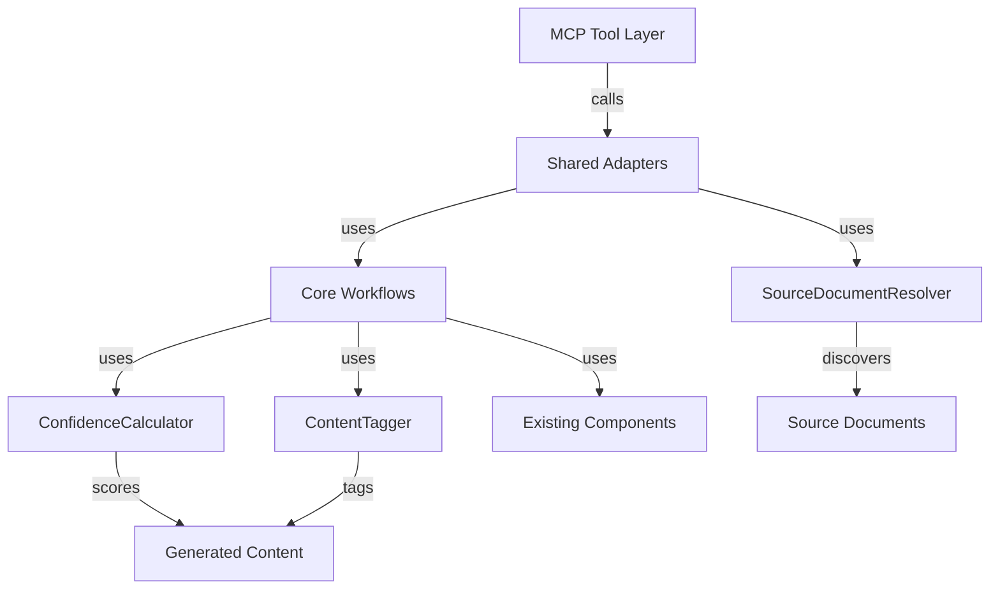
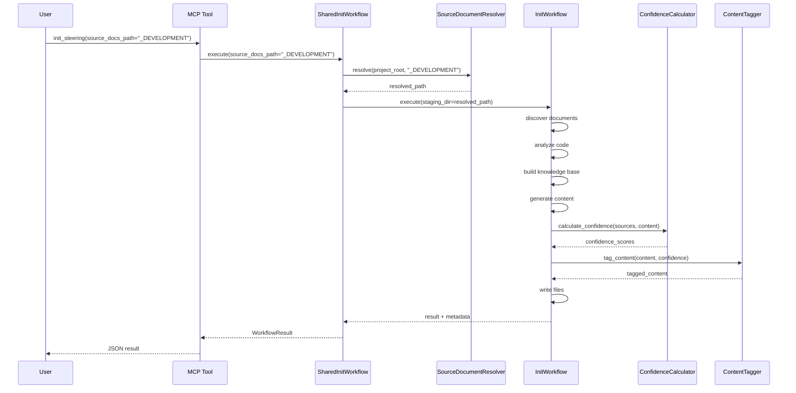
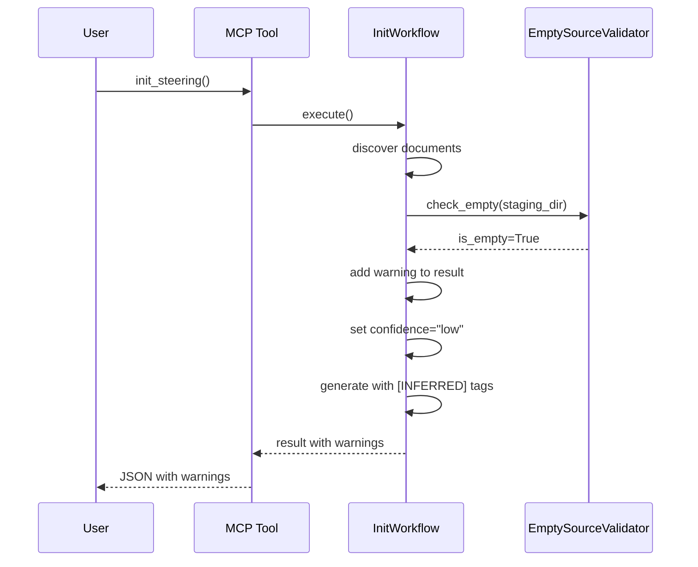

# Design: Source Documents Path & Hallucination Guardrails

**Spec ID:** `source-docs-and-guardrails`  
**Created:** 2026-02-19  
**Updated:** 2026-02-19 (Red Team Review)  
**Status:** Approved with Modifications  
**Version:** 2.2.1

---

## Architecture Overview

### System Components



### Component Responsibilities

#### SourceDocumentResolver
- **Responsibility:** Resolve and validate custom source document paths
- **Interface:** `resolve(project_root: Path, source_docs_path: Optional[str]) -> Path`
- **Dependencies:** pathlib, security validation

#### ConfidenceCalculator
- **Responsibility:** Calculate confidence scores for generated content
- **Interface:** `calculate(sources: Dict, content: str) -> ConfidenceScore`
- **Dependencies:** KnowledgeBase, GapAnalysis

#### ContentTagger
- **Responsibility:** Tag inferred content and add metadata
- **Interface:** `tag_content(content: str, confidence: ConfidenceScore) -> str`
- **Dependencies:** ConfidenceCalculator

---

## Data Flow

### Init Workflow with Custom Source Path



### Empty Source Folder Warning Flow



---

## Data Models

### ConfidenceScore

```python
@dataclass
class ConfidenceScore:
    """Confidence score for generated content."""
    
    overall: float  # 0.0 to 1.0
    level: str  # "high", "medium", "low"
    sources: Dict[str, float]  # source -> contribution percentage
    inferred_sections: List[str]  # section names that were inferred
    
    def to_dict(self) -> Dict[str, Any]:
        return {
            "overall": self.overall,
            "level": self.level,
            "sources": self.sources,
            "inferred_sections": self.inferred_sections
        }
```

### EnhancedWorkflowResult

```python
@dataclass
class EnhancedWorkflowResult(WorkflowResult):
    """Extended result with confidence metadata."""
    
    source_documents_found: int = 0
    confidence_level: str = "unknown"
    confidence_scores: Dict[str, ConfidenceScore] = field(default_factory=dict)
    discovery_stats: Optional[Dict[str, Any]] = None
```

### SourceDocumentInfo

```python
@dataclass
class SourceDocumentInfo:
    """Information about discovered source documents."""
    
    path: Path
    file_type: str
    size_bytes: int
    discovered_from: str  # "staging", "custom_path", "project_root"
    is_symlink: bool = False  # True if file was symlinked to staging
    original_path: Optional[Path] = None  # Original path if symlinked
```

---

## API Design

### MCP Tool Signatures (Updated)

```python
async def init_steering(
    ctx: Context,
    project_root: str = ".",
    source_docs_path: Optional[str] = None,  # NEW
    auto_discover: bool = True,
    autonomous: bool = True,
    confidence_threshold: float = 0.7,
    dry_run: bool = False,  # NEW
    copy_files: bool = False  # NEW
) -> dict[str, Any]:
    """
    Initialize steering files for a project.
    
    Args:
        project_root: Path to project root directory
        source_docs_path: Optional path to source documents folder (relative to project_root)
        auto_discover: Enable automatic discovery of existing docs
        autonomous: Enable autonomous generation mode (LLM fills gaps without asking)
        confidence_threshold: Minimum confidence for autonomous decisions (0.0-1.0)
                             Controls when to ask vs. infer in autonomous mode
        dry_run: Preview what would be created without writing files
        copy_files: If True, copy source files to staging. If False, use symlinks (default)
    
    Returns:
        {
            "status": "success" | "failed",
            "message": str,
            "files_created": List[str],
            "source_documents_found": int,
            "confidence_level": "high" | "medium" | "low",
            "confidence_scores": Dict[str, ConfidenceScore],
            "warnings": List[str],
            "errors": List[str],
            "metadata": {
                "source_docs_path": Optional[str],
                "discovery_stats": Dict[str, Any]
            }
        }
    """
```

```python
async def discover_docs(
    ctx: Context,
    project_root: str = ".",
    source_docs_path: Optional[str] = None,  # NEW
    file_types: Optional[List[str]] = None,  # NEW
    include_git_history: bool = False,
    max_discovery_files: int = 1000,
    max_file_size_mb: int = 10
) -> dict[str, Any]:
    """
    Discover existing documentation and project files.
    
    Args:
        project_root: Path to project root directory
        source_docs_path: Optional path to prioritize for discovery
        file_types: Optional list of file extensions to include (e.g., [".md", ".pdf"])
        include_git_history: Analyze git commits and PRs
        max_discovery_files: Maximum files to analyze
        max_file_size_mb: Maximum file size in MB
    
    Returns:
        {
            "status": "success" | "failed",
            "message": str,
            "files_discovered": int,
            "files_by_type": Dict[str, int],
            "files_by_path": Dict[str, int],
            "files_included": int,
            "files_excluded": int,
            "warnings": List[str],
            "errors": List[str]
        }
    """
```

### Core Component Interfaces

```python
class SourceDocumentResolver:
    """Resolves and validates custom source document paths."""
    
    def __init__(self, project_root: Path):
        self.project_root = project_root
    
    def sanitize_path(self, path_str: str) -> str:
        """Sanitize user-provided path string (see Security section)."""
        pass
    
    def validate_path(self, path: Path) -> bool:
        """Validate that path exists and is within project root (see Security section)."""
        pass
    
    def resolve(
        self, 
        source_docs_path: Optional[str],
        copy_files: bool = False
    ) -> Tuple[Path, List[SourceDocumentInfo]]:
        """
        Resolve source document path and discover documents.
        
        Args:
            source_docs_path: Relative path to source documents
            copy_files: If True, copy files to staging. If False, use symlinks (default)
        
        Returns:
            Tuple of (resolved_path, discovered_documents)
        
        Raises:
            ValueError: If path is invalid or doesn't exist
        """
        pass
    
    def discover_documents(
        self,
        path: Path,
        staging_dir: Path,
        copy_files: bool = False
    ) -> List[SourceDocumentInfo]:
        """
        Discover documents in path and link/copy to staging.
        
        Args:
            path: Path to discover documents from
            staging_dir: Staging directory to link/copy to
            copy_files: If True, copy files. If False, create symlinks.
        
        Returns:
            List of discovered document info
        """
        pass
```

```python
class ConfidenceCalculator:
    """Calculates confidence scores for generated content."""
    
    def calculate_file_confidence(
        self,
        file_name: str,
        sources: Dict[str, Any],
        content: str
    ) -> ConfidenceScore:
        """
        Calculate confidence for a single steering file.
        
        Args:
            file_name: Name of the steering file
            sources: Dictionary of content sources
            content: Generated file content
        
        Returns:
            ConfidenceScore with overall score and breakdown
        """
        pass
    
    def calculate_overall_confidence(
        self,
        file_scores: Dict[str, ConfidenceScore]
    ) -> ConfidenceScore:
        """Calculate overall workflow confidence from file scores."""
        pass
```

```python
class ContentTagger:
    """Tags inferred content and adds metadata."""
    
    def tag_inferred_sections(
        self,
        content: str,
        inferred_sections: List[str]
    ) -> str:
        """Add [INFERRED] tags to specified sections."""
        pass
    
    def add_metadata_header(
        self,
        content: str,
        confidence: ConfidenceScore,
        metadata: Dict[str, Any]
    ) -> str:
        """Add YAML frontmatter with confidence metadata."""
        pass
    
    def add_low_confidence_warning(
        self,
        content: str
    ) -> str:
        """Add prominent warning for low-confidence files."""
        pass
```

---

## Confidence Calculation Algorithm

### Confidence Weight Rationale

**Why these specific weights?**

- **Source documents: 1.0** - Highest confidence. User-provided design documents are the ground truth for project vision, requirements, and business context.
- **Code analysis: 0.8** - High confidence. Code is factual and accurate for technical details (tech stack, architecture patterns, conventions), but doesn't capture business intent or future plans.
- **LLM inference: 0.3** - Low confidence. Inferred content is educated guessing based on patterns. Useful for filling gaps but requires user verification.

**Justification:**
- Source documents represent explicit user intent → full weight
- Code analysis is objective but incomplete → slight discount
- LLM inference is speculative → significant discount

These weights are fixed in v2.2.0 for simplicity. Configurable weights may be added in v2.3.0 based on user feedback.

### Per-File Confidence

```python
def calculate_file_confidence(
    file_name: str,
    sources: Dict[str, Any],
    content: str
) -> ConfidenceScore:
    """
    Calculate confidence based on:
    1. Percentage of content from source documents
    2. Percentage from code analysis
    3. Percentage inferred by LLM
    
    Weights (see rationale above):
    - Source documents: 1.0
    - Code analysis: 0.8
    - LLM inference: 0.3
    """
    
    # Count sections by source
    doc_sections = sources.get("documents", [])
    code_sections = sources.get("code_analysis", [])
    inferred_sections = sources.get("inferred", [])
    
    total_sections = len(doc_sections) + len(code_sections) + len(inferred_sections)
    
    if total_sections == 0:
        return ConfidenceScore(overall=0.0, level="low", sources={}, inferred_sections=[])
    
    # Calculate weighted score
    doc_weight = len(doc_sections) / total_sections * 1.0
    code_weight = len(code_sections) / total_sections * 0.8
    inferred_weight = len(inferred_sections) / total_sections * 0.3
    
    overall = doc_weight + code_weight + inferred_weight
    
    # Determine level
    if overall >= 0.8:
        level = "high"
    elif overall >= 0.5:
        level = "medium"
    else:
        level = "low"
    
    return ConfidenceScore(
        overall=overall,
        level=level,
        sources={
            "documents": doc_weight,
            "code_analysis": code_weight,
            "inferred": inferred_weight
        },
        inferred_sections=inferred_sections
    )
```

### Overall Workflow Confidence

```python
def calculate_overall_confidence(
    file_scores: Dict[str, ConfidenceScore]
) -> ConfidenceScore:
    """
    Calculate overall confidence as weighted average of file scores.
    
    Weights by file importance:
    - project-vision.md: 1.5
    - tech-stack.md: 1.2
    - architecture.md: 1.2
    - conventions.md: 1.0
    - db-standards.md: 0.8
    - api-standards.md: 0.8
    - ui-standards.md: 0.8
    - qa-standards.md: 0.8
    """
    
    weights = {
        "project-vision.md": 1.5,
        "tech-stack.md": 1.2,
        "architecture.md": 1.2,
        "conventions.md": 1.0,
        "db-standards.md": 0.8,
        "api-standards.md": 0.8,
        "ui-standards.md": 0.8,
        "qa-standards.md": 0.8
    }
    
    weighted_sum = 0.0
    weight_total = 0.0
    all_inferred = []
    
    for file_name, score in file_scores.items():
        weight = weights.get(file_name, 1.0)
        weighted_sum += score.overall * weight
        weight_total += weight
        all_inferred.extend(score.inferred_sections)
    
    overall = weighted_sum / weight_total if weight_total > 0 else 0.0
    
    if overall >= 0.8:
        level = "high"
    elif overall >= 0.5:
        level = "medium"
    else:
        level = "low"
    
    return ConfidenceScore(
        overall=overall,
        level=level,
        sources={},  # Aggregated, not per-source
        inferred_sections=all_inferred
    )
```

---

## Content Tagging Format

### Metadata Header (YAML Frontmatter)

```markdown
---
generated_by: hiveforge v2.2.0
generated_at: 2026-02-19T10:30:00Z
source_documents: 3
source_docs_path: _DEVELOPMENT
code_analysis: true
confidence:
  overall: 0.65
  level: medium
  sources:
    documents: 0.40
    code_analysis: 0.20
    inferred: 0.05
  inferred_sections:
    - "Problem Statement"
    - "Target Users"
---

# Project Vision

## Problem Statement
<!-- INFERRED: Please verify this section -->
Users struggle with managing multiple documentation sources...
```

### Low Confidence Warning

```markdown
---
generated_by: hiveforge v2.2.0
confidence:
  overall: 0.35
  level: low
---

> ⚠️ **LOW CONFIDENCE**: This file was generated with limited source material.
> Most content is inferred from code analysis. Please review and update with actual project information.

# Project Vision
...
```

### Inferred Section Tags

```markdown
## Target Users

<!-- INFERRED: Please verify this section -->
1. **Primary:** Software developers working on multi-agent systems
2. **Secondary:** DevOps engineers managing deployment pipelines

<!-- END INFERRED -->

## Success Metrics
...
```

---

## Error Handling

### Input Sanitization

```python
def sanitize_path(self, path_str: str) -> str:
    """
    Sanitize user-provided path string.
    
    Sanitization rules:
    1. Strip leading/trailing whitespace
    2. Normalize path separators (convert to OS-specific)
    3. Remove redundant separators (// → /)
    4. Reject paths with null bytes
    5. Reject paths with control characters
    
    Returns:
        Sanitized path string
    
    Raises:
        ValueError: If path contains invalid characters
    """
    # Strip whitespace
    path_str = path_str.strip()
    
    # Check for null bytes
    if '\0' in path_str:
        raise ValueError("Path contains null bytes")
    
    # Check for control characters
    if any(ord(c) < 32 for c in path_str):
        raise ValueError("Path contains control characters")
    
    # Normalize separators
    path_str = path_str.replace('\\', '/')
    
    # Remove redundant separators
    while '//' in path_str:
        path_str = path_str.replace('//', '/')
    
    return path_str
```

### Empty Source Folder

```python
if document_count == 0:
    warnings.append(
        "No source documents found. Steering files will be generated from "
        "code analysis only. Consider adding design documents to improve accuracy."
    )
    
    if autonomous:
        warnings.append(
            "Autonomous mode with no source documents may produce inferred content. "
            "Review generated files carefully."
        )
    
    metadata["source_documents_found"] = 0
    metadata["confidence_level"] = "low"
```

### Invalid Source Path

```python
try:
    resolved_path = resolver.resolve(source_docs_path)
except ValueError as e:
    return {
        "status": "failed",
        "message": f"Invalid source_docs_path: {str(e)}",
        "errors": [str(e)],
        "warnings": ["Try using a relative path like '_DEVELOPMENT' or 'docs'"]
    }
```

### Path Traversal Prevention

```python
def validate_path(self, path: Path) -> bool:
    """
    Validate path is within project root.
    
    Security checks:
    1. Resolve symlinks to real paths
    2. Ensure resolved path is within project root
    3. Reject paths with null bytes
    4. Reject absolute paths outside project
    5. Reject parent directory traversal attempts
    """
    try:
        # Check for null bytes (security)
        if '\0' in str(path):
            raise ValueError("Path contains null bytes")
        
        # Resolve symlinks and relative paths
        resolved = path.resolve()
        project_resolved = self.project_root.resolve()
        
        # Ensure path is within project root
        resolved.relative_to(project_resolved)
        
        # Additional check: reject if resolved path escapes via symlink
        if not str(resolved).startswith(str(project_resolved)):
            raise ValueError("Path escapes project root via symlink")
        
        return True
    except ValueError as e:
        raise ValueError(
            f"Path {path} is outside project root {self.project_root}: {e}"
        )
```

**Test Coverage:**
- Path traversal: `../../../etc/passwd`
- Absolute paths: `/etc/passwd`
- Relative escapes: `subdir/../../escape`
- Symlink attacks: `ln -s /etc/passwd evil`
- Null byte injection: `path\0.txt`
- Unicode attacks: `..%2F..%2Fetc`

---

## Backward Compatibility

### Default Behavior (No source_docs_path)

When `source_docs_path` is not provided:
1. Check `.kiro/onboarding/` first (existing behavior)
2. If empty, scan `project_root` (existing behavior)
3. No warnings unless both are empty

### Existing Workflows

All existing code continues to work:
```python
# Old code - still works
init_steering(project_root=".")

# New code - enhanced
init_steering(project_root=".", source_docs_path="_DEVELOPMENT")
```

---

## Performance Considerations

### SourceDocumentResolver
- Caches discovered documents to avoid re-scanning
- Uses pathlib for efficient path operations
- Respects `.gitignore` patterns
- **Uses symlinks by default** (fast, ~100ms for 1000 files)
- Optional file copying via `copy_files=True` parameter (slow, ~5s for 1000 files)

### ConfidenceCalculator
- Lightweight heuristics, no heavy computation
- Runs after content generation (doesn't slow down workflow)
- Results cached in memory during workflow

### ContentTagger
- Simple string operations
- Adds < 1% overhead to file writing

---

## Security Considerations

### Path Validation
- All paths validated against project root
- Path traversal attacks prevented
- Symlinks resolved and checked

### Input Sanitization
- `source_docs_path` sanitized before use
- File type filtering prevents execution of arbitrary files
- Size limits enforced on discovered documents

---

## Testing Strategy

### Unit Tests
- `test_source_document_resolver.py` - Path resolution, validation, discovery
- `test_confidence_calculator.py` - Scoring algorithm, edge cases
- `test_content_tagger.py` - Tag insertion, metadata formatting

### Integration Tests
- `test_init_with_custom_source.py` - Full workflow with custom path
- `test_empty_source_warnings.py` - Warning generation and metadata
- `test_confidence_metadata.py` - Metadata in generated files
- `test_backward_compatibility.py` - Existing workflows unchanged

### Manual Test Scenarios
1. User with docs in `_DEVELOPMENT/` - should discover and use them
2. User with empty `.kiro/onboarding/` - should show warnings
3. User with invalid path - should fail gracefully with helpful message
4. User with no source_docs_path - should work as before

---

## Migration Path

### For Existing Users
1. No action required - existing workflows continue to work
2. Optional: Move documents to custom folder and use `source_docs_path`
3. Optional: Review confidence metadata in generated files

### For New Users
1. Place documents in any folder (e.g., `_DEVELOPMENT/`)
2. Use `source_docs_path` parameter when calling `init_steering`
3. Review confidence scores and warnings in results

---

## Confidence Threshold Parameter Clarification

**What does `confidence_threshold: float = 0.7` control?**

The `confidence_threshold` parameter is used by the **autonomous mode** to decide when to ask the user for clarification vs. when to infer content automatically.

**Usage:**
- When gap analysis identifies missing information, the assistant calculates a "fillability confidence" for each gap
- If fillability confidence >= `confidence_threshold`, the LLM fills the gap autonomously
- If fillability confidence < `confidence_threshold`, the LLM asks the user (if interactive mode)

**Not used for:**
- Warning generation (warnings trigger at < 0.5 overall confidence, fixed)
- Confidence score calculation (uses fixed weights: 1.0, 0.8, 0.3)
- File validation (separate validation logic)

**Example:**
```python
# High threshold = more questions, less inference
init_steering(autonomous=True, confidence_threshold=0.9)

# Low threshold = fewer questions, more inference
init_steering(autonomous=True, confidence_threshold=0.5)
```

---

## Telemetry Collection

### New Metrics Tracked

**Parameter Usage:**
- `source_docs_path` usage rate (% of calls with custom path)
- `dry_run` usage rate
- `copy_files` usage rate

**Confidence Levels:**
- Distribution of overall confidence (high/medium/low)
- Average confidence per template type
- Correlation between source document count and confidence

**Performance:**
- Source document discovery time
- Confidence calculation time
- Content tagging time

**Errors:**
- Path validation failures (by error type)
- Discovery failures (by cause)
- Confidence calculation failures

### Implementation

Telemetry is collected via existing `TelemetryCollector` in shared adapters:

```python
if self.telemetry_collector:
    self.telemetry_collector.collect_workflow_execution(
        workflow_type="init",
        parameters={
            "source_docs_path": source_docs_path,
            "dry_run": dry_run,
            "copy_files": copy_files
        },
        metadata={
            "confidence_level": result.confidence_level,
            "source_documents_found": result.source_documents_found,
            "discovery_time_ms": discovery_time,
            "confidence_calc_time_ms": confidence_time
        }
    )
```

---

## Migration Guide for Existing Users

### Scenario 1: Documents Already in `.kiro/onboarding/`

**No action required.** Your existing workflow continues to work unchanged.

```python
# Before v2.2.0
init_steering(project_root=".")

# After v2.2.0 (same behavior)
init_steering(project_root=".")
```

### Scenario 2: Want to Move Documents to Custom Folder

**Option A: Move files and use `source_docs_path`**

```bash
# Move documents
mkdir _DEVELOPMENT
mv .kiro/onboarding/* _DEVELOPMENT/

# Use new parameter
init_steering(project_root=".", source_docs_path="_DEVELOPMENT")
```

**Option B: Keep using `.kiro/onboarding/`**

No change needed. The default behavior is unchanged.

### Scenario 3: Documents in Multiple Locations

**Current limitation:** v2.2.0 supports only one `source_docs_path`.

**Workaround:** Copy/symlink all documents to one folder:

```bash
mkdir _DEVELOPMENT/all-docs
cp docs/*.md _DEVELOPMENT/all-docs/
cp design/*.pdf _DEVELOPMENT/all-docs/
init_steering(source_docs_path="_DEVELOPMENT/all-docs")
```

**Future:** v2.3.0 will support multiple paths:
```python
init_steering(source_docs_path=["docs", "design", "_DEVELOPMENT"])
```

### Scenario 4: Using HiveForge Power from KIRO

**Before v2.2.0:**
```
User: "Initialize steering files for my project"
KIRO: [calls init_steering(project_root=".")]
Result: Only uses .kiro/onboarding/ (often empty)
```

**After v2.2.0:**
```
User: "Initialize steering files; my design docs are in _DEVELOPMENT"
KIRO: [calls init_steering(project_root=".", source_docs_path="_DEVELOPMENT")]
Result: Uses documents from _DEVELOPMENT/
```

### Precedence Rules

When both `.kiro/onboarding/` and `source_docs_path` exist:

1. If `source_docs_path` is provided → use only that path
2. If `source_docs_path` is NOT provided → use `.kiro/onboarding/` (default)
3. Documents are discovered from the specified path only (no merging)

---

## Open Questions & Decisions

### Q1: Should source_docs_path support multiple paths?
**Decision:** Not in v2.2.0. Single path is simpler. Can add in v2.3.0 if needed.

### Q2: Should we deprecate .kiro/onboarding/?
**Decision:** No. Keep for backward compatibility. Add deprecation warning in v2.3.0, remove in v3.0.0.

### Q3: What confidence threshold should trigger warnings?
**Decision:** < 0.5 (50%) triggers warnings (fixed). `confidence_threshold` parameter controls autonomous mode decisions only.

### Q4: Should dry-run be available in CLI?
**Decision:** Yes. Add `--dry-run` flag to CLI in same release.

---

## Success Metrics

- [ ] 90%+ user success rate on first attempt
- [ ] Zero silent failures (all issues produce warnings)
- [ ] 100% of generated files include confidence metadata
- [ ] Backward compatibility maintained (existing tests pass)
- [ ] Documentation updated and accurate
