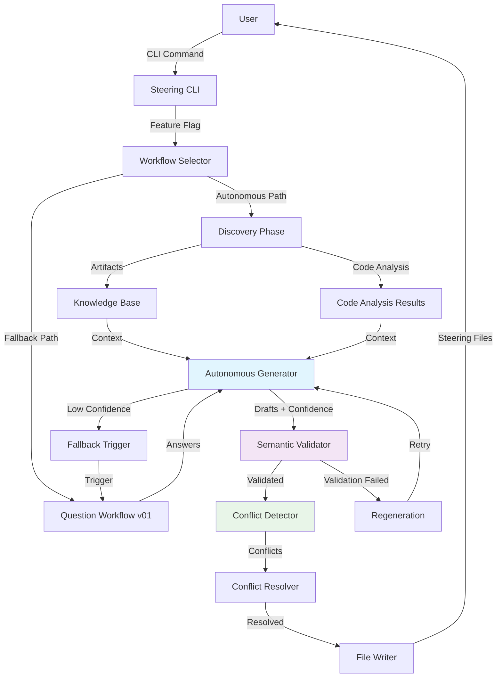

# Design Document: Steering Assistant v02 UX Improvements

## Overview

The Steering Assistant v02 redesign transforms the user experience from a question-driven interrogation to an autonomous, intelligent generation system. This architectural shift addresses critical UX issues identified in real-world testing: excessive user burden (14 questions across 6 batches), poor information synthesis (83 validation errors), and underutilization of LLM capabilities.

The core innovation is inverting the workflow: instead of using LLMs to analyze gaps and humans to fill templates, the system uses LLMs to generate complete drafts autonomously, with humans only intervening for validation and refinement of genuinely ambiguous cases. This represents a fundamental paradigm shift from "AI-assisted form filling" to "AI-driven content generation with human oversight."

**Key Architectural Decision:** v02 extends the existing v01 codebase rather than replacing it. The `AutonomousWorkflow` class extends `InitWorkflow` and reuses existing components (`KnowledgeBase`, `GapAnalysisEngine`, `TemplatePopulator`, `ConflictResolver`, `CustomizationDetector`). This ensures backward compatibility and reduces implementation risk.

### Key Design Principles

1. **Autonomy First**: Generate complete drafts without user questions whenever possible
2. **Sequential Generation**: Generate files one at a time with shared context (not batch)
3. **Confidence Transparency**: Clearly indicate certainty levels for all generated content (conservative thresholds: HIGH ≥0.9, MEDIUM ≥0.7, LOW <0.7)
4. **Rule-Based Validation**: Use validation_rules.yaml for semantic validation (not LLM-based)
5. **Graceful Degradation**: Fall back to question-asking only when genuinely uncertain
6. **Incremental Updates**: Update only changed files (not sections) to preserve customizations
7. **Structural Consistency**: Focus on structural similarity (not semantic equivalence) for v02.0

## Architecture

### System Diagram



### Component Responsibilities

#### 1. Workflow Selector
- **Responsibility**: Routes execution to autonomous generation or fallback question workflow based on feature flags and confidence thresholds
- **Interface**: CLI flags (`--use-autonomous-generation`, `--confidence-threshold`)
- **Dependencies**: Configuration system, telemetry logging
- **Integration**: Wraps existing `InitWorkflow` and new `AutonomousWorkflow`

#### 2. Discovery Phase (EXTENDS EXISTING)
- **Responsibility**: Intelligently locates and imports project documentation, metadata, and existing steering files
- **Interface**: File system scanning, git history analysis, user selection interface
- **Dependencies**: File I/O, git client, pattern matching libraries
- **Integration**: Extends existing document parser orchestrator with new search capabilities

#### 3. Autonomous Generator (NEW)
- **Responsibility**: Generates complete steering file drafts sequentially using LLM with confidence scoring
- **Interface**: LLM API, knowledge base queries, confidence scoring system
- **Dependencies**: LLM service, token budget management, prompt engineering system, existing `TemplatePopulator`
- **Integration**: Uses existing `KnowledgeBase` and `TemplatePopulator`, adds confidence scoring layer

#### 4. Semantic Validator (NEW - RULE-BASED)
- **Responsibility**: Cross-references generated content against code analysis using validation_rules.yaml
- **Interface**: Validation rules engine, structural consistency checking
- **Dependencies**: Code analysis results, validation_rules.yaml, existing `SteeringValidator`
- **Integration**: Extends existing `SteeringValidator` with semantic validation rules

#### 5. Conflict Detector (EXTENDS EXISTING)
- **Responsibility**: Identifies contradictions between generated content, existing files, and different information sources
- **Interface**: Fact extraction, contradiction analysis, confidence scoring for conflicts
- **Dependencies**: Text analysis, fact extraction algorithms, confidence scoring
- **Integration**: Extends existing `ConflictResolver` with confidence-based conflict detection

#### 6. Conflict Resolver (REUSES EXISTING)
- **Responsibility**: Presents conflicts to users and implements resolution strategies
- **Interface**: User interaction, side-by-side comparison, batch resolution
- **Dependencies**: UI rendering, user input handling, merge algorithms
- **Integration**: Reuses existing `ConflictResolver` class with batch resolution enhancement

#### 7. File Writer (REUSES EXISTING WITH BACKUP)
- **Responsibility**: Writes steering files with backup, rollback, and incremental update capabilities
- **Interface**: File I/O, backup management, incremental diff application
- **Dependencies**: File system, version control, diff/patch libraries
- **Integration**: Extends existing file writing logic with backup manager

### Data Flow

1. **Initialization**: User runs `hiveforge steering init --use-autonomous-generation`
2. **Workflow Selection**: System checks feature flag and routes to autonomous path
3. **Discovery**: System scans project for documentation, analyzes code, builds knowledge base (extends existing discovery)
4. **Sequential Generation**: LLM generates steering files one at a time:
   - Generate project-vision.md (highest priority)
   - Generate tech-stack.md (pass project-vision as context)
   - Generate architecture.md (pass project-vision + tech-stack as context)
   - Generate conventions.md (pass all previous as context)
   - Generate api-standards.md, db-standards.md, qa-standards.md, ui-standards.md (pass all previous as context)
5. **Confidence Scoring**: System assigns confidence scores to each section using evidence strength
6. **Validation**: System validates semantic correctness using validation_rules.yaml
7. **Conflict Detection**: System detects contradictions with existing files (if updating)
8. **Resolution**: User reviews and resolves conflicts (if any)
9. **Writing**: System writes files with backups and rollback protection
10. **Fallback Handling**: If confidence is low or validation fails for a specific file, system falls back to question workflow for that file only

## Validation Rules Specification

The system uses a `validation_rules.yaml` file to define semantic validation rules. This file is located at `src/hiveforge/steering/validation_rules.yaml`.

### Example validation_rules.yaml

```yaml
version: "1.0"

# Framework classification for language/framework pairing validation
framework_classifications:
  frontend:
    - React
    - Vue
    - Angular
    - Svelte
    - Next.js
    - Nuxt.js
  backend:
    - FastAPI
    - Express
    - Django
    - Flask
    - Gin
    - Spring Boot
  database:
    - PostgreSQL
    - MongoDB
    - MySQL
    - Redis
    - Cassandra

# Semantic validation rules
rules:
  - id: tech_stack_backend_framework_classification
    description: "Backend framework must not be a frontend framework"
    severity: CRITICAL
    check:
      file: tech-stack.md
      section: "Backend.Framework"
      condition: "value not in framework_classifications.frontend"
      error_message: "Backend framework '{value}' is classified as a frontend framework"

  - id: tech_stack_frontend_framework_classification
    description: "Frontend framework must not be a backend framework"
    severity: CRITICAL
    check:
      file: tech-stack.md
      section: "Frontend.Framework"
      condition: "value not in framework_classifications.backend"
      error_message: "Frontend framework '{value}' is classified as a backend framework"

  - id: architecture_tech_stack_consistency
    description: "Architecture pattern must be consistent with tech stack description"
    severity: MAJOR
    check:
      files: [architecture.md, tech-stack.md]
      condition: |
        if "microservices" in architecture.md.pattern.lower():
          assert "microservices" in tech-stack.md.rationale.lower() or "distributed" in tech-stack.md.rationale.lower()
        if "monolithic" in architecture.md.pattern.lower():
          assert "monolithic" in tech-stack.md.rationale.lower() or "single" in tech-stack.md.rationale.lower()
      error_message: "Architecture pattern '{architecture_pattern}' is inconsistent with tech stack description"

  - id: version_consistency_across_files
    description: "Technology versions must be consistent across all files"
    severity: MAJOR
    check:
      files: [tech-stack.md, api-standards.md, db-standards.md]
      condition: "extract_versions() and check_consistency()"
      error_message: "Version mismatch for '{technology}': {file1} says '{version1}', {file2} says '{version2}'"

  - id: database_standards_tech_stack_consistency
    description: "Database mentioned in db-standards.md must be in tech-stack.md"
    severity: MAJOR
    check:
      files: [tech-stack.md, db-standards.md]
      condition: "db_standards.database in tech_stack.database"
      error_message: "Database '{database}' in db-standards.md is not mentioned in tech-stack.md"

  - id: api_standards_tech_stack_consistency
    description: "API framework in api-standards.md must match backend framework in tech-stack.md"
    severity: MAJOR
    check:
      files: [tech-stack.md, api-standards.md]
      condition: "api_standards.framework == tech_stack.backend.framework"
      error_message: "API framework '{api_framework}' does not match backend framework '{backend_framework}'"
```

### Validation Rule Execution

The `SemanticValidator` class loads `validation_rules.yaml` and executes each rule:

1. **Extract values**: Parse steering files to extract relevant sections
2. **Evaluate condition**: Run the condition check (Python expression or custom function)
3. **Report errors**: If condition fails, generate validation error with evidence
4. **Assign severity**: CRITICAL errors block generation, MAJOR errors warn user, MINOR errors are informational

## Components and Interfaces

### Core Components

#### 1. Knowledge Base Manager
```python
class KnowledgeBase:
    """Manages discovered artifacts and code analysis results."""
    
    def add_artifact(self, artifact: Artifact) -> None:
        """Add a discovered artifact to the knowledge base."""
        
    def get_relevant_content(self, max_tokens: int) -> str:
        """Extract relevant content for LLM context within token limit."""
        
    def query(self, query: str) -> List[Evidence]:
        """Query the knowledge base for specific information."""
```

#### 2. Confidence Scoring System
```python
class ConfidenceScorer:
    """Assigns and manages confidence scores for generated content."""
    
    def calculate_confidence(self, 
                           content: str, 
                           evidence: List[Evidence]) -> float:
        """Calculate confidence score based on evidence strength."""
        
    def calibrate(self, 
                 predicted: List[float], 
                 actual: List[bool]) -> CalibrationResult:
        """Calibrate confidence scores against actual correctness."""
        
    def get_level(self, score: float) -> ConfidenceLevel:
        """Convert numeric score to HIGH/MEDIUM/LOW level."""
```

#### 3. Semantic Validator
```python
class SemanticValidator:
    """Validates semantic correctness of generated content."""
    
    def validate(self, 
                content: str, 
                code_analysis: CodeAnalysis) -> ValidationResult:
        """Validate content against code analysis results."""
        
    def check_equivalence(self, 
                         content1: str, 
                         content2: str) -> EquivalenceResult:
        """Check if two content pieces are semantically equivalent."""
        
    def detect_contradictions(self, 
                             facts: List[Fact]) -> List[Contradiction]:
        """Detect logical contradictions between facts."""
```

#### 4. Conflict Resolution Engine
```python
class ConflictResolver:
    """Manages conflict detection and resolution."""
    
    def detect_conflicts(self, 
                        new_content: Dict[str, str],
                        existing_content: Dict[str, str]) -> List[Conflict]:
        """Detect conflicts between new and existing content."""
        
    def present_conflicts(self, 
                         conflicts: List[Conflict]) -> ResolutionDecisions:
        """Present conflicts to user and collect resolution decisions."""
        
    def apply_resolutions(self, 
                         content: Dict[str, str],
                         decisions: ResolutionDecisions) -> Dict[str, str]:
        """Apply user resolution decisions to content."""
```

### Interface Specifications

#### CLI Interface
```bash
# Primary command with autonomous generation
hiveforge steering init --use-autonomous-generation

# With confidence threshold adjustment
hiveforge steering init --use-autonomous-generation --confidence-threshold 0.7

# With discovery customization
hiveforge steering init --use-autonomous-generation --discovery-paths docs/,design/

# Preview mode
hiveforge steering init --use-autonomous-generation --preview

# Incremental update
hiveforge steering update --incremental

# Rollback
hiveforge steering rollback

# Confidence calibration
hiveforge steering calibrate --calibrate-confidence
```

#### Programmatic API
```python
class SteeringAssistant:
    """Programmatic interface for steering assistant."""
    
    def generate_autonomous(self,
                          project_path: Path,
                          use_cache: bool = True) -> GenerationResult:
        """Generate steering files autonomously."""
        
    def update_incremental(self,
                         project_path: Path,
                         changes: ProjectChanges) -> UpdateResult:
        """Update steering files incrementally based on changes."""
        
    def validate_semantic(self,
                         content: Dict[str, str],
                         code_analysis: CodeAnalysis) -> ValidationResult:
        """Validate semantic correctness of content."""
```

## Data Models

### Core Data Structures

#### 1. Artifact Model
```python
@dataclass
class Artifact:
    """Represents a discovered project artifact."""
    path: Path
    content_type: ArtifactType  # DOCUMENTATION, CODE, CONFIG, METADATA
    content: str
    relevance_score: float  # 0.0-1.0
    extraction_method: ExtractionMethod  # DIRECT, PARSED, INFERRED
    confidence: float  # 0.0-1.0
    metadata: Dict[str, Any]
```

#### 2. Confidence Model
```python
@dataclass
class ConfidenceScore:
    """Represents a confidence score with calibration data."""
    value: float  # 0.0-1.0
    level: ConfidenceLevel  # HIGH, MEDIUM, LOW
    evidence: List[Evidence]
    calibration_status: CalibrationStatus  # UNCALIBRATED, CALIBRATING, CALIBRATED
    calibration_data: Optional[CalibrationData]
    
@dataclass
class Evidence:
    """Evidence supporting a confidence score."""
    source: EvidenceSource  # ARTIFACT, CODE_ANALYSIS, INFERENCE, USER
    strength: float  # 0.0-1.0
    description: str
    metadata: Dict[str, Any]
```

#### 3. Validation Model
```python
@dataclass
class ValidationResult:
    """Result of semantic validation."""
    is_valid: bool
    confidence: float  # 0.0-1.0
    errors: List[ValidationError]
    warnings: List[ValidationWarning]
    equivalence_check: EquivalenceCheckResult
    
@dataclass
class ValidationError:
    """A semantic validation error."""
    type: ErrorType  # CONTRADICTION, INCONSISTENCY, IMPOSSIBLE
    section: str
    message: str
    evidence: List[Evidence]
    severity: Severity  # CRITICAL, MAJOR, MINOR
```

#### 4. Conflict Model
```python
@dataclass
class Conflict:
    """A detected conflict between information sources."""
    id: str
    type: ConflictType  # DIRECT, IMPLICIT, VERSION, CUSTOMIZATION
    description: str
    old_value: Optional[str]
    new_value: Optional[str]
    confidence: float  # Confidence in conflict detection
    evidence_old: List[Evidence]
    evidence_new: List[Evidence]
    resolution_options: List[ResolutionOption]
    
@dataclass
class ResolutionOption:
    """A possible resolution for a conflict."""
    id: str
    description: str
    action: ResolutionAction  # KEEP_OLD, USE_NEW, MERGE, REGENERATE
    preview: Optional[str]
    confidence_impact: float  # Impact on overall confidence
```

#### 5. Generation Model
```python
@dataclass
class GenerationResult:
    """Result of autonomous generation."""
    files: Dict[str, GeneratedFile]
    overall_confidence: float
    validation_result: ValidationResult
    conflicts: List[Conflict]
    token_usage: TokenUsage
    fallback_triggered: bool
    
@dataclass
class GeneratedFile:
    """A generated steering file with confidence data."""
    filename: str
    content: str
    section_confidences: Dict[str, float]  # Section name -> confidence
    overall_confidence: float
    inference_sources: Dict[str, InferenceSource]  # Section -> source
    validation_status: ValidationStatus
```

### Telemetry Storage (File-Based)

Instead of a database, v02.0 uses file-based telemetry storage in `.kiro/.telemetry/` directory.

#### Telemetry File Structure

```
.kiro/.telemetry/
├── sessions/
│   ├── 2026-02-16_14-30-45_abc123.json  # Generation session
│   ├── 2026-02-16_15-45-12_def456.json
│   └── ...
├── calibration/
│   ├── confidence_scores.json  # Confidence calibration data
│   └── validation_accuracy.json
└── summary.json  # Aggregated statistics
```

#### Session Telemetry Format

```json
{
  "session_id": "abc123",
  "timestamp": "2026-02-16T14:30:45Z",
  "workflow_type": "AUTONOMOUS",
  "overall_confidence": 0.85,
  "validation_passed": true,
  "conflict_count": 2,
  "token_usage": 15420,
  "duration_ms": 45000,
  "success": true,
  "files_generated": [
    {
      "filename": "project-vision.md",
      "confidence": 0.92,
      "validation_status": "PASSED",
      "token_usage": 2100
    },
    {
      "filename": "tech-stack.md",
      "confidence": 0.88,
      "validation_status": "PASSED",
      "token_usage": 1800
    }
  ],
  "conflicts_resolved": [
    {
      "conflict_type": "VERSION_MISMATCH",
      "resolution_action": "USE_NEW",
      "resolution_duration_ms": 5000
    }
  ],
  "errors": []
}
```

#### Calibration Data Format

```json
{
  "confidence_scores": [
    {
      "project_hash": "abc123",
      "section_type": "tech_stack.backend",
      "predicted_confidence": 0.9,
      "actual_correctness": true,
      "calibration_date": "2026-02-16T14:30:45Z"
    }
  ]
}
```

#### Summary Statistics Format

```json
{
  "total_sessions": 50,
  "autonomous_sessions": 35,
  "fallback_sessions": 15,
  "average_confidence": 0.87,
  "average_token_usage": 14500,
  "average_duration_ms": 42000,
  "success_rate": 0.94,
  "last_updated": "2026-02-16T15:45:12Z"
}
```

### Database Export (v02.1)

v02.1 will add a `hiveforge steering telemetry export` command to export file-based telemetry to database format (PostgreSQL, SQLite, etc.) for advanced analytics.

### State Management

#### Session State
```python
@dataclass
class GenerationSession:
    """Tracks state during a generation session."""
    session_id: UUID
    workflow_type: WorkflowType
    knowledge_base: KnowledgeBase
    code_analysis: CodeAnalysis
    generation_result: Optional[GenerationResult]
    validation_result: Optional[ValidationResult]
    resolution_decisions: Dict[str, ResolutionDecision]
    file_writes: List[FileWrite]
    rollback_points: List[RollbackPoint]
    token_usage: TokenUsage
    start_time: datetime
    end_time: Optional[datetime]
```

#### Cache State
```python
@dataclass  
class GenerationCache:
    """Caches generation results for incremental updates."""
    project_hash: str
    last_analysis: CodeAnalysis
    last_generation: GenerationResult
    customizations: Dict[str, Customization]
    confidence_calibration: Dict[str, CalibrationData]
    timestamp: datetime
    ttl_seconds: int = 86400  # 24 hours
```

## Correctness Properties

### Property 1: Feature Flag Routing

*For any* steering command execution, the system SHALL route to the correct workflow based on feature flags:
- WHEN `--use-autonomous-generation` is provided, the system SHALL use autonomous generation workflow
- WHEN `--use-autonomous-generation` is not provided, the system SHALL use the existing question-asking workflow (v01)
- WHEN both workflows are present, the system SHALL maintain them in parallel without interference

**Validates: Requirements 1.1-1.5**

### Property 2: Discovery Completeness

*For any* discovery phase execution, the system SHALL search for all specified artifact types:
- Documentation files matching patterns: README*, CONTRIBUTING*, ARCHITECTURE*, DESIGN*, SPEC*, REQUIREMENTS*
- Documentation directories: docs/, documentation/, design/, .github/
- Package metadata files: package.json, pyproject.toml, Cargo.toml, pom.xml
- Git history: commit messages and PR descriptions
- CI/CD configurations: .github/workflows/, .gitlab-ci.yml, .circleci/, Jenkinsfile
- Deployment manifests: Dockerfile, docker-compose.yml, k8s/, helm/
- Existing steering files in non-standard locations

**Validates: Requirements 2.1-2.10**

### Property 3: Autonomous Generation Completeness

*For any* autonomous generation execution, the system SHALL produce complete steering files:
- WHEN generating drafts, steering files SHALL be generated sequentially (not in a single LLM call)
- WHEN generating each file, previously generated files SHALL be passed as context
- WHEN information is available, content SHALL have NO unreplaced placeholders
- WHEN information is missing, content SHALL use intelligent inference with markers
- WHEN inference is impossible, content SHALL use explicit markers ("To be determined", "Not yet defined")
- WHEN generation fails for a specific file after retry, the system SHALL continue with remaining files (partial failure handling)

**Validates: Requirements 3.1-3.10**

### Property 4: Confidence Score Accuracy

*For any* confidence score assignment, the system SHALL use appropriate levels:
- HIGH (≥0.9) for content directly extracted from artifacts or code analysis
- MEDIUM (0.7-0.9) for content reasonably inferred from available information
- LOW (<0.7) for generic placeholders or guesses
- WHEN confidence is LOW, the system SHALL flag sections for user review or trigger fallback
- WHEN calibration data is available, thresholds SHALL be adjusted based on actual correctness rates

**Validates: Requirements 4.1-4.8**

### Property 5: Semantic Validation Correctness

*For any* semantic validation execution, the system SHALL detect logical errors using rule-based validation:
- WHEN validating, tech stack claims SHALL be cross-referenced against code analysis using validation_rules.yaml
- WHEN validating, framework/language pairings SHALL be verified using framework classification database
- WHEN validating, logical contradictions SHALL be detected using keyword matching rules
- WHEN validating, version consistency SHALL be checked using version extraction and comparison
- WHEN validating, structural consistency SHALL be verified (e.g., database in tech-stack.md must be referenced in db-standards.md)
- WHEN semantic validation fails, the system SHALL trigger regeneration or fallback

**Validates: Requirements 5.1-5.10**

### Property 6: Conflict Detection Precision

*For any* conflict detection execution, the system SHALL identify contradictions:
- WHEN analyzing drafts, direct contradictions SHALL be detected (Python vs JavaScript)
- WHEN analyzing drafts, implicit contradictions SHALL be detected (REST vs GraphQL)
- WHEN analyzing drafts, version mismatches SHALL be detected
- WHEN analyzing drafts, conflicts with existing steering files SHALL be detected
- WHEN conflicts are detected, high-confidence conflicts SHALL be presented to users

**Validates: Requirements 6.1-6.8**

### Property 7: Customization Preservation

*For any* update workflow execution, the system SHALL preserve user customizations:
- WHEN updating files, customizations SHALL be detected by diffing against templates
- WHEN customizations are detected, they SHALL be marked as protected
- WHEN conflicts exist, merge options SHALL be presented
- WHEN `--preserve-all` flag is set, customized sections SHALL be skipped
- WHEN displaying diffs, customizations SHALL be highlighted with special indicators

**Validates: Requirements 7.1-7.7**

### Property 8: Fallback Triggering

*For any* autonomous generation execution, the system SHALL fall back when appropriate:
- WHEN confidence is LOW (<0.6) for critical sections, fallback SHALL be triggered
- WHEN semantic validation fails, fallback SHALL be triggered
- WHEN `--interactive` flag is provided, fallback SHALL be used
- WHEN token budget is exceeded, fallback SHALL be triggered
- WHEN fallback is triggered, the existing question-asking workflow SHALL be used

**Validates: Requirements 8.1-8.8**

### Property 9: Rollback Integrity

*For any* file write operation, the system SHALL maintain backup integrity:
- WHEN writing files, automatic backups SHALL be created before writing
- WHEN backups exceed limit (5 versions), oldest versions SHALL be deleted
- WHEN `hiveforge steering rollback` is run, all files SHALL be restored to previous version
- WHEN `--dry-run` is set, no files SHALL be written, only preview displayed
- WHEN preview is rejected, no changes SHALL be committed

**Validates: Requirements 9.1-9.7**

### Property 10: Performance Bounds

*For any* generation execution, the system SHALL respect performance limits:
- WHEN generation exceeds 5 seconds, a "working" message SHALL be displayed
- WHEN LLM calls exceed 60 seconds, timeout SHALL occur with retry once
- WHEN token budget approaches limit (90%), user SHALL be warned
- WHEN token budget is exceeded, graceful degradation SHALL occur
- WHEN generation fails after retries, clear error messages SHALL be provided

**Validates: Requirements 10.1-10.7**

### Property 11: Token Budget Enforcement

*For any* LLM execution, the system SHALL track and enforce token budgets:
- WHEN budget approaches limit (90%), user SHALL be warned
- WHEN budget is exceeded, graceful degradation SHALL occur
- WHEN `--max-tokens` is set, the limit SHALL be enforced
- WHEN budget is exceeded, fallback workflow SHALL be triggered
- Token usage metrics SHALL be logged for analysis

**Validates: Requirements 11.1-11.7**

### Property 12: Testability for Non-Deterministic Generation

*For any* test execution, the system SHALL support deterministic testing:
- WHEN unit tests run, mocked LLM responses SHALL be supported
- WHEN testing content, semantic similarity checks SHALL be used instead of exact matches
- WHEN testing, properties of output SHALL be tested (structure, completeness, confidence scores)
- WHEN integration tests run, real LLM calls SHALL be marked as slow/optional
- WHEN regression tests run, known-good examples SHALL be maintained

**Validates: Requirements 12.1-12.7**

### Property 13: UX Improvement Targets

*For any* autonomous generation execution, the system SHALL meet UX targets:
- WHEN autonomous generation is enabled, question count SHALL be reduced from 14 to 0-3
- WHEN autonomous generation is enabled, completion time SHALL be reduced from 10 minutes to 2 minutes
- WHEN displaying files, confidence levels SHALL use clear visual indicators
- WHEN conflicts are detected, they SHALL be presented in easy-to-understand format
- WHEN generation completes, structural validation errors SHALL be 0 (100% reduction from 83)

**Validates: Requirements 13.1-13.7**

### Property 14: Telemetry Completeness

*For any* workflow execution, the system SHALL log telemetry data to file-based storage:
- Telemetry data SHALL be stored in `.kiro/.telemetry/` directory using JSON format
- WHICH workflow was used (autonomous vs fallback) SHALL be logged
- CONFIDENCE scores for generated content SHALL be logged
- VALIDATION results (structural and semantic) SHALL be logged
- TOKEN usage per execution SHALL be logged
- ERROR rates and failure modes SHALL be logged
- USER interactions (conflict resolutions, question answers) SHALL be logged
- WHEN `--telemetry-off` is set, no data SHALL be collected
- A `hiveforge steering telemetry export` command SHALL be available in v02.1 for database export

**Validates: Requirements 14.1-14.9**

### Property 15: Migration Support

*For any* user transitioning from v01 to v02, the system SHALL provide clear guidance:
- A migration guide SHALL be provided
- Feature flag system SHALL be documented
- Confidence scoring interpretation SHALL be documented
- Fallback workflow triggers SHALL be documented
- Successful autonomous generation examples SHALL be provided
- Troubleshooting steps SHALL be documented
- Steering assistant guide SHALL be updated with v02 features

**Validates: Requirements 15.1-15.7**

### Property 16: Backward Compatibility and Integration

*For any* v01 workflow execution (without feature flag), the system SHALL maintain compatibility and integration:
- WHEN feature flag is not provided, v01 question-asking workflow SHALL be used
- ALL existing CLI flags and options SHALL be maintained
- ALL existing validation rules and properties SHALL be maintained
- ALL existing file formats and templates SHALL be maintained
- ALL existing unit tests and property tests SHALL pass
- The existing API for programmatic usage SHALL be maintained
- WHEN v01 workflow is used, output SHALL be identical to previous version
- The v02 AutonomousWorkflow SHALL extend InitWorkflow class
- The v02 implementation SHALL reuse KnowledgeBase, GapAnalysisEngine, TemplatePopulator, ConflictResolver, CustomizationDetector
- A `workflow_type` parameter SHALL be added to existing workflow classes

**Validates: Requirements 16.1-16.11**

### Property 17: Error Recovery

*For any* error condition, the system SHALL provide graceful recovery:
- WHEN LLM generation fails, clear error message with reason SHALL be provided
- WHEN LLM generation fails, recovery options (retry, fallback, abort) SHALL be offered
- WHEN semantic validation fails, failed checks and reasons SHALL be explained
- WHEN conflicts cannot be resolved, manual resolution guidance SHALL be provided
- WHEN token budget is exceeded, limit explanation and continuation options SHALL be provided
- WHEN file I/O errors occur, backups SHALL be preserved and data loss prevented
- ALL errors SHALL be logged with sufficient context for debugging

**Validates: Requirements 17.1-17.7**

### Property 18: Confidence Threshold Configuration

*For any* confidence threshold configuration, the system SHALL validate and apply correctly:
- WHEN `--confidence-threshold` is set, the threshold SHALL be validated (0.0-1.0)
- WHEN threshold is set, fallback SHALL be triggered for sections below threshold
- WHEN threshold is not set, default thresholds SHALL be used (HIGH ≥0.9, MEDIUM ≥0.7, LOW <0.7)
- WHEN threshold is too high (>0.95), user SHALL be warned
- WHICH threshold is being used SHALL be displayed at start of execution
- Recommended threshold values SHALL be documented for different use cases
- WHEN `--calibration-mode` is set, data SHALL be collected for adjusting thresholds

**Validates: Requirements 18.1-18.8**

### Property 19: Batch Conflict Resolution

*For any* multiple conflict resolution, the system SHALL support batch operations:
- WHEN multiple conflicts are detected, they SHALL be presented in a batch view
- WHEN conflicts are similar, they SHALL be grouped together
- WHEN batch resolution is enabled, same resolution strategy SHALL be applicable to similar conflicts
- WHEN batch resolution is enabled, "Keep all old", "Use all new", and "Review individually" options SHALL be supported
- WHEN batch resolution is complete, a summary SHALL be displayed
- WHEN conflicts are skipped, they SHALL be resolvable later

**Validates: Requirements 19.1-19.7**

### Property 20: Preview Mode Correctness

*For any* preview mode execution, the system SHALL display accurate information:
- WHEN `--preview` is enabled, all generated files SHALL be shown with confidence scores
- WHEN `--preview` is enabled, detected conflicts AND proposed resolutions SHALL be shown
- WHEN `--preview` is enabled, sections triggering fallback SHALL be indicated
- WHEN preview is approved, files SHALL be written
- WHEN preview is rejected, no changes SHALL be committed
- WHEN preview is rejected, regeneration OR fallback options SHALL be offered

**Validates: Requirements 20.1-20.7**

### Property 21: Generation Consistency (DEFERRED TO v02.1)

*For any* generation with temperature=0 and fixed seed (v02.1), the system SHALL produce structurally consistent output:
- WHEN content is regenerated with same inputs, structural consistency SHALL be maintained (same sections, similar length, same key facts)
- WHEN structural consistency fails, regeneration with adjusted parameters SHALL be attempted
- WHEN structural consistency cannot be achieved after 2 attempts, content SHALL be flagged as unstable
- STRUCTURAL consistency rate SHALL be tracked as a quality metric
- WHEN structural consistency is below 80% for a section type, generation strategy SHALL be adjusted

**Note:** This property is deferred to v02.1. v02.0 focuses on single-pass generation quality.

**Validates: Requirements 21.1-21.6 (v02.1)**

### Property 22: Confidence Score Calibration

*For any* confidence score assignment, the system SHALL maintain calibration accuracy:
- WHEN users review and correct content, corrections SHALL be recorded with original confidence
- WHEN calibration data is collected, confidence score accuracy SHALL be analyzed
- WHEN scores are systematically miscalibrated, algorithms SHALL be adjusted
- WHEN `--calibrate-confidence` is set, calibration analysis SHALL be run
- CONFIDENCE calibration status SHALL be displayed to users
- CALIBRATION data SHALL be maintained across multiple projects

**Validates: Requirements 22.1-22.7**

### Property 23: Incremental Update Correctness

*For any* incremental update, the system SHALL update only changed files:
- WHEN updating files, incremental analysis SHALL identify changed information using cached analysis
- WHEN comparing current state with previous analysis (from `.kiro/.cache/steering_cache.json`), new information SHALL be detected
- WHEN only specific files have changed, only those files SHALL be regenerated
- WHEN performing incremental updates, unchanged files SHALL be passed as context
- WHEN incremental updates are performed, consistency across files SHALL be maintained
- WHEN `--incremental` flag is set, incremental update mode SHALL be forced
- WHEN incremental updates are performed, which files were updated SHALL be displayed
- WHEN incremental mode is used with autonomous generation, files SHALL be generated sequentially

**Validates: Requirements 23.1-23.8**

### Property 24: Discovery Phase Scalability

*For any* large repository (10,000+ files), the system SHALL handle discovery efficiently:
- WHEN scanning for documentation, efficient file system traversal SHALL be used
- WHEN `--max-discovery-files` is set, the limit SHALL be enforced (default: 1000, configurable)
- WHEN repository contains more than 10,000 files, heuristic sampling SHALL be used with user warning
- WHEN files exceed 10MB, they SHALL be skipped (configurable with `--max-file-size`)
- WHEN discovery results are cached in `.kiro/.cache/discovery_cache.json`, repeated scanning SHALL be avoided
- WHEN discovery exceeds 30 seconds, users SHALL be able to cancel with partial results
- WHEN files are skipped due to limits, which files were skipped SHALL be logged

**Validates: Requirements 24.1-24.8**

### Property 25: Partial Failure Isolation

*For any* partial failure during batch file generation, the system SHALL isolate failures:
- WHEN generating multiple files, each file SHALL be handled independently
- WHEN a specific file generation fails, remaining files SHALL continue generating
- WHEN partial failure occurs, successful files SHALL be presented with failed files indicated
- WHEN file generation fails, recovery options (retry, skip, fallback) SHALL be offered
- WHEN file I/O errors occur, successfully written files SHALL be preserved
- WHEN partial completion occurs, users SHALL be able to proceed with successful files

**Validates: Requirements 25.1-25.7**

### Property 26: Intelligent Inference Transparency

*For any* intelligent inference, the system SHALL clearly indicate assumptions:
- WHEN inference patterns are used, they SHALL be documented
- WHEN using intelligent inference, inferred content SHALL be marked with confidence levels
- WHEN making inferences, strong inferences (clear patterns) SHALL be distinguished from weak inferences (educated guesses)
- WHEN making inferences, industry standards, common patterns, and project context SHALL be considered
- WHEN insufficient information exists, explicit markers ("To be determined") SHALL be used instead of guessing
- WHEN `--conservative-inference` is set, inference aggressiveness SHALL be reduced
- WHEN users review inferred content, reasoning behind each inference SHALL be explained

**Validates: Requirements 26.1-26.7**

### Property 27: Semantic Equivalence Validation (DEFERRED TO v02.1)

*For any* structural similarity validation (v02.1), the system SHALL use clear criteria:
- WHEN comparing content for similarity, key facts, relationships, and technical specifications SHALL be extracted
- WHEN comparing content, structural similarity SHALL be determined by matching key sections and facts
- WHEN comparing content, minor wording variations SHALL be tolerated but substantive differences SHALL be caught
- WHEN similarity validation is ambiguous, content SHALL be flagged for human review
- WHEN similarity validation is performed, results SHALL be logged
- WHEN `--strict-similarity` is set, exact matching SHALL be used

**Note:** This property is deferred to v02.1. v02.0 uses structural validation only.

**Validates: Requirements 27.1-27.7 (v02.1)**