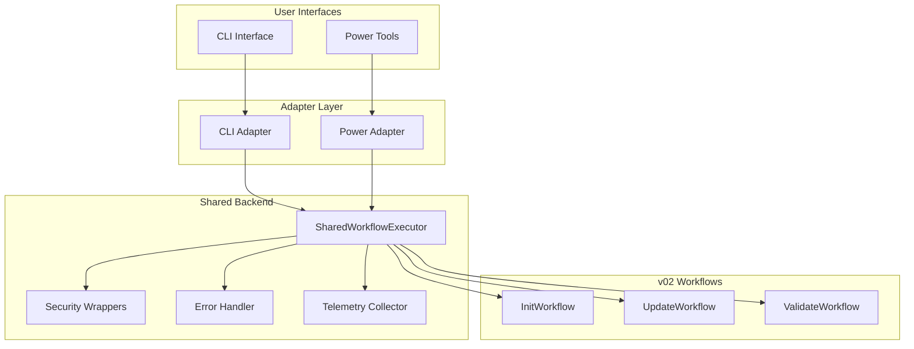

# Interface Specification Document

**Feature**: steering-power-conversion  
**Version**: 2.0.0  
**Document Type**: Interface Specification  
**Status**: Phase 1 - Architecture Definition

---

## 1. Executive Summary

This document provides the complete interface specification for the HiveForge Steering Assistant Power conversion. It defines how the CLI and Power interfaces interact with the shared backend, ensuring both interfaces produce identical results while maintaining their unique characteristics.

### 1.1 Purpose

Define the contracts between:
1. **CLI Interface** ↔ **Shared Backend**
2. **Power Tools** ↔ **Shared Backend**
3. **Shared Backend** ↔ **v02 Workflows**

### 1.2 Key Principles

1. **Interface Equivalence**: CLI and Power produce identical file outputs
2. **Shared Implementation**: Both interfaces use the same backend code
3. **Adapter Pattern**: Interface-specific adapters handle presentation differences
4. **Contract-Based Design**: Clear contracts validated by integration tests

---

## 2. Architecture Overview

### 2.1 Component Diagram




### 2.2 Data Flow

**CLI Path**:
```
User Command → CLI Parser → CLI Adapter → SharedWorkflowExecutor → 
v02 Workflow → Result → CLI Adapter → Terminal Output
```

**Power Path**:
```
Agent Request → MCP Tool → Power Adapter → SharedWorkflowExecutor → 
v02 Workflow → Result → Power Adapter → JSON Response
```

**Key Insight**: Both paths converge at SharedWorkflowExecutor, ensuring identical behavior.

---

## 3. Shared Backend Interface

### 3.1 SharedWorkflowExecutor API

The core interface used by both CLI and Power adapters.

```python
class SharedWorkflowExecutor:
    """
    Orchestrates workflow execution with security, error handling, and telemetry.
    
    This is the single source of truth for both CLI and Power interfaces.
    """
    
    def __init__(
        self,
        project_root: Path = Path("."),
        interface_type: InterfaceType = InterfaceType.CLI,
        enable_telemetry: bool = True,
        enable_security: bool = True
    ):
        """
        Initialize the executor.
        
        Args:
            project_root: Root directory of the project
            interface_type: CLI or POWER (for telemetry tracking)
            enable_telemetry: Whether to collect telemetry
            enable_security: Whether to apply security checks
        """
        pass
    
    def execute_workflow(
        self,
        workflow_type: WorkflowType,
        parameters: dict,
        user_id: Optional[str] = None
    ) -> ExecutionResult:
        """
        Execute a workflow with full error handling and telemetry.
        
        Args:
            workflow_type: Type of workflow (INIT, UPDATE, VALIDATE, etc.)
            parameters: Workflow-specific parameters
            user_id: Optional user identifier for telemetry
        
        Returns:
            ExecutionResult with status, data, and metadata
        
        Raises:
            SecurityError: If security validation fails
            WorkflowError: If workflow execution fails
        """
        pass
```


### 3.2 WorkflowType Enum

```python
from enum import Enum

class WorkflowType(Enum):
    """Supported workflow types."""
    INIT = "init"
    UPDATE = "update"
    VALIDATE = "validate"
    RESET = "reset"
    DISCOVER = "discover"
```

### 3.3 InterfaceType Enum

```python
class InterfaceType(Enum):
    """Interface types for telemetry tracking."""
    CLI = "cli"
    POWER = "power"
```

### 3.4 ExecutionResult Class

```python
@dataclass
class ExecutionResult:
    """
    Result of workflow execution.
    
    This is the common result format used by both CLI and Power.
    Adapters transform this into interface-specific formats.
    """
    
    # Status
    status: str  # "success", "failed", "partial"
    message: str  # Human-readable message
    
    # Data
    data: Dict[str, Any] = field(default_factory=dict)
    errors: list[Dict[str, Any]] = field(default_factory=list)
    
    # Metadata
    telemetry_id: Optional[str] = None
    execution_time_seconds: float = 0.0
    files_created: list[str] = field(default_factory=list)
    files_updated: list[str] = field(default_factory=list)
    files_validated: list[str] = field(default_factory=list)
    
    # Confidence scores (for autonomous generation)
    confidence_scores: Dict[str, float] = field(default_factory=dict)
    
    def to_dict(self) -> dict:
        """Convert to dictionary for serialization."""
        return asdict(self)
    
    def format_for_cli(self) -> str:
        """Format result for CLI output."""
        # Implemented by CLI adapter
        pass
    
    def format_for_power(self) -> dict:
        """Format result for Power JSON response."""
        # Implemented by Power adapter
        pass
```


---

## 4. CLI Interface Specification

### 4.1 CLI Commands

All CLI commands map to SharedWorkflowExecutor calls.

#### 4.1.1 init Command

```bash
hiveforge steering init [OPTIONS]
```

**Options**:
- `--auto-discover / --no-auto-discover`: Enable automatic discovery (default: True)
- `--autonomous / --interactive`: Use autonomous generation (default: True)
- `--confidence-threshold FLOAT`: Confidence threshold (default: 0.7)
- `--no-telemetry`: Disable telemetry collection
- `--project-root PATH`: Project root directory (default: current directory)

**Implementation**:
```python
@app.command("init")
def steering_init(
    auto_discover: bool = True,
    autonomous: bool = True,
    confidence_threshold: float = 0.7,
    no_telemetry: bool = False,
    project_root: Path = Path(".")
):
    """Initialize steering files with autonomous generation."""
    
    # Create executor
    executor = SharedWorkflowExecutor(
        project_root=project_root,
        interface_type=InterfaceType.CLI,
        enable_telemetry=not no_telemetry
    )
    
    # Execute workflow
    result = executor.execute_workflow(
        WorkflowType.INIT,
        {
            "auto_discover": auto_discover,
            "autonomous": autonomous,
            "confidence_threshold": confidence_threshold
        }
    )
    
    # Format and display result
    adapter = CLIAdapter()
    output = adapter.format_result(result)
    print(output)
    
    # Exit with appropriate code
    sys.exit(0 if result.status == "success" else 1)
```

**Output Format**:
```
✓ Initialized steering files successfully

Generated 4 files:
  • tech-stack.md (confidence: 0.92)
  • architecture.md (confidence: 0.85)
  • conventions.md (confidence: 0.88)
  • project-vision.md (confidence: 0.79)

Completed in 45.2 seconds
```


#### 4.1.2 update Command

```bash
hiveforge steering update [OPTIONS]
```

**Options**:
- `--files TEXT`: Specific files to update (comma-separated)
- `--preserve-customizations / --no-preserve`: Preserve user customizations (default: True)
- `--incremental / --full`: Incremental or full update (default: True)
- `--no-telemetry`: Disable telemetry collection
- `--project-root PATH`: Project root directory

**Implementation**:
```python
@app.command("update")
def steering_update(
    files: Optional[str] = None,
    preserve_customizations: bool = True,
    incremental: bool = True,
    no_telemetry: bool = False,
    project_root: Path = Path(".")
):
    """Update existing steering files."""
    
    executor = SharedWorkflowExecutor(
        project_root=project_root,
        interface_type=InterfaceType.CLI,
        enable_telemetry=not no_telemetry
    )
    
    result = executor.execute_workflow(
        WorkflowType.UPDATE,
        {
            "files": files.split(",") if files else None,
            "preserve_customizations": preserve_customizations,
            "incremental": incremental
        }
    )
    
    adapter = CLIAdapter()
    print(adapter.format_result(result))
    sys.exit(0 if result.status == "success" else 1)
```

#### 4.1.3 validate Command

```bash
hiveforge steering validate [OPTIONS]
```

**Options**:
- `--strict`: Treat warnings as errors
- `--use-llm / --no-llm`: Enable semantic validation (default: True)
- `--project-root PATH`: Project root directory

**Implementation**:
```python
@app.command("validate")
def steering_validate(
    strict: bool = False,
    use_llm: bool = True,
    project_root: Path = Path(".")
):
    """Validate steering files."""
    
    executor = SharedWorkflowExecutor(
        project_root=project_root,
        interface_type=InterfaceType.CLI
    )
    
    result = executor.execute_workflow(
        WorkflowType.VALIDATE,
        {
            "strict": strict,
            "use_llm": use_llm
        }
    )
    
    adapter = CLIAdapter()
    print(adapter.format_result(result))
    sys.exit(0 if result.status == "success" else 1)
```


### 4.2 CLI Adapter Implementation

```python
class CLIAdapter:
    """
    Adapter for CLI interface.
    
    Transforms ExecutionResult into CLI-friendly output.
    """
    
    def format_result(self, result: ExecutionResult) -> str:
        """
        Format execution result for CLI output.
        
        Args:
            result: Execution result from shared backend
        
        Returns:
            Formatted string for terminal display
        """
        output = []
        
        # Status line with color
        if result.status == "success":
            output.append(f"✓ {result.message}")
        elif result.status == "failed":
            output.append(f"✗ {result.message}")
        else:
            output.append(f"⚠ {result.message}")
        
        # Files created/updated
        if result.files_created:
            output.append(f"\nGenerated {len(result.files_created)} files:")
            for file in result.files_created:
                confidence = result.confidence_scores.get(file, 0.0)
                output.append(f"  • {file} (confidence: {confidence:.2f})")
        
        if result.files_updated:
            output.append(f"\nUpdated {len(result.files_updated)} files:")
            for file in result.files_updated:
                output.append(f"  • {file}")
        
        # Errors
        if result.errors:
            output.append(f"\nErrors ({len(result.errors)}):")
            for error in result.errors:
                output.append(f"  • {error['message']}")
        
        # Timing
        output.append(f"\nCompleted in {result.execution_time_seconds:.1f} seconds")
        
        return "\n".join(output)
    
    def format_error(self, error: Exception) -> str:
        """Format error for CLI display."""
        return f"✗ Error: {str(error)}"
```

---

## 5. Power Interface Specification

### 5.1 MCP Tools

All MCP tools map to SharedWorkflowExecutor calls.

#### 5.1.1 init_steering Tool

```python
@mcp.tool()
async def init_steering(
    auto_discover: bool = True,
    autonomous: bool = True,
    confidence_threshold: float = 0.7,
    project_root: str = "."
) -> dict:
    """
    Initialize steering files with autonomous generation.
    
    Args:
        auto_discover: Enable automatic discovery of existing docs
        autonomous: Use autonomous generation (no Q&A)
        confidence_threshold: Minimum confidence for generation (0.0-1.0)
        project_root: Path to project root directory
    
    Returns:
        {
            "status": "success" | "failed" | "partial",
            "message": "Human-readable message",
            "files_created": ["tech-stack.md", "architecture.md", ...],
            "confidence_scores": {"tech-stack.md": 0.92, ...},
            "execution_time_seconds": 45.2,
            "telemetry_id": "uuid"
        }
    """
    executor = SharedWorkflowExecutor(
        project_root=Path(project_root),
        interface_type=InterfaceType.POWER,
        enable_telemetry=True
    )
    
    result = executor.execute_workflow(
        WorkflowType.INIT,
        {
            "auto_discover": auto_discover,
            "autonomous": autonomous,
            "confidence_threshold": confidence_threshold
        }
    )
    
    adapter = PowerAdapter()
    return adapter.format_result(result)
```


#### 5.1.2 update_steering Tool

```python
@mcp.tool()
async def update_steering(
    files: Optional[list[str]] = None,
    preserve_customizations: bool = True,
    incremental: bool = True,
    project_root: str = "."
) -> dict:
    """
    Update existing steering files with new information.
    
    Args:
        files: Specific files to update (None = all files)
        preserve_customizations: Preserve user customizations
        incremental: Incremental update (True) or full regeneration (False)
        project_root: Path to project root directory
    
    Returns:
        {
            "status": "success" | "failed" | "partial",
            "message": "Human-readable message",
            "files_updated": ["tech-stack.md", ...],
            "conflicts_detected": 2,
            "conflicts": [
                {
                    "file": "tech-stack.md",
                    "section": "Backend",
                    "resolution": "preserved_user_content"
                }
            ],
            "execution_time_seconds": 12.5
        }
    """
    executor = SharedWorkflowExecutor(
        project_root=Path(project_root),
        interface_type=InterfaceType.POWER,
        enable_telemetry=True
    )
    
    result = executor.execute_workflow(
        WorkflowType.UPDATE,
        {
            "files": files,
            "preserve_customizations": preserve_customizations,
            "incremental": incremental
        }
    )
    
    adapter = PowerAdapter()
    return adapter.format_result(result)
```

#### 5.1.3 validate_steering Tool

```python
@mcp.tool()
async def validate_steering(
    strict: bool = False,
    use_llm: bool = True,
    project_root: str = "."
) -> dict:
    """
    Validate steering files for completeness and consistency.
    
    Args:
        strict: Treat warnings as errors
        use_llm: Enable semantic validation
        project_root: Path to project root directory
    
    Returns:
        {
            "status": "passed" | "failed",
            "message": "Validation summary",
            "issues": [
                {
                    "file": "tech-stack.md",
                    "severity": "error" | "warning",
                    "message": "Missing backend framework",
                    "line": 10
                }
            ],
            "files_validated": 4,
            "error_count": 0,
            "warning_count": 2
        }
    """
    executor = SharedWorkflowExecutor(
        project_root=Path(project_root),
        interface_type=InterfaceType.POWER,
        enable_telemetry=True
    )
    
    result = executor.execute_workflow(
        WorkflowType.VALIDATE,
        {
            "strict": strict,
            "use_llm": use_llm
        }
    )
    
    adapter = PowerAdapter()
    return adapter.format_result(result)
```


### 5.2 Power Adapter Implementation

```python
class PowerAdapter:
    """
    Adapter for Power interface.
    
    Transforms ExecutionResult into JSON responses for MCP protocol.
    """
    
    def format_result(self, result: ExecutionResult) -> dict:
        """
        Format execution result for Power JSON response.
        
        Args:
            result: Execution result from shared backend
        
        Returns:
            Dictionary suitable for JSON serialization
        """
        response = {
            "status": result.status,
            "message": result.message,
            "execution_time_seconds": result.execution_time_seconds
        }
        
        # Add files created/updated
        if result.files_created:
            response["files_created"] = result.files_created
            response["confidence_scores"] = result.confidence_scores
        
        if result.files_updated:
            response["files_updated"] = result.files_updated
        
        if result.files_validated:
            response["files_validated"] = result.files_validated
        
        # Add errors if any
        if result.errors:
            response["errors"] = result.errors
            response["error_count"] = len(result.errors)
        
        # Add telemetry ID
        if result.telemetry_id:
            response["telemetry_id"] = result.telemetry_id
        
        # Add any additional data
        response.update(result.data)
        
        return response
```


---

## 6. Parameter Mapping

### 6.1 CLI to Shared Backend Mapping

| CLI Parameter | Backend Parameter | Type | Default |
|---------------|-------------------|------|---------|
| `--auto-discover` | `auto_discover` | bool | True |
| `--autonomous` | `autonomous` | bool | True |
| `--confidence-threshold` | `confidence_threshold` | float | 0.7 |
| `--files` | `files` | list[str] | None |
| `--preserve-customizations` | `preserve_customizations` | bool | True |
| `--incremental` | `incremental` | bool | True |
| `--strict` | `strict` | bool | False |
| `--use-llm` | `use_llm` | bool | True |
| `--project-root` | `project_root` | Path | "." |

### 6.2 Power to Shared Backend Mapping

| Power Parameter | Backend Parameter | Type | Default |
|-----------------|-------------------|------|---------|
| `auto_discover` | `auto_discover` | bool | True |
| `autonomous` | `autonomous` | bool | True |
| `confidence_threshold` | `confidence_threshold` | float | 0.7 |
| `files` | `files` | list[str] | None |
| `preserve_customizations` | `preserve_customizations` | bool | True |
| `incremental` | `incremental` | bool | True |
| `strict` | `strict` | bool | False |
| `use_llm` | `use_llm` | bool | True |
| `project_root` | `project_root` | Path | "." |

**Key Insight**: Parameters are identical between CLI and Power, ensuring equivalent behavior.

---

## 7. Response Format Comparison

### 7.1 Init Workflow Response

**Shared Backend Result**:
```python
ExecutionResult(
    status="success",
    message="Generated 4 steering files",
    files_created=["tech-stack.md", "architecture.md", "conventions.md", "project-vision.md"],
    confidence_scores={"tech-stack.md": 0.92, "architecture.md": 0.85, ...},
    execution_time_seconds=45.2,
    telemetry_id="a1b2c3d4"
)
```

**CLI Output** (via CLIAdapter):
```
✓ Generated 4 steering files

Generated 4 files:
  • tech-stack.md (confidence: 0.92)
  • architecture.md (confidence: 0.85)
  • conventions.md (confidence: 0.88)
  • project-vision.md (confidence: 0.79)

Completed in 45.2 seconds
```

**Power Response** (via PowerAdapter):
```json
{
  "status": "success",
  "message": "Generated 4 steering files",
  "files_created": [
    "tech-stack.md",
    "architecture.md",
    "conventions.md",
    "project-vision.md"
  ],
  "confidence_scores": {
    "tech-stack.md": 0.92,
    "architecture.md": 0.85,
    "conventions.md": 0.88,
    "project-vision.md": 0.79
  },
  "execution_time_seconds": 45.2,
  "telemetry_id": "a1b2c3d4"
}
```


### 7.2 Error Response

**Shared Backend Result**:
```python
ExecutionResult(
    status="failed",
    message="Failed to generate steering files",
    errors=[
        {
            "type": "llm_api_error",
            "message": "Rate limit exceeded",
            "component": "generation",
            "severity": "critical"
        }
    ],
    execution_time_seconds=5.3
)
```

**CLI Output**:
```
✗ Failed to generate steering files

Errors (1):
  • Rate limit exceeded

Completed in 5.3 seconds
```

**Power Response**:
```json
{
  "status": "failed",
  "message": "Failed to generate steering files",
  "errors": [
    {
      "type": "llm_api_error",
      "message": "Rate limit exceeded",
      "component": "generation",
      "severity": "critical"
    }
  ],
  "error_count": 1,
  "execution_time_seconds": 5.3
}
```

---

## 8. Integration Contracts

### 8.1 Contract: Output Equivalence

**Requirement**: Given identical inputs, CLI and Power MUST produce identical file outputs.

**Validation**:
```python
def test_output_equivalence():
    """Test that CLI and Power produce identical outputs."""
    
    # Setup test project
    test_project = create_test_project()
    
    # Execute via CLI
    cli_executor = SharedWorkflowExecutor(
        project_root=test_project,
        interface_type=InterfaceType.CLI
    )
    cli_result = cli_executor.execute_workflow(
        WorkflowType.INIT,
        {"auto_discover": True, "autonomous": True}
    )
    cli_files = read_generated_files(test_project)
    
    # Reset project
    reset_test_project(test_project)
    
    # Execute via Power
    power_executor = SharedWorkflowExecutor(
        project_root=test_project,
        interface_type=InterfaceType.POWER
    )
    power_result = power_executor.execute_workflow(
        WorkflowType.INIT,
        {"auto_discover": True, "autonomous": True}
    )
    power_files = read_generated_files(test_project)
    
    # Assert equivalence
    assert cli_files == power_files, "CLI and Power produced different outputs"
    assert cli_result.status == power_result.status
    assert cli_result.files_created == power_result.files_created
```


### 8.2 Contract: Shared Backend Utilization

**Requirement**: Both CLI and Power MUST use SharedWorkflowExecutor (no direct workflow calls).

**Validation**:
```python
def test_shared_backend_utilization():
    """Test that both interfaces use shared backend."""
    
    # Monitor function calls
    with patch('hiveforge.steering.shared.executor.SharedWorkflowExecutor.execute_workflow') as mock:
        # Run CLI command
        subprocess.run(["hiveforge", "steering", "init", "--auto"])
        cli_calls = mock.call_count
        
        # Run Power tool
        asyncio.run(init_steering(auto_discover=True))
        power_calls = mock.call_count - cli_calls
        
        # Assert both called shared backend
        assert cli_calls > 0, "CLI did not use shared backend"
        assert power_calls > 0, "Power did not use shared backend"
```

### 8.3 Contract: Error Handling Parity

**Requirement**: Both interfaces MUST handle errors identically (same rollback, same recovery).

**Validation**:
```python
def test_error_handling_parity():
    """Test that both interfaces handle errors identically."""
    
    # Inject error
    with patch('hiveforge.steering.workflows.init_workflow.InitWorkflow.execute') as mock:
        mock.side_effect = LLMAPIError("Rate limit exceeded")
        
        # Execute via CLI
        cli_executor = SharedWorkflowExecutor(interface_type=InterfaceType.CLI)
        cli_result = cli_executor.execute_workflow(WorkflowType.INIT, {})
        
        # Execute via Power
        power_executor = SharedWorkflowExecutor(interface_type=InterfaceType.POWER)
        power_result = power_executor.execute_workflow(WorkflowType.INIT, {})
        
        # Assert identical error handling
        assert cli_result.status == power_result.status == "failed"
        assert cli_result.errors[0]["type"] == power_result.errors[0]["type"]
```

### 8.4 Contract: Security Validation

**Requirement**: Both interfaces MUST apply identical security validation.

**Validation**:
```python
def test_security_validation_parity():
    """Test that both interfaces apply same security validation."""
    
    # Test path traversal prevention
    malicious_path = "../../etc/passwd"
    
    # Via CLI
    with pytest.raises(SecurityError):
        cli_executor = SharedWorkflowExecutor(interface_type=InterfaceType.CLI)
        cli_executor.execute_workflow(
            WorkflowType.INIT,
            {"project_root": malicious_path}
        )
    
    # Via Power
    with pytest.raises(SecurityError):
        power_executor = SharedWorkflowExecutor(interface_type=InterfaceType.POWER)
        power_executor.execute_workflow(
            WorkflowType.INIT,
            {"project_root": malicious_path}
        )
```

---

## 9. Module Structure

### 9.1 Shared Backend Modules

```
src/hiveforge/steering/shared/
├── __init__.py
├── executor.py              # SharedWorkflowExecutor
├── results.py               # ExecutionResult, WorkflowType, InterfaceType
├── security/
│   ├── __init__.py
│   ├── wrappers.py         # Security validation
│   ├── validators.py       # Input validation
│   └── sanitizers.py       # Path sanitization
├── error_handling/
│   ├── __init__.py
│   ├── handler.py          # Error handling logic
│   ├── rollback.py         # Automatic rollback
│   └── errors.py           # Error types
├── telemetry/
│   ├── __init__.py
│   ├── collector.py        # TelemetryCollector
│   ├── storage.py          # File-based storage
│   └── exporters.py        # Export formats
└── adapters/
    ├── __init__.py
    ├── base.py             # BaseAdapter protocol
    ├── cli_adapter.py      # CLIAdapter
    └── power_adapter.py    # PowerAdapter
```


### 9.2 CLI Interface Modules

```
src/hiveforge/steering/
├── cli.py                   # CLI commands (uses shared backend)
└── [existing v02 modules]
```

### 9.3 Power Interface Modules

```
mcp-server/
├── server.py               # FastMCP server
└── tools/
    ├── __init__.py
    ├── init_steering.py    # Uses shared backend
    ├── update_steering.py  # Uses shared backend
    ├── validate_steering.py # Uses shared backend
    ├── reset_steering.py   # Uses shared backend
    └── discover_docs.py    # Uses shared backend
```

---

## 10. Implementation Checklist

### Phase 1.4.6: Interface Specification (This Document)

- [x] Define SharedWorkflowExecutor API
- [x] Define ExecutionResult format
- [x] Specify CLI commands and implementation
- [x] Specify Power tools and implementation
- [x] Define adapter interfaces (CLI and Power)
- [x] Document parameter mapping
- [x] Document response format comparison
- [x] Define integration contracts
- [x] Specify module structure
- [x] Create validation test specifications

### Phase 2: Shared Backend Implementation

- [ ] Implement SharedWorkflowExecutor
- [ ] Implement ExecutionResult class
- [ ] Implement security wrappers
- [ ] Implement error handling with rollback
- [ ] Implement telemetry collector
- [ ] Implement CLI adapter
- [ ] Implement Power adapter
- [ ] Write unit tests (>80% coverage)
- [ ] Write integration tests (validate contracts)

### Phase 3: CLI Interface Update

- [ ] Update CLI commands to use SharedWorkflowExecutor
- [ ] Integrate CLIAdapter for output formatting
- [ ] Add telemetry support to CLI
- [ ] Write backward compatibility tests
- [ ] Update CLI documentation

### Phase 4: Power Implementation

- [ ] Implement FastMCP server
- [ ] Implement MCP tools using SharedWorkflowExecutor
- [ ] Integrate PowerAdapter for JSON responses
- [ ] Add security wrappers to all tools
- [ ] Write Power tool tests
- [ ] Write orchestrator integration tests

---

## 11. Success Criteria

### 11.1 Interface Equivalence

- [ ] CLI and Power produce identical file outputs (validated by tests)
- [ ] Same parameters accepted by both interfaces
- [ ] Same error handling for both interfaces
- [ ] Same security validation for both interfaces

### 11.2 Shared Backend Utilization

- [ ] Both interfaces use SharedWorkflowExecutor (no direct workflow calls)
- [ ] Code coverage shows >95% shared code between interfaces
- [ ] Integration tests validate shared backend usage

### 11.3 Contract Compliance

- [ ] All integration contracts pass
- [ ] Output equivalence contract validated
- [ ] Shared backend utilization contract validated
- [ ] Error handling parity contract validated
- [ ] Security validation contract validated

### 11.4 Documentation Completeness

- [ ] All interfaces documented with examples
- [ ] Parameter mappings clearly defined
- [ ] Response formats documented
- [ ] Integration contracts specified
- [ ] Module structure defined

---

## 12. Summary

This interface specification document defines the complete contract between CLI, Power, and the shared backend. Key achievements:

1. **Clear Contracts**: Defined integration contracts validated by tests
2. **Shared Implementation**: Both interfaces use SharedWorkflowExecutor
3. **Adapter Pattern**: Interface-specific adapters handle presentation differences
4. **Equivalence Guarantee**: Same inputs produce identical file outputs
5. **Testable Design**: All contracts validated through integration tests

The specification ensures that CLI and Power interfaces are truly equivalent while maintaining their unique characteristics (terminal output vs JSON responses).
