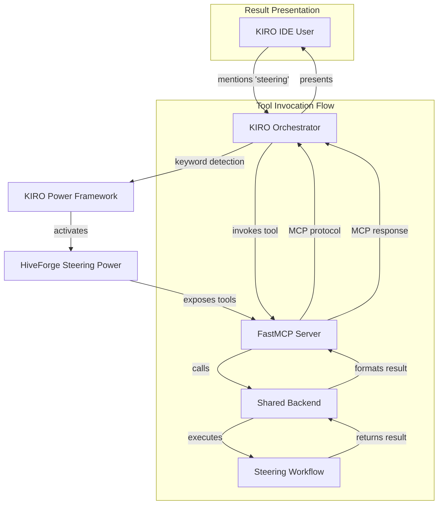
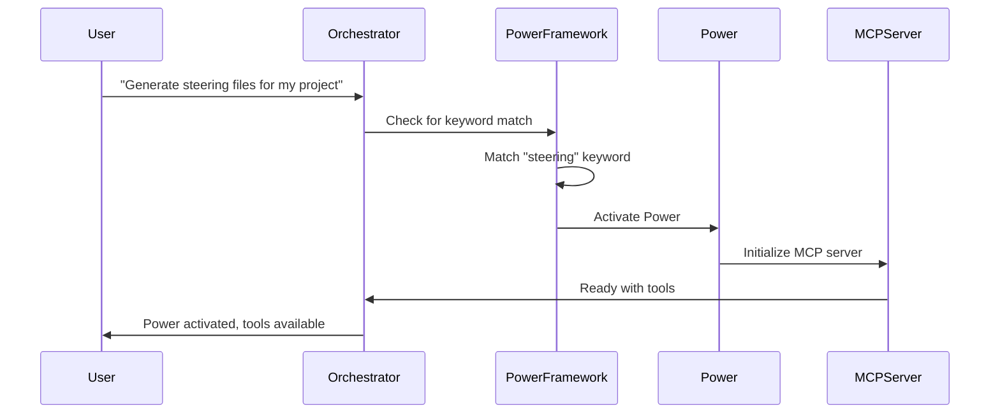
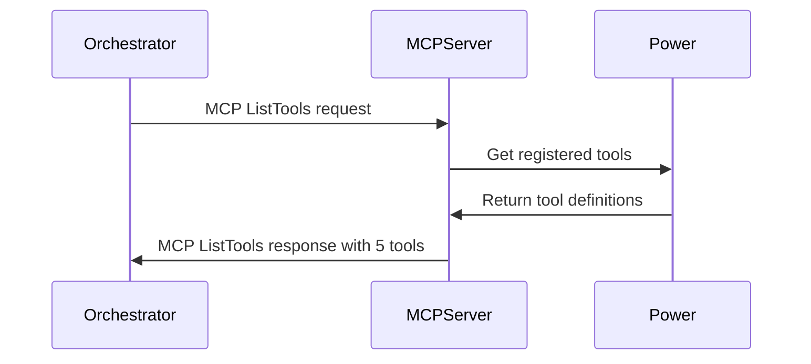
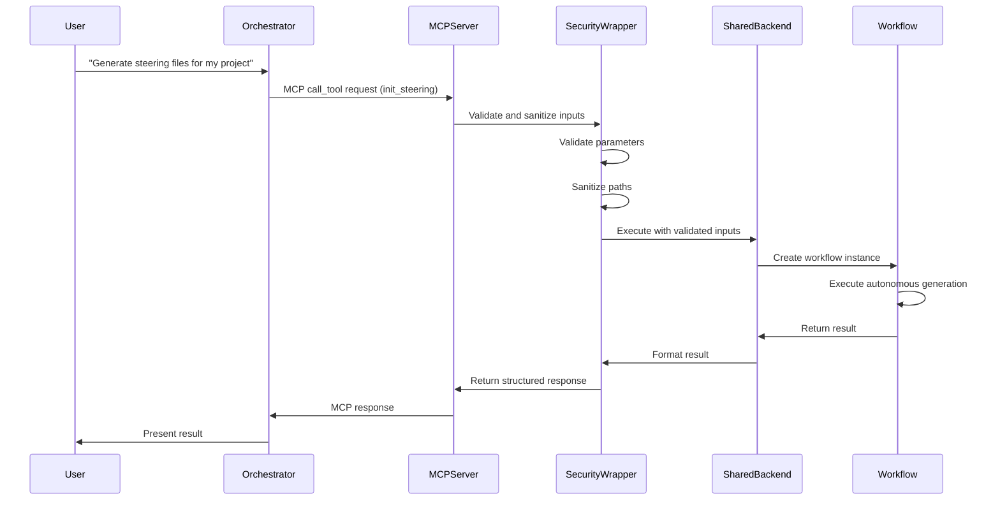
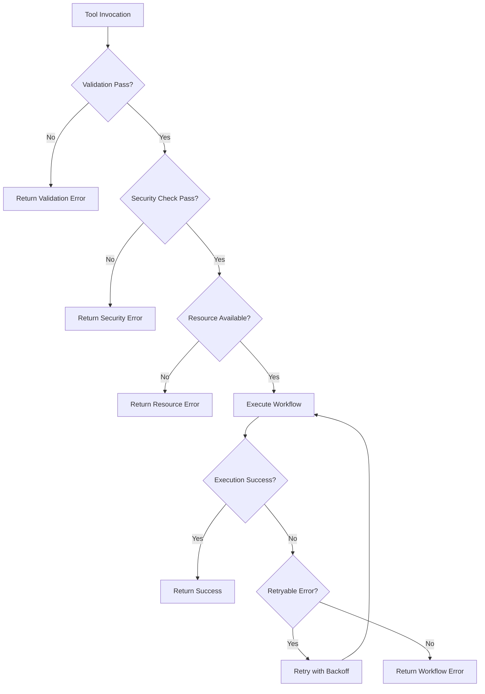

# Orchestrator Integration Specification

**Feature**: steering-power-conversion  
**Version**: 2.0.0  
**Status**: Draft  
**Related To**: Phase 1.1 Architecture Specification

---

## 1. Overview

This document specifies how the HiveForge Steering Power integrates with KIRO Orchestrator. The integration follows the standard KIRO Power framework patterns, enabling seamless activation, tool discovery, and invocation through the orchestrator's existing infrastructure.

### 1.1 Integration Goals

The Power integration with KIRO Orchestrator aims to achieve:

- **Seamless Activation**: Power activates automatically when users mention steering-related keywords
- **Transparent Tool Discovery**: Orchestrator discovers available tools via standard MCP protocol
- **Natural Language Invocation**: Users can invoke tools through natural language without knowing about MCP
- **Consistent Results**: Tool results are formatted for consistent presentation to users
- **Robust Error Handling**: Errors are propagated correctly and presented in user-friendly format

### 1.2 Integration Architecture



### 1.3 Key Components

| Component | Responsibility | Interface |
|-----------|---------------|-----------|
| KIRO Power Framework | Power lifecycle management, keyword detection | Internal API |
| FastMCP Server | Expose tools via MCP protocol | JSON-RPC 2.0 |
| Shared Backend | Core steering logic | Python module API |
| Orchestrator | Coordinate tool invocation, present results | MCP client |

---

## 2. Keyword Activation

### 2.1 Activation Mechanism

The Power activates through KIRO's keyword-based activation system. When users mention specific keywords in their conversations with KIRO IDE, the Power Framework detects these keywords and automatically activates the corresponding Power.

### 2.2 Keywords Configuration

The Power declares the following activation keywords in its `package.json`:

```json
{
  "keywords": [
    "steering",
    "steering files",
    "documentation",
    "project documentation",
    "onboarding",
    "project setup",
    "generate docs",
    "create steering"
  ]
}
```

### 2.3 Keyword Matching Rules

**Primary Keywords** (exact match triggers immediate activation):
- `steering`
- `steering files`
- `documentation`
- `project documentation`

**Secondary Keywords** (context-dependent activation):
- `onboarding` - activates when context suggests project onboarding
- `project setup` - activates when discussing project initialization
- `generate docs` - activates when discussing documentation generation
- `create steering` - activates when discussing steering file creation

### 2.4 Activation Behavior



### 2.5 Activation Conditions

The Power activates when **any** of the following conditions are met:

1. **Exact Keyword Match**: User message contains any primary keyword
2. **Secondary Keyword with Context**: User message contains secondary keyword AND context suggests steering-related task
3. **Explicit Invocation**: User explicitly names the Power (e.g., "Use HiveForge Steering")

### 2.6 Deactivation Behavior

The Power deactivates automatically when:

1. **Task Completion**: All requested operations have completed successfully
2. **Explicit Deactivation**: User explicitly requests Power deactivation
3. **Timeout**: No tool invocations for 5 minutes of inactivity
4. **Error**: Critical error that prevents further operation

### 2.7 Configuration Options

Power activation can be configured through `package.json`:

```json
{
  "power": {
    "activation": {
      "keywords": ["steering", "documentation"],
      "timeoutMinutes": 5,
      "requireContext": false
    }
  }
}
```

| Option | Type | Default | Description |
|--------|------|---------|-------------|
| `keywords` | string[] | See above | Keywords that trigger activation |
| `timeoutMinutes` | number | 5 | Inactivity timeout before deactivation |
| `requireContext` | boolean | false | Require context match for secondary keywords |

---

## 3. Tool Discovery via MCP Protocol

### 3.1 MCP Protocol Overview

The Power exposes its tools through the Model Context Protocol (MCP), a standardized protocol for LLM-tool interaction. The orchestrator discovers available tools by querying the MCP server.

### 3.2 Tool Definitions

The Power exposes 5 core tools via MCP:

```json
{
  "tools": [
    {
      "name": "init_steering",
      "description": "Initialize steering files with autonomous generation",
      "parameters": {
        "type": "object",
        "properties": {
          "auto_discover": {
            "type": "boolean",
            "description": "Automatically discover project context"
          },
          "autonomous": {
            "type": "boolean",
            "description": "Use autonomous generation without user interaction"
          },
          "project_root": {
            "type": "string",
            "description": "Path to project root directory"
          },
          "confidence_threshold": {
            "type": "number",
            "description": "Minimum confidence threshold for autonomous decisions"
          }
        },
        "required": ["project_root"]
      }
    },
    {
      "name": "update_steering",
      "description": "Update existing steering files with new information",
      "parameters": {
        "type": "object",
        "properties": {
          "files": {
            "type": "array",
            "description": "Specific files to update (null for all)"
          },
          "preserve_customizations": {
            "type": "boolean",
            "description": "Preserve user customizations during update"
          },
          "incremental": {
            "type": "boolean",
            "description": "Use incremental update mode"
          },
          "project_root": {
            "type": "string",
            "description": "Path to project root directory"
          }
        },
        "required": ["project_root"]
      }
    },
    {
      "name": "validate_steering",
      "description": "Validate steering files for completeness and consistency",
      "parameters": {
        "type": "object",
        "properties": {
          "strict": {
            "type": "boolean",
            "description": "Treat warnings as errors"
          },
          "use_llm": {
            "type": "boolean",
            "description": "Enable semantic validation with LLM"
          },
          "project_root": {
            "type": "string",
            "description": "Path to project root directory"
          }
        },
        "required": ["project_root"]
      }
    },
    {
      "name": "reset_steering",
      "description": "Reset steering files to default templates",
      "parameters": {
        "type": "object",
        "properties": {
          "file": {
            "type": "string",
            "description": "Specific file to reset (null for all files)"
          },
          "confirm": {
            "type": "boolean",
            "description": "Skip confirmation prompt"
          },
          "project_root": {
            "type": "string",
            "description": "Path to project root directory"
          }
        },
        "required": ["project_root"]
      }
    },
    {
      "name": "discover_project_docs",
      "description": "Discover existing project documentation",
      "parameters": {
        "type": "object",
        "properties": {
          "project_root": {
            "type": "string",
            "description": "Path to project root directory"
          },
          "include_git_history": {
            "type": "boolean",
            "description": "Analyze git commits and PRs"
          }
        },
        "required": ["project_root"]
      }
    }
  ]
}
```

### 3.3 Tool Discovery Flow



### 3.4 MCP Protocol Compliance

The MCP server complies with MCP specification version 2024-11-05:

| Protocol Element | Implementation |
|-----------------|----------------|
| Transport | stdio (for local execution) |
| Message Format | JSON-RPC 2.0 |
| Request Types | initialize, list_tools, call_tool |
| Response Types | result, error |
| Error Codes | -32600 (Invalid Request), -32601 (Method Not Found), -32603 (Internal Error) |

### 3.5 Tool Registration

Tools are registered with the FastMCP server using decorators:

```python
from fastmcp import FastMCP

mcp = FastMCP("hiveforge-steering")

@mcp.tool()
async def init_steering(
    auto_discover: bool = True,
    autonomous: bool = True,
    project_root: str = ".",
    confidence_threshold: float = 0.7
) -> dict:
    """Initialize steering files with autonomous generation."""
    # Implementation
    pass
```

---

## 4. Tool Invocation Flow

### 4.1 Invocation Sequence



### 4.2 Request Processing

#### 4.2.1 Input Validation

All tool parameters are validated before processing:

```python
def validate_parameters(kwargs: dict) -> dict:
    """Validate all tool parameters."""
    validated = {}
    
    for key, value in kwargs.items():
        if key == 'project_root':
            validated[key] = validate_path(value)
        elif key == 'files':
            validated[key] = validate_file_list(value)
        elif key == 'confidence_threshold':
            validated[key] = validate_confidence(value)
        elif key == 'strict':
            validated[key] = validate_boolean(value)
        elif key == 'autonomous':
            validated[key] = validate_boolean(value)
        elif key == 'auto_discover':
            validated[key] = validate_boolean(value)
        elif key == 'preserve_customizations':
            validated[key] = validate_boolean(value)
        elif key == 'incremental':
            validated[key] = validate_boolean(value)
        elif key == 'confirm':
            validated[key] = validate_boolean(value)
        elif key == 'include_git_history':
            validated[key] = validate_boolean(value)
        else:
            raise ValidationError(f"Unknown parameter: {key}")
    
    return validated
```

#### 4.2.2 Path Sanitization

Project root and file paths are sanitized to prevent directory traversal:

```python
def sanitize_path(path: str) -> str:
    """Sanitize path to prevent directory traversal."""
    # Resolve to absolute path
    abs_path = Path(path).resolve()
    
    # Check for path traversal attempts
    if ".." in str(abs_path):
        raise SecurityError("Path traversal attempt detected")
    
    # Ensure path is within allowed directories
    if not is_path_allowed(abs_path):
        raise SecurityError("Path not in allowed directories")
    
    return str(abs_path)
```

### 4.3 Resource Limits

Tool execution enforces resource limits:

| Resource | Limit | Action |
|----------|-------|--------|
| Memory | 512 MB | Terminate execution |
| CPU Time | 300 seconds | Terminate execution |
| File Size | 10 MB per file | Reject operation |
| Concurrent Operations | 1 | Queue additional requests |

### 4.4 Execution Flow

#### 4.4.1 init_steering Execution

```python
@mcp.tool()
async def init_steering(
    auto_discover: bool = True,
    autonomous: bool = True,
    project_root: str = ".",
    confidence_threshold: float = 0.7
) -> dict:
    """Initialize steering files with autonomous generation."""
    try:
        # Create config
        config = SteeringConfig(
            interactive=not autonomous,
            analyze_code=True,
            feature_flags=FeatureFlagConfig(
                use_autonomous_generation=autonomous,
                confidence_threshold=confidence_threshold
            )
        )
        
        # Run workflow
        workflow = InitWorkflow(
            config=config,
            project_root=Path(project_root)
        )
        success = workflow.execute()
        
        # Return structured response
        return {
            "status": "success" if success else "failed",
            "files_created": len(workflow.state.generated_files),
            "validation": workflow.state.validation_status,
            "confidence_scores": workflow.state.confidence_scores,
            "message": f"Generated {len(workflow.state.generated_files)} files"
        }
    except Exception as e:
        return {
            "status": "failed",
            "error": str(e),
            "message": f"Failed to initialize steering files: {e}"
        }
```

#### 4.4.2 update_steering Execution

```python
@mcp.tool()
async def update_steering(
    files: list[str] = None,
    preserve_customizations: bool = True,
    incremental: bool = True,
    project_root: str = "."
) -> dict:
    """Update existing steering files with new information."""
    try:
        workflow = UpdateWorkflow(
            project_root=Path(project_root),
            files_to_update=files,
            preserve_customizations=preserve_customizations,
            incremental=incremental
        )
        success = workflow.execute()
        
        return {
            "status": "success" if success else "failed",
            "files_updated": len(workflow.state.updated_files),
            "conflicts": workflow.state.conflicts,
            "message": f"Updated {len(workflow.state.updated_files)} files"
        }
    except Exception as e:
        return {
            "status": "failed",
            "error": str(e),
            "message": f"Failed to update steering files: {e}"
        }
```

#### 4.4.3 validate_steering Execution

```python
@mcp.tool()
async def validate_steering(
    strict: bool = False,
    use_llm: bool = True,
    project_root: str = "."
) -> dict:
    """Validate steering files for completeness and consistency."""
    try:
        workflow = ValidateWorkflow(
            project_root=Path(project_root),
            strict=strict,
            use_llm=use_llm
        )
        result = workflow.execute()
        
        return {
            "status": "passed" if result.passed else "failed",
            "issues": result.issues,
            "summary": result.summary,
            "message": result.summary
        }
    except Exception as e:
        return {
            "status": "failed",
            "error": str(e),
            "message": f"Failed to validate steering files: {e}"
        }
```

#### 4.4.4 reset_steering Execution

```python
@mcp.tool()
async def reset_steering(
    file: str = None,
    confirm: bool = False,
    project_root: str = "."
) -> dict:
    """Reset steering files to default templates."""
    try:
        project_path = Path(project_root)
        steering_dir = project_path / ".kiro" / "steering"
        
        # Create backup first
        backup_mgr = BackupManager(backup_dir=project_path / ".kiro" / "backups")
        backup_path = backup_mgr.create_backup(steering_dir)
        
        # Reset files
        reset_mgr = ResetManager(
            steering_dir=steering_dir,
            template_dir=Path(__file__).parent.parent / "templates" / "steering"
        )
        
        if file:
            reset_files = reset_mgr.reset_file(file)
        else:
            if not confirm:
                return {
                    "status": "cancelled",
                    "message": "Reset requires confirmation. Use confirm=true"
                }
            reset_files = reset_mgr.reset_all()
        
        return {
            "status": "success",
            "files_reset": len(reset_files),
            "backup_created": str(backup_path),
            "message": f"Reset {len(reset_files)} file(s) to default templates"
        }
    except Exception as e:
        return {
            "status": "failed",
            "error": str(e),
            "message": f"Failed to reset steering files: {e}"
        }
```

#### 4.4.5 discover_project_docs Execution

```python
@mcp.tool()
async def discover_project_docs(
    project_root: str = ".",
    include_git_history: bool = False
) -> dict:
    """Discover existing project documentation."""
    try:
        discovery = DocumentationDiscovery(
            project_root=Path(project_root),
            include_git_history=include_git_history
        )
        result = discovery.execute()
        
        return {
            "status": "success",
            "found": result.documents,
            "suggested_import": result.suggested_import,
            "message": f"Found {len(result.documents)} documents"
        }
    except Exception as e:
        return {
            "status": "failed",
            "error": str(e),
            "message": f"Failed to discover documentation: {e}"
        }
```

---

## 5. Result Presentation Format

### 5.1 Success Response Format

All tools return structured JSON responses:

```json
{
  "status": "success",
  "data": {
    "files_created": 8,
    "files": [
      "project-vision.md",
      "tech-stack.md",
      "architecture.md",
      "conventions.md",
      "onboarding.md",
      "workflow.md",
      "glossary.md",
      "troubleshooting.md"
    ]
  },
  "message": "Generated 8 steering files",
  "metadata": {
    "confidence_scores": {
      "project-vision.md": 0.95,
      "tech-stack.md": 0.92
    },
    "execution_time_ms": 45230,
    "project_root": "/path/to/project"
  }
}
```

### 5.2 Error Response Format

```json
{
  "status": "failed",
  "error": {
    "type": "validation_error",
    "code": "INVALID_CONFIDENCE_THRESHOLD",
    "message": "Confidence threshold must be between 0.0 and 1.0"
  },
  "recovery_options": [
    {
      "action": "retry_with_valid_threshold",
      "description": "Retry with confidence_threshold between 0.0 and 1.0"
    }
  ],
  "message": "Failed to initialize steering files: Invalid confidence threshold"
}
```

### 5.3 Result Fields

| Field | Type | Description |
|-------|------|-------------|
| `status` | string | "success", "failed", or "cancelled" |
| `data` | object | Tool-specific result data (success only) |
| `error` | object | Error details (failed only) |
| `message` | string | Human-readable summary |
| `metadata` | object | Execution metadata (optional) |

### 5.4 Tool-Specific Result Formats

#### init_steering

```json
{
  "status": "success",
  "data": {
    "files_created": 8,
    "files": ["project-vision.md", "tech-stack.md", ...],
    "validation_status": "passed",
    "confidence_scores": {
      "project-vision.md": 0.95,
      "tech-stack.md": 0.92
    }
  },
  "message": "Generated 8 steering files"
}
```

#### update_steering

```json
{
  "status": "success",
  "data": {
    "files_updated": 3,
    "files": ["tech-stack.md", "architecture.md"],
    "conflicts_resolved": 1,
    "customizations_preserved": 5
  },
  "message": "Updated 3 files"
}
```

#### validate_steering

```json
{
  "status": "passed",
  "data": {
    "files_validated": 8,
    "issues": [],
    "summary": "8 files validated, 0 errors, 0 warnings"
  },
  "message": "Validation passed"
}
```

#### reset_steering

```json
{
  "status": "success",
  "data": {
    "files_reset": 2,
    "backup_created": "/path/to/project/.kiro/backups/backup-20240215.tar.gz",
    "files": ["tech-stack.md", "conventions.md"]
  },
  "message": "Reset 2 files to default templates"
}
```

#### discover_project_docs

```json
{
  "status": "success",
  "data": {
    "found": [
      {
        "path": "README.md",
        "type": "readme",
        "relevance": 0.95
      },
      {
        "path": "docs/api.md",
        "type": "documentation",
        "relevance": 0.80
      }
    ],
    "suggested_import": true
  },
  "message": "Found 5 documents"
}
```

### 5.5 Orchestrator Presentation

The orchestrator presents results to users in a user-friendly format:

**Success Presentation**:
```
✓ Steering files generated successfully

Generated 8 files:
  - project-vision.md
  - tech-stack.md
  - architecture.md
  - conventions.md
  - onboarding.md
  - workflow.md
  - glossary.md
  - troubleshooting.md

Files are located in: .kiro/steering/
```

**Error Presentation**:
```
✗ Failed to initialize steering files

Error: Invalid confidence threshold

The confidence threshold must be between 0.0 and 1.0.
Please try again with a valid value.
```

---

## 6. Error Handling with Orchestrator

### 6.1 Error Categories

| Category | Description | Handling |
|----------|-------------|----------|
| User Errors | Invalid inputs, missing permissions | Return user-friendly error |
| System Errors | LLM API failures, network issues | Retry with backoff |
| Validation Errors | Generated content fails validation | Trigger regeneration |
| Security Errors | Path traversal, invalid parameters | Immediate failure |
| Resource Errors | Memory/CPU limits exceeded | Terminate with explanation |

### 6.2 Error Response Structure

```python
class ToolError:
    def __init__(
        self,
        error_type: str,
        message: str,
        recovery_options: list[RecoveryOption] = None,
        details: dict = None
    ):
        self.error_type = error_type
        self.message = message
        self.recovery_options = recovery_options or []
        self.details = details or {}
```

### 6.3 Error Types and Codes

| Error Type | Code | Description |
|------------|------|-------------|
| `validation_error` | VE-001 | Invalid input parameter |
| `path_error` | PE-001 | Invalid project root path |
| `path_error` | PE-002 | Path traversal attempt |
| `security_error` | SE-001 | Security violation detected |
| `resource_error` | RE-001 | Memory limit exceeded |
| `resource_error` | RE-002 | CPU time limit exceeded |
| `llm_error` | LE-001 | LLM API rate limit |
| `llm_error` | LE-002 | LLM API timeout |
| `file_error` | FE-001 | File not found |
| `file_error` | FE-002 | Permission denied |
| `workflow_error` | WE-001 | Workflow execution failed |

### 6.4 Error Handling Flow



### 6.5 Retry Logic

For retryable errors (LLM API failures, network issues):

```python
async def execute_with_retry(func, max_retries=3):
    """Execute function with exponential backoff retry."""
    for attempt in range(max_retries):
        try:
            return await func()
        except RetryableError as e:
            if attempt == max_retries - 1:
                raise e
            delay = 2 ** attempt  # Exponential backoff
            await asyncio.sleep(delay)
```

### 6.6 Error Recovery Options

Each error includes recovery options for the orchestrator:

```json
{
  "error": {
    "type": "llm_error",
    "code": "LE-001",
    "message": "LLM API rate limit exceeded"
  },
  "recovery_options": [
    {
      "action": "retry_after_delay",
      "description": "Retry after 60 seconds",
      "delay_seconds": 60
    },
    {
      "action": "use_fallback_workflow",
      "description": "Use simplified workflow without LLM"
    },
    {
      "action": "abort",
      "description": "Abort operation and inform user"
    }
  ]
}
```

### 6.7 Error Obfuscation

Detailed error information is logged internally but obfuscated for users:

```python
def obfuscate_errors(result: dict) -> dict:
    """Obfuscate detailed errors for users."""
    if result.get('status') == 'failed':
        # Log detailed error internally
        logger.error(f"Tool failed: {result.get('error')}")
        
        # Return user-friendly error
        return {
            'status': 'failed',
            'message': 'Operation failed. Please check permissions and try again.',
            'can_retry': True
        }
    
    return result
```

### 6.8 Error Logging

All errors are logged for debugging:

```python
logger.error(
    f"Tool {tool_name} failed",
    extra={
        "error_type": error.error_type,
        "error_code": error.code,
        "project_root": project_root,
        "user_id": user_id,
        "timestamp": datetime.utcnow().isoformat()
    }
)
```

### 6.9 Orchestrator Error Handling

The orchestrator handles Power errors as follows:

1. **Parse Error Response**: Extract status, error type, and recovery options
2. **Check Recovery Options**: Determine available recovery actions
3. **Present to User**: Show user-friendly error message
4. **Suggest Recovery**: Offer recovery options based on error type
5. **Log Error**: Record error for monitoring and debugging

---

## 7. Security Integration

### 7.1 Security Wrapper

All tools are wrapped with security validation:

```python
def secure_tool_execution(tool_func):
    """Security wrapper for all MCP tools."""
    async def wrapper(**kwargs):
        # 1. Validate inputs
        validated_kwargs = validate_parameters(kwargs)
        
        # 2. Sanitize paths
        if 'project_root' in validated_kwargs:
            validated_kwargs['project_root'] = sanitize_path(
                validated_kwargs['project_root']
            )
        
        # 3. Enforce resource limits
        with ResourceLimiter(
            max_memory_mb=512,
            max_cpu_time_sec=300,
            max_file_size_mb=10
        ):
            result = await tool_func(**validated_kwargs)
        
        # 4. Obfuscate errors for users
        return obfuscate_errors(result)
    
    return wrapper
```

### 7.2 Security Validation Points

| Point | Validation | Action on Failure |
|-------|------------|-------------------|
| Input | Parameter type and range validation | Reject with validation error |
| Path | Path traversal prevention | Reject with security error |
| Resource | Memory, CPU, file size limits | Terminate with resource error |
| Output | Sensitive data in responses | Obfuscate before returning |

---

## 8. Performance Considerations

### 8.1 Execution Time Targets

| Tool | Target | With Progress |
|------|--------|---------------|
| init_steering | < 2 minutes | Yes (> 10 seconds) |
| update_steering | < 1 minute | Yes (> 10 seconds) |
| validate_steering | < 10 seconds | No |
| reset_steering | < 5 seconds | No |
| discover_project_docs | < 30 seconds | No |

### 8.2 Progress Reporting

For long-running operations, progress is reported via MCP notifications:

```json
{
  "jsonrpc": "2.0",
  "method": "notifications/progress",
  "params": {
    "progressToken": "task-123",
    "progress": 0.5,
    "message": "Analyzing project structure..."
  }
}
```

### 8.3 Resource Monitoring

Resource usage is monitored during execution:

- **Memory**: Real-time tracking with limit enforcement
- **CPU**: Time tracking with limit enforcement
- **File I/O**: Rate limiting for large operations
- **LLM API**: Rate limiting and retry logic

---

## 9. Testing Requirements

### 9.1 Integration Test Cases

| Test ID | Description | Expected Result |
|---------|-------------|-----------------|
| OI-01 | Keyword activation | Power activates on "steering" keyword |
| OI-02 | Tool discovery | All 5 tools are discoverable |
| OI-03 | Tool invocation | Tools execute successfully |
| OI-04 | Result handling | Results are formatted correctly |
| OI-05 | Error propagation | Errors are returned correctly |
| OI-06 | Security validation | Malicious inputs are rejected |
| OI-07 | Resource limits | Resource limits are enforced |
| OI-08 | Progress reporting | Progress is reported for long operations |

### 9.2 Test Implementation

```python
def test_orchestrator_integration():
    """Test Power integration with KIRO orchestrator."""
    # Setup: Mock orchestrator
    orchestrator = MockKIROOrchestrator()
    mcp_client = MCPClient("hiveforge-steering")
    
    # Test keyword activation
    activation_result = orchestrator.simulate_keyword("steering")
    assert activation_result.power_activated == "hiveforge-steering"
    assert "init_steering" in activation_result.available_tools
    
    # Test tool discovery
    tools = mcp_client.list_tools()
    expected_tools = [
        "init_steering",
        "update_steering",
        "validate_steering",
        "reset_steering",
        "discover_project_docs"
    ]
    assert all(t in tools for t in expected_tools), "Missing expected tools"
    
    # Test tool invocation
    result = mcp_client.call_tool("init_steering", auto_discover=True)
    assert result.status in ("success", "failed")
    assert "message" in result
    assert "files_created" in result or "error" in result
    
    # Test MCP protocol compliance
    assert mcp_client.protocol_version == "2024-11-05"
    assert result.format == "jsonrpc2.0"
```

---

## 10. References

- **MCP Specification**: https://modelcontextprotocol.io
- **FastMCP Documentation**: https://github.com/jlowin/fastmcp
- **KIRO Powers Guide**: (internal documentation)
- **Requirements Document**: `.kiro/specs/steering-power-conversion/requirements.md`
- **Design Document**: `.kiro/specs/steering-power-conversion/design.md`
- **Security Design**: `.kiro/specs/steering-power-conversion/SECURITY_WRAPPER_DESIGN.md`
- **Shared Backend Interface**: `.kiro/specs/steering-power-conversion/SHARED_BACKEND_INTERFACE.md`

---

**Document Version**: 1.0  
**Last Updated**: February 2026  
**Status**: Draft - Pending Review