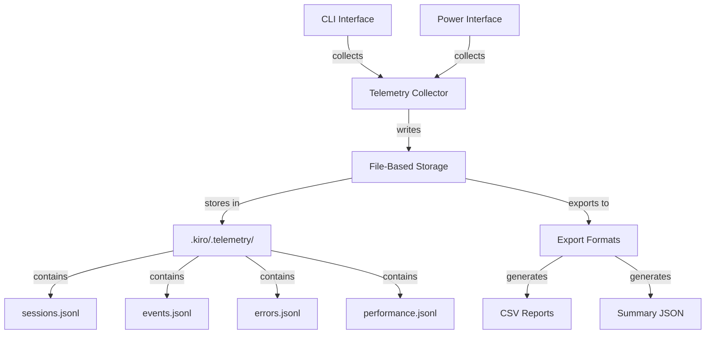

# Telemetry System Design

**Feature**: steering-power-conversion  
**Version**: 2.0.0  
**Document Type**: Architecture Design  
**Status**: Phase 1 - Architecture Definition

---

## 1. Overview

### 1.1 Purpose

This document specifies the design of the shared telemetry system used by both CLI and Power interfaces for the HiveForge Steering Assistant. The telemetry system collects usage data, performance metrics, and error information to enable:

1. **Usage Analytics**: Track CLI vs Power adoption and usage patterns
2. **Performance Monitoring**: Identify performance bottlenecks and optimization opportunities
3. **Error Tracking**: Monitor error rates and failure patterns
4. **Confidence Calibration**: Collect data for improving autonomous generation confidence thresholds
5. **Feature Adoption**: Understand which features are used and which are ignored

### 1.2 Design Principles

1. **Privacy First**: No PII collected, all data anonymized
2. **Shared Implementation**: Single telemetry module used by both CLI and Power
3. **File-Based Storage**: Store telemetry in `.kiro/.telemetry/` directory (no external dependencies)
4. **Opt-Out Support**: Users can disable telemetry collection
5. **Minimal Overhead**: Telemetry collection should not impact performance
6. **Structured Data**: Use JSON format for easy analysis and export

### 1.3 Architecture Diagram



---

## 2. Data Model

### 2.1 Telemetry Session

A session represents a single invocation of a steering workflow (via CLI or Power).

```python
@dataclass
class TelemetrySession:
    """Represents a single workflow execution session."""
    
    # Identifiers
    session_id: str  # UUID v4
    user_id: str  # Anonymized hash of machine ID
    
    # Context
    interface_type: str  # "cli" or "power"
    workflow_type: str  # "init", "update", "validate", "reset", "discover"
    timestamp: str  # ISO 8601 format
    
    # Environment
    python_version: str
    platform: str  # "darwin", "linux", "win32"
    hiveforge_version: str
    
    # Execution
    status: str  # "success", "failed", "partial"
    duration_seconds: float
    
    # Results
    files_created: int
    files_updated: int
    files_validated: int
    
    # Errors
    error_count: int
    error_types: list[str]
    
    # Performance
    memory_peak_mb: float
    cpu_time_seconds: float
```

### 2.2 Telemetry Event

Events represent specific actions within a session.

```python
@dataclass
class TelemetryEvent:
    """Represents a specific event within a session."""
    
    # Identifiers
    event_id: str  # UUID v4
    session_id: str  # Links to session
    
    # Event details
    event_type: str  # "file_generated", "validation_run", "error_occurred", etc.
    timestamp: str  # ISO 8601 format
    
    # Context
    file_path: Optional[str]  # Relative path (anonymized)
    component: str  # "discovery", "generation", "validation", etc.
    
    # Metrics
    duration_seconds: float
    confidence_score: Optional[float]  # For generation events
    
    # Additional data
    metadata: dict[str, Any]
```


### 2.3 Telemetry Error

Errors represent failures or issues during execution.

```python
@dataclass
class TelemetryError:
    """Represents an error that occurred during execution."""
    
    # Identifiers
    error_id: str  # UUID v4
    session_id: str  # Links to session
    
    # Error details
    error_type: str  # "llm_api_error", "validation_error", "file_io_error", etc.
    error_message: str  # User-friendly message (no PII)
    timestamp: str  # ISO 8601 format
    
    # Context
    component: str  # Where error occurred
    severity: str  # "critical", "error", "warning"
    
    # Recovery
    recovered: bool  # Whether error was recovered from
    recovery_method: Optional[str]  # "retry", "fallback", "rollback", etc.
    
    # Stack trace (anonymized)
    stack_trace_hash: str  # Hash of stack trace for grouping
```

### 2.4 Performance Metrics

Performance metrics track resource usage and timing.

```python
@dataclass
class PerformanceMetrics:
    """Performance metrics for a session."""
    
    # Identifiers
    session_id: str
    timestamp: str
    
    # Timing
    total_duration_seconds: float
    discovery_duration_seconds: float
    generation_duration_seconds: float
    validation_duration_seconds: float
    
    # Resource usage
    memory_peak_mb: float
    memory_average_mb: float
    cpu_time_seconds: float
    
    # I/O
    files_read: int
    files_written: int
    bytes_read: int
    bytes_written: int
    
    # LLM API
    llm_calls: int
    llm_tokens_input: int
    llm_tokens_output: int
    llm_api_time_seconds: float
```

---

## 3. Storage Implementation

### 3.1 File Structure

Telemetry data is stored in `.kiro/.telemetry/` directory:

```
.kiro/.telemetry/
├── sessions.jsonl          # One session per line
├── events.jsonl            # One event per line
├── errors.jsonl            # One error per line
├── performance.jsonl       # One metrics record per line
├── summary.json            # Aggregated summary
└── .telemetry_config.json  # User preferences
```


### 3.2 JSONL Format

Each file uses JSON Lines format (one JSON object per line) for:
- Easy appending without parsing entire file
- Streaming processing for large datasets
- Simple rotation and archival

**Example sessions.jsonl**:
```jsonl
{"session_id":"a1b2c3","user_id":"hash123","interface_type":"cli","workflow_type":"init","timestamp":"2026-02-17T10:00:00Z","status":"success","duration_seconds":45.2}
{"session_id":"d4e5f6","user_id":"hash123","interface_type":"power","workflow_type":"update","timestamp":"2026-02-17T11:00:00Z","status":"success","duration_seconds":12.5}
```

### 3.3 File Rotation

To prevent unbounded growth:
- Maximum file size: 10MB per file
- Rotation: When file exceeds limit, rename to `{filename}.1.jsonl`, `{filename}.2.jsonl`, etc.
- Retention: Keep last 10 rotated files (100MB total per file type)
- Cleanup: Delete files older than 90 days

### 3.4 Privacy and Anonymization

**User ID Generation**:
```python
def generate_user_id() -> str:
    """Generate anonymized user ID from machine ID."""
    import hashlib
    import uuid
    
    # Get machine ID
    machine_id = str(uuid.getnode())
    
    # Hash with salt
    salt = "hiveforge-telemetry-v1"
    hashed = hashlib.sha256(f"{machine_id}{salt}".encode()).hexdigest()
    
    return hashed[:16]  # First 16 chars
```


**Path Anonymization**:
```python
def anonymize_path(path: str) -> str:
    """Anonymize file path to remove PII."""
    # Replace project root with placeholder
    # Keep only relative structure
    # Example: /Users/john/myproject/src/main.py -> <root>/src/main.py
    return path.replace(str(Path.home()), "<home>")
```

**No PII Collected**:
- No usernames, email addresses, or personal identifiers
- No file contents or code snippets
- No environment variables or secrets
- Only anonymized paths and hashed identifiers

---

## 4. Telemetry Collector Implementation

### 4.1 TelemetryCollector Class

```python
from pathlib import Path
from typing import Optional
import json
import uuid
from datetime import datetime

class TelemetryCollector:
    """Collects and stores telemetry data."""
    
    def __init__(self, telemetry_dir: Path = None, enabled: bool = True):
        """
        Initialize telemetry collector.
        
        Args:
            telemetry_dir: Directory to store telemetry (default: .kiro/.telemetry/)
            enabled: Whether telemetry collection is enabled
        """
        self.enabled = enabled
        self.telemetry_dir = telemetry_dir or Path(".kiro/.telemetry")
        self.user_id = self._get_or_create_user_id()
        self.current_session: Optional[TelemetrySession] = None
        
        if self.enabled:
            self._ensure_telemetry_dir()
    
    def start_session(
        self,
        interface_type: str,
        workflow_type: str
    ) -> str:
        """Start a new telemetry session."""
        if not self.enabled:
            return ""
        
        session_id = str(uuid.uuid4())
        self.current_session = TelemetrySession(
            session_id=session_id,
            user_id=self.user_id,
            interface_type=interface_type,
            workflow_type=workflow_type,
            timestamp=datetime.utcnow().isoformat() + "Z",
            python_version=sys.version.split()[0],
            platform=sys.platform,
            hiveforge_version=get_version(),
            status="in_progress",
            duration_seconds=0.0,
            files_created=0,
            files_updated=0,
            files_validated=0,
            error_count=0,
            error_types=[],
            memory_peak_mb=0.0,
            cpu_time_seconds=0.0
        )
        
        return session_id
    
    def end_session(self, status: str, duration: float):
        """End current session and write to storage."""
        if not self.enabled or not self.current_session:
            return
        
        self.current_session.status = status
        self.current_session.duration_seconds = duration
        
        self._write_session(self.current_session)
        self.current_session = None
```
    
    def record_event(
        self,
        event_type: str,
        component: str,
        duration: float = 0.0,
        confidence_score: Optional[float] = None,
        metadata: dict = None
    ):
        """Record an event within the current session."""
        if not self.enabled or not self.current_session:
            return
        
        event = TelemetryEvent(
            event_id=str(uuid.uuid4()),
            session_id=self.current_session.session_id,
            event_type=event_type,
            timestamp=datetime.utcnow().isoformat() + "Z",
            component=component,
            duration_seconds=duration,
            confidence_score=confidence_score,
            metadata=metadata or {}
        )
        
        self._write_event(event)
    
    def record_error(
        self,
        error_type: str,
        error_message: str,
        component: str,
        severity: str,
        recovered: bool = False,
        recovery_method: Optional[str] = None
    ):
        """Record an error within the current session."""
        if not self.enabled or not self.current_session:
            return
        
        error = TelemetryError(
            error_id=str(uuid.uuid4()),
            session_id=self.current_session.session_id,
            error_type=error_type,
            error_message=error_message,
            timestamp=datetime.utcnow().isoformat() + "Z",
            component=component,
            severity=severity,
            recovered=recovered,
            recovery_method=recovery_method,
            stack_trace_hash=""  # Computed from stack trace
        )
        
        self._write_error(error)
```


### 4.2 Context Manager Pattern

For easy integration with workflows:

```python
class TelemetryContext:
    """Context manager for telemetry collection."""
    
    def __init__(
        self,
        collector: TelemetryCollector,
        interface_type: str,
        workflow_type: str
    ):
        self.collector = collector
        self.interface_type = interface_type
        self.workflow_type = workflow_type
        self.start_time = None
        self.session_id = None
    
    def __enter__(self):
        self.start_time = time.time()
        self.session_id = self.collector.start_session(
            self.interface_type,
            self.workflow_type
        )
        return self
    
    def __exit__(self, exc_type, exc_val, exc_tb):
        duration = time.time() - self.start_time
        status = "success" if exc_type is None else "failed"
        self.collector.end_session(status, duration)
        return False  # Don't suppress exceptions
```

**Usage Example**:
```python
# In shared workflow
telemetry = TelemetryCollector()

with TelemetryContext(telemetry, "cli", "init") as ctx:
    # Execute workflow
    result = workflow.execute()
    
    # Record events
    telemetry.record_event(
        event_type="file_generated",
        component="generation",
        confidence_score=0.85
    )
```


---

## 5. Integration with Shared Backend

### 5.1 SharedWorkflowExecutor Integration

The telemetry collector is integrated into the SharedWorkflowExecutor:

```python
class SharedWorkflowExecutor:
    """Orchestrates workflow execution with telemetry."""
    
    def __init__(
        self,
        project_root: Path = Path("."),
        interface_type: InterfaceType = InterfaceType.CLI,
        enable_telemetry: bool = True
    ):
        self.project_root = project_root
        self.interface_type = interface_type
        self.enable_telemetry = enable_telemetry
        
        # Initialize telemetry collector
        self._telemetry = TelemetryCollector(
            telemetry_dir=project_root / ".kiro" / ".telemetry",
            enabled=enable_telemetry
        )
    
    def execute_workflow(
        self,
        workflow_type: WorkflowType,
        parameters: dict
    ) -> ExecutionResult:
        """Execute workflow with telemetry collection."""
        
        # Start telemetry session
        with TelemetryContext(
            self._telemetry,
            self.interface_type.value,
            workflow_type.value
        ):
            try:
                # Execute workflow
                result = self._execute_workflow_impl(workflow_type, parameters)
                
                # Record success metrics
                self._telemetry.record_event(
                    event_type="workflow_completed",
                    component="executor",
                    duration=result.execution_time_seconds
                )
                
                return result
                
            except Exception as e:
                # Record error
                self._telemetry.record_error(
                    error_type=type(e).__name__,
                    error_message=str(e),
                    component="executor",
                    severity="critical"
                )
                raise
```


### 5.2 CLI Integration

```python
# src/hiveforge/steering/cli.py

@app.command("init")
def steering_init(
    auto_discover: bool = True,
    autonomous: bool = True,
    no_telemetry: bool = typer.Option(False, "--no-telemetry")
):
    """Initialize steering files."""
    
    # Create executor with telemetry
    executor = SharedWorkflowExecutor(
        project_root=Path.cwd(),
        interface_type=InterfaceType.CLI,
        enable_telemetry=not no_telemetry
    )
    
    # Execute workflow (telemetry collected automatically)
    result = executor.execute_workflow(
        WorkflowType.INIT,
        {"auto_discover": auto_discover, "autonomous": autonomous}
    )
    
    # Display result
    print(result.format_for_cli())
```

### 5.3 Power Tool Integration

```python
# mcp-server/tools/init_steering.py

@mcp.tool()
async def init_steering(
    auto_discover: bool = True,
    autonomous: bool = True,
    project_root: str = "."
) -> dict:
    """Initialize steering files via Power."""
    
    # Create executor with telemetry
    executor = SharedWorkflowExecutor(
        project_root=Path(project_root),
        interface_type=InterfaceType.POWER,
        enable_telemetry=True  # Always enabled for Power
    )
    
    # Execute workflow (telemetry collected automatically)
    result = executor.execute_workflow(
        WorkflowType.INIT,
        {"auto_discover": auto_discover, "autonomous": autonomous}
    )
    
    return result.to_dict()
```


---

## 6. Telemetry Configuration

### 6.1 Configuration File

Users can configure telemetry via `.kiro/.telemetry/.telemetry_config.json`:

```json
{
  "enabled": true,
  "anonymize_paths": true,
  "retention_days": 90,
  "max_file_size_mb": 10,
  "max_rotated_files": 10,
  "collect_performance_metrics": true,
  "collect_confidence_scores": true,
  "export_format": "jsonl"
}
```

### 6.2 Opt-Out Mechanism

Users can disable telemetry in multiple ways:

1. **CLI Flag**: `--no-telemetry` on any command
2. **Environment Variable**: `HIVEFORGE_TELEMETRY=0`
3. **Config File**: Set `"enabled": false` in config
4. **Global Disable**: Create `.kiro/.telemetry/DISABLE` file

**Priority Order** (highest to lowest):
1. CLI flag
2. Environment variable
3. DISABLE file
4. Config file
5. Default (enabled)

### 6.3 Configuration API

```python
class TelemetryConfig:
    """Manages telemetry configuration."""
    
    @staticmethod
    def is_enabled(project_root: Path) -> bool:
        """Check if telemetry is enabled."""
        # Check DISABLE file
        if (project_root / ".kiro/.telemetry/DISABLE").exists():
            return False
        
        # Check environment variable
        if os.getenv("HIVEFORGE_TELEMETRY") == "0":
            return False
        
        # Check config file
        config = TelemetryConfig.load(project_root)
        return config.get("enabled", True)
    
    @staticmethod
    def load(project_root: Path) -> dict:
        """Load telemetry configuration."""
        config_path = project_root / ".kiro/.telemetry/.telemetry_config.json"
        if config_path.exists():
            return json.loads(config_path.read_text())
        return {}
```


---

## 7. Analytics and Reporting

### 7.1 Summary Generation

Generate aggregated summaries from telemetry data:

```python
class TelemetrySummary:
    """Generate summary statistics from telemetry data."""
    
    def generate_summary(self, telemetry_dir: Path) -> dict:
        """Generate summary from telemetry files."""
        sessions = self._load_sessions(telemetry_dir)
        
        return {
            "total_sessions": len(sessions),
            "cli_sessions": sum(1 for s in sessions if s["interface_type"] == "cli"),
            "power_sessions": sum(1 for s in sessions if s["interface_type"] == "power"),
            "success_rate": self._calculate_success_rate(sessions),
            "average_duration": self._calculate_avg_duration(sessions),
            "most_used_workflow": self._find_most_used_workflow(sessions),
            "error_rate": self._calculate_error_rate(sessions),
            "date_range": self._get_date_range(sessions)
        }
```

### 7.2 Export Formats

Support multiple export formats for analysis:

**CSV Export**:
```python
def export_to_csv(telemetry_dir: Path, output_file: Path):
    """Export telemetry data to CSV for analysis."""
    sessions = load_sessions(telemetry_dir)
    
    with open(output_file, 'w', newline='') as f:
        writer = csv.DictWriter(f, fieldnames=sessions[0].keys())
        writer.writeheader()
        writer.writerows(sessions)
```

**Summary JSON**:
```python
def export_summary(telemetry_dir: Path, output_file: Path):
    """Export summary statistics to JSON."""
    summary = TelemetrySummary().generate_summary(telemetry_dir)
    output_file.write_text(json.dumps(summary, indent=2))
```


### 7.3 CLI Commands for Telemetry

```bash
# View telemetry summary
hiveforge steering telemetry summary

# Export telemetry data
hiveforge steering telemetry export --format csv --output telemetry.csv

# Clear telemetry data
hiveforge steering telemetry clear --confirm

# Disable telemetry
hiveforge steering telemetry disable

# Enable telemetry
hiveforge steering telemetry enable
```

---

## 8. Use Cases

### 8.1 Usage Analytics

**Question**: Are users adopting Power or sticking with CLI?

**Query**:
```python
def analyze_interface_adoption(telemetry_dir: Path) -> dict:
    """Analyze CLI vs Power adoption."""
    sessions = load_sessions(telemetry_dir)
    
    cli_count = sum(1 for s in sessions if s["interface_type"] == "cli")
    power_count = sum(1 for s in sessions if s["interface_type"] == "power")
    
    return {
        "cli_sessions": cli_count,
        "power_sessions": power_count,
        "power_adoption_rate": power_count / len(sessions) if sessions else 0
    }
```

### 8.2 Performance Monitoring

**Question**: Which workflows are slowest?

**Query**:
```python
def analyze_performance(telemetry_dir: Path) -> dict:
    """Analyze workflow performance."""
    sessions = load_sessions(telemetry_dir)
    
    by_workflow = {}
    for session in sessions:
        workflow = session["workflow_type"]
        if workflow not in by_workflow:
            by_workflow[workflow] = []
        by_workflow[workflow].append(session["duration_seconds"])
    
    return {
        workflow: {
            "avg_duration": sum(durations) / len(durations),
            "max_duration": max(durations),
            "min_duration": min(durations)
        }
        for workflow, durations in by_workflow.items()
    }
```


### 8.3 Error Tracking

**Question**: What are the most common errors?

**Query**:
```python
def analyze_errors(telemetry_dir: Path) -> dict:
    """Analyze error patterns."""
    errors = load_errors(telemetry_dir)
    
    error_counts = {}
    for error in errors:
        error_type = error["error_type"]
        error_counts[error_type] = error_counts.get(error_type, 0) + 1
    
    return {
        "total_errors": len(errors),
        "error_types": error_counts,
        "most_common": max(error_counts.items(), key=lambda x: x[1])[0]
    }
```

### 8.4 Confidence Calibration

**Question**: Are confidence scores accurate?

**Query**:
```python
def analyze_confidence_accuracy(telemetry_dir: Path) -> dict:
    """Analyze confidence score accuracy."""
    events = load_events(telemetry_dir)
    
    # Filter generation events with confidence scores
    generation_events = [
        e for e in events 
        if e["event_type"] == "file_generated" and e["confidence_score"]
    ]
    
    # Group by confidence bucket
    buckets = {"high": [], "medium": [], "low": []}
    for event in generation_events:
        score = event["confidence_score"]
        if score >= 0.9:
            buckets["high"].append(event)
        elif score >= 0.7:
            buckets["medium"].append(event)
        else:
            buckets["low"].append(event)
    
    return {
        "high_confidence_count": len(buckets["high"]),
        "medium_confidence_count": len(buckets["medium"]),
        "low_confidence_count": len(buckets["low"])
    }
```

---

## 9. Testing Strategy

### 9.1 Unit Tests

```python
# tests/test_telemetry_collector.py

def test_telemetry_session_lifecycle():
    """Test session start and end."""
    collector = TelemetryCollector(enabled=True)
    
    session_id = collector.start_session("cli", "init")
    assert session_id
    assert collector.current_session is not None
    
    collector.end_session("success", 10.5)
    assert collector.current_session is None
```


def test_telemetry_disabled():
    """Test that telemetry can be disabled."""
    collector = TelemetryCollector(enabled=False)
    
    session_id = collector.start_session("cli", "init")
    assert session_id == ""
    assert collector.current_session is None

def test_event_recording():
    """Test event recording."""
    collector = TelemetryCollector(enabled=True)
    collector.start_session("cli", "init")
    
    collector.record_event(
        event_type="file_generated",
        component="generation",
        confidence_score=0.85
    )
    
    # Verify event written to file
    events = load_events(collector.telemetry_dir)
    assert len(events) == 1
    assert events[0]["event_type"] == "file_generated"

def test_error_recording():
    """Test error recording."""
    collector = TelemetryCollector(enabled=True)
    collector.start_session("cli", "init")
    
    collector.record_error(
        error_type="llm_api_error",
        error_message="Rate limit exceeded",
        component="generation",
        severity="error"
    )
    
    # Verify error written to file
    errors = load_errors(collector.telemetry_dir)
    assert len(errors) == 1
    assert errors[0]["error_type"] == "llm_api_error"

def test_privacy_anonymization():
    """Test that paths are anonymized."""
    path = "/Users/john/myproject/src/main.py"
    anonymized = anonymize_path(path)
    
    assert "john" not in anonymized
    assert "<home>" in anonymized
```

### 9.2 Integration Tests

```python
# tests/test_telemetry_integration.py

def test_cli_telemetry_collection():
    """Test telemetry collection via CLI."""
    # Run CLI command
    result = subprocess.run(
        ["hiveforge", "steering", "init", "--auto"],
        capture_output=True
    )
    
    # Verify telemetry collected
    telemetry_dir = Path(".kiro/.telemetry")
    sessions = load_sessions(telemetry_dir)
    
    assert len(sessions) >= 1
    assert sessions[-1]["interface_type"] == "cli"
    assert sessions[-1]["workflow_type"] == "init"
```


def test_power_telemetry_collection():
    """Test telemetry collection via Power."""
    # Simulate Power tool invocation
    executor = SharedWorkflowExecutor(
        interface_type=InterfaceType.POWER,
        enable_telemetry=True
    )
    
    result = executor.execute_workflow(
        WorkflowType.INIT,
        {"auto_discover": True}
    )
    
    # Verify telemetry collected
    telemetry_dir = Path(".kiro/.telemetry")
    sessions = load_sessions(telemetry_dir)
    
    assert len(sessions) >= 1
    assert sessions[-1]["interface_type"] == "power"

def test_telemetry_opt_out():
    """Test telemetry opt-out mechanism."""
    # Create DISABLE file
    disable_file = Path(".kiro/.telemetry/DISABLE")
    disable_file.parent.mkdir(parents=True, exist_ok=True)
    disable_file.touch()
    
    # Run CLI command
    result = subprocess.run(
        ["hiveforge", "steering", "init", "--auto"],
        capture_output=True
    )
    
    # Verify no telemetry collected
    sessions = load_sessions(Path(".kiro/.telemetry"))
    initial_count = len(sessions)
    
    # Run again
    subprocess.run(["hiveforge", "steering", "validate"])
    
    # Count should not increase
    assert len(load_sessions(Path(".kiro/.telemetry"))) == initial_count

def test_cli_power_telemetry_equivalence():
    """Test that CLI and Power collect equivalent telemetry."""
    # Run same workflow via CLI
    cli_executor = SharedWorkflowExecutor(
        interface_type=InterfaceType.CLI,
        enable_telemetry=True
    )
    cli_result = cli_executor.execute_workflow(
        WorkflowType.INIT,
        {"auto_discover": True}
    )
    
    # Run same workflow via Power
    power_executor = SharedWorkflowExecutor(
        interface_type=InterfaceType.POWER,
        enable_telemetry=True
    )
    power_result = power_executor.execute_workflow(
        WorkflowType.INIT,
        {"auto_discover": True}
    )
    
    # Load sessions
    sessions = load_sessions(Path(".kiro/.telemetry"))
    cli_session = [s for s in sessions if s["interface_type"] == "cli"][-1]
    power_session = [s for s in sessions if s["interface_type"] == "power"][-1]
    
    # Verify equivalent data collected (except interface_type)
    assert cli_session["workflow_type"] == power_session["workflow_type"]
    assert cli_session["status"] == power_session["status"]
    assert abs(cli_session["duration_seconds"] - power_session["duration_seconds"]) < 5.0
```


---

## 10. Implementation Checklist

### Phase 2.4: Shared Telemetry System Implementation

- [ ] **Core Classes**
  - [ ] Implement `TelemetrySession` dataclass
  - [ ] Implement `TelemetryEvent` dataclass
  - [ ] Implement `TelemetryError` dataclass
  - [ ] Implement `PerformanceMetrics` dataclass

- [ ] **Collector Implementation**
  - [ ] Implement `TelemetryCollector` class
  - [ ] Implement `TelemetryContext` context manager
  - [ ] Implement session lifecycle methods
  - [ ] Implement event recording
  - [ ] Implement error recording
  - [ ] Implement performance metrics collection

- [ ] **Storage Implementation**
  - [ ] Implement JSONL file writing
  - [ ] Implement file rotation logic
  - [ ] Implement cleanup/retention logic
  - [ ] Implement user ID generation and anonymization
  - [ ] Implement path anonymization

- [ ] **Configuration**
  - [ ] Implement `TelemetryConfig` class
  - [ ] Implement opt-out mechanisms (flag, env var, DISABLE file)
  - [ ] Implement configuration file loading
  - [ ] Create default configuration

- [ ] **Integration**
  - [ ] Integrate with `SharedWorkflowExecutor`
  - [ ] Add telemetry to CLI commands
  - [ ] Add telemetry to Power tools
  - [ ] Ensure shared implementation used by both interfaces

- [ ] **Analytics and Reporting**
  - [ ] Implement `TelemetrySummary` class
  - [ ] Implement CSV export
  - [ ] Implement summary JSON export
  - [ ] Add CLI commands for telemetry management

- [ ] **Testing**
  - [ ] Write unit tests for collector
  - [ ] Write unit tests for storage
  - [ ] Write unit tests for configuration
  - [ ] Write integration tests for CLI telemetry
  - [ ] Write integration tests for Power telemetry
  - [ ] Write tests for opt-out mechanisms
  - [ ] Write tests for privacy/anonymization
  - [ ] Achieve > 80% code coverage

- [ ] **Documentation**
  - [ ] Document telemetry data model
  - [ ] Document opt-out mechanisms
  - [ ] Document privacy guarantees
  - [ ] Add examples to POWER.md
  - [ ] Update CLI help text

---

## 11. Privacy and Compliance

### 11.1 Data Collection Policy

**What We Collect**:
- Anonymized user ID (hashed machine ID)
- Interface type (CLI or Power)
- Workflow type and execution status
- Performance metrics (duration, memory, CPU)
- Error types and anonymized messages
- Confidence scores for generated content
- File counts (not contents or names)

**What We DO NOT Collect**:
- Usernames, email addresses, or personal identifiers
- File contents or code snippets
- Environment variables or secrets
- Actual file paths (only anonymized)
- Project names or organization details
- Any personally identifiable information (PII)


### 11.2 Data Retention

- **Local Storage**: All telemetry stored locally in `.kiro/.telemetry/`
- **Retention Period**: 90 days by default (configurable)
- **Automatic Cleanup**: Files older than retention period deleted automatically
- **User Control**: Users can clear telemetry data at any time

### 11.3 Data Transmission

- **No Automatic Upload**: Telemetry data never automatically sent to external servers
- **Local Only**: All data remains on user's machine
- **Optional Export**: Users can manually export data if they choose
- **No Third-Party Sharing**: Data never shared with third parties

### 11.4 Compliance

- **GDPR Compliant**: No PII collected, user can disable and delete data
- **CCPA Compliant**: User has full control over data collection
- **Enterprise Friendly**: All data stays within organization's infrastructure
- **Audit Trail**: All telemetry operations logged for transparency

---

## 12. Future Enhancements (v1.1+)

### 12.1 Advanced Analytics

- **Trend Analysis**: Track metrics over time
- **Anomaly Detection**: Identify unusual patterns
- **Predictive Analytics**: Predict workflow success rates
- **Comparative Analysis**: Compare performance across projects

### 12.2 Confidence Calibration

- **Automatic Calibration**: Adjust confidence thresholds based on telemetry
- **Feedback Loop**: Learn from user corrections
- **Multi-Project Learning**: Improve across all projects
- **Confidence Accuracy Metrics**: Track how accurate confidence scores are

### 12.3 Dashboard

- **Web Dashboard**: Visual analytics dashboard
- **Real-Time Monitoring**: Live performance monitoring
- **Custom Reports**: User-defined reports and queries
- **Export to BI Tools**: Integration with Tableau, PowerBI, etc.

### 12.4 Optional Cloud Sync

- **Opt-In Cloud Sync**: Users can choose to sync telemetry to cloud
- **Aggregated Insights**: Learn from anonymized data across all users
- **Benchmarking**: Compare performance against community averages
- **Privacy Preserved**: All data anonymized before upload

---

## 13. Success Criteria

### 13.1 Implementation Success

- [ ] Telemetry collector implemented and tested
- [ ] Both CLI and Power use shared telemetry implementation
- [ ] Privacy guarantees validated (no PII collected)
- [ ] Opt-out mechanisms work correctly
- [ ] File rotation and cleanup work correctly
- [ ] Unit test coverage > 80%
- [ ] Integration tests validate CLI/Power equivalence

### 13.2 Functional Success

- [ ] Can track CLI vs Power adoption rates
- [ ] Can identify performance bottlenecks
- [ ] Can monitor error rates and patterns
- [ ] Can collect confidence calibration data
- [ ] Can generate summary reports
- [ ] Can export data for analysis

### 13.3 Privacy Success

- [ ] No PII collected (validated by tests)
- [ ] Paths properly anonymized
- [ ] User ID properly hashed
- [ ] Opt-out mechanisms work
- [ ] Data retention enforced
- [ ] Compliance requirements met

---

## 14. Summary

This telemetry system design provides:

1. **Shared Implementation**: Single telemetry module used by both CLI and Power
2. **Privacy First**: No PII collected, all data anonymized, local storage only
3. **User Control**: Multiple opt-out mechanisms, configurable retention
4. **Comprehensive Data**: Sessions, events, errors, and performance metrics
5. **Analytics Ready**: Structured data format for easy analysis
6. **Compliance**: GDPR and CCPA compliant by design

The telemetry system enables data-driven improvements to the Steering Assistant while respecting user privacy and maintaining full transparency.
