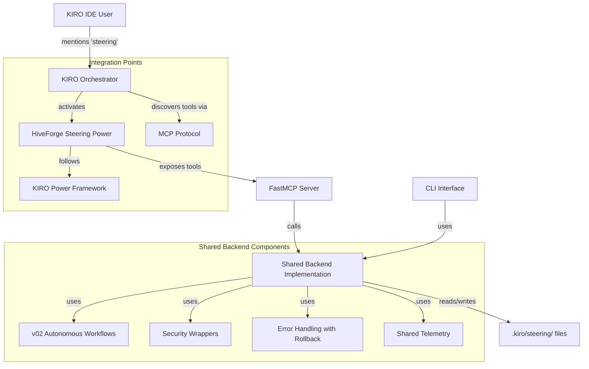

# Design Document: Steering Assistant Power Conversion

**Feature**: steering-power-conversion  
**Version**: 2.0.0  
**Status**: Revised (Based on RED TEAM feedback)  
**Based on**: Updated requirements v2.0.0

---

## Architecture Overview

### Revised System Architecture (Addressing RED TEAM Findings)



### Key Architectural Changes (Based on RED TEAM Findings):

1. **Explicit Orchestrator Integration**: Clear integration with KIRO Orchestrator via standard Power framework
2. **Shared Backend Implementation**: Single source of truth used by both CLI and Power tools
3. **Security-First Design**: Security wrappers and resource limits built into shared backend
4. **Architecture Validation**: Integration tests validate CLI/Power equivalence claims
5. **Progressive Enhancement**: CLI works independently, Power adds IDE integration

### Component Responsibilities (Revised Architecture)

#### Component 1: HiveForge Steering Power
- **Responsibility**: Package MCP server, documentation, and metadata for KIRO marketplace
- **Interface**: KIRO Power API, keyword activation, tool discovery
- **Dependencies**: FastMCP, Python 3.11+, existing steering codebase
- **Key Change**: Follows standard KIRO Power framework for automatic orchestrator integration

#### Component 2: FastMCP Server
- **Responsibility**: Expose steering tools via MCP protocol to KIRO agents
- **Interface**: MCP protocol (JSON-RPC), tool definitions, error handling
- **Dependencies**: FastMCP framework, shared backend modules
- **Key Change**: Tools call shared backend, not direct workflow calls

#### Component 3: Shared Backend Implementation
- **Responsibility**: Core steering logic used by both CLI and Power tools
- **Interface**: Python module API, configuration files, telemetry
- **Dependencies**: Existing v02 codebase, LLM APIs, file system
- **Key Change**: Single source of truth for both CLI and Power interfaces
- **Subcomponents**:
  - **Security Wrappers**: Input validation, path sanitization, resource limits
  - **Error Handling**: Comprehensive error handling with automatic rollback
  - **Telemetry System**: Shared telemetry for both CLI and Power usage
  - **Workflow Adapters**: Adapters for v02 workflows (InitWorkflow, UpdateWorkflow, etc.)

#### Component 4: CLI Interface
- **Responsibility**: Maintain backward compatibility for CI/CD and standalone usage
- **Interface**: Command-line arguments, help text, exit codes
- **Dependencies**: Shared backend, argparse, logging
- **Key Change**: Uses same shared backend as Power tools (proven through integration tests)

#### Component 5: KIRO Orchestrator Integration
- **Responsibility**: Automatic Power activation and tool discovery
- **Interface**: Keyword detection, MCP tool discovery, result presentation
- **Dependencies**: KIRO Power framework, MCP protocol
- **Key Change**: Standard integration via KIRO Power framework (no custom integration needed)

---

## Detailed Design

### 1. Power Package Structure

```
hiveforge-power/
├── POWER.md                    # User-facing documentation
├── package.json                # Power metadata
├── pyproject.toml              # Python package config
├── README.md                   # Developer documentation
├── mcp-server/
│   ├── __init__.py
│   ├── server.py              # FastMCP server entry point
│   └── tools/
│       ├── __init__.py
│       ├── init_steering.py
│       ├── update_steering.py
│       ├── validate_steering.py
│       ├── reset_steering.py
│       └── discover_docs.py
└── tests/
    ├── test_server.py
    ├── test_init_tool.py
    ├── test_update_tool.py
    ├── test_validate_tool.py
    ├── test_reset_tool.py
    └── test_discover_tool.py
```

### 2. MCP Server Implementation

**Framework**: FastMCP (Python)

**server.py**:
```python
from fastmcp import FastMCP

# Create MCP server
mcp = FastMCP("hiveforge-steering")

# Import and register tools
from .tools import (
    init_steering,
    update_steering,
    validate_steering,
    reset_steering,
    discover_project_docs
)

# Tools are auto-registered via @mcp.tool() decorator

if __name__ == "__main__":
    mcp.run()
```

**Tool Pattern**:
```python
from fastmcp import FastMCP
from pathlib import Path
from src.hiveforge.steering.workflows.init_workflow import InitWorkflow
from src.hiveforge.steering.models import SteeringConfig

mcp = FastMCP("hiveforge-steering")

@mcp.tool()
async def init_steering(
    auto_discover: bool = True,
    autonomous: bool = True,
    project_root: str = ".",
    confidence_threshold: float = 0.7
) -> dict:
    """Initialize steering files with autonomous generation."""
    try:
        # Create config
        config = SteeringConfig(
            interactive=not autonomous,
            analyze_code=True,
            feature_flags=FeatureFlagConfig(
                use_autonomous_generation=autonomous,
                confidence_threshold=confidence_threshold
            )
        )
        
        # Run workflow
        workflow = InitWorkflow(
            config=config,
            project_root=Path(project_root)
        )
        success = workflow.execute()
        
        # Return structured response
        return {
            "status": "success" if success else "failed",
            "files_created": len(workflow.state.generated_files),
            "validation": workflow.state.validation_status,
            "confidence_scores": workflow.state.confidence_scores,
            "message": f"Generated {len(workflow.state.generated_files)} files"
        }
    except Exception as e:
        return {
            "status": "failed",
            "error": str(e),
            "message": f"Failed to initialize steering files: {e}"
        }
```

### 3. New Feature: reset_steering Tool

**Purpose**: Restore steering files to default templates

**Implementation**:
```python
@mcp.tool()
async def reset_steering(
    file: str = None,
    confirm: bool = False,
    project_root: str = "."
) -> dict:
    """Reset steering files to default templates."""
    from src.hiveforge.steering.reset import ResetManager
    from src.hiveforge.steering.backup_manager import BackupManager
    
    try:
        project_path = Path(project_root)
        steering_dir = project_path / ".kiro" / "steering"
        
        # Create backup first
        backup_mgr = BackupManager(backup_dir=project_path / ".kiro" / "backups")
        backup_path = backup_mgr.create_backup(steering_dir)
        
        # Reset files
        reset_mgr = ResetManager(
            steering_dir=steering_dir,
            template_dir=Path(__file__).parent.parent / "templates" / "steering"
        )
        
        if file:
            reset_files = reset_mgr.reset_file(file)
        else:
            if not confirm:
                return {
                    "status": "cancelled",
                    "message": "Reset requires confirmation. Use confirm=true"
                }
            reset_files = reset_mgr.reset_all()
        
        return {
            "status": "success",
            "files_reset": len(reset_files),
            "backup_created": str(backup_path),
            "message": f"Reset {len(reset_files)} file(s) to default templates"
        }
    except Exception as e:
        return {
            "status": "failed",
            "error": str(e),
            "message": f"Failed to reset steering files: {e}"
        }
```

**New Classes Needed**:
- `ResetManager`: Handles template restoration logic
- Already have: `BackupManager` (from v02 spec)

### 4. CLI Backward Compatibility

**Approach**: CLI commands call the same workflows as MCP tools

**Example**:
```python
# src/hiveforge/steering/cli.py

@app.command("reset")
def steering_reset(
    file: Optional[str] = typer.Option(None, "--file", help="Specific file to reset"),
    confirm: bool = typer.Option(False, "--confirm", help="Skip confirmation"),
    dry_run: bool = typer.Option(False, "--dry-run", help="Preview changes")
):
    """Reset steering files to default templates."""
    from .reset import ResetManager
    from .backup_manager import BackupManager
    
    # Same logic as MCP tool
    # ...
```

### 5. Package Distribution

**PyPI Package**: `hiveforge-steering-mcp`

**pyproject.toml**:
```toml
[project]
name = "hiveforge-steering-mcp"
version = "2.0.0"
description = "MCP server for HiveForge Steering Assistant"
dependencies = [
    "fastmcp>=0.1.0",
    "hiveforge>=1.0.0"  # Existing package
]

[project.scripts]
hiveforge-steering-mcp = "mcp_server.server:main"
```

**Installation**:
```bash
# Via uvx (recommended for Powers)
uvx hiveforge-steering-mcp@latest

# Via pip (for development)
pip install hiveforge-steering-mcp
```

---

## Data Flow (Revised Architecture)

### Scenario 1: User Generates Steering Files via KIRO IDE (Power Path)

1. **User Intent**: User says "generate steering files for my project" in KIRO IDE
2. **Keyword Detection**: KIRO detects "steering" keyword
3. **Power Activation**: KIRO Power framework activates HiveForge Steering Power
4. **Orchestrator Integration**: KIRO Orchestrator discovers available tools via MCP protocol
5. **Tool Invocation**: Orchestrator invokes `init_steering(auto_discover=True, autonomous=True)`
6. **Security Validation**: Tool validates inputs, sanitizes paths, enforces resource limits
7. **Shared Backend Call**: Tool calls shared backend: `AutonomousWorkflow.execute()`
8. **Workflow Execution**: Shared backend executes v02 autonomous generation
9. **Error Handling**: If failure, automatic rollback from backup
10. **Result Processing**: Shared backend returns structured result
11. **Response Formatting**: Tool formats result for MCP protocol
12. **User Presentation**: Orchestrator presents results to user
13. **Power Deactivation**: Power deactivates when task complete

### Scenario 2: User Updates Steering Files via CLI (Backward Compatibility Path)

1. **User Command**: User runs `hiveforge steering update --incremental`
2. **CLI Parsing**: CLI parses arguments and validates inputs
3. **Shared Backend Call**: CLI calls same shared backend: `UpdateWorkflow.execute()`
4. **Security Validation**: Shared backend validates inputs (same as Power path)
5. **Workflow Execution**: Shared backend executes v02 incremental update
6. **Error Handling**: Same error handling with rollback as Power path
7. **Result Processing**: Shared backend returns result
8. **CLI Formatting**: CLI formats result for terminal output
9. **User Display**: CLI displays summary to user

### Key Data Flow Changes (Based on RED TEAM Findings):

1. **Single Source of Truth**: Both Power and CLI paths use identical shared backend
2. **Security Consistency**: Same security validation for both interfaces
3. **Error Handling Parity**: Same error handling with rollback for both interfaces
4. **Result Equivalence**: Both interfaces produce identical file outputs (validated by tests)
5. **Orchestrator Integration**: Clear integration via standard KIRO Power framework

---

## Key Architectural Decisions

### Decision 1: Shared Backend Implementation

**Problem**: How to ensure CLI and Power tools behave identically?

**Decision**: Implement shared backend used by both CLI and Power interfaces

**Rationale**:
- Single source of truth eliminates behavioral divergence
- Enables validation through integration tests
- Reduces maintenance burden (fix once, works for both)
- Ensures backward compatibility is provable

**Implementation**:
- Extract common logic from v02 workflows into shared modules
- Create adapter interfaces for both CLI and Power
- Implement integration tests validating equivalence

**Trade-offs**:
- ✅ Guaranteed consistency between interfaces
- ✅ Easier to maintain and test
- ✅ Backward compatibility provable
- ⚠️ Requires careful interface design
- ⚠️ Additional refactoring effort upfront

### Decision 2: Security-First Design

**Problem**: How to secure MCP tools exposed to LLM agents?

**Decision**: Implement security-first design with built-in protections

**Rationale**:
- MCP tools are exposed to potentially untrusted LLM agents
- Need protection against injection attacks and resource exhaustion
- Enterprise adoption requires security compliance

**Implementation**:
- Input validation for all tool parameters
- Path sanitization to prevent directory traversal
- Resource limits (memory, CPU, file size)
- Error obfuscation (detailed logs internally, user-friendly messages)

**Trade-offs**:
- ✅ Proactive security protection
- ✅ Meets enterprise requirements
- ✅ Easier to audit and validate
- ⚠️ Performance overhead for security checks
- ⚠️ Additional implementation complexity

### Decision 3: Progressive Enhancement

**Problem**: How to introduce Power without breaking existing CLI?

**Decision**: Use progressive enhancement approach

**Rationale**:
- Respect existing users and automation
- Enable gradual adoption at user's pace
- Maintain CI/CD pipeline compatibility
- Reduce migration burden

**Implementation**:
- CLI continues to work unchanged
- Power adds IDE integration on top
- Shared backend ensures consistency
- Documentation covers both paths

**Trade-offs**:
- ✅ No breaking changes for existing users
- ✅ Users can adopt Power gradually
- ✅ CI/CD pipelines continue working
- ⚠️ Must maintain two interfaces
- ⚠️ Documentation must cover both paths

### Decision 4: Architecture Validation Before Implementation

**Problem**: How to validate architectural claims before implementation?

**Decision**: Create integration tests that validate architecture before implementation

**Rationale**:
- RED TEAM identified unvalidated architectural claims
- Need to prove CLI/Power equivalence claims
- Reduce risk of implementation diverging from design

**Implementation**:
- Integration test suite validating architectural claims
- Tests prove CLI and Power produce identical outputs
- Tests validate shared backend utilization
- Tests verify error handling parity

**Trade-offs**:
- ✅ Architectural claims are testable and provable
- ✅ Reduces implementation risk
- ✅ Provides clear success criteria
- ⚠️ Additional upfront testing effort
- ⚠️ Requires test infrastructure

---

## Error Handling Strategy (Revised)

### Error Categories

**1. User Errors**:
- Project root not found
- Invalid file paths
- Missing permissions

**Response**: Clear error message with fix suggestion (same for CLI and Power)

**2. System Errors**:
- LLM API failures
- Network timeouts
- File I/O errors

**Response**: Retry logic, fallback options, preserve state (shared implementation)

**3. Validation Errors**:
- Generated content fails validation
- Semantic inconsistencies

**Response**: Trigger regeneration or fallback workflow (shared logic)

**4. Security Errors**:
- Path traversal attempts
- Resource limit violations
- Input validation failures

**Response**: Immediate failure with security logging (no retry)

### Error Response Format

```python
{
    "status": "failed",
    "error_type": "llm_api_error",
    "error": "Rate limit exceeded",
    "recovery_options": [
        "retry_after_delay",
        "use_fallback_workflow",
        "abort"
    ],
    "message": "LLM API rate limit exceeded. Retry in 60 seconds?"
}
```

---

## Security Considerations (Security-First Design)

### 1. Security Wrapper Implementation

**Approach**: All tools wrapped with security decorator

**Implementation**:
```python
def secure_tool_execution(tool_func):
    """Security wrapper for all MCP tools."""
    async def wrapper(**kwargs):
        # 1. Validate all inputs
        validated_kwargs = validate_parameters(kwargs)
        
        # 2. Sanitize paths
        if 'project_root' in validated_kwargs:
            validated_kwargs['project_root'] = sanitize_path(
                validated_kwargs['project_root']
            )
        
        # 3. Enforce resource limits
        with ResourceLimiter(
            max_memory_mb=512,
            max_cpu_time_sec=300,
            max_file_size_mb=10
        ):
            result = await tool_func(**validated_kwargs)
        
        # 4. Obfuscate errors for users
        return obfuscate_errors(result)
    
    return wrapper

# Usage
@mcp.tool()
@secure_tool_execution
async def init_steering(**kwargs):
    # Tool implementation
    pass
```

### 2. Path Traversal Prevention

**Risk**: Malicious project_root or file paths

**Mitigation**:
```python
def sanitize_path(path: str) -> str:
    """Sanitize path to prevent directory traversal."""
    # Resolve to absolute path
    abs_path = Path(path).resolve()
    
    # Check for path traversal attempts
    if ".." in str(abs_path):
        raise SecurityError("Path traversal attempt detected")
    
    # Ensure path is within allowed directories
    if not is_path_allowed(abs_path):
        raise SecurityError("Path not in allowed directories")
    
    return str(abs_path)
```

### 3. Resource Limit Enforcement

**Risk**: Resource exhaustion attacks

**Mitigation**:
```python
class ResourceLimiter:
    """Enforce resource limits for tool execution."""
    
    def __init__(self, max_memory_mb=512, max_cpu_time_sec=300, max_file_size_mb=10):
        self.max_memory_mb = max_memory_mb
        self.max_cpu_time_sec = max_cpu_time_sec
        self.max_file_size_mb = max_file_size_mb
    
    def __enter__(self):
        # Set resource limits
        resource.setrlimit(
            resource.RLIMIT_AS,
            (self.max_memory_mb * 1024 * 1024, resource.RLIM_INFINITY)
        )
        # Start CPU timer
        self.start_time = time.time()
        return self
    
    def __exit__(self, exc_type, exc_val, exc_tb):
        # Check CPU time
        elapsed = time.time() - self.start_time
        if elapsed > self.max_cpu_time_sec:
            raise ResourceLimitError(f"CPU time limit exceeded: {elapsed}s")
```

### 4. Input Validation

**Risk**: Malicious tool parameters

**Mitigation**:
```python
def validate_parameters(kwargs: dict) -> dict:
    """Validate all tool parameters."""
    validated = {}
    
    for key, value in kwargs.items():
        if key == 'project_root':
            validated[key] = validate_path(value)
        elif key == 'files':
            validated[key] = validate_file_list(value)
        elif key == 'confidence_threshold':
            validated[key] = validate_confidence(value)
        # ... validate all parameters
    
    return validated
```

### 5. Error Obfuscation

**Risk**: Information leakage in error messages

**Mitigation**:
```python
def obfuscate_errors(result: dict) -> dict:
    """Obfuscate detailed errors for users."""
    if result.get('status') == 'failed':
        # Log detailed error internally
        logger.error(f"Tool failed: {result.get('error')}")
        
        # Return user-friendly error
        return {
            'status': 'failed',
            'message': 'Operation failed. Please check permissions and try again.',
            'can_retry': True
        }
    
    return result
```

### 6. Shared Security Implementation

**Key Principle**: Same security implementation used by both CLI and Power

- CLI commands use same security validation
- Same resource limits enforced
- Same error obfuscation applied
- Validated through integration tests

---

## Performance Optimization

### 1. Caching Strategy

**What to Cache**:
- Code analysis results (`.kiro/.cache/code_analysis.json`)
- Discovered documentation (`.kiro/.cache/discovery.json`)
- Template definitions (in-memory)

**Cache Invalidation**:
- Code analysis: When files change (check mtime)
- Discovery: When new files added
- Templates: Never (static)

### 2. Async Execution

**Approach**: Use FastMCP's async support

**Benefits**:
- Non-blocking tool invocations
- Better responsiveness
- Can show progress updates

### 3. Streaming Responses

**For Long Operations**:
- Stream progress updates to user
- Show which file is being generated
- Display confidence scores as they're calculated

---

## Testing Strategy (Revised with Architecture Validation)

### Unit Tests

**Coverage Target**: > 80% for new code, > 90% for critical paths

**Test Files**:
- `test_shared_backend.py`: Test shared backend modules
- `test_security_wrappers.py`: Test security validation and limits
- `test_error_handling.py`: Test error handling with rollback
- `test_init_tool.py`: Test init_steering tool
- `test_update_tool.py`: Test update_steering tool
- `test_validate_tool.py`: Test validate_steering tool
- `test_reset_tool.py`: Test reset_steering tool
- `test_discover_tool.py`: Test discover_project_docs tool

**Mock Strategy**:
- Mock LLM calls for deterministic tests
- Mock file I/O for isolation
- Use test fixtures for project structures
- **NEW**: Test shared backend independently of interface

### Integration Tests (Architecture Validation)

**Primary Goal**: Validate architectural claims about CLI/Power equivalence

**Test Scenarios**:

1. **Identical Output Test**:
   ```python
   def test_cli_power_output_equivalence():
       """Test that CLI and Power produce identical file outputs."""
       # Given same inputs
       # When run via CLI
       # And run via Power tool
       # Then outputs should be identical
   ```

2. **Shared Backend Test**:
   ```python
   def test_shared_backend_utilization():
       """Test that both interfaces use same backend code."""
       # Monitor code coverage
       # Verify same functions called
       # Validate shared modules used
   ```

3. **Error Handling Parity Test**:
   ```python
   def test_error_handling_parity():
       """Test that both interfaces handle errors identically."""
       # Inject same errors
       # Compare error responses
       # Validate rollback behavior
   ```

4. **Performance Parity Test**:
   ```python
   def test_performance_parity():
       """Test that both interfaces have similar performance."""
       # Measure execution time
       # Compare resource usage
       # Validate within 10% variance
   ```

5. **Security Validation Test**:
   ```python
   def test_security_validation():
       """Test that security measures work for both interfaces."""
       # Test path traversal prevention
       # Test resource limit enforcement
       # Test input validation
   ```

6. **Orchestrator Integration Test**:
   ```python
   def test_orchestrator_integration():
       """Test Power integration with KIRO orchestrator."""
       # Simulate keyword activation
       # Test tool discovery
       # Validate MCP protocol compliance
   ```

**Acceptance Criteria**:
- [ ] All 6 integration test scenarios pass
- [ ] CLI and Power produce identical outputs
- [ ] Shared backend utilization > 95%
- [ ] Error handling identical for both interfaces
- [ ] Performance within 10% variance
- [ ] Security measures validated
- [ ] Orchestrator integration works

### Manual Testing Checklist

- [ ] Install Power in KIRO IDE
- [ ] Activate via keyword
- [ ] Generate steering files
- [ ] Update existing files
- [ ] Validate files
- [ ] Reset files
- [ ] Discover documentation
- [ ] Test CLI compatibility
- [ ] Test error scenarios
- [ ] Verify backups created

---

## Deployment Plan

### Phase 1: Package Creation
- Create mcp-server/ directory
- Implement 5 tools
- Implement ResetManager
- Unit tests

### Phase 2: PyPI Publishing
- Configure pyproject.toml
- Build package: `python -m build`
- Publish to PyPI: `twine upload dist/*`
- Test installation: `uvx hiveforge-steering-mcp@latest`

### Phase 3: Power Submission
- Create POWER.md documentation
- Create package.json metadata
- Submit to KIRO Powers marketplace
- Wait for approval

### Phase 4: Release
- Announce on KIRO community
- Update main hiveforge documentation
- Create tutorial video
- Monitor adoption metrics

---

## Rollback Plan

**If Power has critical issues**:

1. Remove from marketplace (stop new installations)
2. Users can uninstall Power
3. CLI continues to work (no impact)
4. Fix issues in new version
5. Resubmit to marketplace

**Data Safety**:
- All operations create backups
- Users can rollback via `hiveforge steering rollback`
- No data loss possible

---

## Success Criteria (Revised with Architecture Validation)

### Architecture Validation Criteria (NEW)
- [ ] **CLI/Power Output Equivalence**: 100% identical file outputs for same inputs
- [ ] **Shared Backend Utilization**: > 95% code shared between CLI and Power
- [ ] **Integration Test Coverage**: 100% of architectural claims validated
- [ ] **Security Validation**: All security measures implemented and tested
- [ ] **Error Handling Parity**: Identical error handling for both interfaces

### Must Have
- [ ] All 5 MCP tools implemented using shared backend
- [ ] Power installable via uvx with keyword activation
- [ ] CLI backward compatibility maintained (proven through tests)
- [ ] Security-first design implemented (input validation, resource limits)
- [ ] Comprehensive error handling with automatic rollback
- [ ] Documentation complete (POWER.md, architecture validation report)
- [ ] Unit tests pass (>80% coverage for new code)
- [ ] Integration tests pass (architecture validation scenarios)

### Should Have
- [ ] Performance targets met (<2 min generation, <50MB memory)
- [ ] Telemetry tracking for both CLI and Power usage
- [ ] Beta testing with real users
- [ ] Performance parity within 10% between CLI and Power

### Nice to Have
- [ ] Tutorial video demonstrating both CLI and Power usage
- [ ] Example projects with different tech stacks
- [ ] Community feedback incorporated
- [ ] Advanced features (custom template sets, offline mode)

### Key Changes from Original:
1. **Added Architecture Validation Criteria**: Must prove CLI/Power equivalence
2. **Emphasized Shared Backend**: Tools must use shared backend implementation
3. **Security-First Design**: Security measures are must-have, not nice-to-have
4. **Integration Tests**: Focus on architecture validation, not just functionality
5. **Documentation**: Includes architecture validation report

---

## Open Issues (Resolved by Architecture Decisions)

1. **Issue**: How to ensure CLI and Power tools behave identically?
   **Resolution**: **RESOLVED** - Shared backend implementation with integration tests validating equivalence

2. **Issue**: How to secure MCP tools exposed to LLM agents?
   **Resolution**: **RESOLVED** - Security-first design with input validation, path sanitization, resource limits

3. **Issue**: How to validate architectural claims before implementation?
   **Resolution**: **RESOLVED** - Integration test suite that validates architecture before implementation

4. **Issue**: How to integrate with KIRO Orchestrator?
   **Resolution**: **RESOLVED** - Standard KIRO Power framework integration (keyword activation, MCP tool discovery)

5. **Issue**: How to handle Power updates?
   **Resolution**: Use semantic versioning, document breaking changes, maintain CLI compatibility

6. **Issue**: Should we support offline mode?
   **Resolution**: Defer to v1.1 - requires local LLM, focus on core architecture first

7. **Issue**: How to test in KIRO IDE without publishing?
   **Resolution**: Use local MCP server for development testing, integration tests simulate orchestrator

### Remaining Questions for Implementation:

1. **Q**: What specific v02 workflows need adaptation for shared backend?
   **A**: All major workflows (InitWorkflow, UpdateWorkflow, ValidateWorkflow) need adapter interfaces

2. **Q**: How to measure shared backend utilization?
   **A**: Code coverage tools, import tracing, integration test monitoring

3. **Q**: What security audit process should be followed?
   **A**: Internal security review before release, external audit for v1.0

4. **Q**: How to handle telemetry for both CLI and Power?
   **A**: Shared telemetry module with interface-specific metadata

---

## Architecture Validation Test Plan

This section provides a comprehensive test plan for validating architectural claims about CLI/Power equivalence. The test plan is organized by validation category, with detailed specifications, success criteria, and fixture requirements.

### 1. Test Plan Overview

**Purpose**: Validate that the architectural claims about CLI/Power equivalence are true and that the shared backend implementation works correctly for both interfaces.

**Scope**: This test plan covers all 6 integration test categories specified in the requirements:
1. CLI/Power output equivalence tests
2. Shared backend utilization tests
3. Error handling parity tests
4. Performance parity tests
5. Security validation tests
6. Orchestrator integration tests

**Test Environment Requirements**:
- Python 3.11+ with all dependencies installed
- Mock LLM API for deterministic testing
- Isolated file system for each test run
- Memory and CPU monitoring tools
- MCP protocol testing tools

### 2. CLI/Power Output Equivalence Tests

**Objective**: Verify that CLI and Power tools produce identical file outputs given the same inputs.

**Test Cases**:

| Test ID | Description | Input | Expected Result |
|---------|-------------|-------|-----------------|
| EQ-01 | init_steering equivalence | Same project structure, auto_discover=True, autonomous=True | Identical files generated |
| EQ-02 | update_steering equivalence | Same project with existing steering files | Identical updates applied |
| EQ-03 | validate_steering equivalence | Same steering files | Identical validation results |
| EQ-04 | reset_steering equivalence | Same steering files, confirm=True | Identical reset files |
| EQ-05 | discover_docs equivalence | Same project structure | Identical discovery results |

**Test Implementation**:
```python
def test_cli_power_output_equivalence():
    """Test that CLI and Power produce identical file outputs."""
    # Setup: Create test project with known structure
    test_project = create_test_project_fixture("python_flask")
    
    # Run via CLI
    cli_result = run_cli_command(
        "hiveforge steering init",
        cwd=test_project,
        env={"AUTO_DISCOVER": "true", "AUTONOMOUS": "true"}
    )
    cli_files = read_generated_files(test_project / ".kiro" / "steering")
    cli_content = {f.name: f.read_text() for f in cli_files}
    
    # Run via Power tool (simulated)
    power_result = call_mcp_tool(
        "init_steering",
        auto_discover=True,
        autonomous=True,
        project_root=str(test_project)
    )
    power_files = read_generated_files(test_project / ".kiro" / "steering")
    power_content = {f.name: f.read_text() for f in power_files}
    
    # Assert equivalence
    assert cli_content == power_content, "CLI and Power produced different outputs"
    assert cli_result.exit_code == (0 if power_result["status"] == "success" else 1)
```

**Success Criteria**:
- 100% of test cases pass
- File content is byte-for-byte identical
- File metadata (mtime, permissions) may differ but content must match
- No extra or missing files between CLI and Power outputs

**Metrics**:
- Equivalence pass rate: target 100%
- Content match percentage: target 100%
- Number of failing cases: target 0

### 3. Shared Backend Utilization Tests

**Objective**: Verify that both CLI and Power tools use the same shared backend code paths.

**Test Cases**:

| Test ID | Description | Validation Method |
|---------|-------------|-------------------|
| SB-01 | Import tracing | Verify both interfaces import same modules |
| SB-02 | Code coverage | Verify shared modules are exercised by both |
| SB-03 | Function call tracing | Verify same functions called in same order |
| SB-04 | Shared workflow usage | Verify workflow adapters are used by both |

**Test Implementation**:
```python
def test_shared_backend_utilization():
    """Test that both interfaces use same backend code."""
    # Setup: Enable import tracing and coverage
    import_tracer = ImportTracer()
    coverage_collector = CoverageCollector()
    
    test_project = create_test_project_fixture("node_express")
    
    # Run via CLI
    with import_tracer, coverage_collector:
        run_cli_command("hiveforge steering init", cwd=test_project)
    
    cli_imports = import_tracer.get_imports()
    cli_coverage = coverage_collector.get_coverage()
    
    # Reset for Power
    import_tracer.reset()
    coverage_collector.reset()
    
    # Run via Power
    with import_tracer, coverage_collector:
        call_mcp_tool("init_steering", project_root=str(test_project))
    
    power_imports = import_tracer.get_imports()
    power_coverage = coverage_collector.get_coverage()
    
    # Verify shared backend usage
    shared_modules = {"hiveforge.steering.shared", "hiveforge.steering.workflows"}
    assert shared_modules.issubset(cli_imports)
    assert shared_modules.issubset(power_imports)
    
    # Calculate shared backend utilization
    shared_coverage = cli_coverage.intersection(power_coverage)
    utilization = len(shared_coverage) / len(cli_coverage.union(power_coverage))
    assert utilization > 0.95, f"Shared backend utilization: {utilization:.2%}"
```

**Success Criteria**:
- Shared backend utilization > 95%
- All critical shared modules are used by both interfaces
- No duplicate implementations of core logic
- Code coverage of shared modules > 90%

**Metrics**:
- Shared module import rate: target 100%
- Code coverage overlap: target > 95%
- Duplicate code ratio: target < 5%

### 4. Error Handling Parity Tests

**Objective**: Verify that CLI and Power tools handle errors identically.

**Test Cases**:

| Test ID | Error Scenario | Injection Method |
|---------|---------------|------------------|
| EH-01 | Project not found | Invalid project_root path |
| EH-02 | LLM API failure | Mock API error response |
| EH-03 | File I/O error | Permission-denied directory |
| EH-04 | Validation failure | Invalid generated content |
| EH-05 | Resource limit exceeded | Large project with limits |

**Test Implementation**:
```python
def test_error_handling_parity():
    """Test that both interfaces handle errors identically."""
    error_scenarios = [
        ("project_not_found", {"project_root": "/nonexistent/path"}),
        ("llm_api_failure", {"mock_error": "rate_limit_exceeded"}),
        ("permission_denied", {"project_root": "/root-only"}),
    ]
    
    for scenario_name, error_params in error_scenarios:
        # Run via CLI
        cli_result = run_cli_command(
            "hiveforge steering init",
            cwd=error_params.get("project_root", ".")
        )
        cli_error = capture_cli_error(cli_result)
        
        # Run via Power
        power_result = call_mcp_tool(
            "init_steering",
            project_root=error_params.get("project_root", ".")
        )
        power_error = power_result.get("error", {})
        
        # Compare error handling
        assert cli_error.error_type == power_error.get("error_type"), \
            f"Error type mismatch in {scenario_name}"
        assert cli_error.recovery_options == power_error.get("recovery_options"), \
            f"Recovery options mismatch in {scenario_name}"
        assert cli_error.user_message == power_error.get("message"), \
            f"User message mismatch in {scenario_name}"
```

**Success Criteria**:
- Error types match for all scenarios
- Recovery options are identical
- User messages are equivalent (may differ in format but convey same info)
- Rollback behavior is identical for both interfaces

**Metrics**:
- Error parity pass rate: target 100%
- Recovery option match rate: target 100%
- Rollback consistency: target 100%

### 5. Performance Parity Tests

**Objective**: Verify that CLI and Power tools have similar performance characteristics.

**Test Cases**:

| Test ID | Operation | Metric | Target |
|---------|-----------|--------|--------|
| PF-01 | init_steering | Execution time | Within 10% variance |
| PF-02 | update_steering | Execution time | Within 10% variance |
| PF-03 | validate_steering | Execution time | Within 10% variance |
| PF-04 | All operations | Memory usage | Within 15% variance |
| PF-05 | All operations | CPU usage | Within 15% variance |

**Test Implementation**:
```python
def test_performance_parity():
    """Test that both interfaces have similar performance."""
    test_project = create_test_project_fixture("django_project")
    
    # Warmup
    run_cli_command("hiveforge steering init", cwd=test_project)
    call_mcp_tool("init_steering", project_root=str(test_project))
    
    # Benchmark CLI
    cli_times = []
    cli_memory = []
    for _ in range(5):
        with PerformanceMonitor() as monitor:
            run_cli_command("hiveforge steering init", cwd=test_project)
        cli_times.append(monitor.elapsed_time)
        cli_memory.append(monitor.peak_memory)
    
    # Benchmark Power
    power_times = []
    power_memory = []
    for _ in range(5):
        with PerformanceMonitor() as monitor:
            call_mcp_tool("init_steering", project_root=str(test_project))
        power_times.append(monitor.elapsed_time)
        power_memory.append(monitor.peak_memory)
    
    # Calculate variance
    cli_avg_time = statistics.mean(cli_times)
    power_avg_time = statistics.mean(power_times)
    time_variance = abs(cli_avg_time - power_avg_time) / cli_avg_time
    
    cli_avg_mem = statistics.mean(cli_memory)
    power_avg_mem = statistics.mean(power_memory)
    mem_variance = abs(cli_avg_mem - power_avg_mem) / cli_avg_mem
    
    assert time_variance < 0.10, f"Time variance: {time_variance:.2%}"
    assert mem_variance < 0.15, f"Memory variance: {mem_variance:.2%}"
```

**Success Criteria**:
- Execution time variance < 10% for all operations
- Memory usage variance < 15% for all operations
- CPU usage variance < 15% for all operations
- No significant performance regression from v02

**Metrics**:
- Time parity pass rate: target > 95%
- Memory parity pass rate: target > 90%
- Performance regression: target < 5% from v02

### 6. Security Validation Tests

**Objective**: Verify that security measures work correctly for both interfaces.

**Test Cases**:

| Test ID | Security Check | Attack Vector |
|---------|---------------|---------------|
| SV-01 | Path traversal prevention | "../etc/passwd" in path |
| SV-02 | Path traversal prevention | Absolute path outside project |
| SV-03 | Resource limit enforcement | Large file operation |
| SV-04 | Input validation | Invalid confidence threshold |
| SV-05 | Input validation | SQL injection in parameters |
| SV-06 | Error obfuscation | Sensitive data in errors |

**Test Implementation**:
```python
def test_security_validation():
    """Test that security measures work for both interfaces."""
    security_tests = [
        ("path_traversal", {"project_root": "../../../etc"}),
        ("absolute_path", {"project_root": "/tmp/malicious/project"}),
        ("invalid_param", {"confidence_threshold": 999}),
    ]
    
    for test_name, malicious_params in security_tests:
        # Test CLI security
        cli_result = run_cli_command(
            "hiveforge steering init",
            cwd=malicious_params.get("project_root", ".")
        )
        assert cli_result.exit_code != 0, f"CLI should reject {test_name}"
        assert "security" in cli_result.error.lower() or "invalid" in cli_result.error.lower()
        
        # Test Power security
        power_result = call_mcp_tool(
            "init_steering",
            project_root=malicious_params.get("project_root", ".")
        )
        assert power_result["status"] == "failed", f"Power should reject {test_name}"
        assert "security" in power_result.get("message", "").lower() or \
               "invalid" in power_result.get("message", "").lower()
        
        # Verify no sensitive data in error messages
        assert "password" not in power_result.get("message", "").lower()
        assert "api_key" not in power_result.get("message", "").lower()
```

**Success Criteria**:
- All security attacks are blocked
- No sensitive data exposed in error messages
- Resource limits are enforced
- Input validation catches all invalid parameters

**Metrics**:
- Security test pass rate: target 100%
- Attack blocked rate: target 100%
- False positive rate: target < 1%

### 7. Orchestrator Integration Tests

**Objective**: Verify that the Power integrates correctly with KIRO orchestrator.

**Test Cases**:

| Test ID | Integration Check | Validation Method |
|---------|------------------|-------------------|
| OI-01 | Keyword activation | Simulate keyword detection |
| OI-02 | Tool discovery | Verify MCP tool list |
| OI-03 | Tool invocation | Call tool via MCP protocol |
| OI-04 | Result handling | Verify result format |
| OI-05 | Error propagation | Verify errors return correctly |

**Test Implementation**:
```python
def test_orchestrator_integration():
    """Test Power integration with KIRO orchestrator."""
    # Setup: Mock orchestrator
    orchestrator = MockKIROOrchestrator()
    mcp_client = MCPClient("hiveforge-steering")
    
    # Test keyword activation
    activation_result = orchestrator.simulate_keyword("steering")
    assert activation_result.power_activated == "hiveforge-steering"
    assert "init_steering" in activation_result.available_tools
    
    # Test tool discovery
    tools = mcp_client.list_tools()
    expected_tools = [
        "init_steering",
        "update_steering",
        "validate_steering",
        "reset_steering",
        "discover_project_docs"
    ]
    assert all(t in tools for t in expected_tools), "Missing expected tools"
    
    # Test tool invocation
    result = mcp_client.call_tool("init_steering", auto_discover=True)
    assert result.status in ("success", "failed")
    assert "message" in result
    assert "files_created" in result or "error" in result
    
    # Test MCP protocol compliance
    assert mcp_client.protocol_version == "2024-11-05"
    assert result.format == "jsonrpc2.0"
```

**Success Criteria**:
- Power activates on keyword detection
- All 5 tools are discoverable via MCP protocol
- Tool invocation works via MCP protocol
- Results are formatted correctly for orchestrator
- Errors are propagated correctly

**Metrics**:
- Integration test pass rate: target 100%
- Tool discovery success: target 100%
- MCP protocol compliance: target 100%

### 8. Test Fixtures

**Purpose**: Provide consistent test data and environments for all validation tests.

**Fixture Types**:

| Fixture Name | Description | Use Cases |
|--------------|-------------|-----------|
| python_flask | Flask project with requirements.txt | EQ-01, SB-01, PF-01 |
| node_express | Express.js project with package.json | EQ-01, SB-01, PF-01 |
| django_project | Django project with settings.py | EQ-01, SB-01, PF-01 |
| go_microservice | Go microservice with go.mod | EQ-01, SB-01, PF-01 |
| empty_project | Project with no existing docs | EQ-01, PF-01 |
| existing_steering | Project with existing steering files | EQ-02, EQ-03, EQ-04 |
| large_project | Project with 100+ files | PF-04, PF-05 |
| malicious_project | Project with suspicious structure | SV-01, SV-02 |

**Fixture Structure**:
```
tests/fixtures/
├── projects/
│   ├── python_flask/
│   │   ├── app.py
│   │   ├── requirements.txt
│   │   └── README.md
│   ├── node_express/
│   │   ├── index.js
│   │   └── package.json
│   └── ...
├── steering/
│   └── existing_steering/
│       ├── tech-stack.md
│       └── conventions.md
└── malicious/
    └── path_traversal/
        └── project/
```

**Fixture Creation**:
```python
@pytest.fixture
def python_flask_project(tmp_path):
    """Create a Python Flask project fixture."""
    project = tmp_path / "python_flask"
    project.mkdir()
    
    (project / "app.py").write_text(FLASK_APP_CODE)
    (project / "requirements.txt").write_text(FLASK_REQUIREMENTS)
    (project / "README.md").write_text("# Flask App\n\nTest application")
    
    return project

@pytest.fixture
def existing_steering_project(tmp_path):
    """Create a project with existing steering files."""
    project = tmp_path / "existing"
    project.mkdir()
    
    steering_dir = project / ".kiro" / "steering"
    steering_dir.mkdir(parents=True)
    
    (steering_dir / "tech-stack.md").write_text(TECH_STACK_CONTENT)
    (steering_dir / "conventions.md").write_text(CONVENTIONS_CONTENT)
    
    return project
```

### 9. Success Criteria Summary

| Category | Criterion | Target | Measurement Method |
|----------|-----------|--------|-------------------|
| Output Equivalence | File content match | 100% | Byte comparison |
| Shared Backend | Code utilization | > 95% | Coverage overlap |
| Error Handling | Parity rate | 100% | Error comparison |
| Performance | Time variance | < 10% | Execution timing |
| Performance | Memory variance | < 15% | Memory profiling |
| Security | Attack blocked | 100% | Security tests |
| Orchestrator | Integration pass | 100% | MCP protocol tests |

### 10. Test Execution Plan

**Phase 1: Pre-Implementation Validation**
- Run architecture validation tests against current v02 implementation
- Establish baseline metrics
- Identify gaps in current architecture

**Phase 2: Shared Backend Validation**
- Run tests as shared backend is implemented
- Validate shared backend utilization
- Verify error handling parity

**Phase 3: CLI Integration Validation**
- Run tests as CLI is updated to use shared backend
- Validate CLI/Power output equivalence
- Measure performance parity

**Phase 4: Power Integration Validation**
- Run tests as Power is implemented
- Validate orchestrator integration
- Final security validation

**Phase 5: Release Validation**
- Run full test suite
- Generate architecture validation report
- Confirm all success criteria met

---

## References

- FastMCP Documentation: https://github.com/jlowin/fastmcp
- KIRO Powers Guide: (internal documentation)
- MCP Specification: https://modelcontextprotocol.io
- v02 Autonomous Generation: `.kiro/specs/steering-assistant-v02/`
