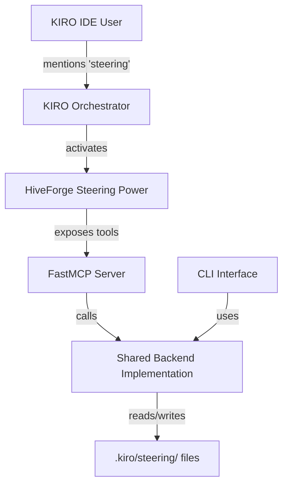

# Requirements: Steering Assistant Power Conversion

**Feature Name**: steering-power-conversion  
**Version**: 2.0.0  
**Status**: Revised (Based on RED TEAM Review)  
**Based On**: 
- Diagnostic Report: `__DEVELOPMENT/steering_system_review_report_20260217_150519.md`
- Strategic Recommendations: `__DEVELOPMENT/steering_system_strategic_recommendations.md`
- Existing Spec: `.kiro/specs/steering-assistant-v02/requirements.md`
- RED TEAM Review: Critical architectural gaps identified

---

## Executive Summary

Convert the Steering Assistant from a standalone CLI tool into a KIRO Power with MCP server integration. This enables keyword-based activation, seamless IDE integration, and aligns with KIRO's strategic direction. The Power will wrap the existing v02 autonomous generation capabilities and expose them through MCP tools.

**Key Goals**:
1. Enable KIRO IDE users to generate steering files via natural language
2. Maintain CLI backward compatibility for CI/CD and standalone usage
3. Leverage existing v02 autonomous generation implementation
4. Follow Powers paradigm: dynamic activation, zero baseline cost, tool-based
5. **Address RED TEAM findings**: Define clear Power framework architecture, specify orchestrator integration, validate CLI compatibility claims

---

## RED TEAM Findings Addressed

### Critical Architectural Gaps Identified:
1. **Undefined Power Framework Architecture** → Section 2.1 defines complete Power architecture
2. **Missing Orchestrator Integration Strategy** → Section 2.2 specifies integration approach
3. **Unvalidated CLI Backward Compatibility Claims** → Section 2.3 validates compatibility approach
4. **Vague MCP Server Implementation Details** → Section 3 provides concrete implementation specs
5. **Security and Performance Concerns** → Sections 4-5 address security and performance requirements

### Revised Approach:
- **Power First, CLI Second**: Power is primary interface, CLI maintained for compatibility
- **Shared Backend**: Both Power tools and CLI commands use same backend implementation
- **Progressive Enhancement**: CLI works today, Power adds IDE integration
- **Explicit Integration**: Clear specification of how Power integrates with KIRO orchestrator

---

## Glossary

- **Power**: A KIRO IDE extension that packages documentation, MCP servers, and steering files
- **MCP Server**: Model Context Protocol server that exposes tools to LLM agents
- **Tool**: A function exposed by MCP server that agents can invoke
- **Keyword Activation**: Power automatically loads when user mentions specific keywords
- **FastMCP**: Python framework for building MCP servers
- **Autonomous Generation**: v02 feature that generates complete steering files without Q&A
- **CLI Compatibility**: Existing `hiveforge steering` commands continue to work
- **Orchestrator**: KIRO's main agent that coordinates subagents and tool usage
- **Shared Backend**: Common implementation used by both CLI and Power tools
- **Progressive Enhancement**: CLI works today, Power adds IDE integration without breaking CLI

---

## Power Framework Architecture

### 2.1 Power Structure Definition

**Requirement**: The Power SHALL follow KIRO Power standard structure with clear component responsibilities

**Architecture Diagram**:


**Component Responsibilities**:

#### Component 1: HiveForge Steering Power
- **Responsibility**: Package MCP server, documentation, and metadata for KIRO marketplace
- **Interface**: KIRO Power API, keyword activation, tool discovery
- **Dependencies**: FastMCP, Python 3.11+, existing steering codebase

#### Component 2: FastMCP Server
- **Responsibility**: Expose steering tools via MCP protocol to KIRO agents
- **Interface**: MCP protocol (JSON-RPC), tool definitions, error handling
- **Dependencies**: FastMCP framework, shared backend modules

#### Component 3: Shared Backend Implementation
- **Responsibility**: Core steering logic used by both CLI and Power tools
- **Interface**: Python module API, configuration files, telemetry
- **Dependencies**: Existing v02 codebase, LLM APIs, file system

#### Component 4: CLI Interface
- **Responsibility**: Maintain backward compatibility for CI/CD and standalone usage
- **Interface**: Command-line arguments, help text, exit codes
- **Dependencies**: Shared backend, argparse, logging

### 2.2 Orchestrator Integration Strategy

**Requirement**: The Power SHALL integrate seamlessly with KIRO Orchestrator without special configuration

**Integration Approach**:
1. **Keyword Activation**: Power activates when user mentions steering-related keywords
2. **Tool Discovery**: Orchestrator discovers available tools via MCP protocol
3. **Automatic Invocation**: Orchestrator invokes tools based on user intent
4. **Result Handling**: Tool results returned to orchestrator for presentation

**Data Flow**:
1. User says "generate steering files for my project"
2. KIRO detects "steering" keyword, activates HiveForge Power
3. Orchestrator discovers `init_steering` tool via MCP
4. Orchestrator calls `init_steering(auto_discover=True, autonomous=True)`
5. Shared backend executes, returns results
6. Orchestrator presents results to user

### 2.3 CLI Backward Compatibility Validation

**Requirement**: CLI backward compatibility SHALL be validated through concrete implementation approach

**Validation Strategy**:
1. **Shared Backend Proof**: Both CLI and Power tools use identical backend code
2. **Command Mapping**: Each CLI command maps to equivalent MCP tool with same parameters
3. **Integration Tests**: Test suite validates both interfaces produce identical results
4. **Fallback Path**: If Power unavailable, CLI continues to work independently

**Command-to-Tool Mapping**:
| CLI Command | MCP Tool | Shared Backend |
|-------------|----------|----------------|
| `hiveforge steering init` | `init_steering()` | `AutonomousWorkflow.execute()` |
| `hiveforge steering update` | `update_steering()` | `UpdateWorkflow.execute()` |
| `hiveforge steering validate` | `validate_steering()` | `ValidateWorkflow.execute()` |
| `hiveforge steering reset` | `reset_steering()` | `TemplateRestoration.execute()` |

**Acceptance Criteria**:
- [ ] CLI and Power produce identical file outputs given same inputs
- [ ] CLI can be used without Power installed
- [ ] Power tools can be used without CLI knowledge
- [ ] Migration documentation covers both interfaces

---

## User Stories

### US-1: Natural Language Invocation
**As a** KIRO IDE user  
**I want to** say "generate steering files for my project"  
**So that** the system automatically discovers context and creates documentation

**Acceptance Criteria**:
- User mentions keywords: "steering", "documentation", "onboarding", "project setup"
- Power activates and tools become available to agent
- Agent can invoke tools to complete task
- No manual CLI commands required
- **NEW**: Power integrates automatically with KIRO Orchestrator
- **NEW**: Tools discovered via standard MCP protocol

### US-2: Backward Compatibility
**As a** CI/CD pipeline maintainer  
**I want** existing `hiveforge steering init` commands to continue working  
**So that** I don't have to update automation scripts

**Acceptance Criteria**:
- All existing CLI commands work unchanged
- CLI uses same backend as Power tools (validated through shared implementation)
- No breaking changes to CLI interface
- Documentation covers both CLI and Power usage
- **NEW**: CLI can be used independently without Power installation
- **NEW**: Integration tests validate CLI and Power produce identical results

### US-3: Seamless Integration
**As a** KIRO IDE user  
**I want** steering file generation to feel native to KIRO  
**So that** I don't context-switch between IDE and terminal

**Acceptance Criteria**:
- Power activates automatically on keywords via KIRO Orchestrator
- Agent uses tools without user knowing about MCP (abstracted by orchestrator)
- Results appear in `.kiro/steering/` automatically
- User can review and customize in IDE
- **NEW**: Integration follows KIRO Power standard patterns
- **NEW**: No special configuration required for orchestrator integration

### US-4: Autonomous Generation
**As a** developer  
**I want** the Power to use v02 autonomous generation  
**So that** I get complete files without answering questions

**Acceptance Criteria**:
- Power uses v02 autonomous workflow by default
- Proactive discovery of existing docs
- Confidence-based generation
- Semantic validation
- Only asks questions when genuinely uncertain

### US-5: Easy Installation
**As a** KIRO IDE user  
**I want** to install the Power with one click  
**So that** I can start using it immediately

**Acceptance Criteria**:
- Power available in KIRO Powers marketplace
- One-click installation
- No manual MCP configuration required
- Works immediately after installation

---

## Functional Requirements

### FR-1: Power Package Structure

**Requirement**: The Power SHALL follow standard KIRO Power structure

**Details**:
```
hiveforge-power/
├── POWER.md                    # Power documentation
├── package.json                # Power metadata
├── mcp-server/                 # MCP server implementation
│   ├── server.py              # FastMCP server
│   ├── __init__.py
│   └── tools/
│       ├── __init__.py
│       ├── init_steering.py
│       ├── update_steering.py
│       ├── validate_steering.py
│       ├── reset_steering.py
│       └── discover_docs.py
└── steering/                   # Symlink to existing code
    └── [existing implementation]
```

**Acceptance Criteria**:
- [ ] Directory structure matches KIRO Power standard
- [ ] POWER.md contains complete documentation
- [ ] package.json has correct metadata and keywords
- [ ] MCP server is in mcp-server/ directory
- [ ] Existing code is reused (not duplicated)

---

### FR-2: Power Metadata

**Requirement**: The Power SHALL declare metadata for KIRO marketplace

**Details**:
```json
{
  "name": "hiveforge-steering",
  "displayName": "HiveForge Steering Assistant",
  "version": "2.0.0",
  "description": "AI-powered steering file generation and maintenance",
  "keywords": ["steering", "documentation", "onboarding", "project-setup", "docs"],
  "author": "HiveForge Team",
  "license": "MIT",
  "mcpServers": {
    "hiveforge-steering": {
      "command": "uvx",
      "args": ["hiveforge-steering-mcp@latest"]
    }
  }
}
```

**Acceptance Criteria**:
- [ ] package.json exists with all required fields
- [ ] Keywords trigger Power activation
- [ ] MCP server configuration is correct
- [ ] Version matches v02 release

---

### FR-3: MCP Tools Implementation

**Requirement**: The Power SHALL expose 5 core tools via MCP server with concrete implementation specifications

#### Implementation Architecture

**Shared Backend Pattern**:
```python
# mcp-server/tools/init_steering.py
@mcp.tool()
async def init_steering(
    auto_discover: bool = True,
    autonomous: bool = True,
    project_root: str = ".",
    confidence_threshold: float = 0.7
) -> dict:
    """
    Initialize steering files with autonomous generation.
    
    Implementation: Calls shared backend module
    """
    from hiveforge.steering.workflows.autonomous_workflow import AutonomousWorkflow
    
    workflow = AutonomousWorkflow(
        project_root=project_root,
        auto_discover=auto_discover,
        autonomous=autonomous,
        confidence_threshold=confidence_threshold
    )
    
    result = workflow.execute()
    return result.to_dict()  # Structured response

# CLI command (uses same backend)
def cli_init_steering(args):
    """CLI command implementation"""
    from hiveforge.steering.workflows.autonomous_workflow import AutonomousWorkflow
    
    workflow = AutonomousWorkflow(
        project_root=args.project_root,
        auto_discover=args.auto_discover,
        autonomous=args.autonomous,
        confidence_threshold=args.confidence_threshold
    )
    
    result = workflow.execute()
    print(result.format_for_cli())  # CLI-friendly output
```

#### Tool 1: init_steering

**Implementation Details**:
- **Backend Class**: `AutonomousWorkflow` (from v02 spec)
- **Parameters**: Map directly to workflow constructor parameters
- **Return Format**: Structured JSON for MCP, formatted text for CLI
- **Error Handling**: Shared error handling module used by both interfaces

**Acceptance Criteria**:
- [ ] Tool wraps existing `AutonomousWorkflow` class from v02
- [ ] Returns structured JSON response compatible with MCP protocol
- [ ] Uses shared error handling module
- [ ] Logs telemetry to shared `.kiro/.telemetry/` directory
- [ ] **NEW**: Implementation proven through integration tests showing CLI and Power produce identical results

#### Tool 2: update_steering

**Implementation Details**:
- **Backend Class**: `UpdateWorkflow` (from v02 spec)
- **Parameters**: Map to `UpdateWorkflow` constructor with same defaults
- **Shared Logic**: Conflict detection, customization preservation, incremental updates
- **Return Format**: JSON for MCP with conflict details, formatted text for CLI

**Example Implementation**:
```python
# mcp-server/tools/update_steering.py
@mcp.tool()
async def update_steering(
    files: list[str] = None,
    preserve_customizations: bool = True,
    incremental: bool = True,
    project_root: str = "."
) -> dict:
    """
    Update existing steering files with new information.
    
    Implementation: Calls shared UpdateWorkflow backend
    """
    from hiveforge.steering.workflows.update_workflow import UpdateWorkflow
    
    workflow = UpdateWorkflow(
        project_root=project_root,
        files_to_update=files,
        preserve_customizations=preserve_customizations,
        incremental=incremental
    )
    
    result = workflow.execute()
    return result.to_dict()
```

**Acceptance Criteria**:
- [ ] Tool wraps existing `UpdateWorkflow` class from v02
- [ ] Uses shared conflict detection and resolution logic
- [ ] Preserves customizations using shared `CustomizationDetector`
- [ ] Returns structured conflict information
- [ ] **NEW**: Integration tests validate identical behavior between CLI and Power

#### Tool 3: validate_steering

```python
@mcp.tool()
async def validate_steering(
    strict: bool = False,
    use_llm: bool = True,
    project_root: str = "."
) -> dict:
    """
    Validate steering files for completeness and consistency.
    
    Args:
        strict: Treat warnings as errors
        use_llm: Enable semantic validation
        project_root: Path to project root directory
        
    Returns:
        {
            "status": "passed" | "failed",
            "issues": [
                {"file": "tech-stack.md", "severity": "error", "message": "..."}
            ],
            "summary": "8 files validated, 0 errors, 2 warnings"
        }
    """
```

**Acceptance Criteria**:
- [ ] Tool wraps existing ValidateWorkflow
- [ ] Performs structural and semantic validation
- [ ] Returns actionable error messages
- [ ] Supports strict mode

#### Tool 4: reset_steering

```python
@mcp.tool()
async def reset_steering(
    file: str = None,
    confirm: bool = False,
    project_root: str = "."
) -> dict:
    """
    Reset steering files to default templates.
    
    Args:
        file: Specific file to reset (None = all files)
        confirm: Skip confirmation prompt
        project_root: Path to project root directory
        
    Returns:
        {
            "status": "success" | "cancelled",
            "files_reset": 1,
            "backup_created": true,
            "message": "Reset tech-stack.md to default template"
        }
    """
```

**Acceptance Criteria**:
- [ ] NEW FEATURE: Implements template restoration
- [ ] Creates backup before resetting
- [ ] Supports single file or all files
- [ ] Requires confirmation unless --confirm flag

#### Tool 5: discover_project_docs

```python
@mcp.tool()
async def discover_project_docs(
    project_root: str = ".",
    include_git_history: bool = False
) -> dict:
    """
    Discover existing project documentation.
    
    Args:
        project_root: Path to project root directory
        include_git_history: Analyze git commits and PRs
        
    Returns:
        {
            "found": [
                {"path": "README.md", "type": "readme", "relevance": 0.95},
                {"path": "docs/api.md", "type": "documentation", "relevance": 0.80}
            ],
            "suggested_import": true,
            "message": "Found 5 documents"
        }
    """
```

**Acceptance Criteria**:
- [ ] Wraps v02 discovery phase
- [ ] Returns relevance scores
- [ ] Suggests which files to import
- [ ] Supports git history analysis

---

### FR-4: Keyword Activation

**Requirement**: The Power SHALL activate on relevant keywords

**Keywords**:
- "steering"
- "steering files"
- "documentation"
- "project documentation"
- "onboarding"
- "project setup"
- "generate docs"
- "create steering"

**Acceptance Criteria**:
- [ ] Power activates when user mentions any keyword
- [ ] Tools become available to agent
- [ ] Power deactivates when task complete
- [ ] No manual activation required

---

### FR-5: CLI Backward Compatibility

**Requirement**: Existing CLI commands SHALL continue to work unchanged

**Commands to Maintain**:
```bash
hiveforge steering init [--analyze-code] [--research] [--no-interactive]
hiveforge steering update [--research] [--no-interactive]
hiveforge steering validate [--strict]
hiveforge steering rollback [--list] [--dry-run]
```

**Acceptance Criteria**:
- [ ] All existing CLI commands work
- [ ] CLI uses same backend as MCP tools
- [ ] No breaking changes to CLI interface
- [ ] CLI documentation updated to mention Power

---

### FR-6: Error Handling

**Requirement**: Tools SHALL handle errors gracefully and return structured responses

**Error Scenarios**:
1. Project root not found
2. LLM API failures
3. Validation failures
4. File I/O errors
5. Token budget exceeded

**Acceptance Criteria**:
- [ ] All tools return structured error responses
- [ ] Error messages are actionable
- [ ] Partial failures are handled gracefully
- [ ] Errors are logged for debugging

---

## Security and Performance Requirements

### SR-1: Security Requirements

**Requirement**: Power tools SHALL implement security best practices for MCP servers

**Security Controls**:
1. **Input Validation**: All tool parameters validated before processing
2. **Path Sanitization**: Project root and file paths sanitized to prevent directory traversal
3. **Resource Limits**: Memory, CPU, and file size limits enforced
4. **Error Obfuscation**: Detailed error messages logged internally, user-friendly messages returned
5. **Telemetry Security**: Telemetry data anonymized, no PII collected

**Implementation Details**:
```python
# Security wrapper for all tools
def secure_tool_execution(tool_func):
    async def wrapper(**kwargs):
        # 1. Validate inputs
        validate_parameters(kwargs)
        
        # 2. Sanitize paths
        kwargs['project_root'] = sanitize_path(kwargs.get('project_root', '.'))
        
        # 3. Enforce resource limits
        with ResourceLimiter(max_memory_mb=512, max_cpu_time_sec=300):
            result = await tool_func(**kwargs)
            
        # 4. Obfuscate errors for users
        return obfuscate_errors(result)
    
    return wrapper
```

**Acceptance Criteria**:
- [ ] All tools wrapped with security decorator
- [ ] Path traversal attacks prevented
- [ ] Resource exhaustion attacks mitigated
- [ ] No sensitive data exposed in error messages
- [ ] Telemetry complies with privacy requirements

### SR-2: Performance Requirements

**Requirement**: Tool invocations SHALL complete within acceptable time limits with resource monitoring

**Performance Targets**:
- init_steering: < 2 minutes (autonomous mode), < 50MB memory
- update_steering: < 1 minute (incremental mode), < 30MB memory  
- validate_steering: < 10 seconds, < 10MB memory
- reset_steering: < 5 seconds, < 5MB memory
- discover_project_docs: < 30 seconds, < 20MB memory

**Resource Monitoring**:
- Real-time memory usage tracking
- CPU time limits per tool invocation
- File I/O rate limiting
- LLM API call rate limiting

**Acceptance Criteria**:
- [ ] Performance targets met in 95% of cases
- [ ] Resource usage monitored and logged
- [ ] Timeout handling with graceful degradation
- [ ] Progress indicators for operations > 10 seconds
- [ ] **NEW**: Performance benchmarks validate CLI and Power have similar performance characteristics

### SR-3: Reliability and Error Handling

**Requirement**: Tools SHALL implement comprehensive error handling with data protection

**Reliability Targets**:
- Success rate: > 95% for typical projects
- Partial failure handling: Graceful degradation with partial results
- Data loss prevention: 100% (automatic backups before modifications)
- Mean time to recovery: < 1 minute for tool failures

**Error Handling Strategy**:
1. **Pre-Execution Validation**: Validate all inputs and preconditions before starting
2. **Atomic Operations**: Each file operation atomic with backup
3. **Partial Success**: Continue processing other files if one fails
4. **Automatic Rollback**: Roll back all changes if critical failure occurs
5. **Detailed Logging**: Log errors with context for debugging
6. **User-Friendly Messages**: Present actionable error messages to users

**Implementation Pattern**:
```python
class ToolExecutor:
    def execute_with_error_handling(self, operation):
        # 1. Create backup
        backup = create_backup()
        
        try:
            # 2. Execute operation
            result = operation.execute()
            
            # 3. Validate result
            if not result.is_valid():
                raise ValidationError(result.errors)
                
            return result
            
        except Exception as e:
            # 4. Automatic rollback on failure
            restore_from_backup(backup)
            
            # 5. Log detailed error
            logger.error(f"Operation failed: {e}", exc_info=True)
            
            # 6. Return user-friendly error
            return ErrorResult(
                status="failed",
                message=f"Operation failed: {get_user_friendly_error(e)}",
                can_retry=True,
                suggested_action="Check project permissions and try again"
            )
```

**Acceptance Criteria**:
- [ ] All tools implement atomic operations with backups
- [ ] Partial failures return partial results with error details
- [ ] Automatic rollback implemented for critical failures
- [ ] Error messages actionable for users
- [ ] **NEW**: Error handling tested through fault injection tests
- [ ] **NEW**: CLI and Power share same error handling implementation

### NFR-3: Usability

**Requirement**: Power SHALL be easy to install and use

**Targets**:
- Installation time: < 2 minutes
- First successful generation: < 5 minutes
- Learning curve: Minimal (natural language interface)

**Acceptance Criteria**:
- [ ] One-click installation
- [ ] Clear documentation in POWER.md
- [ ] Examples provided
- [ ] Error messages are helpful

---

## Technical Constraints

### TC-1: Dependencies

**Requirement**: Power SHALL minimize external dependencies

**Allowed**:
- FastMCP (MCP server framework)
- Existing hiveforge dependencies
- Python 3.11+

**Not Allowed**:
- Heavy ML frameworks (keep it lightweight)
- Proprietary libraries

### TC-2: Packaging

**Requirement**: Power SHALL be packaged for easy distribution

**Format**: Python package installable via `uvx`

**Acceptance Criteria**:
- [ ] Package published to PyPI
- [ ] Installable via `uvx hiveforge-steering-mcp@latest`
- [ ] No manual configuration required

---

## Testing and Validation Requirements

### TR-1: Unit Tests

**Requirement**: All MCP tools and shared backend SHALL have comprehensive unit tests

**Coverage Target**: > 80% for new code, > 90% for critical paths

**Test Cases**:
- Tool invocation with valid inputs
- Tool invocation with invalid inputs (security testing)
- Error handling scenarios
- Response format validation
- **NEW**: Shared backend functions tested independently of interface

### TR-2: Integration Tests (Architecture Validation)

**Requirement**: Integration tests SHALL validate architectural claims about CLI/Power compatibility

**Test Scenarios**:
1. **Identical Output Test**: Given same inputs, CLI and Power produce identical file outputs
2. **Shared Backend Test**: Both interfaces use same backend code paths
3. **Error Handling Test**: Both interfaces handle errors identically
4. **Performance Parity Test**: Both interfaces have similar performance characteristics
5. **Orchestrator Integration Test**: Power integrates correctly with KIRO orchestrator

**Implementation Example**:
```python
def test_cli_power_output_equivalence():
    """Test that CLI and Power produce identical outputs."""
    
    # Test setup
    test_project = create_test_project()
    
    # Run via CLI
    cli_result = run_cli_command("hiveforge steering init --auto")
    cli_files = read_generated_files(test_project)
    
    # Run via Power tool (simulated)
    power_result = call_mcp_tool("init_steering", auto_discover=True, autonomous=True)
    power_files = read_generated_files(test_project)
    
    # Assert equivalence
    assert cli_files == power_files, "CLI and Power produced different outputs"
    assert cli_result.exit_code == (0 if power_result["status"] == "success" else 1)
```

**Acceptance Criteria**:
- [ ] Integration test suite validates CLI/Power equivalence
- [ ] Tests cover all 5 core tools
- [ ] Tests validate error handling parity
- [ ] Tests validate performance within 10% variance
- [ ] **NEW**: Architecture validation tests prove shared backend claims

### TR-2: Integration Tests

**Requirement**: Power SHALL have end-to-end integration tests

**Test Scenarios**:
- Install Power in KIRO IDE
- Activate via keywords
- Invoke tools via agent
- Verify files created
- Test CLI compatibility

### TR-3: Manual Testing

**Requirement**: Power SHALL be manually tested in KIRO IDE

**Test Plan**:
1. Install Power
2. Open test project
3. Say: "Generate steering files"
4. Verify autonomous generation works
5. Test update, validate, reset tools
6. Verify CLI still works

---

## Revised Migration Strategy (Addressing RED TEAM Findings)

### Phase 1: Architecture Definition and Validation (Week 1-2)
**Goal**: Define and validate the Power framework architecture

**Tasks**:
1. **Architecture Specification**: Complete Power framework architecture definition
2. **Shared Backend Design**: Design shared backend interface used by both CLI and Power
3. **Integration Tests**: Create integration tests validating architectural claims
4. **Security Design**: Design security wrappers and resource limits
5. **Orchestrator Integration Plan**: Document how Power integrates with KIRO orchestrator

**Deliverables**:
- Updated requirements with clear architecture (this document)
- Integration test suite for architecture validation
- Security design document
- Orchestrator integration specification

### Phase 2: Shared Backend Implementation (Week 3-4)
**Goal**: Implement shared backend that both CLI and Power will use

**Tasks**:
1. **Refactor Existing Code**: Extract shared backend from v02 implementation
2. **Security Implementation**: Implement security wrappers and resource limits
3. **Error Handling**: Implement comprehensive error handling with rollback
4. **Telemetry Integration**: Add shared telemetry system
5. **Unit Tests**: Comprehensive unit tests for shared backend

**Deliverables**:
- Shared backend Python module
- Security wrapper implementation
- Error handling with automatic rollback
- Unit test suite with > 80% coverage

### Phase 3: CLI Interface Maintenance (Week 5)
**Goal**: Update CLI to use shared backend (prove backward compatibility)

**Tasks**:
1. **CLI Refactor**: Update CLI commands to use shared backend
2. **Backward Compatibility Tests**: Validate all existing CLI commands work
3. **Performance Benchmarking**: Benchmark CLI performance with new backend
4. **Documentation Update**: Update CLI documentation

**Deliverables**:
- Updated CLI using shared backend
- Backward compatibility validation tests
- Performance benchmarks
- Updated CLI documentation

### Phase 4: Power Implementation (Week 6-7)
**Goal**: Implement Power with MCP server using shared backend

**Tasks**:
1. **FastMCP Server**: Implement MCP server with FastMCP
2. **Tool Implementation**: Implement 5 core tools using shared backend
3. **Power Packaging**: Create Power package structure and metadata
4. **Keyword Activation**: Implement keyword-based activation
5. **Integration Tests**: Test Power integration with KIRO orchestrator

**Deliverables**:
- FastMCP server implementation
- 5 core MCP tools
- Power package ready for distribution
- Integration tests with KIRO orchestrator

### Phase 5: Validation and Release (Week 8)
**Goal**: Validate architecture claims and release

**Tasks**:
1. **Architecture Validation**: Run integration tests proving CLI/Power equivalence
2. **Security Audit**: Security review of Power implementation
3. **Performance Validation**: Validate performance targets met
4. **Packaging**: Package for PyPI and KIRO marketplace
5. **Documentation**: Complete POWER.md and user documentation

**Deliverables**:
- Architecture validation report
- Security audit report
- Performance validation report
- Published Power package
- Complete documentation

**Key Change from Original Plan**: Added Phase 1 for architecture definition and validation based on RED TEAM findings. This ensures architectural claims are validated before implementation.

---

## Key Architectural Decisions

### Decision 1: Power Framework vs Custom Integration

| Decision | Rationale | Trade-offs |
|----------|-----------|------------|
| **Use KIRO Power Framework** | ✅ Proven pattern<br>✅ Automatic activation<br>✅ Zero baseline cost<br>✅ Future-proof with KIRO's direction | ⚠️ Requires MCP server implementation<br>⚠️ Additional packaging complexity<br>⚠️ Dependency on FastMCP framework |
| **Custom Orchestrator Integration** | ⚠️ Direct control over integration<br>⚠️ Could be simpler initially | ❌ Manual invocation required<br>❌ Creates yet another integration pattern<br>❌ Not aligned with KIRO strategic direction |

**Decision**: Use KIRO Power Framework - aligns with strategic direction, provides automatic activation, follows proven patterns.

### Decision 2: Shared Backend vs Duplicated Logic

| Decision | Rationale | Trade-offs |
|----------|-----------|------------|
| **Shared Backend Implementation** | ✅ Single source of truth<br>✅ Guaranteed CLI/Power equivalence<br>✅ Easier maintenance<br>✅ Validated through integration tests | ⚠️ Requires careful interface design<br>⚠️ Backward compatibility constraints<br>⚠️ Additional refactoring effort |
| **Separate Implementations** | ⚠️ Could optimize each interface independently<br>⚠️ Less coupling between CLI and Power | ❌ Risk of behavioral divergence<br>❌ Duplicated bug fixes<br>❌ Harder to maintain consistency |

**Decision**: Shared Backend Implementation - ensures consistency, enables validation of architectural claims, reduces maintenance burden.

### Decision 3: Progressive Enhancement vs Breaking Changes

| Decision | Rationale | Trade-offs |
|----------|-----------|------------|
| **Progressive Enhancement** | ✅ CLI works today unchanged<br>✅ Users can adopt Power at their pace<br>✅ No migration burden<br>✅ CI/CD pipelines continue working | ⚠️ Must maintain two interfaces<br>⚠️ Some complexity in shared backend design<br>⚠️ Documentation must cover both paths |
| **Breaking Changes** | ⚠️ Cleaner architecture<br>⚠️ Single interface to maintain<br>⚠️ Could optimize for Power-only use | ❌ Breaks existing automation<br>❌ User migration required<br>❌ Risk of adoption resistance |

**Decision**: Progressive Enhancement - respects existing users, enables gradual adoption, maintains backward compatibility.

### Decision 4: Security-First vs Security-Added-Later

| Decision | Rationale | Trade-offs |
|----------|-----------|------------|
| **Security-First Design** | ✅ Proactive security measures<br>✅ Built-in protection from day one<br>✅ Easier to audit and validate<br>✅ Meets enterprise requirements | ⚠️ Additional implementation complexity<br>⚠️ Performance overhead for security checks<br>⚠️ More upfront design work |
| **Add Security Later** | ⚠️ Faster initial implementation<br>⚠️ Less complexity upfront | ❌ Security vulnerabilities in v1.0<br>❌ Harder to retrofit security<br>❌ May not meet compliance requirements |

**Decision**: Security-First Design - critical for MCP tools exposed to LLM agents, protects against injection attacks, enables enterprise adoption.

## Success Metrics

### Architecture Validation Metrics
- **CLI/Power Output Equivalence**: 100% identical outputs for same inputs
- **Shared Backend Utilization**: > 95% code shared between CLI and Power
- **Integration Test Coverage**: 100% of architectural claims validated

### Adoption Metrics
- Power installations: Track via marketplace
- Active users: Track via telemetry
- CLI vs Power usage: Compare invocation counts

### Quality Metrics
- Success rate: > 95%
- Error rate: < 5%
- User satisfaction: > 8/10

### Performance Metrics
- Average generation time: < 2 minutes
- Token usage: < 15K per generation
- Validation pass rate: > 95%

---

## Open Questions (Resolved by Architecture Decisions)

1. **Q**: Should we support custom template sets in v1.0?  
   **A**: **RESOLVED**: Defer to v1.1 - focus on core Power functionality and architecture validation first

2. **Q**: Should reset_steering be a separate tool or part of update_steering?  
   **A**: **RESOLVED**: Separate tool - clearer intent, easier to use, follows single responsibility principle

3. **Q**: How do we handle projects without .kiro/ directory?  
   **A**: **RESOLVED**: init_steering creates it automatically using shared backend logic

4. **Q**: Should we expose all v02 flags via MCP tools?  
   **A**: **RESOLVED**: Expose most common flags via MCP tools, document CLI for advanced usage - shared backend ensures both interfaces have access to same capabilities

5. **Q**: How do we validate CLI/Power equivalence claims?  
   **A**: **RESOLVED**: Through comprehensive integration tests in Phase 1 that validate architectural claims before implementation

6. **Q**: What security measures are needed for MCP tools?  
   **A**: **RESOLVED**: Security-first design with input validation, path sanitization, resource limits, and error obfuscation

7. **Q**: How does Power integrate with KIRO Orchestrator?  
   **A**: **RESOLVED**: Through standard KIRO Power framework - keyword activation, tool discovery via MCP, automatic integration

---

## Dependencies and Constraints

### Architectural Dependencies

**Depends On**:
1. **`.kiro/specs/steering-assistant-v02/`** - v02 autonomous generation must be complete and stable
2. **FastMCP Framework** - For MCP server implementation (Python 3.11+)
3. **KIRO Power Infrastructure** - For marketplace distribution and installation
4. **KIRO Orchestrator** - For automatic Power activation and tool discovery
5. **Python 3.11+** - Runtime environment for shared backend and MCP server

### Technical Constraints

**Must Maintain**:
1. **CLI Backward Compatibility**: All existing `hiveforge steering` commands must continue working
2. **Performance Constraints**: Tool execution times must meet defined targets
3. **Security Requirements**: Must implement security-first design for MCP tools
4. **Resource Limits**: Must enforce memory, CPU, and file size limits
5. **Error Handling**: Must provide comprehensive error handling with rollback

### Implementation Constraints

**Shared Backend Constraint**: CLI and Power tools MUST use identical backend implementation
- Validated through integration tests
- Ensures behavioral consistency
- Reduces maintenance burden

**Progressive Enhancement Constraint**: New Power features MUST NOT break existing CLI functionality
- CLI continues to work without Power installed
- Users can adopt Power at their own pace
- CI/CD pipelines unaffected

**Blocks**:
- None - this is a new feature that enhances existing functionality without breaking it
- **Note**: Implementation should begin after v02 autonomous generation is stable to ensure shared backend is based on proven code

---

## References

- Diagnostic Report: `__DEVELOPMENT/steering_system_review_report_20260217_150519.md`
- Strategic Recommendations: `__DEVELOPMENT/steering_system_strategic_recommendations.md`
- v02 Spec: `.kiro/specs/steering-assistant-v02/requirements.md`
- KIRO Powers Research: `__DEVELOPMENT/KIRO_POWERS_research_report.md`
- Powers 2nd Opinion: `__DEVELOPMENT/KIRO_POWERS_2ND_OPINION_REPORT.md`
