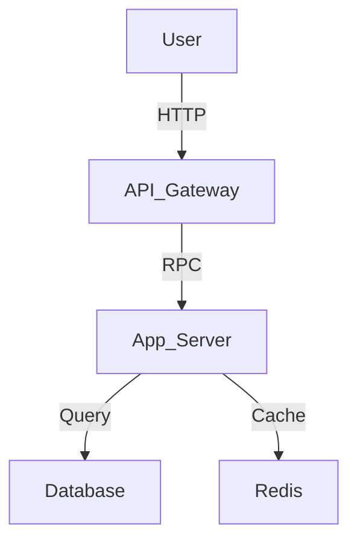

---
inclusion: always
priority: 1
description: "System design, component responsibilities, data flow."---

# Architecture Overview

## System Diagram


## Component Responsibilities

### Architecture Pattern: monolithic
Components:   Development,   Manual Test,  Development, .Github, .Hypothesis, .Kiro, Docs, Hiveforge Power, Src

- **Workflow result structure**: Enhanced with confidence metadata and discovery statistics
- **Documentation**: Updated all workflows to show correct HiveForge Power usage from KIRO IDE
- **Performance targets**: Relaxed to realistic values while maintaining good performance

### Fixed
- **Documentation accuracy**: Corrected workflow instructions to u
- **Responsibility:** Architecture Pattern: monolithic
Components:   Development,   Manual Test,  Development, .Github, .Hypothesis, .Kiro, Docs, Hiveforge Power, Src

- **Workflow result structure**: Enhanced with confidence metadata and discovery statistics
- **Documentation**: Updated all workflows to show correct HiveForge Power usage from KIRO IDE
- **Performance targets**: Relaxed to realistic values while maintaining good performance

### Fixed
- **Documentation accuracy**: Corrected workflow instructions to u
- **Interface:** Architecture Pattern: monolithic
Components:   Development,   Manual Test,  Development, .Github, .Hypothesis, .Kiro, Docs, Hiveforge Power, Src

- **Workflow result structure**: Enhanced with confidence metadata and discovery statistics
- **Documentation**: Updated all workflows to show correct HiveForge Power usage from KIRO IDE
- **Performance targets**: Relaxed to realistic values while maintaining good performance

### Fixed
- **Documentation accuracy**: Corrected workflow instructions to u
- **Dependencies:** Architecture Pattern: monolithic
Components:   Development,   Manual Test,  Development, .Github, .Hypothesis, .Kiro, Docs, Hiveforge Power, Src

- **Workflow result structure**: Enhanced with confidence metadata and discovery statistics
- **Documentation**: Updated all workflows to show correct HiveForge Power usage from KIRO IDE
- **Performance targets**: Relaxed to realistic values while maintaining good performance

### Fixed
- **Documentation accuracy**: Corrected workflow instructions to u

### Architecture Pattern: monolithic
Components:   Development,   Manual Test,  Development, .Github, .Hypothesis, .Kiro, Docs, Hiveforge Power, Src

- **Workflow result structure**: Enhanced with confidence metadata and discovery statistics
- **Documentation**: Updated all workflows to show correct HiveForge Power usage from KIRO IDE
- **Performance targets**: Relaxed to realistic values while maintaining good performance

### Fixed
- **Documentation accuracy**: Corrected workflow instructions to u
- **Responsibility:** Architecture Pattern: monolithic
Components:   Development,   Manual Test,  Development, .Github, .Hypothesis, .Kiro, Docs, Hiveforge Power, Src

- **Workflow result structure**: Enhanced with confidence metadata and discovery statistics
- **Documentation**: Updated all workflows to show correct HiveForge Power usage from KIRO IDE
- **Performance targets**: Relaxed to realistic values while maintaining good performance

### Fixed
- **Documentation accuracy**: Corrected workflow instructions to u
- **Interface:** Architecture Pattern: monolithic
Components:   Development,   Manual Test,  Development, .Github, .Hypothesis, .Kiro, Docs, Hiveforge Power, Src

- **Workflow result structure**: Enhanced with confidence metadata and discovery statistics
- **Documentation**: Updated all workflows to show correct HiveForge Power usage from KIRO IDE
- **Performance targets**: Relaxed to realistic values while maintaining good performance

### Fixed
- **Documentation accuracy**: Corrected workflow instructions to u
- **Dependencies:** Architecture Pattern: monolithic
Components:   Development,   Manual Test,  Development, .Github, .Hypothesis, .Kiro, Docs, Hiveforge Power, Src

- **Workflow result structure**: Enhanced with confidence metadata and discovery statistics
- **Documentation**: Updated all workflows to show correct HiveForge Power usage from KIRO IDE
- **Performance targets**: Relaxed to realistic values while maintaining good performance

### Fixed
- **Documentation accuracy**: Corrected workflow instructions to u

## Data Flow
1. #### Update Workflow Data Flow

```
Existing Files + New Artifacts
         │
         ▼
   Document Parsers
         │
         ▼
   Knowledge Base
         │
         ▼
   Customization Detector
         │
         ▼
   Gap Analysis Engine
         │
         ▼
   Steering Assistant
         │
         ▼
   Conflict Resolver
         │
         ▼
   Diff Generator
         │
         ▼
   User Approval
         │
         ▼
   Apply Changes
         │
         ▼
   Steering Validator
```

2. #### Update Workflow Data Flow

```
Existing Files + New Artifacts
         │
         ▼
   Document Parsers
         │
         ▼
   Knowledge Base
         │
         ▼
   Customization Detector
         │
         ▼
   Gap Analysis Engine
         │
         ▼
   Steering Assistant
         │
         ▼
   Conflict Resolver
         │
         ▼
   Diff Generator
         │
         ▼
   User Approval
         │
         ▼
   Apply Changes
         │
         ▼
   Steering Validator
```

3. #### Update Workflow Data Flow

```
Existing Files + New Artifacts
         │
         ▼
   Document Parsers
         │
         ▼
   Knowledge Base
         │
         ▼
   Customization Detector
         │
         ▼
   Gap Analysis Engine
         │
         ▼
   Steering Assistant
         │
         ▼
   Conflict Resolver
         │
         ▼
   Diff Generator
         │
         ▼
   User Approval
         │
         ▼
   Apply Changes
         │
         ▼
   Steering Validator
```


## Key Decisions

| Decision | Rationale | Trade-offs |
|----------|-----------|------------|
| {Decision} | {Why} | {What we gave up} |

## Scalability Considerations
- {How we handle growth}
- {Bottlenecks to watch}