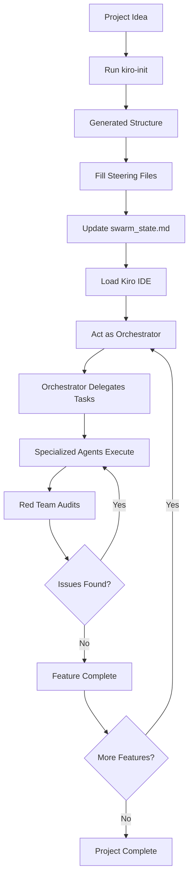
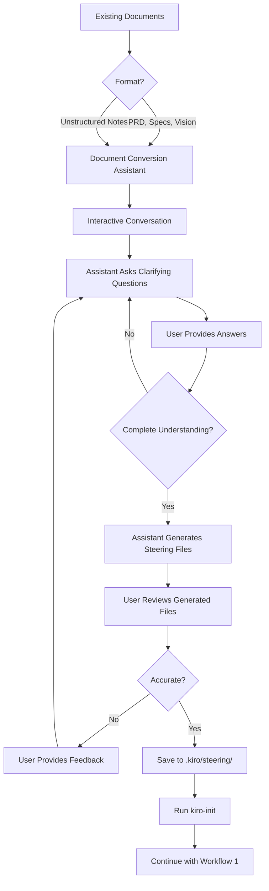
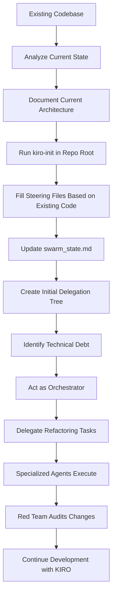
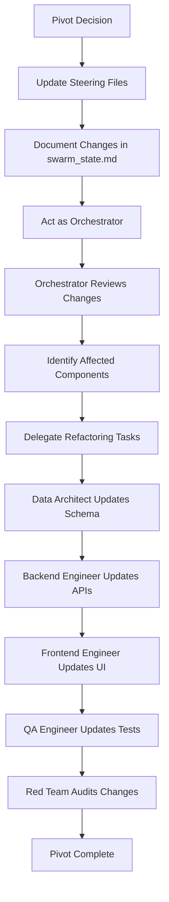

# 🔄 KIRO Methodology Workflow Guide

This guide explains **how to use kiro-init and KIRO Methodology v05** in real-world scenarios, from initial project setup to ongoing development.

---

## Table of Contents

1. [Overview](#overview)
2. [Workflow 1: Starting a New Project](#workflow-1-starting-a-new-project)
3. [Workflow 2: Converting Existing Documents](#workflow-2-converting-existing-documents)
4. [Workflow 3: Integrating with Existing Codebase](#workflow-3-integrating-with-existing-codebase)
5. [Workflow 4: Pivoting/Updating Project](#workflow-4-pivotingupdating-project)
6. [Best Practices](#best-practices)

---

## Overview

KIRO Methodology v05 uses a **multi-agent architecture** where specialized AI agents collaborate on your project. The workflow ensures:

- **Clear separation of concerns** - Each agent has specific responsibilities
- **Consistent standards** - Steering files define project-wide conventions
- **Traceable decisions** - Swarm state tracks all delegation and decisions
- **Safe boundaries** - toolsSettings prevent agents from overstepping

---

## Workflow 1: Starting a New Project

**Scenario:** You have a project idea and want to start fresh with KIRO methodology.

### Process Flow



### Step-by-Step

#### 1. Initialize Project

```bash
mkdir my-awesome-app
cd my-awesome-app
kiro-init -n my-awesome-app
```

**Result:**
```
my-awesome-app/
├── .kiro/
│   ├── agents/          # 7 agent definitions
│   └── steering/        # 8 steering files (TEMPLATES)
├── .swarm/
│   ├── plan/
│   └── audit_logs/
└── swarm_state.md       # Central state document
```

#### 2. Fill Steering Files

Edit each steering file with your project specifics:

**`.kiro/steering/project-vision.md`**
```markdown
# Project Vision

## Problem Statement
Users struggle to manage tasks across multiple tools...

## Solution
AI-powered task management that learns from workflow patterns...

## Target Users
- Busy professionals
- Small teams (5-20 people)
```

**`.kiro/steering/tech-stack.md`**
```markdown
# Tech Stack

## Backend
- Framework: FastAPI
- Database: PostgreSQL 15
- ORM: SQLAlchemy 2.0

## Frontend
- Framework: React 18 + TypeScript
- Styling: TailwindCSS
```

**Repeat for all 8 steering files:**
- `project-vision.md` - Goals, users, value proposition
- `tech-stack.md` - Technologies, frameworks, libraries
- `conventions.md` - Naming, formatting, commit messages
- `architecture.md` - System design, components, data flow
- `db-standards.md` - Schema design, migrations, queries
- `api-standards.md` - Endpoint design, error handling, auth
- `ui-standards.md` - Component structure, styling, accessibility
- `qa-standards.md` - Testing strategy, coverage requirements

#### 3. Update Swarm State

Edit `swarm_state.md` with project context:

```markdown
## 1. Project Identity & Context

**Project Name:** my-awesome-app
**Brief Description:** AI-powered task management for busy professionals
**Target Users:** Professionals, small teams, remote workers
**Core Value Proposition:** Learn from workflow patterns to suggest optimal task prioritization
```

#### 4. Start Development

Load Kiro IDE and act as **Orchestrator**:

```
I need to build the user authentication system. Please plan and delegate.
```

**Orchestrator Response:**
```
I'll delegate this to:
1. Data Architect - Design user/session tables
2. Backend Engineer - Implement JWT auth endpoints
3. QA Engineer - Write integration tests
4. Red Team - Review security

Creating delegation tree in swarm_state.md...
```

---

## Workflow 2: Converting Existing Documents

**Scenario:** You have existing PRD, specs, or vision documents and want to use KIRO methodology.

### Process Flow



### Recommended Approach

#### Option A: Manual Conversion (Simple)

1. **Run kiro-init** to generate template structure
2. **Copy-paste** relevant sections from your documents into steering files
3. **Refine** to match template structure

**Example:**

Your PRD says:
```
The app will have user authentication with email/password.
Users can create, edit, and delete tasks.
Tasks have priority levels: High, Medium, Low.
```

Convert to `.kiro/steering/architecture.md`:
```markdown
# Architecture

## Core Components

### Authentication Service
- Email/password authentication
- JWT token generation
- Session management

### Task Management Service
- CRUD operations for tasks
- Priority levels: High, Medium, Low
- User-task associations
```

#### Option B: AI-Assisted Conversion (Recommended)

**Use an AI assistant (outside KIRO) to convert documents:**

**Prompt Template:**
```
I have the following project documents:
[paste your PRD, specs, vision]

Please convert these into KIRO Methodology v05 steering files.
The steering files are:
1. project-vision.md - Problem, solution, users, value proposition
2. tech-stack.md - Technologies, frameworks, libraries
3. conventions.md - Naming, formatting, commit messages
4. architecture.md - System design, components, data flow
5. db-standards.md - Schema design, migrations, queries
6. api-standards.md - Endpoint design, error handling, auth
7. ui-standards.md - Component structure, styling, accessibility
8. qa-standards.md - Testing strategy, coverage requirements

For each file, extract relevant information from my documents and format it according to the steering file's purpose. Ask clarifying questions if anything is unclear or missing.
```

**Interactive Process:**
1. Assistant asks: "What database are you planning to use?"
2. You answer: "PostgreSQL 15"
3. Assistant asks: "What's your testing strategy?"
4. You answer: "Unit tests with pytest, 80% coverage minimum"
5. Assistant generates all 8 steering files
6. You review and refine

#### Option C: KIRO-Internal Assistant (Future Enhancement)

**Planned for v2.0:** A dedicated agent that:
- Reads your existing documents
- Asks clarifying questions
- Generates steering files automatically
- Validates consistency across files

---

## Workflow 3: Integrating with Existing Codebase

**Scenario:** You have an existing repository with code and want to adopt KIRO methodology.

### Process Flow



### Step-by-Step

#### 1. Analyze Existing Codebase

**Document what you have:**
```bash
# Clone your existing repo
git clone https://github.com/youruser/existing-project.git
cd existing-project

# Analyze structure
tree -L 2
```

**Example existing structure:**
```
existing-project/
├── src/
│   ├── api/
│   ├── models/
│   └── utils/
├── tests/
├── requirements.txt
└── README.md
```

#### 2. Initialize KIRO

```bash
# Run kiro-init in your existing repo
kiro-init -n existing-project
```

**Result:**
```
existing-project/
├── src/                 # Your existing code (unchanged)
├── tests/               # Your existing tests (unchanged)
├── .kiro/               # NEW: KIRO structure
│   ├── agents/
│   └── steering/
├── .swarm/              # NEW: Planning & logs
└── swarm_state.md       # NEW: State tracking
```

#### 3. Reverse-Engineer Steering Files

**Fill steering files based on existing code:**

**`.kiro/steering/tech-stack.md`** (analyze from `requirements.txt`):
```markdown
# Tech Stack

## Current Stack (Existing)
- Backend: Flask 2.3
- Database: SQLite (development), PostgreSQL (production)
- ORM: SQLAlchemy 1.4

## Planned Upgrades
- Migrate to FastAPI
- Upgrade SQLAlchemy to 2.0
```

**`.kiro/steering/architecture.md`** (analyze from `src/` structure):
```markdown
# Architecture

## Current Components
- API Layer: Flask blueprints in `src/api/`
- Data Layer: SQLAlchemy models in `src/models/`
- Utilities: Helper functions in `src/utils/`

## Technical Debt
- No API versioning
- Missing input validation
- Inconsistent error handling
```

#### 4. Create Initial Delegation Tree

**In `swarm_state.md`, document current state:**

```markdown
## 3. Delegation Tree

### Current State Analysis (Orchestrator → All Agents)
**Status:** Complete
**Findings:**
- Codebase: ~5,000 lines Python
- Test coverage: 45% (needs improvement)
- Technical debt: API versioning, input validation
- Architecture: Monolithic Flask app

### Next Steps (Orchestrator)
**Planned:**
1. Data Architect: Design migration to PostgreSQL
2. Backend Engineer: Add API versioning
3. QA Engineer: Increase test coverage to 80%
4. Red Team: Security audit of auth endpoints
```

#### 5. Start Iterative Improvements

**Act as Orchestrator:**
```
We have an existing Flask app with 45% test coverage. Let's increase coverage to 80% and add API versioning. Please plan and delegate.
```

**Orchestrator delegates:**
- QA Engineer: Write missing tests
- Backend Engineer: Implement API versioning
- Red Team: Audit changes

---

## Workflow 4: Pivoting/Updating Project

**Scenario:** You need to change direction (pivot) or update project requirements.

### Process Flow



### Step-by-Step

#### 1. Update Steering Files

**Example Pivot:** Changing from email/password auth to OAuth

**Update `.kiro/steering/tech-stack.md`:**
```diff
## Authentication
- - Email/password with JWT
+ - OAuth 2.0 (Google, GitHub)
+ - Library: Authlib
```

**Update `.kiro/steering/architecture.md`:**
```diff
## Authentication Service
- - JWT token generation
- - Password hashing with bcrypt
+ - OAuth provider integration
+ - Token refresh mechanism
```

#### 2. Document in Swarm State

**In `swarm_state.md`:**
```markdown
## 2. Project Evolution Log

### 2026-02-14: Pivot to OAuth Authentication
**Reason:** User feedback - prefer social login over email/password
**Impact:**
- Remove: User password storage, JWT generation
- Add: OAuth provider integration, token refresh
- Affected: Backend auth endpoints, frontend login UI, database schema

**Steering Files Updated:**
- tech-stack.md: Added Authlib
- architecture.md: Updated auth flow
- db-standards.md: Removed password fields
- api-standards.md: Updated auth endpoints
```

#### 3. Delegate Refactoring

**Act as Orchestrator:**
```
We're pivoting from email/password to OAuth. I've updated the steering files. Please review and delegate the necessary refactoring.
```

**Orchestrator Response:**
```
Pivot acknowledged. Delegating:

1. Data Architect: Remove password fields, add OAuth token storage
2. Backend Engineer: Implement OAuth flow, update auth endpoints
3. Frontend Engineer: Replace login form with OAuth buttons
4. QA Engineer: Update auth tests, add OAuth integration tests
5. Red Team: Security review of OAuth implementation

Creating delegation tree...
```

#### 4. Preserve History

**Commit steering file changes:**
```bash
git add .kiro/steering/
git commit -m "docs: pivot to OAuth authentication

- Updated tech-stack.md with Authlib
- Updated architecture.md with OAuth flow
- Updated db-standards.md to remove password storage
- Updated api-standards.md with new auth endpoints"
```

---

## Best Practices

### 1. Keep Steering Files Updated

✅ **Do:**
- Update steering files **before** making code changes
- Commit steering file changes separately
- Use version control for steering files

❌ **Don't:**
- Let steering files become outdated
- Make code changes without updating docs
- Skip documenting pivots

### 2. Use Swarm State as Single Source of Truth

✅ **Do:**
- Document all major decisions in swarm_state.md
- Update delegation tree as work progresses
- Track technical debt and blockers

❌ **Don't:**
- Keep decisions in separate documents
- Forget to update swarm state
- Let delegation tree become stale

### 3. Respect Agent Boundaries

✅ **Do:**
- Always start with Orchestrator for planning
- Let specialized agents handle their domains
- Use Red Team for continuous audits

❌ **Don't:**
- Skip Orchestrator and jump to implementation
- Let Orchestrator write code (violates toolsSettings)
- Ignore Red Team feedback

### 4. Iterate and Refine

✅ **Do:**
- Start with minimal steering files, refine over time
- Use Red Team feedback to improve standards
- Update conventions based on learnings

❌ **Don't:**
- Try to perfect steering files upfront
- Ignore lessons learned
- Resist changing conventions

---

## Common Questions

### Q: Do I need to fill all 8 steering files before starting?

**A:** No! Start with the essentials:
1. `project-vision.md` - Know what you're building
2. `tech-stack.md` - Know your technologies
3. `conventions.md` - Basic code style

Fill others as needed during development.

### Q: Can I add custom steering files?

**A:** Yes! Add files like:
- `security-standards.md`
- `deployment-standards.md`
- `monitoring-standards.md`

Just ensure all agents reference them.

### Q: What if my project doesn't fit the templates?

**A:** Adapt the templates! They're guidelines, not strict rules. Modify to fit your project's needs.

### Q: How do I handle multiple projects?

**A:** Each project gets its own `.kiro/` directory. You can reuse steering file patterns across projects.

---

## Summary

**KIRO Methodology Workflow:**

1. **New Project:** `kiro-init` → Fill steering files → Develop with agents
2. **Existing Docs:** Convert to steering files → `kiro-init` → Develop
3. **Existing Code:** `kiro-init` → Reverse-engineer steering files → Improve iteratively
4. **Pivot:** Update steering files → Document in swarm state → Delegate refactoring

**Key Principles:**
- Steering files = Project standards
- Swarm state = Decision history
- Orchestrator = Planning & delegation
- Specialized agents = Implementation
- Red Team = Quality assurance

---

<div align="center">

**Ready to start?** Check out the [Quick Start Guide](./QUICKSTART.md)

**Need help?** See [Troubleshooting](./docs/troubleshooting.md) or [open an issue](https://github.com/asoshnin/HiveForge/issues)

</div>
