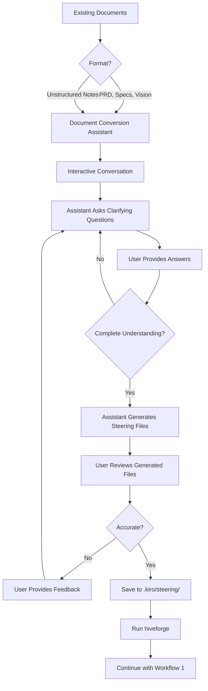
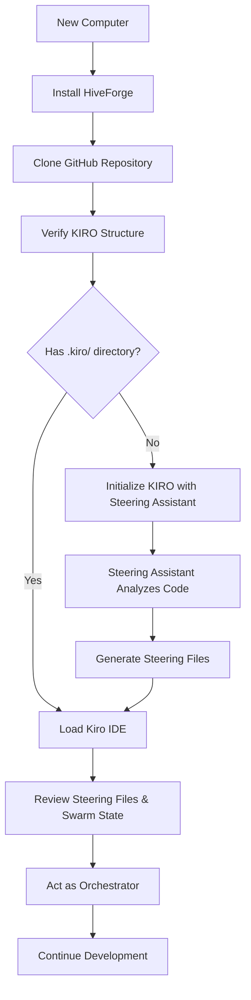
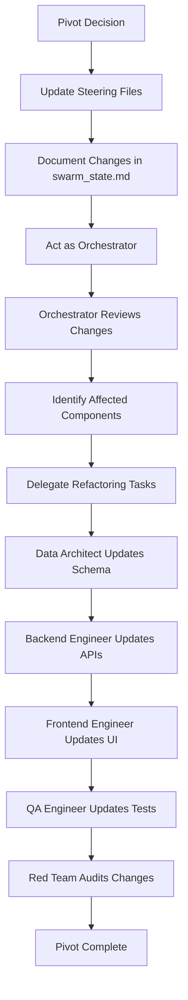

# 🔄 KIRO Methodology Workflow Guide

This guide explains **how to use hiveforge and KIRO Methodology v05** in real-world scenarios, from initial project setup to ongoing development.

---

## Table of Contents

1. [Overview](#overview)
2. [v2.1.0 Shared Backend Architecture](#v21-shared-backend-architecture)
3. [Workflow 1: Starting a New Project](#workflow-1-starting-a-new-project)
4. [Workflow 2: Converting Existing Documents](#workflow-2-converting-existing-documents)
5. [Workflow 3: Integrating with Existing Codebase](#workflow-3-integrating-with-existing-codebase)
6. [Workflow 4: Pivoting/Updating Project](#workflow-4-pivotingupdating-project)
7. [Best Practices](#best-practices)

---

## Overview

KIRO Methodology v05 uses a **multi-agent architecture** where specialized AI agents collaborate on your project. The workflow ensures:

- **Clear separation of concerns** - Each agent has specific responsibilities
- **Consistent standards** - Steering files define project-wide conventions
- **Traceable decisions** - Swarm state tracks all delegation and decisions
- **Safe boundaries** - toolsSettings prevent agents from overstepping

---

## v2.1.0 Shared Backend Architecture

The v2.1.0 release introduced a **Shared Backend Architecture** that unifies CLI and Power (MCP) implementations.

### Architecture Diagram

```
┌─────────────────────────────────────────────────────────────────┐
│                      KIRO Orchestrator                           │
├─────────────────────────────────────────────────────────────────┤
│                                                                  │
│  ┌──────────────┐                          ┌─────────────────┐ │
│  │    CLI       │                          │   Power (MCP)   │ │
│  │  Interface   │                          │   Interface     │ │
│  └──────┬───────┘                          └────────┬────────┘ │
│         │                                            │          │
│         └──────────────────┬─────────────────────────┘          │
│                            │                                      │
│                            ▼                                      │
│              ┌─────────────────────────────┐                     │
│              │   Shared Backend Adapters   │                     │
│              │   (src/hiveforge/steering/  │                     │
│              │    shared/)                 │                     │
│              └──────────────┬──────────────┘                     │
│                             │                                     │
│         ┌───────────────────┼───────────────────┐                │
│         │                   │                   │                │
│         ▼                   ▼                   ▼                │
│  ┌─────────────┐    ┌─────────────┐    ┌─────────────┐         │
│  │   Error     │    │  Security   │    │  Telemetry  │         │
│  │  Handling   │    │  Wrapper    │    │  Collector  │         │
│  │  + Rollback │    │             │    │             │         │
│  └─────────────┘    └─────────────┘    └─────────────┘         │
│                             │                                     │
│                             ▼                                     │
│              ┌─────────────────────────────┐                     │
│              │      v02 Workflows          │                     │
│              │  Init/Update/Validate/      │                     │
│              │  Reset/Discover             │                     │
│              └─────────────────────────────┘                     │
│                                                                  │
└─────────────────────────────────────────────────────────────────┘
```

### Key Benefits

1. **Single Source of Truth**: Both CLI and Power use identical workflow logic
2. **Consistent Behavior**: Same features, same error handling, same output
3. **Easier Maintenance**: Bug fixes and features apply to both interfaces
4. **Reduced Duplication**: No separate implementations to maintain

### v2.1.0 Features

#### Error Handling with Automatic Rollback

When workflows fail, the system automatically:
1. Creates a backup of the current state
2. Preserves any partially completed work
3. Provides the backup location in the result metadata
4. Allows easy recovery by restoring from backup

```python
@dataclass
class WorkflowResult:
    success: bool                    # Whether the workflow succeeded
    files_created: List[Path]        # Files that were created
    files_modified: List[Path]       # Files that were modified
    errors: List[str]                # List of error messages
    warnings: List[str]              # List of warning messages
    metadata: Dict[str, Any]         # Additional metadata
    backup_location: Optional[Path]  # Path to backup (if created)
```

#### Security Wrapper

The security wrapper provides input validation, path sanitization, and resource limits.

**Components:**
- **Parameter Validation**: Validates all input parameters before workflow execution
- **Path Sanitization**: Prevents path traversal attacks (e.g., `../../../etc/passwd`)
- **Resource Limiter**: Limits memory, CPU time, and file size

```python
from hiveforge.steering.shared.security import (
    validate_parameters,
    sanitize_path,
    ResourceLimiter
)

# Validate parameters
result = validate_parameters(
    project_root="/valid/path",
    confidence_threshold=0.7
)

# Sanitize paths
safe = sanitize_path("/valid/path", "/valid")

# Limit resources
with ResourceLimiter(max_memory_mb=512, max_cpu_time_sec=300):
    pass  # Your code here
```

#### Telemetry Collection

The telemetry collector tracks workflow execution for monitoring and optimization.

```python
from hiveforge.steering.shared.telemetry import TelemetryCollector, InterfaceType

# Create telemetry collector
telemetry = TelemetryCollector(telemetry_dir=Path(".kiro/.telemetry"))

# Record workflow events
telemetry.record_workflow_start(
    workflow_name="init",
    interface_type=InterfaceType.CLI,
    parameters={"analyze_code": True}
)

telemetry.record_workflow_complete(
    workflow_name="init",
    success=True,
    duration_ms=15234,
    files_created=8,
    files_modified=0
)
```

**Telemetry Data:**
- Workflow start/complete/failure timestamps
- Interface type (CLI, MCP, API)
- Duration, files created/modified
- Error types and messages

**Privacy:** Telemetry data is stored locally only, never sent externally.

---

## Workflow 1: Starting a New Project

**Scenario:** You have a project idea and want to start fresh with KIRO methodology.

### Process Flow


### Step-by-Step

#### 1. Initialize Project

```bash
mkdir my-awesome-app
cd my-awesome-app
hiveforge -n my-awesome-app
```

**Result:**
```
my-awesome-app/
├── .kiro/
│   ├── agents/          # 7 agent definitions
│   └── steering/        # 8 steering files (TEMPLATES)
├── .swarm/
│   ├── plan/
│   └── audit_logs/
└── swarm_state.md       # Central state document
```

#### 2. Fill Steering Files

Edit each steering file with your project specifics:

**`.kiro/steering/project-vision.md`**
```markdown
# Project Vision

## Problem Statement
Users struggle to manage tasks across multiple tools...

## Solution
AI-powered task management that learns from workflow patterns...

## Target Users
- Busy professionals
- Small teams (5-20 people)
```

**`.kiro/steering/tech-stack.md`**
```markdown
# Tech Stack

## Backend
- Framework: FastAPI
- Database: PostgreSQL 15
- ORM: SQLAlchemy 2.0

## Frontend
- Framework: React 18 + TypeScript
- Styling: TailwindCSS
```

**Repeat for all 8 steering files:**
- `project-vision.md` - Goals, users, value proposition
- `tech-stack.md` - Technologies, frameworks, libraries
- `conventions.md` - Naming, formatting, commit messages
- `architecture.md` - System design, components, data flow
- `db-standards.md` - Schema design, migrations, queries
- `api-standards.md` - Endpoint design, error handling, auth
- `ui-standards.md` - Component structure, styling, accessibility
- `qa-standards.md` - Testing strategy, coverage requirements

#### 3. Update Swarm State

Edit `swarm_state.md` with project context:

```markdown
## 1. Project Identity & Context

**Project Name:** my-awesome-app
**Brief Description:** AI-powered task management for busy professionals
**Target Users:** Professionals, small teams, remote workers
**Core Value Proposition:** Learn from workflow patterns to suggest optimal task prioritization
```

#### 4. Start Development

Load Kiro IDE and act as **Orchestrator**:

```
I need to build the user authentication system. Please plan and delegate.
```

**Orchestrator Response:**
```
I'll delegate this to:
1. Data Architect - Design user/session tables
2. Backend Engineer - Implement JWT auth endpoints
3. QA Engineer - Write integration tests
4. Red Team - Review security

Creating delegation tree in swarm_state.md...
```

#### 5. v2.1.0: Error Handling with Automatic Rollback

When workflows fail, the system automatically creates backups:

```bash
# If init fails, backup is created automatically
hiveforge steering init

# Output on failure:
# ⚠️  Workflow failed. Backup created at:
#    /path/to/project/.kiro/backups/backup_20260217_103000
#
# To restore from backup:
#    cp -r /path/to/project/.kiro/backups/backup_20260217_103000/steering .kiro/
```

**Backup Features:**
- Automatic backup creation on failure
- Timestamp-named backup directories
- Preserves all steering files
- Easy restore process

#### 7. v2.1.0: Telemetry Collection

Workflow execution is tracked for monitoring and optimization:

```bash
# Telemetry data is stored in .kiro/.telemetry/
ls -la .kiro/.telemetry/

# Example telemetry file:
# workflow_start_2026-02-17T10-30-00.json
# workflow_complete_2026-02-17T10-30-05.json
```

**Telemetry Includes:**
- Workflow start/complete timestamps
- Interface type (CLI, MCP, API)
- Duration, files created/modified
- Error types and messages

**Privacy:** Data is stored locally only, never sent externally.

---

## Workflow 2: Converting Existing Documents

**Scenario:** You have existing PRD, specs, or vision documents and want to use KIRO methodology.

### Process Flow



### Recommended Approach

#### Option A: Manual Conversion (Simple)

1. **Run hiveforge** to generate template structure
2. **Copy-paste** relevant sections from your documents into steering files
3. **Refine** to match template structure

**Example:**

Your PRD says:
```
The app will have user authentication with email/password.
Users can create, edit, and delete tasks.
Tasks have priority levels: High, Medium, Low.
```

Convert to `.kiro/steering/architecture.md`:
```markdown
# Architecture

## Core Components

### Authentication Service
- Email/password authentication
- JWT token generation
- Session management

### Task Management Service
- CRUD operations for tasks
- Priority levels: High, Medium, Low
- User-task associations
```

#### Option B: KIRO IDE + HiveForge Power (Recommended)

**Use the HiveForge Power (MCP tool) from within KIRO IDE:**

1. **Place your documents** in `.kiro/onboarding/` (or any custom folder)

2. **In KIRO chat, type:**
```
Initialize steering files for my project
```

**What happens:**
- KIRO invokes the HiveForge Power's `init_steering` MCP tool
- The tool reads all documents in `.kiro/onboarding/`
- LLM transforms them into properly formatted steering files
- Files are saved to `.kiro/steering/`

**Using custom source document location:**

If your documents are in a different folder (e.g., `docs/design/` or `_DEVELOPMENT/`):

```
Initialize steering files for my project using documents from docs/design/
```

**Parameters you can specify:**
- `source_docs_path`: Custom folder for source documents (e.g., "docs/design", "_DEVELOPMENT")
- `dry_run`: Preview what would be created without writing files
- `autonomous`: Enable autonomous generation (LLM fills gaps without asking)
- `confidence_threshold`: Confidence level for autonomous decisions (0.0-1.0, default: 0.7)

**Example with custom path:**
```
Use the HiveForge Power to initialize steering files.
Set source_docs_path to "_DEVELOPMENT" to use documents from that folder.
```

**Example with dry-run:**
```
Initialize steering files in dry-run mode to preview what would be created
```

**Advantages:**
- ✅ Uses LLM for intelligent extraction
- ✅ No manual Q&A required
- ✅ Supports custom document locations
- ✅ Can preview with dry-run mode
- ✅ Automatic confidence scoring

#### Option C: AI-Assisted Conversion (External Assistant)

**Use an AI assistant (outside KIRO) to convert documents:**

**Prompt Template:**
```
I have the following project documents:
[paste your PRD, specs, vision]

Please convert these into KIRO Methodology v05 steering files.
The steering files are:
1. project-vision.md - Problem, solution, users, value proposition
2. tech-stack.md - Technologies, frameworks, libraries
3. conventions.md - Naming, formatting, commit messages
4. architecture.md - System design, components, data flow
5. db-standards.md - Schema design, migrations, queries
6. api-standards.md - Endpoint design, error handling, auth
7. ui-standards.md - Component structure, styling, accessibility
8. qa-standards.md - Testing strategy, coverage requirements

For each file, extract relevant information from my documents and format it according to the steering file's purpose. Ask clarifying questions if anything is unclear or missing.
```

**Interactive Process:**
1. Assistant asks: "What database are you planning to use?"
2. You answer: "PostgreSQL 15"
3. Assistant asks: "What's your testing strategy?"
4. You answer: "Unit tests with pytest, 80% coverage minimum"
5. Assistant generates all 8 steering files
6. You review and refine

#### Option D: KIRO-Internal Assistant (Legacy)

**Note:** This was the original planned approach, but has been superseded by the HiveForge Power (Option B above).

If you prefer to use the Steering Assistant agent directly:
- Act as Steering Assistant agent in KIRO
- Provide your documents and ask it to transform them into steering files
- The agent will ask clarifying questions and generate files

**Recommendation:** Use Option B (HiveForge Power) instead for better integration and features.

#### v2.1.0: Error Handling During Conversion

If conversion fails, automatic rollback preserves your work:

```bash
# During conversion, if error occurs:
hiveforge steering init --analyze-code

# ⚠️  Error: Failed to parse PDF artifact
# ⚠️  Workflow failed. Backup created at:
#    /path/to/project/.kiro/backups/backup_20260217_103000
#
# To restore from backup:
#    cp -r /path/to/project/.kiro/backups/backup_20260217_103000/steering .kiro/
```

**Error Handling Features:**
- Graceful degradation on parsing failures
- Automatic backup creation
- Detailed error messages with suggestions

---

## Workflow 3: Integrating with Existing Codebase

**Scenario:** You're on a new computer without HiveForge installed, and you want to continue working on an existing GitHub repository that uses KIRO methodology.

### Process Flow



### Scenario A: Continuing Work on KIRO-Enabled Repository

**Starting Point:** Repository already has `.kiro/` directory with agents and steering files.

#### 1. Install HiveForge

See [INSTALLATION_GUIDE.md](./INSTALLATION_GUIDE.md) for detailed instructions.

**Quick Install:**
```bash
# Clone HiveForge repository
git clone https://github.com/asoshnin/HiveForge.git
cd HiveForge

# Create and activate virtual environment
python3 -m venv venv
source venv/bin/activate  # macOS/Linux
# OR
venv\Scripts\activate.bat  # Windows CMD

# Install HiveForge
pip install -e .

# Verify installation
hiveforge --help
```

#### 2. Clone Your Project Repository

```bash
# Navigate to your workspace
cd ~/projects

# Clone your existing project
git clone https://github.com/youruser/existing-project.git
cd existing-project
```

**Expected structure:**
```
existing-project/
├── .kiro/
│   ├── agents/          # 7 agent definitions
│   └── steering/        # 8 steering files
├── .swarm/
│   ├── plan/
│   └── audit_logs/
├── swarm_state.md       # Project state & decisions
├── src/                 # Your application code
├── tests/               # Your tests
└── README.md
```

#### 3. Verify KIRO Structure

```bash
# Check that KIRO files exist
ls -la .kiro/agents/
ls -la .kiro/steering/

# Should show:
# agents: 7 files (orchestrator, data_architect, backend_engineer, etc.)
# steering: 8 files (project-vision, tech-stack, conventions, etc.)
```

#### 4. Review Project Context

**Read steering files to understand the project:**

```bash
# Review project vision
cat .kiro/steering/project-vision.md

# Review tech stack
cat .kiro/steering/tech-stack.md

# Review current state
cat swarm_state.md
```

**Key information to understand:**
- What problem does this project solve?
- What technologies are being used?
- What's the current development status?
- What are the coding conventions?
- What's the architecture?

#### 5. Load Kiro IDE and Continue Development

```bash
# Open project in Kiro IDE
# (Kiro IDE will automatically detect .kiro/ structure)
```

**Act as Orchestrator to continue work:**

```
I'm continuing work on this project. According to swarm_state.md, we were working on [feature X]. What's the current status and what should we work on next?
```

**Orchestrator will:**
- Review swarm_state.md
- Check delegation tree
- Identify next tasks
- Delegate to appropriate agents

### Scenario B: Adding KIRO to Existing Non-KIRO Repository

**Starting Point:** Repository exists but doesn't have `.kiro/` directory yet.

#### 1. Install HiveForge

Follow the same installation steps as Scenario A (see [INSTALLATION_GUIDE.md](./INSTALLATION_GUIDE.md)).

#### 2. Clone Your Project Repository

```bash
cd ~/projects
git clone https://github.com/youruser/existing-project.git
cd existing-project
```

**Current structure (no KIRO):**
```
existing-project/
├── src/
│   ├── api/
│   ├── models/
│   └── utils/
├── tests/
├── requirements.txt
└── README.md
```

#### 3. Initialize KIRO Structure

```bash
# Initialize KIRO in existing repository
hiveforge -n existing-project
```

**Result:**
```
existing-project/
├── src/                 # Your existing code (unchanged)
├── tests/               # Your existing tests (unchanged)
├── .kiro/               # NEW: KIRO structure
│   ├── agents/          # 7 agent definitions
│   └── steering/        # 8 steering files (templates)
├── .swarm/              # NEW: Planning & logs
│   ├── plan/
│   └── audit_logs/
└── swarm_state.md       # NEW: State tracking
```

#### 4. Generate Steering Files with Steering Assistant

**Option A: Automatic Analysis (Recommended)**

Use the Steering Assistant to automatically analyze your codebase and generate steering files:

```bash
# Analyze codebase and generate steering files
hiveforge steering init --analyze-code
```

**What the Steering Assistant does:**
1. Scans your codebase to detect:
   - Programming languages and versions
   - Frameworks and libraries (from package.json, requirements.txt, etc.)
   - Architecture patterns (from directory structure)
   - Coding conventions (from actual code)
   - Existing documentation (README, docs/)

2. Asks clarifying questions about:
   - Project vision and goals
   - Target users
   - Missing technical details
   - Development standards

3. Generates 8 comprehensive steering files:
   - `project-vision.md` - Goals, users, value proposition
   - `tech-stack.md` - Technologies, frameworks, libraries
   - `conventions.md` - Naming, formatting, commit messages
   - `architecture.md` - System design, components, data flow
   - `db-standards.md` - Schema design, migrations, queries
   - `api-standards.md` - Endpoint design, error handling, auth
   - `ui-standards.md` - Component structure, styling, accessibility
   - `qa-standards.md` - Testing strategy, coverage requirements

**Example interaction:**
```bash
$ hiveforge steering init --analyze-code

🔍 Analyzing codebase...
✓ Detected: Python 3.11, Flask 2.3, SQLAlchemy 1.4, PostgreSQL
✓ Architecture: Monolithic web application
✓ Found 5,234 lines of code across 42 files

📋 I need some additional information:

1. What is the main problem this project solves?
   > Task management for remote teams

2. Who are the primary users?
   > Remote workers and small teams (5-20 people)

3. What's your testing strategy?
   > Unit tests with pytest, aiming for 80% coverage

4. What are your API design principles?
   > RESTful, versioned endpoints, JSON responses

✓ Generating steering files...
✓ Validating generated files...

✅ Steering files created successfully!
📁 Review files in .kiro/steering/
```

**Option B: Manual with Artifacts**

If you have existing documentation (PRD, architecture diagrams, specs):

```bash
# 1. Create onboarding folder and add artifacts
mkdir -p .kiro/onboarding
cp docs/architecture.md .kiro/onboarding/
cp docs/project-spec.pdf .kiro/onboarding/
cp docs/requirements.md .kiro/onboarding/

# 2. Run Steering Assistant with artifacts
hiveforge steering init --analyze-code
```

The Steering Assistant will:
- Parse your artifacts (markdown, PDF, images)
- Analyze your codebase
- Ask fewer questions (since artifacts provide context)
- Generate steering files combining both sources

**Option C: Manual Reverse-Engineering**

If you prefer manual control, reverse-engineer steering files from your code:

**`.kiro/steering/tech-stack.md`** (from `requirements.txt`):
```markdown
# Tech Stack

## Backend
- Language: Python 3.11
- Framework: Flask 2.3
- Database: PostgreSQL 15
- ORM: SQLAlchemy 1.4

## Testing
- Framework: pytest
- Coverage: 45% (target: 80%)

## Deployment
- Container: Docker
- Hosting: AWS EC2
```

**`.kiro/steering/architecture.md`** (from `src/` structure):
```markdown
# Architecture

## System Type
Monolithic web application

## Core Components

### API Layer (`src/api/`)
- Flask blueprints for routing
- RESTful endpoints
- JSON responses

### Data Layer (`src/models/`)
- SQLAlchemy ORM models
- Database migrations with Alembic

### Business Logic (`src/utils/`)
- Helper functions
- Validation logic
- Business rules

## Technical Debt
- No API versioning
- Missing input validation on some endpoints
- Inconsistent error handling
- Test coverage below target (45% vs 80%)
```

**Repeat for all 8 steering files.**

#### 5. Update Swarm State

Document the current state in `swarm_state.md`:

```markdown
## 1. Project Identity & Context

**Project Name:** existing-project
**Brief Description:** Task management system for remote teams
**Target Users:** Remote workers, small teams (5-20 people)
**Core Value Proposition:** Streamlined task tracking with team collaboration features

## 2. Project Evolution Log

### 2026-02-16: KIRO Methodology Adoption
**Reason:** Improve development workflow and code quality
**Actions:**
- Initialized KIRO structure with hiveforge
- Generated steering files using Steering Assistant
- Documented existing architecture and technical debt

**Current State:**
- Codebase: ~5,200 lines Python
- Test coverage: 45%
- Architecture: Monolithic Flask app
- Database: PostgreSQL 15

**Identified Technical Debt:**
- No API versioning
- Missing input validation
- Inconsistent error handling
- Test coverage below 80% target

## 3. Delegation Tree

### Initial Assessment (Orchestrator)
**Status:** Complete
**Next Steps:**
1. QA Engineer: Increase test coverage to 80%
2. Backend Engineer: Add API versioning
3. Backend Engineer: Implement consistent error handling
4. Red Team: Security audit of authentication
```

#### 6. Commit KIRO Structure

```bash
# Add KIRO files to git
git add .kiro/ .swarm/ swarm_state.md

# Commit
git commit -m "feat: adopt KIRO Methodology v05

- Initialize KIRO structure with hiveforge
- Generate steering files with Steering Assistant
- Document current architecture and technical debt
- Identify improvement priorities"

# Push to GitHub
git push origin main
```

#### 7. Start Development with KIRO

**Load Kiro IDE and act as Orchestrator:**

```
I've just adopted KIRO methodology for this existing project. According to swarm_state.md, we have technical debt to address. Let's start by increasing test coverage to 80%. Please plan and delegate.
```

**Orchestrator Response:**
```
Acknowledged. I'll delegate this to the QA Engineer.

QA Engineer: Please analyze the current test suite and:
1. Identify untested code paths
2. Write unit tests to increase coverage from 45% to 80%
3. Focus on critical paths first (auth, data validation, API endpoints)
4. Ensure tests follow conventions in .kiro/steering/qa-standards.md

I'll track progress in swarm_state.md.
```

### Scenario C: Team Member Joining Existing KIRO Project

**Starting Point:** You're a new team member joining a project that already uses KIRO.

#### 1. Install HiveForge

Follow [INSTALLATION_GUIDE.md](./INSTALLATION_GUIDE.md).

#### 2. Clone Project Repository

```bash
cd ~/projects
git clone https://github.com/company/project-name.git
cd project-name
```

#### 3. Onboard with Steering Files

**Read steering files in order:**

```bash
# 1. Understand the vision
cat .kiro/steering/project-vision.md

# 2. Learn the tech stack
cat .kiro/steering/tech-stack.md

# 3. Learn coding conventions
cat .kiro/steering/conventions.md

# 4. Understand architecture
cat .kiro/steering/architecture.md

# 5. Review current state
cat swarm_state.md
```

**Key questions to answer:**
- What problem does this solve?
- Who are the users?
- What technologies are used?
- What are the coding standards?
- How is the system architected?
- What's currently being worked on?

#### 4. Set Up Development Environment

```bash
# Install dependencies (example for Python)
python3 -m venv venv
source venv/bin/activate
pip install -r requirements.txt

# Run tests to verify setup
pytest tests/ -v

# Start development server (if applicable)
python src/main.py
```

#### 5. Start Contributing

**Act as Orchestrator to get assigned work:**

```
I'm a new team member. I've reviewed the steering files and understand the project. What tasks can I help with?
```

**Orchestrator Response:**
```
Welcome! Based on swarm_state.md, here are good starter tasks:

1. [QA] Write tests for user authentication (currently 60% coverage)
2. [Backend] Implement input validation for /api/tasks endpoint
3. [Frontend] Fix responsive layout on mobile devices

Which area interests you most?
```

### Key Differences Between Scenarios

| Scenario | Starting Point | HiveForge Needed? | Steering Files | Best Approach |
|----------|---------------|-------------------|----------------|---------------|
| A: Continue KIRO project | Repo has `.kiro/` | Yes | Already exist | Clone → Review → Continue |
| B: Add KIRO to existing | Repo without `.kiro/` | Yes | Need to create | Clone → Init → Steering Assistant |
| C: Join KIRO team | Repo has `.kiro/` | Yes | Already exist | Clone → Onboard → Contribute |

### Troubleshooting

#### "hiveforge: command not found"

**Solution:** HiveForge not installed or venv not activated.
```bash
# Activate virtual environment
source venv/bin/activate  # macOS/Linux
venv\Scripts\activate.bat  # Windows

# If still not found, reinstall
cd /path/to/HiveForge
pip install -e .
```

#### ".kiro/ directory already exists"

**Solution:** Repository already has KIRO structure.
```bash
# Just verify it's complete
ls -la .kiro/agents/  # Should show 7 files
ls -la .kiro/steering/  # Should show 8 files

# If incomplete, regenerate
hiveforge -n project-name --force
```

#### "Steering files are empty or have placeholders"

**Solution:** Use Steering Assistant to populate them.
```bash
# Generate from codebase analysis
hiveforge steering init --analyze-code

# Or update existing files
hiveforge steering update --analyze-code
```

#### "Can't understand the codebase"

**Solution:** Use Steering Assistant's analysis.
```bash
# Let Steering Assistant explain the codebase
hiveforge steering init --analyze-code

# Review generated steering files
cat .kiro/steering/architecture.md
cat .kiro/steering/tech-stack.md
```

---

## Workflow 4: Pivoting/Updating Project

**Scenario:** You need to change direction (pivot) or update project requirements.

### Process Flow



### Step-by-Step

#### 1. Update Steering Files

**Example Pivot:** Changing from email/password auth to OAuth

**Update `.kiro/steering/tech-stack.md`:**
```diff
## Authentication
- - Email/password with JWT
+ - OAuth 2.0 (Google, GitHub)
+ - Library: Authlib
```

**Update `.kiro/steering/architecture.md`:**
```diff
## Authentication Service
- - JWT token generation
- - Password hashing with bcrypt
+ - OAuth provider integration
+ - Token refresh mechanism
```

#### 2. Document in Swarm State

**In `swarm_state.md`:**
```markdown
## 2. Project Evolution Log

### 2026-02-14: Pivot to OAuth Authentication
**Reason:** User feedback - prefer social login over email/password
**Impact:**
- Remove: User password storage, JWT generation
- Add: OAuth provider integration, token refresh
- Affected: Backend auth endpoints, frontend login UI, database schema

**Steering Files Updated:**
- tech-stack.md: Added Authlib
- architecture.md: Updated auth flow
- db-standards.md: Removed password fields
- api-standards.md: Updated auth endpoints
```

#### 3. Delegate Refactoring

**Act as Orchestrator:**
```
We're pivoting from email/password to OAuth. I've updated the steering files. Please review and delegate the necessary refactoring.
```

**Orchestrator Response:**
```
Pivot acknowledged. Delegating:

1. Data Architect: Remove password fields, add OAuth token storage
2. Backend Engineer: Implement OAuth flow, update auth endpoints
3. Frontend Engineer: Replace login form with OAuth buttons
4. QA Engineer: Update auth tests, add OAuth integration tests
5. Red Team: Security review of OAuth implementation

Creating delegation tree...
```

#### 4. Preserve History

**Commit steering file changes:**
```bash
git add .kiro/steering/
git commit -m "docs: pivot to OAuth authentication

- Updated tech-stack.md with Authlib
- Updated architecture.md with OAuth flow
- Updated db-standards.md to remove password storage
- Updated api-standards.md with new auth endpoints"
```

---

## Best Practices

### 1. Keep Steering Files Updated

✅ **Do:**
- Update steering files **before** making code changes
- Commit steering file changes separately
- Use version control for steering files

❌ **Don't:**
- Let steering files become outdated
- Make code changes without updating docs
- Skip documenting pivots

### 2. Use Swarm State as Single Source of Truth

✅ **Do:**
- Document all major decisions in swarm_state.md
- Update delegation tree as work progresses
- Track technical debt and blockers

❌ **Don't:**
- Keep decisions in separate documents
- Forget to update swarm state
- Let delegation tree become stale

### 3. Respect Agent Boundaries

✅ **Do:**
- Always start with Orchestrator for planning
- Let specialized agents handle their domains
- Use Red Team for continuous audits

❌ **Don't:**
- Skip Orchestrator and jump to implementation
- Let Orchestrator write code (violates toolsSettings)
- Ignore Red Team feedback

### 4. Iterate and Refine

✅ **Do:**
- Start with minimal steering files, refine over time
- Use Red Team feedback to improve standards
- Update conventions based on learnings

❌ **Don't:**
- Try to perfect steering files upfront
- Ignore lessons learned
- Resist changing conventions

### 5. Leverage v2.1.0 Safety Features

✅ **Do:**
- Use automatic rollback when making risky changes
- Enable security validation for all workflows
- Monitor telemetry to track workflow performance
- Review backup locations after failures

❌ **Don't:**
- Ignore validation errors without addressing them
- Skip security validation for external inputs
- Disable telemetry collection (it's local-only and useful for debugging)
- Forget to check backup locations after failures

**v2.1.0 Safety Checklist:**
```bash
# Before running workflows
✓ Review validation output
✓ Check backup location is writable
✓ Verify security validation is enabled

# After workflow failures
✓ Check backup location
✓ Review error messages
✓ Restore from backup if needed
```

---

## Common Questions

### Q: Do I need to fill all 8 steering files before starting?

**A:** No! Start with the essentials:
1. `project-vision.md` - Know what you're building
2. `tech-stack.md` - Know your technologies
3. `conventions.md` - Basic code style

Fill others as needed during development.

### Q: Can I add custom steering files?

**A:** Yes! Add files like:
- `security-standards.md`
- `deployment-standards.md`
- `monitoring-standards.md`

Just ensure all agents reference them.

### Q: What if my project doesn't fit the templates?

**A:** Adapt the templates! They're guidelines, not strict rules. Modify to fit your project's needs.

### Q: How do I handle multiple projects?

**A:** Each project gets its own `.kiro/` directory. You can reuse steering file patterns across projects.

### Q: How does v2.1.0 automatic rollback work?

**A:** When a workflow fails, v2.1.0 automatically:
1. Creates a timestamped backup in `.kiro/backups/`
2. Preserves all steering files and partial work
3. Reports the backup location in error output

**Example:**
```bash
$ hiveforge steering update

# ⚠️  Workflow failed. Backup created at:
#    /path/to/project/.kiro/backups/backup_20260217_103000
#
# To restore from backup:
#    cp -r /path/to/project/.kiro/backups/backup_20260217_103000/steering .kiro/
```

**Best Practice:** Always check the backup location after failures and restore if needed.

### Q: What does the security wrapper validate?

**A:** The v2.1.0 security wrapper validates:
- **Parameter validation:** Ensures all inputs are valid types and ranges
- **Path sanitization:** Prevents path traversal attacks (e.g., `../../../etc/passwd`)
- **Resource limits:** Prevents excessive memory, CPU, or file size usage

**Example:**
```python
from hiveforge.steering.shared.security import validate_parameters, sanitize_path

# Validate parameters
result = validate_parameters(
    project_root=Path("/valid/path"),
    confidence_threshold=0.7
)

# Sanitize paths
safe_path = sanitize_path(Path("/user/input"), Path("/valid"))
```

### Q: What telemetry data is collected and where is it stored?

**A:** v2.1.0 collects workflow telemetry for monitoring:
- **Data collected:** Workflow start/complete timestamps, duration, interface type (CLI/MCP/API), files created/modified, error types
- **Storage location:** `.kiro/.telemetry/` (local directory)
- **Privacy:** Data is stored locally only, never sent externally

**Example telemetry file:**
```json
{
  "workflow_name": "init",
  "interface_type": "CLI",
  "parameters": {"analyze_code": true},
  "start_time": "2026-02-17T10-30:00Z",
  "complete_time": "2026-02-17T10-30:05Z",
  "duration_ms": 5234,
  "files_created": 8,
  "success": true
}
```

**Best Practice:** Review telemetry data to identify slow workflows or frequent errors.

### Q: Can I disable v2.1.0 features?

**A:** Yes, but it's not recommended:
- **Rollback:** Backups are created automatically; you can ignore them if not needed
- **Security:** Validation is built into workflows; disabling requires code changes
- **Telemetry:** Data is stored locally only; you can delete `.kiro/.telemetry/` anytime

**Recommendation:** Keep all v2.1.0 safety features enabled for better reliability and debugging.

---

## Summary

**KIRO Methodology Workflow:**

1. **New Project:** `hiveforge` → Fill steering files → Develop with agents
2. **Existing Docs:** Convert to steering files → `hiveforge` → Develop
3. **Existing Code:** `hiveforge` → Reverse-engineer steering files → Improve iteratively
4. **Pivot:** Update steering files → Document in swarm state → Delegate refactoring

**Key Principles:**
- Steering files = Project standards
- Swarm state = Decision history
- Orchestrator = Planning & delegation
- Specialized agents = Implementation
- Red Team = Quality assurance

---

<div align="center">

**Ready to start?** Check out the [Quick Start Guide](./QUICKSTART.md)

**Need help?** See [Troubleshooting](./docs/troubleshooting.md) or [open an issue](https://github.com/asoshnin/HiveForge/issues)

</div>
