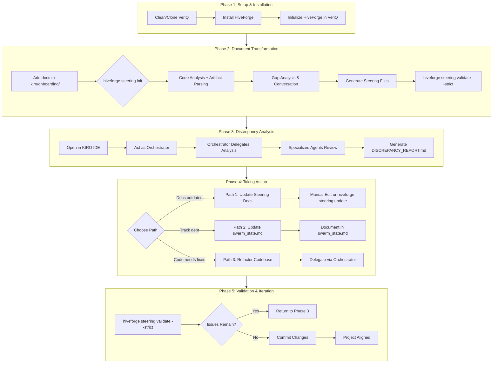

# Workflow Guide: Refactoring with KIRO Methodology

This guide walks you through refactoring an existing project using KIRO Methodology v05. You'll transform original project documentation into HiveForge steering documents, analyze discrepancies between documented intent and actual implementation, and take action to align your codebase with project standards.

## v2.1.0 Shared Backend Architecture

The v2.1.0 release introduced a **Shared Backend Architecture** that unifies CLI and Power (MCP) implementations.

```
┌─────────────────────────────────────────────────────────────────┐
│                      KIRO Orchestrator                           │
├─────────────────────────────────────────────────────────────────┤
│  ┌──────────────┐                          ┌─────────────────┐ │
│  │    CLI       │                          │   Power (MCP)   │ │
│  └──────┬───────┘                          └────────┬────────┘ │
│         │                                            │          │
│         └──────────────────┬─────────────────────────┘          │
│                            │                                      │
│                            ▼                                      │
│              ┌─────────────────────────────┐                     │
│              │   Shared Backend Adapters   │                     │
│              └──────────────┬──────────────┘                     │
│                             │                                     │
│         ┌───────────────────┼───────────────────┐                │
│         │                   │                   │                │
│         ▼                   ▼                   ▼                │
│  ┌─────────────┐    ┌─────────────┐    ┌─────────────┐         │
│  │   Error     │    │  Security   │    │  Telemetry  │         │
│  │  Handling   │    │  Wrapper    │    │  Collector  │         │
│  │  + Rollback │    │             │    │             │         │
│  └─────────────┘    └─────────────┘    └─────────────┘         │
│                             │                                     │
│                             ▼                                     │
│              ┌─────────────────────────────┐                     │
│              │      v02 Workflows          │                     │
│              └─────────────────────────────┘                     │
└─────────────────────────────────────────────────────────────────┘
```

### Key v2.1.0 Features

#### Error Handling with Automatic Rollback

When workflows fail, the system automatically creates backups:

```bash
# If refactoring workflow fails, backup is created automatically
hiveforge steering init --analyze-code

# Output on failure:
# ⚠️  Workflow failed. Backup created at:
#    /path/to/project/.kiro/backups/backup_20260217_103000
#
# To restore from backup:
#    cp -r /path/to/project/.kiro/backups/backup_20260217_103000/steering .kiro/
```

#### Security Validation

All workflows validate inputs and sanitize paths:

```python
from hiveforge.steering.shared.security import validate_parameters, sanitize_path

# Validate project root
result = validate_parameters(project_root=Path("/valid/path"))

# Sanitize paths to prevent traversal attacks
safe_path = sanitize_path(user_path=Path("/user/input"), base_path=Path("/valid"))
```

#### Telemetry Collection

Workflow execution is tracked for monitoring:

```bash
# Telemetry data is stored in .kiro/.telemetry/
ls -la .kiro/.telemetry/

# Example telemetry file:
# workflow_start_2026-02-17T10-30-00.json
# workflow_complete_2026-02-17T10-30-05.json
```

## Who This Guide Is For

This guide is for developers who have:
- Original project documentation (specs, requirements, design docs) written before the codebase
- An existing codebase that may or may not match the documentation
- KIRO IDE installed and ready to use
- GitHub access to clone or work with the project repository

By following this guide, you'll:
1. Transform existing documents into standardized HiveForge steering files
2. Identify gaps between documented standards and actual code
3. Generate a discrepancy report to guide refactoring efforts
4. Choose and execute a path to align code with documentation

---

## Visual Workflow Diagram



---

## Phase 1: Setup and Installation

### Step 1.1: Prepare a Clean Working Directory

Before starting, ensure you have a fresh clone of the project. Old files or configurations can cause conflicts during the workflow.

```bash
# Check if VeriQ exists
ls ~/projects/veriq

# If it exists and you want a clean slate, remove it completely
rm -rf ~/projects/veriq

# Why: Ensures no stale files or configs interfere with the workflow
```

### Step 1.2: Install HiveForge

If HiveForge is not already installed, install it from source:

```bash
# Clone HiveForge repository
git clone https://github.com/asoshnin/HiveForge.git
cd HiveForge

# Create and activate virtual environment
python3 -m venv venv
source venv/bin/activate  # macOS/Linux
# OR: venv\Scripts\activate.bat  # Windows

# Install HiveForge from source
pip install -e .

# Verify installation
hiveforge --help
# Expected output: Shows steering, init, update, validate commands
```

**Verified in:** `README.md` (Installation section) and `src/hiveforge/steering/cli.py`

### Step 1.3: Clone or Navigate to VeriQ

```bash
# Navigate to your workspace
cd ~/projects

# Clone VeriQ (private repo - requires GitHub authentication)
git clone https://github.com/[username]/VeriQ.git
cd VeriQ

# Verify repository structure
ls -la
# Expected: Should show source code, not .kiro/ yet
```

### Step 1.4: Initialize HiveForge in VeriQ

**Critical: Run this BEFORE adding documents to .kiro/onboarding/**

```bash
# Initialize HiveForge with project name
hiveforge -n veriq

# Verify structure created
ls -la .kiro/
# Expected: Shows agents/, steering/, onboarding/ directories
```

**What this creates:**
```
veriq/
├── .kiro/
│   ├── agents/          # 7 agent definitions
│   └── steering/        # 8 steering file templates
├── .swarm/
│   ├── plan/
│   └── audit_logs/
└── swarm_state.md       # Central state document
```

**Verified in:** `src/hiveforge/cli.py` (main CLI entry point)

---

## Phase 2: Document Transformation

This phase transforms your original project documentation into HiveForge steering documents.

**⚠️ Important: Two Approaches Available**

| Approach | Uses LLM | User Input Required | Recommended For |
|----------|----------|---------------------|-----------------|
| **KIRO IDE + Steering Assistant** | ✅ YES | Minimal | Most users (easier, faster) |
| CLI (`hiveforge steering init`) | ❌ NO | Lots of Q&A | Users without KIRO IDE |

**We recommend KIRO IDE + Steering Assistant** - the LLM does all the work!

---

### Step 2.1: Add Original Documents to Staging

Place your original documents in the `.kiro/onboarding/` folder:

```bash
# Create onboarding folder if it doesn't exist
mkdir -p .kiro/onboarding

# Copy your original documents
cp /path/to/original/docs/*.md .kiro/onboarding/
cp /path/to/original/docs/*.pdf .kiro/onboarding/

# Verify documents were added
ls -la .kiro/onboarding/
```

**Supported formats:** Markdown (.md), PDF (.pdf), Images (.png, .jpg with OCR)

---

### Step 2.2: Use KIRO IDE + HiveForge Power (RECOMMENDED)

**This approach uses the HiveForge Power (MCP tool) to automatically transform documents - no tedious Q&A!**

1. **Open VeriQ in KIRO IDE**

2. **In KIRO chat, type:**

```
Initialize steering files for my project
```

**What happens:**
- KIRO invokes the HiveForge Power's `init_steering` MCP tool
- The tool reads all documents in `.kiro/onboarding/`
- LLM transforms them into properly formatted steering files
- Files are saved to `.kiro/steering/`
- No manual Q&A required!

**Using custom source document location:**

If your documents are in a different folder (e.g., `_DEVELOPMENT/` or `docs/design/`), specify the path:

```
Initialize steering files for my project using documents from _DEVELOPMENT/
```

Or more explicitly:

```
Use the HiveForge Power to initialize steering files. 
Set source_docs_path to "_DEVELOPMENT" to use documents from that folder instead of .kiro/onboarding/
```

**Parameters you can specify:**
- `source_docs_path`: Custom folder for source documents (e.g., "_DEVELOPMENT", "docs/design")
- `dry_run`: Preview what would be created without writing files
- `autonomous`: Enable autonomous generation (LLM fills gaps without asking)
- `confidence_threshold`: Confidence level for autonomous decisions (0.0-1.0, default: 0.7)

**Example with dry-run:**
```
Initialize steering files in dry-run mode to preview what would be created
```

3. **Review generated files:**
```bash
ls -la .kiro/steering/
cat .kiro/steering/project-vision.md
# ... review all files
```

**Note:** If the HiveForge Power is not available in your KIRO installation, you can fall back to using the Steering Assistant agent (see alternative approach below) or the CLI method (Step 2.3).

**Alternative - Using Steering Assistant Agent:**

If you prefer to use the agent directly:

1. Act as Steering Assistant agent in KIRO
2. Use this prompt:

```
I have original project documents in .kiro/onboarding/ that describe the intended system design.

Please:
1. Read all documents in .kiro/onboarding/
2. Transform them into HiveForge steering documents
3. Create all 8 steering files in .kiro/steering/:
   - project-vision.md - Problem, solution, users, value proposition
   - tech-stack.md - Technologies, frameworks, libraries
   - conventions.md - Naming, formatting, commit messages
   - architecture.md - System design, components, data flow
   - db-standards.md - Schema design, migrations, queries
   - api-standards.md - Endpoint design, error handling, auth
   - ui-standards.md - Component structure, styling, accessibility
   - qa-standards.md - Testing strategy, coverage requirements

Extract all relevant information from the documents and format according to steering file templates.
```

---

### Step 2.3: Alternative - CLI Approach (NOT RECOMMENDED)

Only use this if you cannot access KIRO IDE. This approach requires answering many questions manually.

```bash
# Generate steering files
hiveforge steering init --analyze-code
```

**What this does:**
- Analyzes codebase (local Python, no LLM)
- Parses documents from `.kiro/onboarding/`
- **Asks you MANY questions** via terminal Q&A
- Populates steering templates

**Downsides:**
- No LLM - you must answer every question
- Tedious and time-consuming
- Error-prone

**Example questions you'll need to answer:**
```
1. What is the one-sentence description of your project?
2. What backend language and framework are you using?
3. What are your test coverage requirements?
... (many more)
```

**We strongly recommend Step 2.2 instead!**

---

### Step 2.4: Validate Steering Files

```bash
# Run strict validation to ensure completeness
hiveforge steering validate --strict

# Expected output:
# Validation Report
# ================
# ✓ project-vision.md: PASS
# ✓ tech-stack.md: PASS
# ...
# Summary: All files passed validation
```

**Exit codes:**
- 0: Validation passed
- 1: Validation failed (critical issues or warnings in strict mode)

**Verified in:** `src/hiveforge/steering/cli.py` (validate command)

### v2.1.0: Error Handling During Validation

If validation fails, the system provides detailed error information:

```bash
$ hiveforge steering validate --strict

# ⚠️  Validation failed with 2 critical issues
# ⚠️  Backup created at: .kiro/backups/backup_20260217_103000
#
# Critical Issues:
# 1. architecture.md: Missing required section "Data Flow"
# 2. tech-stack.md: Unreplaced placeholder "{DATABASE_VERSION}"
#
# Suggestions:
# - Review and complete missing sections
# - Replace placeholders with actual values
```

**Error Handling Features:**
- Detailed error messages with line numbers
- Suggestions for fixing issues
- Automatic backup on failure
- Graceful degradation

---

## Phase 3: Manual Discrepancy Analysis (KIRO IDE)

**⚠️ Critical Limitation:** HiveForge does NOT have built-in discrepancy analysis.

### What HiveForge DOES:
- Generate steering files from your documents
- Validate that steering files are complete and well-formed
- Update steering files with new information

### What HiveForge does NOT do:
- Read your source code and check if it matches the documentation
- Find features described in docs but missing in code
- Identify convention violations in your codebase

**Solution for Gap Analysis:** You need KIRO IDE + Orchestrator for that - it uses LLM-powered agents to manually analyze the gap between what's documented and what's implemented.

---

### Step 3.1: Open VeriQ in KIRO IDE

Load the project in KIRO IDE. Steering files from `.kiro/steering/` and swarm state from `swarm_state.md` are automatically loaded.

**How to open:**
1. Launch KIRO IDE
2. File → Open Folder → Select your project directory (e.g., `~/projects/veriq`)
3. Wait for KIRO to index the project (status bar shows progress)

**Verify setup:**
- Check that `.kiro/steering/` contains your 8 steering files
- Check that `swarm_state.md` exists in the root
- Ensure no syntax errors in steering files (KIRO will highlight them)

### Step 3.2: Act as Orchestrator

**How to invoke the Orchestrator:**

1. Open the KIRO chat panel (usually on the right side)
2. Click the agent selector dropdown (top of chat)
3. Select "Orchestrator" from the list
4. Paste the prompt below into the chat input
5. Press Enter to start the analysis

**Use this exact prompt template:**

```
I have steering documents in .kiro/steering/ that describe the intended system design.
I need you to analyze the actual codebase and compare it against these steering documents.

Please:
1. Read all steering files in .kiro/steering/
2. Analyze the actual code implementation in src/
3. Create a comprehensive discrepancy report that identifies:
   - Features described in steering docs but not implemented in code
   - Code that doesn't match the documented design
   - Architectural differences between docs and implementation
   - Convention violations
   - Missing components
   - Technical debt items

Save the report to: DISCREPANCY_REPORT.md in the project root directory

Delegate this analysis to appropriate specialized agents (Backend Engineer, Frontend Engineer, Data Architect, QA Engineer, Red Team).
```

**What happens next:**
- Orchestrator reads all steering files
- Orchestrator creates a delegation plan
- Orchestrator assigns tasks to specialized agents
- Each agent reports back with findings
- Orchestrator compiles the final report

### v2.1.0: Security Validation During Analysis

The code analysis includes security validation:

```python
from hiveforge.steering.shared.security import validate_parameters, sanitize_path

# Validate analysis parameters
result = validate_parameters(
    project_root=Path("/path/to/project"),
    confidence_threshold=0.7
)

# Sanitize paths to prevent traversal attacks
safe_path = sanitize_path(
    user_path=Path("/path/to/analyze"),
    base_path=Path("/path/to/project")
)
```

**Security Checks:**
- Path traversal prevention
- Input validation
- Resource limits (memory, CPU time)

### Step 3.3: Orchestrator Delegation Flow

**Understanding the delegation sequence:**

The Orchestrator follows this workflow:

1. **Phase 1: Document Understanding**
   - **Steering Validator** reads all 8 steering files
   - Extracts requirements, standards, and expectations
   - Creates a checklist of items to verify in code

2. **Phase 2: Code Analysis (Parallel)**
   - **Backend Engineer** → Analyzes `src/api/`, `src/services/` against `api-standards.md`, `db-standards.md`
   - **Frontend Engineer** → Analyzes `src/components/`, `src/pages/` against `ui-standards.md`
   - **Data Architect** → Analyzes database schema, migrations against `db-standards.md`
   - **QA Engineer** → Analyzes test files, coverage reports against `qa-standards.md`

3. **Phase 3: Cross-Cutting Concerns**
   - **Red Team** → Audits all findings for security issues, quality gaps, and architectural risks

4. **Phase 4: Report Compilation**
   - **Orchestrator** → Aggregates all findings
   - Prioritizes issues (Critical, Warning, Info)
   - Generates `DISCREPANCY_REPORT.md`

**Monitoring progress:**
- Watch the KIRO chat for delegation messages
- Each agent will report completion status
- Typical analysis takes 5-15 minutes depending on codebase size
- Check `swarm_state.md` for real-time delegation tree updates

### Step 3.4: Expected Output and Interpretation

**Location:** The Orchestrator will generate `DISCREPANCY_REPORT.md` in the project root.

**Report Structure:**

```markdown
# Discrepancy Report for VeriQ

## Executive Summary
- Total issues found: 12
- Critical: 3
- Warnings: 5
- Info: 4

## Critical Issues

### 1. Authentication Not Implemented
**Steering Doc:** architecture.md specifies JWT authentication
**Actual Code:** No authentication endpoints found in src/api/
**Impact:** Security vulnerability, feature gap
**Recommendation:** Implement JWT auth middleware (Priority: HIGH)

### 2. Test Coverage Below Target
**Steering Doc:** qa-standards.md requires 80% coverage
**Actual Code:** Current coverage is 45%
**Impact:** Quality risk
**Recommendation:** Add unit tests for core modules (Priority: MEDIUM)

## Convention Violations

### 1. Naming Convention Mismatch
**Steering Doc:** conventions.md specifies snake_case
**Actual Code:** Found camelCase in src/utils/helper.js
**Files affected:** src/utils/helper.js, src/api/user.js
**Recommendation:** Refactor to snake_case (Priority: LOW)

## Missing Components

### 1. Error Handling Middleware
**Steering Doc:** api-standards.md requires standardized error handling
**Status:** Not implemented
**Recommendation:** Create error middleware (Priority: MEDIUM)

## Architectural Differences

### 1. Database Connection Pooling
**Steering Doc:** architecture.md specifies connection pooling
**Actual Code:** Direct connections without pooling
**Impact:** Performance bottleneck under load
**Recommendation:** Implement connection pool (Priority: MEDIUM)
```

**How to interpret the report:**

1. **Priority Levels:**
   - **Critical** → Security vulnerabilities, missing core features, blocking issues
   - **Warning** → Quality issues, performance concerns, incomplete implementations
   - **Info** → Style violations, minor inconsistencies, optimization opportunities

2. **Decision Framework:**
   - **Critical issues** → Address immediately (Phase 4, Path 3: Refactor)
   - **Warnings** → Plan for next sprint (Phase 4, Path 2: Document in swarm_state.md)
   - **Info** → Consider for future cleanup (Phase 4, Path 2: Technical debt log)

3. **Common Patterns:**
   - **"Not Implemented"** → Feature gap, needs development work
   - **"Mismatch"** → Code exists but doesn't follow standards
   - **"Missing"** → Component described in docs but absent in code
   - **"Outdated"** → Docs describe old design, code has evolved

**Next Steps:**
- Review the report with your team
- Prioritize issues based on business impact
- Choose a path from Phase 4 for each issue category

### v2.1.0: Telemetry During Discrepancy Analysis

The analysis workflow tracks execution for monitoring:

```python
from hiveforge.steering.shared.telemetry import TelemetryCollector, InterfaceType

# Create telemetry collector
telemetry = TelemetryCollector(telemetry_dir=Path(".kiro/.telemetry"))

# Record analysis start
telemetry.record_workflow_start(
    workflow_name="discrepancy_analysis",
    interface_type=InterfaceType.CLI,
    parameters={"analyze_code": True}
)

# Record analysis completion
telemetry.record_workflow_complete(
    workflow_name="discrepancy_analysis",
    success=True,
    duration_ms=45234,
    files_created=1,  # DISCREPANCY_REPORT.md
    files_modified=0
)
```

**Telemetry Data:**
- Analysis start/complete timestamps
- Duration, files created
- Error types and messages (if any)
- Interface type (CLI, MCP, API)

**Privacy:** Data is stored locally only, never sent externally.

---

## Phase 4: Taking Action

Based on the discrepancy report, choose one of three paths:

### Path 1: Update Steering Documents

Choose this when the code is correct and the documentation is outdated.

```bash
# Option A: Manual edit
nano .kiro/steering/architecture.md

# Option B: Use update workflow with new artifacts
cp updated-docs/*.md .kiro/onboarding/
hiveforge steering update

# Option C: Validate after changes
hiveforge steering validate --strict
```

**When to use:** The codebase has evolved past the original documentation, and the code represents the current truth.

### Path 2: Update swarm_state.md

Choose this when you want to acknowledge technical debt and plan future work.

```bash
# Edit swarm_state.md to document discrepancies
nano swarm_state.md
```

**Add a section like:**

```markdown
## Technical Debt Log

### 2026-02-17: Discrepancy Analysis Findings

**Critical Items:**
1. Authentication not implemented - Priority: HIGH
2. Test coverage at 45% (target: 80%) - Priority: MEDIUM

**Planned Actions:**
- Week 1: Implement JWT authentication
- Week 2: Increase test coverage to 80%
```

### Path 3: Refactor Codebase

Choose this when the documentation is correct and the code needs fixing.

```bash
# Act as Orchestrator to plan refactoring
```

**Prompt template:**

```
Based on DISCREPANCY_REPORT.md, I need to refactor the codebase to match steering documents.

Please:
1. Review the discrepancy report
2. Create a prioritized refactoring plan
3. Delegate tasks to specialized agents
4. Track progress in swarm_state.md

Focus on:
- Critical security issues (authentication)
- Convention violations
- Missing components
```

**Orchestrator will delegate:**
- Backend Engineer: Fix API endpoints, add authentication
- Frontend Engineer: Fix component patterns
- Data Architect: Update database schema
- QA Engineer: Increase test coverage
- Red Team: Verify fixes

### v2.1.0: Error Handling During Refactoring

If refactoring fails, automatic rollback preserves your work:

```bash
# During refactoring, if error occurs:
hiveforge steering update

# ⚠️  Error: Failed to parse updated artifact
# ⚠️  Workflow failed. Backup created at:
#    /path/to/project/.kiro/backups/backup_20260217_103000
#
# To restore from backup:
#    cp -r /path/to/project/.kiro/backups/backup_20260217_103000/steering .kiro/
```

**Rollback Features:**
- Automatic backup creation on failure
- Preserves partially completed work
- Detailed error messages
- Easy restore process

### v2.1.0: Security Validation During Refactoring

All refactoring operations validate inputs:

```python
from hiveforge.steering.shared.security import (
    validate_parameters,
    sanitize_path,
    ResourceLimiter
)

# Validate refactoring parameters
result = validate_parameters(
    project_root=Path("/path/to/project"),
    files_to_update=[Path("/path/to/file1.md"), Path("/path/to/file2.md")],
    confidence_threshold=0.7
)

# Sanitize paths to prevent traversal attacks
for file_path in result.files_to_update:
    safe_path = sanitize_path(file_path, Path("/path/to/project"))

# Limit resources during refactoring
with ResourceLimiter(max_memory_mb=512, max_cpu_time_sec=300):
    # Refactoring operations here
    pass
```

**Security Features:**
- Input parameter validation
- Path traversal prevention
- Resource limits (memory, CPU time, file size)

---

## Phase 5: Validation and Iteration

### Step 5.1: Re-validate Steering Files

```bash
# After making changes, validate again
hiveforge steering validate --strict
```

### Step 5.2: Re-run Discrepancy Analysis (if needed)

If you made code changes, re-run the analysis from Phase 3:

```bash
# In KIRO IDE, act as Orchestrator again
```

### Step 5.3: Commit Changes

```bash
# Stage all changes
git add .kiro/ steering/ swarm_state.md DISCREPANCY_REPORT.md

# Commit with descriptive message
git commit -m "refactor: align codebase with steering documents

- Updated architecture.md to reflect current implementation
- Fixed naming convention violations
- Added missing error handling middleware
- Increased test coverage to 80%

See DISCREPANCY_REPORT.md for full analysis"
```

### Step 5.4: Maintain Alignment

To prevent future drift:

1. **Update steering files first** - When planning code changes, update relevant steering documents
2. **Validate before commits** - Run `hiveforge steering validate --strict` in pre-commit hooks
3. **Regular audits** - Periodically run discrepancy analysis to catch drift early

### v2.1.0: Error Handling During Validation

If validation fails, the system provides detailed error information:

```bash
$ hiveforge steering validate --strict

# ⚠️  Validation failed with 2 critical issues
# ⚠️  Backup created at: .kiro/backups/backup_20260217_103000
#
# Critical Issues:
# 1. architecture.md: Missing required section "Data Flow"
# 2. tech-stack.md: Unreplaced placeholder "{DATABASE_VERSION}"
#
# Suggestions:
# - Review and complete missing sections
# - Replace placeholders with actual values
```

### v2.1.0: Telemetry During Validation

Validation execution is tracked for monitoring:

```python
from hiveforge.steering.shared.telemetry import TelemetryCollector, InterfaceType

# Create telemetry collector
telemetry = TelemetryCollector(telemetry_dir=Path(".kiro/.telemetry"))

# Record validation start
telemetry.record_workflow_start(
    workflow_name="validate",
    interface_type=InterfaceType.CLI,
    parameters={"strict": True}
)

# Record validation completion
telemetry.record_workflow_complete(
    workflow_name="validate",
    success=False,  # Validation failed
    duration_ms=1234,
    files_created=0,
    files_modified=0
)

# Record error
telemetry.record_error(
    error_type="VALIDATION_ERROR",
    error_message="Missing required section 'Data Flow'",
    workflow_name="validate"
)
```

**Telemetry Data:**
- Validation start/complete timestamps
- Duration, validation results
- Error types and messages
- Interface type (CLI, MCP, API)

**Privacy:** Data is stored locally only, never sent externally.

---

## Tool Usage Matrix

| Task | Tool | Command/Action | Verified In |
|------|------|----------------|-------------|
| Install HiveForge | Terminal | `pip install -e .` | README.md |
| Initialize project | HiveForge CLI | `hiveforge -n veriq` | src/hiveforge/cli.py |
| **Transform documents** | **KIRO IDE** | **"Initialize steering files for my project"** | **hiveforge-power/POWER.md** |
| Transform documents (alt) | HiveForge CLI | `hiveforge steering init --analyze-code` | src/hiveforge/steering/cli.py |
| Update steering docs | HiveForge CLI | `hiveforge steering update` | src/hiveforge/steering/cli.py |
| Validate steering docs | HiveForge CLI | `hiveforge steering validate --strict` | src/hiveforge/steering/cli.py |
| Analyze discrepancies | KIRO IDE | Act as Orchestrator (see Phase 3) | N/A - Manual workflow |
| Refactor code | KIRO IDE | Delegate via Orchestrator | swarm_state.md |

**Legend:**
- ✅ HiveForge CLI - Automated feature
- ⚠️ KIRO IDE - LLM-powered (recommended for document transformation via HiveForge Power)
- 📝 Manual - User must do manually

**Recommendation:** Use KIRO IDE + HiveForge Power for document transformation (uses LLM via MCP tools, minimal user input)

---

## Example Prompts

### KIRO IDE HiveForge Power (RECOMMENDED - Uses MCP Tools!)

Use this simple prompt in KIRO chat to transform original documents into steering files:

```
Initialize steering files for my project
```

**With custom source document location:**

```
Initialize steering files for my project using documents from _DEVELOPMENT/
```

**With dry-run to preview:**

```
Initialize steering files in dry-run mode to preview what would be created
```

**Why this is better:** Uses the HiveForge Power (MCP tool) which leverages LLM - no manual Q&A required!

### KIRO IDE Steering Assistant Agent (Alternative)

If you prefer to use the agent directly, use this prompt:

```
I have original project documents in .kiro/onboarding/ that describe the intended system design.

Please:
1. Read all documents in .kiro/onboarding/
2. Transform them into HiveForge steering documents
3. Create all 8 steering files in .kiro/steering/:
   - project-vision.md - Problem, solution, users, value proposition
   - tech-stack.md - Technologies, frameworks, libraries
   - conventions.md - Naming, formatting, commit messages
   - architecture.md - System design, components, data flow
   - db-standards.md - Schema design, migrations, queries
   - api-standards.md - Endpoint design, error handling, auth
   - ui-standards.md - Component structure, styling, accessibility
   - qa-standards.md - Testing strategy, coverage requirements

Extract all relevant information from the documents and format according to steering file templates.
```

**Why this is better:** LLM does all the work - no manual Q&A required!

### External Assistant Document Transformation (Alternative)

Use this prompt with an external AI assistant (not KIRO) to transform documents:

```
I have project documentation that needs to be transformed into HiveForge steering document format.

[PASTE YOUR ORIGINAL DOCUMENTS HERE]

Please transform these into 8 steering documents following the HiveForge format:
1. project-vision.md - Problem, solution, users, value proposition
2. tech-stack.md - Technologies, frameworks, libraries
3. conventions.md - Naming, formatting, commit messages
4. architecture.md - System design, components, data flow
5. db-standards.md - Schema design, migrations, queries
6. api-standards.md - Endpoint design, error handling, auth
7. ui-standards.md - Component structure, styling, accessibility
8. qa-standards.md - Testing strategy, coverage requirements

For each file, extract relevant information and format according to the steering file's purpose.
```

### KIRO IDE Orchestrator Discrepancy Analysis

```
I have steering documents in .kiro/steering/ that describe the intended system design.
I need you to analyze the actual codebase and compare it against these steering documents.

Please:
1. Read all steering files in .kiro/steering/
2. Analyze the actual code implementation
3. Create a comprehensive discrepancy report that identifies:
   - Features described in steering docs but not implemented in code
   - Code that doesn't match the documented design
   - Architectural differences between docs and implementation
   - Convention violations
   - Missing components
   - Technical debt items

Save the report to: DISCREPANCY_REPORT.md in the root directory

Delegate this analysis to appropriate specialized agents.
```

### KIRO IDE Refactoring Delegation

```
Based on DISCREPANCY_REPORT.md, I need to refactor the codebase to match steering documents.

Please:
1. Review the discrepancy report
2. Create a prioritized refactoring plan
3. Delegate tasks to specialized agents
4. Track progress in swarm_state.md

Focus on:
- Critical security issues (authentication)
- Convention violations
- Missing components
```

---

## Common Pitfalls

### 1. Not Starting with a Clean Clone

**Problem:** Old files or configs interfere with the workflow.

**Solution:** Always start with a fresh clone or clean directory:
```bash
rm -rf ~/projects/veriq
git clone https://github.com/[username]/VeriQ.git
```

### 2. Wrong Initialization Sequence

**Problem:** Running `hiveforge steering init` before `hiveforge -n veriq`.

**Solution:** Always initialize first, then add documents:
```bash
hiveforge -n veriq  # Creates .kiro/ structure
# THEN add documents
cp docs/*.md .kiro/onboarding/
hiveforge steering init --analyze-code
```

### 3. Forgetting to Activate Virtual Environment

**Problem:** Commands fail because HiveForge isn't in PATH.

**Solution:** Activate the virtual environment:
```bash
source venv/bin/activate  # macOS/Linux
# OR
venv\Scripts\activate.bat  # Windows
```

### 4. Placing Documents in Wrong Folder

**Problem:** Documents go to `.kiro/steering/` instead of `.kiro/onboarding/`.

**Solution:** Use the correct staging folder:
```bash
mkdir -p .kiro/onboarding
cp docs/*.md .kiro/onboarding/  # NOT .kiro/steering/
```

### 5. Not Validating Before Analysis

**Problem:** Running discrepancy analysis on incomplete steering files.

**Solution:** Always validate first:
```bash
hiveforge steering validate --strict
```

### 6. Expecting Automated Discrepancy Analysis

**Problem:** Looking for a `hiveforge discrepancy` command that doesn't exist.

**Solution:** Use the KIRO IDE workflow (Phase 3). HiveForge creates and validates documents but doesn't compare them to code.

### 7. Skipping swarm_state.md Updates

**Problem:** Losing track of decisions and technical debt.

**Solution:** Document everything in swarm_state.md:
```markdown
## Technical Debt Log

### 2026-02-17: Discrepancy Analysis Findings
- Authentication not implemented
- Test coverage at 45% (target: 80%)
```

### 8. Not Committing Steering Files

**Problem:** Steering files drift from code over time.

**Solution:** Version control steering files:
```bash
git add .kiro/steering/ swarm_state.md
git commit -m "docs: update steering files for new feature"
```

### 9. Ignoring v2.1.0 Error Handling

**Problem:** Not using automatic rollback during refactoring.

**Solution:** v2.1.0 includes automatic rollback on failure:
```bash
# If refactoring fails, backup is created automatically
hiveforge steering update

# Check backup location if workflow fails
# Backup is in: .kiro/backups/backup_YYYYMMDD_HHMMSS/
```

### 10. Skipping Security Validation

**Problem:** Not validating inputs during refactoring.

**Solution:** v2.1.0 includes security validation:
```python
from hiveforge.steering.shared.security import validate_parameters, sanitize_path

# Validate all inputs
result = validate_parameters(project_root=Path("/valid/path"))

# Sanitize paths
safe_path = sanitize_path(Path("/user/input"), Path("/valid"))
```

---

## FAQ

### What if my original documents are in Word format?

**Answer:** Convert to PDF or Markdown first. HiveForge supports:
- Markdown (.md) - Best support
- PDF (.pdf) - Supported with text extraction
- Images (.png, .jpg) - Supported with OCR (requires tesseract: `brew install tesseract` on macOS)

Word documents (.docx) are not directly supported. Convert them using:
```bash
# Using pandoc (recommended)
pandoc input.docx -o output.md

# Or export from Word as PDF
```

### What if HiveForge doesn't support a feature I need?

**Answer:** 
1. Check the source code in `src/hiveforge/` to verify the limitation
2. Use KIRO IDE with Orchestrator for manual workflows
3. File a feature request: https://github.com/asoshnin/HiveForge/issues

### How do I know if discrepancy analysis is complete?

**Answer:** Check for these indicators:
- `DISCREPANCY_REPORT.md` exists in project root
- `swarm_state.md` has a delegation tree with completed items
- Orchestrator confirms all agents have reported
- No critical issues remain in the report

### Can I automate this workflow?

**Answer:** Partially:
- Document transformation: Yes, `hiveforge steering init --no-interactive --analyze-code`
- Discrepancy analysis: No, requires KIRO IDE manual workflow
- Validation: Yes, `hiveforge steering validate --strict`

For CI/CD integration:
```yaml
# .github/workflows/validate-steering.yml
- name: Validate Steering Files
  run: hiveforge steering validate --strict
```

### What if I have multiple projects to analyze?

**Answer:** Run the workflow separately for each project:
- Each project needs its own `.kiro/` directory
- Can reuse HiveForge installation across projects
- Steering files are project-specific

### Does HiveForge compare steering docs against code automatically?

**Answer:** **NO** - This is a critical limitation.

HiveForge only:
- Creates steering documents from artifacts and code analysis
- Validates steering document completeness
- Updates steering documents with new information

For comparison: Use the KIRO IDE workflow in Phase 3.

### Why should I use KIRO IDE + HiveForge Power instead of CLI?

**Answer:** The CLI approach (`hiveforge steering init`) does NOT use LLM - it requires you to manually answer many questions via terminal. The KIRO IDE approach uses the HiveForge Power (MCP tool) which leverages LLM to automatically transform your documents with minimal user input.

| Aspect | CLI Approach | KIRO IDE + Power Approach |
|--------|--------------|---------------------------|
| LLM Used | ❌ No | ✅ Yes |
| User Input | Many questions | Minimal (just a prompt) |
| Time | Slow (Q&A) | Fast (automated) |
| Quality | Depends on your answers | LLM extracts from docs |
| Custom paths | Via flags | Via natural language |

**Recommendation:** Always use KIRO IDE + HiveForge Power for document transformation!

### What if validation fails with false positives?

**Answer:** 
1. Review the validation report carefully
2. Check if the issue is actually a problem for your project
3. Use normal mode instead of strict mode for less strict validation
4. Manually edit the steering file to address the issue
5. Report false positives as bugs if they persist

### How do I handle large codebases?

**Answer:** The CodeAnalyzer implements sampling for large codebases (>10,000 files):
```bash
# For very large codebases, analysis may take longer
# Progress updates are shown every 30 seconds

hiveforge steering init --analyze-code
```

The analysis respects `.gitignore` and focuses on relevant source files.

### How does v2.1.0 automatic rollback work?

**Answer:** When a workflow fails, v2.1.0 automatically:
1. Creates a timestamped backup in `.kiro/backups/`
2. Preserves all steering files and partial work
3. Reports the backup location in error output

**Example:**
```bash
$ hiveforge steering update

# ⚠️  Workflow failed. Backup created at:
#    /path/to/project/.kiro/backups/backup_20260217_103000
#
# To restore from backup:
#    cp -r /path/to/project/.kiro/backups/backup_20260217_103000/steering .kiro/
```

**Best Practice:** Always check the backup location after failures and restore if needed.

### What does the security wrapper validate?

**Answer:** The v2.1.0 security wrapper validates:
- **Parameter validation:** Ensures all inputs are valid types and ranges
- **Path sanitization:** Prevents path traversal attacks (e.g., `../../../etc/passwd`)
- **Resource limits:** Prevents excessive memory, CPU, or file size usage

**Example:**
```python
from hiveforge.steering.shared.security import validate_parameters, sanitize_path

# Validate parameters
result = validate_parameters(
    project_root=Path("/valid/path"),
    confidence_threshold=0.7
)

# Sanitize paths
safe_path = sanitize_path(Path("/user/input"), Path("/valid"))
```

### What telemetry data is collected and where is it stored?

**Answer:** v2.1.0 collects workflow telemetry for monitoring:
- **Data collected:** Workflow start/complete timestamps, duration, interface type (CLI/MCP/API), files created/modified, error types
- **Storage location:** `.kiro/.telemetry/` (local directory)
- **Privacy:** Data is stored locally only, never sent externally

**Example telemetry file:**
```json
{
  "workflow_name": "discrepancy_analysis",
  "interface_type": "CLI",
  "parameters": {"analyze_code": true},
  "start_time": "2026-02-17T10-30:00Z",
  "complete_time": "2026-02-17T10-30:45Z",
  "duration_ms": 45234,
  "files_created": 1,
  "success": true
}
```

**Best Practice:** Review telemetry data to identify slow workflows or frequent errors.

### Can I disable v2.1.0 features?

**Answer:** Yes, but it's not recommended:
- **Rollback:** Backups are created automatically; you can ignore them if not needed
- **Security:** Validation is built into workflows; disabling requires code changes
- **Telemetry:** Data is stored locally only; you can delete `.kiro/.telemetry/` anytime

**Recommendation:** Keep all v2.1.0 safety features enabled for better reliability and debugging.

---

## Summary

This workflow enables you to:
1. **Set up** HiveForge and prepare your project
2. **Transform** existing documents into standardized steering files
3. **Analyze** discrepancies between documentation and implementation
4. **Take action** to align code with standards
5. **Validate** and maintain alignment over time

**Key takeaway:** HiveForge excels at creating and maintaining steering documents, but discrepancy analysis between docs and code requires the KIRO IDE Orchestrator workflow. Use the tools together for maximum effectiveness.

---

**Last Updated:** February 2026
**Version:** 1.0.0