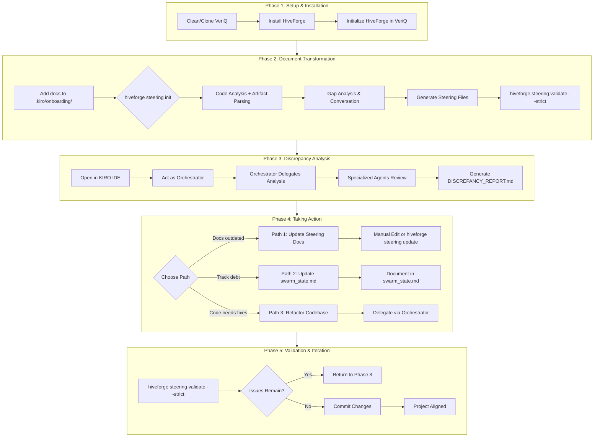

# Workflow Guide: Refactoring with KIRO Methodology

This guide walks you through refactoring an existing project using KIRO Methodology v05. You'll transform original project documentation into HiveForge steering documents, analyze discrepancies between documented intent and actual implementation, and take action to align your codebase with project standards.

## Who This Guide Is For

This guide is for developers who have:
- Original project documentation (specs, requirements, design docs) written before the codebase
- An existing codebase that may or may not match the documentation
- KIRO IDE installed and ready to use
- GitHub access to clone or work with the project repository

By following this guide, you'll:
1. Transform existing documents into standardized HiveForge steering files
2. Identify gaps between documented standards and actual code
3. Generate a discrepancy report to guide refactoring efforts
4. Choose and execute a path to align code with documentation

---

## Visual Workflow Diagram



---

## Phase 1: Setup and Installation

### Step 1.1: Prepare a Clean Working Directory

Before starting, ensure you have a fresh clone of the project. Old files or configurations can cause conflicts during the workflow.

```bash
# Check if VeriQ exists
ls ~/projects/veriq

# If it exists and you want a clean slate, remove it completely
rm -rf ~/projects/veriq

# Why: Ensures no stale files or configs interfere with the workflow
```

### Step 1.2: Install HiveForge

If HiveForge is not already installed, install it from source:

```bash
# Clone HiveForge repository
git clone https://github.com/asoshnin/HiveForge.git
cd HiveForge

# Create and activate virtual environment
python3 -m venv venv
source venv/bin/activate  # macOS/Linux
# OR: venv\Scripts\activate.bat  # Windows

# Install HiveForge from source
pip install -e .

# Verify installation
hiveforge --help
# Expected output: Shows steering, init, update, validate commands
```

**Verified in:** `README.md` (Installation section) and `src/hiveforge/steering/cli.py`

### Step 1.3: Clone or Navigate to VeriQ

```bash
# Navigate to your workspace
cd ~/projects

# Clone VeriQ (private repo - requires GitHub authentication)
git clone https://github.com/[username]/VeriQ.git
cd VeriQ

# Verify repository structure
ls -la
# Expected: Should show source code, not .kiro/ yet
```

### Step 1.4: Initialize HiveForge in VeriQ

**Critical: Run this BEFORE adding documents to .kiro/onboarding/**

```bash
# Initialize HiveForge with project name
hiveforge -n veriq

# Verify structure created
ls -la .kiro/
# Expected: Shows agents/, steering/, onboarding/ directories
```

**What this creates:**
```
veriq/
├── .kiro/
│   ├── agents/          # 7 agent definitions
│   └── steering/        # 8 steering file templates
├── .swarm/
│   ├── plan/
│   └── audit_logs/
└── swarm_state.md       # Central state document
```

**Verified in:** `src/hiveforge/cli.py` (main CLI entry point)

---

## Phase 2: Document Transformation

This phase transforms your original project documentation into HiveForge steering documents.

**⚠️ Important: Two Approaches Available**

| Approach | Uses LLM | User Input Required | Recommended For |
|----------|----------|---------------------|-----------------|
| **KIRO IDE + Steering Assistant** | ✅ YES | Minimal | Most users (easier, faster) |
| CLI (`hiveforge steering init`) | ❌ NO | Lots of Q&A | Users without KIRO IDE |

**We recommend KIRO IDE + Steering Assistant** - the LLM does all the work!

---

### Step 2.1: Add Original Documents to Staging

Place your original documents in the `.kiro/onboarding/` folder:

```bash
# Create onboarding folder if it doesn't exist
mkdir -p .kiro/onboarding

# Copy your original documents
cp /path/to/original/docs/*.md .kiro/onboarding/
cp /path/to/original/docs/*.pdf .kiro/onboarding/

# Verify documents were added
ls -la .kiro/onboarding/
```

**Supported formats:** Markdown (.md), PDF (.pdf), Images (.png, .jpg with OCR)

---

### Step 2.2: Use KIRO IDE + Steering Assistant Agent (RECOMMENDED)

**This approach uses LLM to automatically transform documents - no tedious Q&A!**

1. **Open VeriQ in KIRO IDE**

2. **Act as Steering Assistant agent**

3. **Use this exact prompt:**

```
I have original project documents in .kiro/onboarding/ that describe the intended system design.

Please:
1. Read all documents in .kiro/onboarding/
2. Transform them into HiveForge steering documents
3. Create all 8 steering files in .kiro/steering/:
   - project-vision.md - Problem, solution, users, value proposition
   - tech-stack.md - Technologies, frameworks, libraries
   - conventions.md - Naming, formatting, commit messages
   - architecture.md - System design, components, data flow
   - db-standards.md - Schema design, migrations, queries
   - api-standards.md - Endpoint design, error handling, auth
   - ui-standards.md - Component structure, styling, accessibility
   - qa-standards.md - Testing strategy, coverage requirements

Extract all relevant information from the documents and format according to steering file templates.
```

**What happens:**
- LLM reads your original documents
- LLM transforms them into properly formatted steering files
- Files are saved to `.kiro/steering/`
- No manual Q&A required!

4. **Review generated files:**
```bash
ls -la .kiro/steering/
cat .kiro/steering/project-vision.md
# ... review all files
```

---

### Step 2.3: Alternative - CLI Approach (NOT RECOMMENDED)

Only use this if you cannot access KIRO IDE. This approach requires answering many questions manually.

```bash
# Generate steering files
hiveforge steering init --analyze-code
```

**What this does:**
- Analyzes codebase (local Python, no LLM)
- Parses documents from `.kiro/onboarding/`
- **Asks you MANY questions** via terminal Q&A
- Populates steering templates

**Downsides:**
- No LLM - you must answer every question
- Tedious and time-consuming
- Error-prone

**Example questions you'll need to answer:**
```
1. What is the one-sentence description of your project?
2. What backend language and framework are you using?
3. What are your test coverage requirements?
... (many more)
```

**We strongly recommend Step 2.2 instead!**

---

### Step 2.4: Validate Steering Files

```bash
# Run strict validation to ensure completeness
hiveforge steering validate --strict

# Expected output:
# Validation Report
# ================
# ✓ project-vision.md: PASS
# ✓ tech-stack.md: PASS
# ...
# Summary: All files passed validation
```

**Exit codes:**
- 0: Validation passed
- 1: Validation failed (critical issues or warnings in strict mode)

**Verified in:** `src/hiveforge/steering/cli.py` (validate command)

---

## Phase 3: Discrepancy Analysis

**⚠️ Critical Limitation:** HiveForge does NOT have built-in discrepancy analysis.

The Steering Assistant can:
- Create steering documents from artifacts and code analysis
- Validate steering document completeness
- Update existing steering documents

The Steering Assistant CANNOT:
- Compare steering documents against actual code implementation
- Identify features described in docs but not implemented
- Generate automated discrepancy reports

**Solution:** Use KIRO IDE with the Orchestrator agent to perform manual analysis.

### Step 3.1: Open VeriQ in KIRO IDE

Load the project in KIRO IDE. Steering files from `.kiro/steering/` and swarm state from `swarm_state.md` are automatically loaded.

### Step 3.2: Act as Orchestrator

Use this exact prompt template in KIRO IDE:

```
I have steering documents in .kiro/steering/ that describe the intended system design.
I need you to analyze the actual codebase and compare it against these steering documents.

Please:
1. readFile all steering files in .kiro/steering/
2. Analyze the actual code implementation in src/
3. Create a comprehensive discrepancy report that identifies:
   - Features described in steering docs but not implemented in code
   - Code that doesn't match the documented design
   - Architectural differences between docs and implementation
   - Convention violations
   - Missing components
   - Technical debt items

Save the report to: DISCREPANCY_REPORT.md in the project root directory

Delegate this analysis to appropriate specialized agents (Backend Engineer, Frontend Engineer, Data Architect, QA Engineer, Red Team).
```

### Step 3.3: Orchestrator Delegation Flow

The Orchestrator will delegate to specialized agents:

1. **Steering Validator** - Reads and understands steering documents
2. **Backend Engineer** - Analyzes backend code against api-standards.md, db-standards.md
3. **Frontend Engineer** - Analyzes frontend code against ui-standards.md
4. **Data Architect** - Analyzes database schema against db-standards.md
5. **QA Engineer** - Checks test coverage against qa-standards.md
6. **Red Team** - Audits for security and quality issues

### Step 3.4: Expected Output

The Orchestrator will generate `DISCREPANCY_REPORT.md` in the project root:

```markdown
# Discrepancy Report for VeriQ

## Executive Summary
- Total issues found: 12
- Critical: 3
- Warnings: 5
- Info: 4

## Critical Issues

### 1. Authentication Not Implemented
**Steering Doc:** architecture.md specifies JWT authentication
**Actual Code:** No authentication endpoints found in src/api/
**Impact:** Security vulnerability, feature gap

### 2. Test Coverage Below Target
**Steering Doc:** qa-standards.md requires 80% coverage
**Actual Code:** Current coverage is 45%
**Impact:** Quality risk

## Convention Violations

### 1. Naming Convention Mismatch
**Steering Doc:** conventions.md specifies snake_case
**Actual Code:** Found camelCase in src/utils/helper.js
**Files affected:** src/utils/helper.js, src/api/user.js

## Missing Components

### 1. Error Handling Middleware
**Steering Doc:** api-standards.md requires standardized error handling
**Status:** Not implemented
```

---

## Phase 4: Taking Action

Based on the discrepancy report, choose one of three paths:

### Path 1: Update Steering Documents

Choose this when the code is correct and the documentation is outdated.

```bash
# Option A: Manual edit
nano .kiro/steering/architecture.md

# Option B: Use update workflow with new artifacts
cp updated-docs/*.md .kiro/onboarding/
hiveforge steering update

# Option C: Validate after changes
hiveforge steering validate --strict
```

**When to use:** The codebase has evolved past the original documentation, and the code represents the current truth.

### Path 2: Update swarm_state.md

Choose this when you want to acknowledge technical debt and plan future work.

```bash
# Edit swarm_state.md to document discrepancies
nano swarm_state.md
```

**Add a section like:**

```markdown
## Technical Debt Log

### 2026-02-17: Discrepancy Analysis Findings

**Critical Items:**
1. Authentication not implemented - Priority: HIGH
2. Test coverage at 45% (target: 80%) - Priority: MEDIUM

**Planned Actions:**
- Week 1: Implement JWT authentication
- Week 2: Increase test coverage to 80%
```

### Path 3: Refactor Codebase

Choose this when the documentation is correct and the code needs fixing.

```bash
# Act as Orchestrator to plan refactoring
```

**Prompt template:**

```
Based on DISCREPANCY_REPORT.md, I need to refactor the codebase to match steering documents.

Please:
1. Review the discrepancy report
2. Create a prioritized refactoring plan
3. Delegate tasks to specialized agents
4. Track progress in swarm_state.md

Focus on:
- Critical security issues (authentication)
- Convention violations
- Missing components
```

**Orchestrator will delegate:**
- Backend Engineer: Fix API endpoints, add authentication
- Frontend Engineer: Fix component patterns
- Data Architect: Update database schema
- QA Engineer: Increase test coverage
- Red Team: Verify fixes

---

## Phase 5: Validation and Iteration

### Step 5.1: Re-validate Steering Files

```bash
# After making changes, validate again
hiveforge steering validate --strict
```

### Step 5.2: Re-run Discrepancy Analysis (if needed)

If you made code changes, re-run the analysis from Phase 3:

```bash
# In KIRO IDE, act as Orchestrator again
```

### Step 5.3: Commit Changes

```bash
# Stage all changes
git add .kiro/ steering/ swarm_state.md DISCREPANCY_REPORT.md

# Commit with descriptive message
git commit -m "refactor: align codebase with steering documents

- Updated architecture.md to reflect current implementation
- Fixed naming convention violations
- Added missing error handling middleware
- Increased test coverage to 80%

See DISCREPANCY_REPORT.md for full analysis"
```

### Step 5.4: Maintain Alignment

To prevent future drift:

1. **Update steering files first** - When planning code changes, update relevant steering documents
2. **Validate before commits** - Run `hiveforge steering validate --strict` in pre-commit hooks
3. **Regular audits** - Periodically run discrepancy analysis to catch drift early

---

## Tool Usage Matrix

| Task | Tool | Command/Action | Verified In |
|------|------|----------------|-------------|
| Install HiveForge | Terminal | `pip install -e .` | README.md |
| Initialize project | HiveForge CLI | `hiveforge -n veriq` | src/hiveforge/cli.py |
| **Transform documents** | **KIRO IDE** | **Act as Steering Assistant** | **.kiro/agents/steering_assistant.md** |
| Transform documents (alt) | HiveForge CLI | `hiveforge steering init --analyze-code` | src/hiveforge/steering/cli.py |
| Update steering docs | HiveForge CLI | `hiveforge steering update` | src/hiveforge/steering/cli.py |
| Validate steering docs | HiveForge CLI | `hiveforge steering validate --strict` | src/hiveforge/steering/cli.py |
| Analyze discrepancies | KIRO IDE | Act as Orchestrator (see Phase 3) | N/A - Manual workflow |
| Refactor code | KIRO IDE | Delegate via Orchestrator | swarm_state.md |

**Legend:**
- ✅ HiveForge CLI - Automated feature
- ⚠️ KIRO IDE - LLM-powered agent (recommended for document transformation)
- 📝 Manual - User must do manually

**Recommendation:** Use KIRO IDE + Steering Assistant for document transformation (uses LLM, minimal user input)

---

## Example Prompts

### KIRO IDE Steering Assistant (RECOMMENDED - Uses LLM!)

Use this prompt to transform original documents into steering files:

```
I have original project documents in .kiro/onboarding/ that describe the intended system design.

Please:
1. Read all documents in .kiro/onboarding/
2. Transform them into HiveForge steering documents
3. Create all 8 steering files in .kiro/steering/:
   - project-vision.md - Problem, solution, users, value proposition
   - tech-stack.md - Technologies, frameworks, libraries
   - conventions.md - Naming, formatting, commit messages
   - architecture.md - System design, components, data flow
   - db-standards.md - Schema design, migrations, queries
   - api-standards.md - Endpoint design, error handling, auth
   - ui-standards.md - Component structure, styling, accessibility
   - qa-standards.md - Testing strategy, coverage requirements

Extract all relevant information from the documents and format according to steering file templates.
```

**Why this is better:** LLM does all the work - no manual Q&A required!

### External Assistant Document Transformation (Alternative)

Use this prompt with an external AI assistant (not KIRO) to transform documents:

```
I have project documentation that needs to be transformed into HiveForge steering document format.

[PASTE YOUR ORIGINAL DOCUMENTS HERE]

Please transform these into 8 steering documents following the HiveForge format:
1. project-vision.md - Problem, solution, users, value proposition
2. tech-stack.md - Technologies, frameworks, libraries
3. conventions.md - Naming, formatting, commit messages
4. architecture.md - System design, components, data flow
5. db-standards.md - Schema design, migrations, queries
6. api-standards.md - Endpoint design, error handling, auth
7. ui-standards.md - Component structure, styling, accessibility
8. qa-standards.md - Testing strategy, coverage requirements

For each file, extract relevant information and format according to the steering file's purpose.
```

### KIRO IDE Orchestrator Discrepancy Analysis

```
I have steering documents in .kiro/steering/ that describe the intended system design.
I need you to analyze the actual codebase and compare it against these steering documents.

Please:
1. Read all steering files in .kiro/steering/
2. Analyze the actual code implementation
3. Create a comprehensive discrepancy report that identifies:
   - Features described in steering docs but not implemented in code
   - Code that doesn't match the documented design
   - Architectural differences between docs and implementation
   - Convention violations
   - Missing components
   - Technical debt items

Save the report to: DISCREPANCY_REPORT.md in the root directory

Delegate this analysis to appropriate specialized agents.
```

### KIRO IDE Refactoring Delegation

```
Based on DISCREPANCY_REPORT.md, I need to refactor the codebase to match steering documents.

Please:
1. Review the discrepancy report
2. Create a prioritized refactoring plan
3. Delegate tasks to specialized agents
4. Track progress in swarm_state.md

Focus on:
- Critical security issues (authentication)
- Convention violations
- Missing components
```

---

## Common Pitfalls

### 1. Not Starting with a Clean Clone

**Problem:** Old files or configs interfere with the workflow.

**Solution:** Always start with a fresh clone or clean directory:
```bash
rm -rf ~/projects/veriq
git clone https://github.com/[username]/VeriQ.git
```

### 2. Wrong Initialization Sequence

**Problem:** Running `hiveforge steering init` before `hiveforge -n veriq`.

**Solution:** Always initialize first, then add documents:
```bash
hiveforge -n veriq  # Creates .kiro/ structure
# THEN add documents
cp docs/*.md .kiro/onboarding/
hiveforge steering init --analyze-code
```

### 3. Forgetting to Activate Virtual Environment

**Problem:** Commands fail because HiveForge isn't in PATH.

**Solution:** Activate the virtual environment:
```bash
source venv/bin/activate  # macOS/Linux
# OR
venv\Scripts\activate.bat  # Windows
```

### 4. Placing Documents in Wrong Folder

**Problem:** Documents go to `.kiro/steering/` instead of `.kiro/onboarding/`.

**Solution:** Use the correct staging folder:
```bash
mkdir -p .kiro/onboarding
cp docs/*.md .kiro/onboarding/  # NOT .kiro/steering/
```

### 5. Not Validating Before Analysis

**Problem:** Running discrepancy analysis on incomplete steering files.

**Solution:** Always validate first:
```bash
hiveforge steering validate --strict
```

### 6. Expecting Automated Discrepancy Analysis

**Problem:** Looking for a `hiveforge discrepancy` command that doesn't exist.

**Solution:** Use the KIRO IDE workflow (Phase 3). HiveForge creates and validates documents but doesn't compare them to code.

### 7. Skipping swarm_state.md Updates

**Problem:** Losing track of decisions and technical debt.

**Solution:** Document everything in swarm_state.md:
```markdown
## Technical Debt Log

### 2026-02-17: Discrepancy Analysis Findings
- Authentication not implemented
- Test coverage at 45% (target: 80%)
```

### 8. Not Committing Steering Files

**Problem:** Steering files drift from code over time.

**Solution:** Version control steering files:
```bash
git add .kiro/steering/ swarm_state.md
git commit -m "docs: update steering files for new feature"
```

---

## FAQ

### What if my original documents are in Word format?

**Answer:** Convert to PDF or Markdown first. HiveForge supports:
- Markdown (.md) - Best support
- PDF (.pdf) - Supported with text extraction
- Images (.png, .jpg) - Supported with OCR (requires tesseract: `brew install tesseract` on macOS)

Word documents (.docx) are not directly supported. Convert them using:
```bash
# Using pandoc (recommended)
pandoc input.docx -o output.md

# Or export from Word as PDF
```

### What if HiveForge doesn't support a feature I need?

**Answer:** 
1. Check the source code in `src/hiveforge/` to verify the limitation
2. Use KIRO IDE with Orchestrator for manual workflows
3. File a feature request: https://github.com/asoshnin/HiveForge/issues

### How do I know if discrepancy analysis is complete?

**Answer:** Check for these indicators:
- `DISCREPANCY_REPORT.md` exists in project root
- `swarm_state.md` has a delegation tree with completed items
- Orchestrator confirms all agents have reported
- No critical issues remain in the report

### Can I automate this workflow?

**Answer:** Partially:
- Document transformation: Yes, `hiveforge steering init --no-interactive --analyze-code`
- Discrepancy analysis: No, requires KIRO IDE manual workflow
- Validation: Yes, `hiveforge steering validate --strict`

For CI/CD integration:
```yaml
# .github/workflows/validate-steering.yml
- name: Validate Steering Files
  run: hiveforge steering validate --strict
```

### What if I have multiple projects to analyze?

**Answer:** Run the workflow separately for each project:
- Each project needs its own `.kiro/` directory
- Can reuse HiveForge installation across projects
- Steering files are project-specific

### Does HiveForge compare steering docs against code automatically?

**Answer:** **NO** - This is a critical limitation.

HiveForge only:
- Creates steering documents from artifacts and code analysis
- Validates steering document completeness
- Updates steering documents with new information

For comparison: Use the KIRO IDE workflow in Phase 3.

### Why should I use KIRO IDE + Steering Assistant instead of CLI?

**Answer:** The CLI approach (`hiveforge steering init`) does NOT use LLM - it requires you to manually answer many questions via terminal. The KIRO IDE approach uses LLM to automatically transform your documents with minimal user input.

| Aspect | CLI Approach | KIRO IDE Approach |
|--------|--------------|-------------------|
| LLM Used | ❌ No | ✅ Yes |
| User Input | Many questions | Minimal |
| Time | Slow (Q&A) | Fast (automated) |
| Quality | Depends on your answers | LLM extracts from docs |

**Recommendation:** Always use KIRO IDE + Steering Assistant for document transformation!

### What if validation fails with false positives?

**Answer:** 
1. Review the validation report carefully
2. Check if the issue is actually a problem for your project
3. Use normal mode instead of strict mode for less strict validation
4. Manually edit the steering file to address the issue
5. Report false positives as bugs if they persist

### How do I handle large codebases?

**Answer:** The CodeAnalyzer implements sampling for large codebases (>10,000 files):
```bash
# For very large codebases, analysis may take longer
# Progress updates are shown every 30 seconds

hiveforge steering init --analyze-code
```

The analysis respects `.gitignore` and focuses on relevant source files.

---

## Summary

This workflow enables you to:
1. **Set up** HiveForge and prepare your project
2. **Transform** existing documents into standardized steering files
3. **Analyze** discrepancies between documentation and implementation
4. **Take action** to align code with standards
5. **Validate** and maintain alignment over time

**Key takeaway:** HiveForge excels at creating and maintaining steering documents, but discrepancy analysis between docs and code requires the KIRO IDE Orchestrator workflow. Use the tools together for maximum effectiveness.

---

**Last Updated:** February 2026
**Version:** 1.0.0