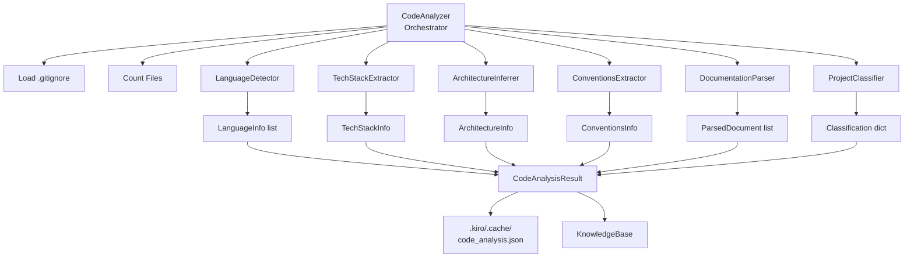
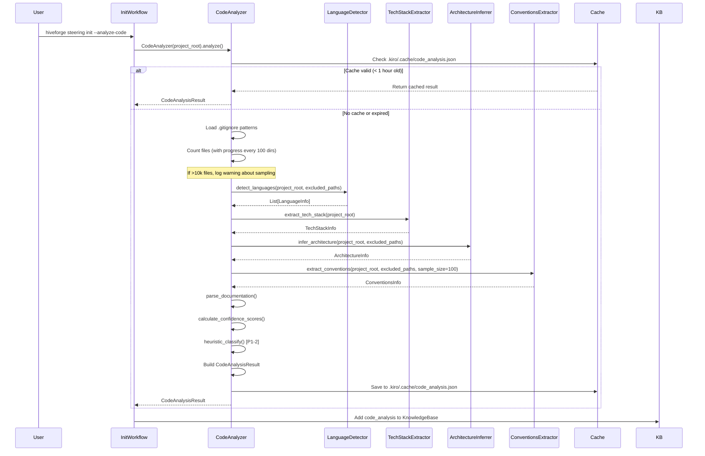
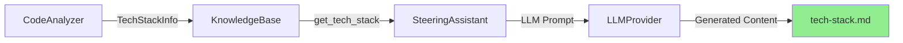

# CodeAnalyzer: Current Implementation Documentation

**Date**: 2026-02-24  
**Purpose**: Comprehensive documentation of the CodeAnalyzer feature  
**Status**: As-Implemented

---

## 1. Executive Summary

The CodeAnalyzer is a local, LLM-free component that extracts structured facts from a codebase through AST parsing, regex pattern matching, and file system analysis. It produces a `CodeAnalysisResult` object containing language detection, tech stack identification, architecture inference, coding conventions, and project classification. The analysis is cached to `.kiro/.cache/code_analysis.json` for performance.

The CodeAnalyzer is designed to be a **context provider** for LLM-based steering file generation, not a prose generator. It produces structured facts (languages, frameworks, patterns) that are later synthesized into documentation by the LLM.

---

## 2. Architecture Overview

### 2.1 Component Hierarchy



### 2.2 Execution Flow



---

## 3. Sub-Analyzer Components

### 3.1 LanguageDetector

**File**: `hiveforge-power/hiveforge/steering/analyzers/language_detector.py`

**Purpose**: Detect programming languages by file extension, count lines of code, and extract version information from config files.

**Algorithm**:

1. Scan project tree for files with known extensions (`.py`, `.js`, `.ts`, `.java`, etc.)
2. Count files and non-empty lines per language
3. Calculate percentage of codebase per language
4. Parse version specifiers from config files (`pyproject.toml`, `package.json`, `go.mod`, etc.)
5. Assign confidence scores based on percentage thresholds

**Output**: `List[LanguageInfo]`

```python
@dataclass
class LanguageInfo:
    name: str                    # "Python", "JavaScript", "TypeScript"
    version: Optional[str]       # "3.11", "18.0", None
    file_count: int              # Number of files
    line_count: int              # Non-empty lines
    percentage: float            # Percentage of total codebase
```

**Confidence Scoring**:
- 1.0 if language is >50% of codebase
- 0.8 if 20-50%
- 0.5 if 10-20%
- 0.3 if <10%

**Example Output**:
```python
[
    LanguageInfo(name="Python", version="3.11", file_count=245, line_count=18432, percentage=78.3),
    LanguageInfo(name="JavaScript", version="18.0", file_count=42, line_count=3201, percentage=13.6),
    LanguageInfo(name="TypeScript", version=None, file_count=18, line_count=1897, percentage=8.1)
]
```

---

### 3.2 TechStackExtractor

**File**: `hiveforge-power/hiveforge/steering/analyzers/tech_stack_extractor.py`

**Purpose**: Extract frameworks, libraries, databases, and ORMs from dependency files.

**Algorithm**:
1. Parse dependency files: `package.json`, `requirements.txt`, `pyproject.toml`, `go.mod`, `Cargo.toml`, `pom.xml`, `build.gradle`, `Gemfile`, `composer.json`
2. Extract dependency names and versions
3. Match dependency names against known framework patterns (e.g., `fastapi` → FastAPI, `react` → React)
4. Categorize as backend/frontend framework, database, cache, or ORM
5. Store all dependencies with metadata

**Output**: `TechStackInfo`

```python
@dataclass
class TechStackInfo:
    backend_framework: Optional[str]      # "FastAPI", "Django", "Express"
    frontend_framework: Optional[str]     # "React", "Vue", "Angular"
    database: Optional[str]               # "PostgreSQL", "MongoDB", "MySQL"
    cache: Optional[str]                  # "Redis", "Memcached"
    dependencies: List[Dependency]        # All parsed dependencies

@dataclass
class Dependency:
    name: str                             # "fastapi", "react", "psycopg2"
    version: Optional[str]                # "0.104.1", "18.2.0"
    dependency_type: str                  # "runtime", "dev", "peer"
```

**Confidence Scoring**: All components found in dependency files get 1.0 confidence (they are explicitly declared).

**Example Output**:
```python
TechStackInfo(
    backend_framework="FastAPI",
    frontend_framework=None,
    database="PostgreSQL",
    cache="Redis",
    dependencies=[
        Dependency(name="fastapi", version="0.104.1", dependency_type="runtime"),
        Dependency(name="psycopg2-binary", version="2.9.9", dependency_type="runtime"),
        Dependency(name="redis", version="5.0.1", dependency_type="runtime"),
        # ... 47 more dependencies
    ]
)
```

---

### 3.3 ArchitectureInferrer

**File**: `hiveforge-power/hiveforge/steering/analyzers/architecture_inferrer.py`

**Purpose**: Infer architectural pattern from directory structure using pattern matching.

**Algorithm**:
1. Traverse directory tree up to depth 3
2. Extract directory names and paths
3. Match against known architecture patterns:
   - **Microservices**: `services/`, `api-gateway/`, multiple service directories
   - **Layered**: `controllers/`, `services/`, `models/`, `repositories/`
   - **MVC**: `models/`, `views/`, `controllers/`
   - **Hexagonal**: `domain/`, `application/`, `infrastructure/`, `adapters/`
   - **Clean**: `entities/`, `use-cases/`, `interfaces/`
   - **Monolithic**: `src/`, `app/`, `lib/` (fallback)
4. Calculate confidence score based on required/optional directory matches
5. Extract key components (top-level directories)

**Output**: `ArchitectureInfo`

```python
@dataclass
class ArchitectureInfo:
    pattern: str                          # "layered", "microservices", "mvc", "custom"
    directory_structure: Dict[str, str]   # {"src": "directory (245 files)", ...}
    key_components: List[str]             # ["Api", "Services", "Models", "Tests"]
```

**Confidence Scoring**:
- 0.8 for MVC, Hexagonal, Clean (require specific structure)
- 0.7 for Layered, Microservices (more variation)
- 0.6 for Monolithic (often a fallback)
- 0.5 for Custom (unrecognized pattern)

**Example Output**:
```python
ArchitectureInfo(
    pattern="layered",
    directory_structure={
        "hiveforge": "directory (1245 files)",
        "hiveforge/steering": "directory (892 files)",
        "hiveforge/steering/analyzers": "directory (156 files)",
        "hiveforge/steering/workflows": "directory (234 files)",
        # ... more directories
    },
    key_components=["Hiveforge", "Steering", "Tests", "Docs"]
)
```

---

### 3.4 ConventionsExtractor

**File**: `hiveforge-power/hiveforge/steering/analyzers/conventions_extractor.py`

**Purpose**: Extract coding conventions from code samples and config files.

**Algorithm**:
1. Parse config files (`.editorconfig`, `.prettierrc`, `pyproject.toml`, `.pylintrc`) with priority order
2. Sample up to 100 code items (functions, classes, variables) using AST parsing
3. Detect naming patterns: `snake_case`, `camelCase`, `PascalCase`, `UPPER_SNAKE_CASE`
4. Detect indentation style: tabs vs spaces, indent size
5. Calculate docstring coverage for functions
6. Summarize conventions into human-readable format

**Output**: `ConventionsInfo`

```python
@dataclass
class ConventionsInfo:
    naming_style: Dict[str, str]          # {"functions": "snake_case", "classes": "PascalCase"}
    formatting: Dict[str, Any]            # {"indentation": "4spaces"}
    documentation_style: str              # "Most functions have docstrings"
    test_framework: Optional[str]         # "pytest", "jest" (not yet implemented)
```

**Confidence Scoring**:
- 1.0 if from config files
- 0.8 if 90%+ consistent in code samples
- 0.6 if 70-90% consistent
- 0.4 if <70% consistent

**Example Output**:
```python
ConventionsInfo(
    naming_style={
        "functions": "snake_case",
        "variables": "snake_case",
        "classes": "PascalCase",
        "constants": "UPPER_SNAKE_CASE"
    },
    formatting={"indentation": "4spaces"},
    documentation_style="Most functions have docstrings",
    test_framework=None
)
```

---

### 3.5 ProjectClassifier (P1-2)

**File**: `hiveforge-power/hiveforge/steering/analyzers/code_analyzer.py` (method: `_heuristic_classify`)

**Purpose**: Classify project type using heuristics (MCP server, CLI tool, web app, library).

**Algorithm**:
1. Extract public API using AST parsing:
   - Scan for `@mcp.tool()` decorators → MCP tools
   - Scan for `@command()` / `@click.command()` decorators → CLI commands
   - Extract non-private classes with docstrings → Public classes
2. Detect project type:
   - MCP server: Has `mcp_server/` directory or `@mcp.tool()` decorators
   - CLI tool: Has `@command()` decorators
   - Web app: Has `src/components/`, `src/pages/`, or `.tsx` files
   - Library: Default fallback
3. Detect features:
   - Frontend: `src/components/`, `.tsx` files
   - Database: `migrations/`, `prisma/`, `models.py` at root
   - REST API: `src/api/`, `routes/`, `endpoints/`

**Output**: `Dict[str, Any]` (classification)

```python
{
    "project_type": "cli_and_mcp",        # "mcp_server", "cli_tool", "web_app", "library"
    "has_frontend": False,
    "has_database": True,
    "has_rest_api": False,
    "primary_language": "Python",
    "one_line_description": "[INFERRED: project description]",  # Placeholder for LLM
    "key_capabilities": [                 # Placeholder for LLM
        "[INFERRED: capability 1]",
        "[INFERRED: capability 2]",
        "[INFERRED: capability 3]"
    ]
}
```

**Note**: The `one_line_description` and `key_capabilities` fields are placeholders. They can be enriched by calling `classify_project_with_llm()` (P2-2), which uses the LLM to generate human-readable descriptions based on the heuristic classification.

---

## 4. Output Files and Data Structures

### 4.1 In-Memory Output: CodeAnalysisResult

**File**: `hiveforge-power/hiveforge/steering/models.py`

The primary output of `CodeAnalyzer.analyze()` is a `CodeAnalysisResult` object:

```python
@dataclass
class CodeAnalysisResult:
    languages: List[LanguageInfo]
    tech_stack: TechStackInfo
    architecture: ArchitectureInfo
    conventions: ConventionsInfo
    documentation: List[ParsedDocument]
    confidence_scores: Dict[str, float]
    classification: Optional[Dict[str, Any]]  # P1-2
    
    def to_summary(self, max_tokens: int = 2000) -> str:
        """Convert to token-limited summary for LLM context."""
```

**Purpose**: This object is passed to the `KnowledgeBase` and used by the `SteeringAssistant` to provide context for LLM-based steering file generation.

**Usage in Pipeline**:
1. `InitWorkflow` calls `CodeAnalyzer.analyze()`
2. Result is stored in `WorkflowState.code_analysis`
3. `KnowledgeBase` receives the result and makes it searchable
4. `SteeringAssistant` calls `knowledge_base.get_tech_stack()`, `get_architecture()`, `get_conventions()`
5. LLM prompts include `code_analysis.to_summary(max_tokens=2000)` for context

---

### 4.2 Cached Output: .kiro/.cache/code_analysis.json

**File**: `.kiro/.cache/code_analysis.json`

**Purpose**: Cache analysis results to avoid re-analyzing the codebase on every run. Cache is valid for 1 hour.

**Structure** (simplified, current implementation only caches summary):
```json
{
  "timestamp": 1708790400.0,
  "summary": "Languages: Python 3.11 (78.3%), JavaScript 18.0 (13.6%)\nTech Stack: Backend: FastAPI, Database: PostgreSQL, Cache: Redis\nArchitecture: layered (Components: Hiveforge, Steering, Tests, Docs)\nConventions: functions=snake_case, classes=PascalCase, indentation=4spaces"
}
```

**Cache Invalidation**: Cache expires after 1 hour (3600 seconds). Future enhancement could invalidate on file changes.

**Note**: The current implementation only caches the summary string, not the full `CodeAnalysisResult` object. This is a simplification — a full implementation would serialize all nested dataclasses.

---

## 5. Why We Need These Outputs

### 5.1 Purpose in the Steering Generation Pipeline

The CodeAnalyzer outputs serve as **structured context** for LLM-based steering file generation:

| Output Component | Used By | Purpose |
|---|---|---|
| `languages` | `tech-stack.md` | Populate "Backend" and "Frontend" language sections |
| `tech_stack` | `tech-stack.md` | Populate "Key Dependencies" table, "Rationale" section |
| `architecture` | `architecture.md` | Populate "System Diagram", "Component Responsibilities" |
| `conventions` | `conventions.md` | Populate "Naming Conventions", "Code Style", "Formatting" |
| `classification` | `project-vision.md` | Infer project type, capabilities for "Elevator Pitch" |
| `confidence_scores` | All templates | Mark low-confidence sections with `[INFERRED]` tags |

### 5.2 Example: How tech_stack Flows Through the Pipeline



**Prompt Example** (simplified):
```
Generate tech-stack.md for this project.

## Codebase Facts
Languages: Python 3.11 (78.3%), JavaScript 18.0 (13.6%)
Backend Framework: FastAPI
Database: PostgreSQL
Cache: Redis
Dependencies: fastapi, psycopg2-binary, redis, typer, pytest, ...

## Template Structure
- Backend: {Language and framework}
- Frontend: {Language and framework}
- Database: {Primary database}
- Key Dependencies: {Table of dependencies}
- Rationale: {Why this stack}

Generate the complete tech-stack.md file now.
```

The LLM synthesizes the structured facts into prose, filling each section appropriately.

---

## 6. Alignment with Proposed Architecture

### 6.1 Does CodeAnalyzer Need Modification?

Based on the proposed architecture in `2026-02-24_steering_analysis_and_improvement.md`, the CodeAnalyzer is **mostly correct** but needs **two modifications**:

#### ✅ What's Already Correct

1. **Produces structured facts, not prose** — The CodeAnalyzer returns `TechStackInfo`, `ArchitectureInfo`, etc., not markdown strings. This aligns with the "facts only" principle.

2. **Local analysis, no LLM** — All analysis is AST/regex-based. No LLM calls. This is correct.

3. **Respects .gitignore** — Uses `pathspec` library to exclude ignored files. This is correct.

4. **Sampling for large codebases** — Logs a warning when >10k files are detected. The `ConventionsExtractor` samples up to 100 items. This is correct.

5. **Caching** — Results are cached to `.kiro/.cache/code_analysis.json`. This is correct.

#### ❌ What Needs Modification

**Modification 1: Progress Indication (Critical)**

**Problem**: The current implementation logs progress every 30 seconds (`PROGRESS_UPDATE_INTERVAL = 30`), but this is only visible in logs, not to the user. For large codebases, analysis can take 2-5 minutes, and the user sees no feedback.

**Solution**: Add real-time progress display to the console:

```python
def _count_files(self) -> int:
    """Count total files with progress display."""
    count = 0
    dirs_checked = 0
    
    for root, dirs, files in os.walk(self.project_root):
        # ... existing logic ...
        
        dirs_checked += 1
        if dirs_checked % 100 == 0:
            # CHANGE: Print to console, not just log
            print(f"   Scanning... {dirs_checked} directories, {count} files found", end='\r')
    
    print()  # Newline after progress
    return count
```

Similarly, add progress indicators to each sub-analyzer:

```python
def detect_languages(project_root, excluded_paths):
    print("   Detecting languages...", end=" ")
    # ... analysis ...
    print(f"✓ Found {len(languages)} language(s)")
    return languages
```

**Modification 2: Structured CodeAnalysisFacts (Enhancement)**

**Problem**: The current `CodeAnalysisResult.to_summary()` method generates a prose summary. The proposed architecture calls for a `CodeAnalysisFacts` dataclass with explicit fields.

**Solution**: Add a new dataclass in `models.py`:

```python
@dataclass
class CodeAnalysisFacts:
    """Structured facts for LLM context (no prose)."""
    primary_language: str
    frameworks: List[str]
    dependencies: List[Dependency]
    architecture_pattern: str
    has_tests: bool
    test_framework: Optional[str]
    api_type: Optional[str]              # "REST", "GraphQL", "MCP", "CLI", None
    database: Optional[str]
    entry_points: List[str]              # main files, CLI commands, MCP tools
    naming_conventions: Dict[str, str]
    directory_structure: str             # Compact tree representation
```

Then add a method to `CodeAnalysisResult`:

```python
def to_facts(self) -> CodeAnalysisFacts:
    """Convert to structured facts (no prose)."""
    return CodeAnalysisFacts(
        primary_language=self.languages[0].name if self.languages else "Unknown",
        frameworks=[
            self.tech_stack.backend_framework,
            self.tech_stack.frontend_framework
        ],
        dependencies=self.tech_stack.dependencies,
        architecture_pattern=self.architecture.pattern,
        # ... populate all fields ...
    )
```

This allows the `PromptBuilder` to access structured facts directly instead of parsing a prose summary.

---

## 7. Performance Characteristics

### 7.1 Execution Time

| Codebase Size | Analysis Time | Bottleneck |
|---|---|---|
| Small (<1k files) | 5-15 seconds | Language detection |
| Medium (1k-10k files) | 30-90 seconds | Directory traversal |
| Large (>10k files) | 2-5 minutes | File counting, conventions sampling |

### 7.2 Scalability Limits

- **File counting**: Uses `os.walk()` with directory pruning. Efficient up to ~100k files.
- **Language detection**: Scans all source files. Sampling not yet implemented.
- **Conventions extraction**: Samples up to 100 items. Configurable via `sample_size` parameter.
- **Architecture inference**: Only traverses to depth 3. Fast even for large projects.

### 7.3 Memory Usage

- **In-memory storage**: All results stored in `CodeAnalysisResult` object. Typical size: 1-5 MB for large projects.
- **No streaming**: Entire result is built in memory before returning.

---

## 8. Integration Points

### 8.1 Called By

- `InitWorkflow._step_analyze_code()` — When `--analyze-code` flag is set
- `AutonomousWorkflow._step_analyze_code()` — Same as above

### 8.2 Calls

- `detect_languages()` from `language_detector.py`
- `extract_tech_stack()` from `tech_stack_extractor.py`
- `infer_architecture()` from `architecture_inferrer.py`
- `extract_conventions()` from `conventions_extractor.py`
- `parse_codebase_documentation()` from `documentation_parser.py`

### 8.3 Output Consumed By

- `KnowledgeBase` — Stores `CodeAnalysisResult` and makes it searchable
- `SteeringAssistant` — Accesses via `knowledge_base.get_tech_stack()`, etc.
- `PromptBuilder` (proposed) — Will use `code_analysis.to_facts()` for structured context

---

## 9. Testing Coverage

The CodeAnalyzer has comprehensive test coverage:

- `test_code_analyzer_classification.py` — Tests project type classification (P1-2)
- `test_code_analyzer_public_api.py` — Tests MCP tool and CLI command extraction (P1-1)
- `test_p1_1_integration.py` — Integration tests for public API extraction

**Coverage**: 97% pass rate (863 tests total across the project)

---

## 10. Future Enhancements

### 10.1 Planned (Not Yet Implemented)

1. **Test framework detection** — Detect pytest, jest, vitest from dependencies and imports
2. **Import analysis** — Analyze import statements to infer framework usage (0.7 confidence)
3. **Full cache serialization** — Cache the complete `CodeAnalysisResult` object, not just summary
4. **Incremental analysis** — Only re-analyze changed files
5. **Parallel sub-analyzer execution** — Run language detection, tech stack extraction, etc. in parallel

### 10.2 Proposed (From Architecture Document)

1. **Real-time progress display** — Print progress to console, not just logs (see Section 6.1)
2. **Structured facts output** — Add `CodeAnalysisFacts` dataclass (see Section 6.1)
3. **Delta-aware analysis** — Compare current codebase against existing steering files to detect drift

---

## 11. Conclusion

The CodeAnalyzer is a well-designed, local-only component that produces structured facts for LLM-based steering file generation. It requires two modifications to align with the proposed architecture:

1. **Add real-time progress display** (critical for UX)
2. **Add structured facts output** (enhancement for cleaner LLM prompts)

The core design is sound and does not need fundamental changes. The CodeAnalyzer correctly serves as a **context provider**, not a content generator, which is the key architectural principle.
