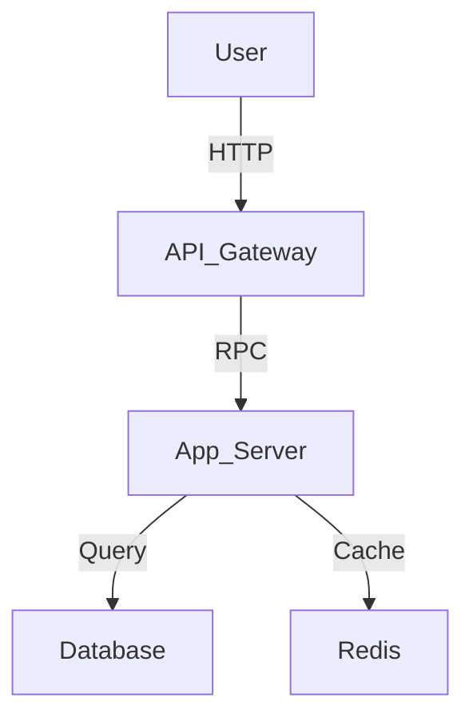

---
inclusion: always
priority: 1
description: "System design, component responsibilities, data flow."---

# Architecture Overview

## System Diagram

## Component Responsibilities
<!-- INFERRED: Please verify this section -->

### {Component 1}
- **Responsibility:** {What it does}
- **Interface:** {How others talk to it}
- **Dependencies:** {What it needs}

### {Component 2}
- **Responsibility:** {What it does}
- **Interface:** {How others talk to it}
- **Dependencies:** {What it needs}

<!-- END INFERRED -->

## Data Flow
1. {Step 1}
2. {Step 2}
3. {Step 3}

## Key Decisions

| Decision | Rationale | Trade-offs |
|----------|-----------|------------|
| {Decision} | {Why} | {What we gave up} |

## Scalability Considerations
- {How we handle growth}
- {Bottlenecks to watch}