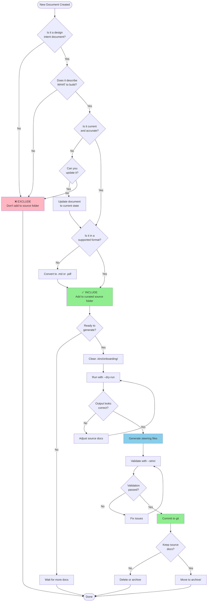

# Best Practices: Managing Source Documents in HiveForge Workflows

**Version**: 1.0  
**Date**: 2026-02-20  
**For**: HiveForge v2.1.0+

---

## TL;DR (Quick Reference)

| Rule | Action |
|------|--------|
| **Supported formats** | Only `.md`, `.pdf`, and image files. Other types ignored. |
| **Recursive scanning** | HiveForge scans ALL subdirectories. Curate carefully. |
| **Staging persistence** | `.kiro/onboarding/` keeps old files. Clean between pivots. |
| **Confidence weighting** | Source docs = 1.0, code = 0.8. Stale docs override code analysis. |
| **No auto-filtering** | HiveForge parses everything. YOU must curate. |
| **Design intent only** | Include specs, PRDs, architecture. Exclude meta-prompts, reports. |
| **Pivot workflow** | Clean staging → add pivot doc → `update --dry-run` → review → apply |
| **Git strategy** | Commit curated source docs. Don't commit staging folder. |
| **Folder hygiene** | Use separate curated folder, not `__DEVELOPMENT/` directly. |
| **When in doubt** | Run `--dry-run` first. Always. |

---

## 1. What Belongs in the Source Folder

### The Golden Rule

**Include documents that describe WHAT to build. Exclude documents that describe HOW you built it or WHAT you found.**

HiveForge treats source documents as ground truth (confidence weight 1.0). If you include a document, HiveForge assumes it's authoritative and current.

### HIGH VALUE Documents (Always Include)

- **Architecture specifications**: System design, component diagrams, data flow
- **Product requirements (PRDs)**: Features, user stories, acceptance criteria
- **Technical design docs**: API contracts, database schemas, integration patterns
- **Strategic decisions**: Tech stack choices, architectural decisions with rationale
- **Vision documents**: Project goals, success metrics, target users

**Example from your `__DEVELOPMENT/`**: 
- ✅ `_EXAMPLE_SourceDoc_GRLS_Parser.md` — detailed technical spec
- ✅ `KIRO_HiveForge_OriginalDocs/SteeringAssistantPowerConversionReqs.md` — requirements doc
- ✅ `steering_system_strategic_recommendations.md` — strategic decisions

### LOW VALUE / CONTAMINATING Documents (Always Exclude)

- **Meta-prompts**: Instructions for AI agents (e.g., `2026-02-17_metaprompt_*.md`)
- **Process artifacts**: Handover notes, meeting notes, status updates
- **Analysis outputs**: Red team reports, diagnostic reports, review reports
- **Test results**: Performance reports, test suite results, validation checklists
- **Temporary documents**: Questions, 2nd opinions, comparative analyses

**Example from your `__DEVELOPMENT/`**:
- ❌ `2026-02-17_metaprompt_steering_refactoring02.md` — meta-prompt (process artifact)
- ❌ `2026-02-18_HANDOVER.md` — handover notes (process artifact)
- ❌ `2026-02-19_RED_TEAM_report.md` — analysis output
- ❌ `phase_6_6_performance_testing_complete.md` — test results
- ❌ `installation_issues_report.md` — diagnostic report

### CONDITIONAL Documents (Use Judgment)

- **Rejected approaches**: Include ONLY if they explain why NOT to do something and that context is still relevant
- **Superseded designs**: Exclude unless they provide historical context that's still valuable
- **Comparative analyses**: Include ONLY if they document a final decision, not the analysis process

### Classification by File Type in `__DEVELOPMENT/`

| Document Type | Classification | Reason |
|---------------|----------------|--------|
| Technical specs (e.g., `_EXAMPLE_SourceDoc_GRLS_Parser.md`) | ✅ SAFE | Design intent, describes what to build |
| Requirements docs (e.g., `SteeringAssistantPowerConversionReqs.md`) | ✅ SAFE | Design intent, authoritative |
| Strategic recommendations (e.g., `steering_system_strategic_recommendations.md`) | ✅ SAFE | Design decisions with rationale |
| Meta-prompts (e.g., `2026-02-17_metaprompt_*.md`) | ❌ EXCLUDE | Process artifacts, not design intent |
| Handover notes (e.g., `2026-02-18_HANDOVER.md`) | ❌ EXCLUDE | Process artifacts, temporary status |
| Red team reports (e.g., `2026-02-19_RED_TEAM_report.md`) | ❌ EXCLUDE | Analysis outputs, not design intent |
| Test results (e.g., `phase_6_6_*.md`) | ❌ EXCLUDE | Process artifacts, temporary results |
| Installation reports (e.g., `installation_issues_report.md`) | ❌ EXCLUDE | Diagnostic outputs, not design |
| Spec summaries (e.g., `spec_summary_power_conversion.md`) | ⚠️ RISKY | May be outdated summary; prefer original spec |

---

## 2. The Temporal Problem: Keeping Documents Fresh

### The Core Risk

**HiveForge weights source documents at 1.0 (highest confidence). Stale documents will override what code analysis detects.**

If you include a 6-month-old architecture doc that says "we use MongoDB," but your code now uses PostgreSQL, HiveForge will likely generate steering files that say MongoDB because the document has higher confidence than code analysis (0.8).

### What HiveForge Does NOT Do

- ❌ Detect that a document is outdated
- ❌ Compare document dates against code commit dates
- ❌ Flag contradictions between documents and code
- ❌ Automatically prefer newer information over older

**The gap analysis checks for unfilled template sections, NOT for doc-vs-code discrepancies.**

### When a Document Becomes "Stale"

A source document is stale when:
1. The code has evolved past what the document describes
2. A pivot has changed the approach described in the document
3. The document describes a rejected or abandoned approach
4. The document's assumptions are no longer valid

### Recommended Strategy: Steering Files as Snapshots

**Default recommendation**: Treat steering files as the "current truth" and delete source documents after generation.

**Rationale**:
- Steering files are validated, complete, and reflect the actual generation output
- Keeping source docs creates temporal confusion ("which is current?")
- Steering files are in git, providing version history
- You can always regenerate from code if needed

**Alternative**: If you must keep source docs, use this discipline:
1. Date-prefix all source documents (e.g., `2026-02-20_architecture_v2.md`)
2. Delete superseded versions immediately after generating new steering files
3. Keep a `README.md` in the source folder explaining which docs are current
4. Review and prune source docs monthly

### Risk Matrix

| Scenario | Risk Level | Mitigation |
|----------|------------|------------|
| Keep ALL documents (including old) | 🔴 HIGH | Stale info contaminates steering files |
| Keep only latest version of each doc | 🟡 MEDIUM | Still risk of staleness if code evolved |
| Delete source docs after generation | 🟢 LOW | Steering files are the truth |
| Regenerate from code only (no docs) | 🟡 MEDIUM | Loses design intent, high inference |

---

## 3. The Pivot Workflow (Step-by-Step)

### Scenario

You have existing steering files from original documents. You did some coding. Now you're pivoting and have created a new document describing the pivot.

### Critical Understanding

**The staging folder (`.kiro/onboarding/`) persists files across runs.** When you used a custom `source_docs_path` during init, HiveForge copied/symlinked those files INTO `.kiro/onboarding/`. They're still there.

### Step-by-Step Workflow

#### Step 1: Create Your Pivot Document

```bash
# Create a clear, dated pivot document
# Location: Anywhere (you'll specify path later)
# Example: docs/pivot-2026-02-20-auth-strategy.md
```

**Document should include**:
- What's changing and why
- What's staying the same
- New architecture/tech stack decisions
- Updated success metrics or timeline

#### Step 2: Clean the Staging Folder

```bash
# CRITICAL: Remove old source documents from staging
rm -rf .kiro/onboarding/*

# Verify it's empty
ls -la .kiro/onboarding/
```

**Why**: Old documents from your initial run are still there. If you don't clean them, HiveForge will parse both old and new documents, creating contradictions.

#### Step 3: Preview the Update

```bash
# Run update with dry-run to see what would change
hiveforge steering update \
  --source-docs-path="docs/" \
  --dry-run

# Review the output carefully
# Look for:
# - Which steering files would be modified
# - What sections would change
# - Any warnings about conflicts
```

**Decision point**: Does the preview look correct?
- ✅ Yes → Proceed to Step 4
- ❌ No → Adjust your pivot document and repeat Step 3

#### Step 4: Choose Your Update Strategy

**Option A: Incremental Update (Recommended for Partial Pivots)**

Use when the pivot changes SOME aspects but keeps most of the project intact.

```bash
# Update existing steering files, preserving customizations
hiveforge steering update \
  --source-docs-path="docs/" \
  --preserve-customizations

# HiveForge will:
# - Parse your pivot document
# - Merge with existing steering files
# - Preserve sections you manually edited
# - Update sections that changed
```

**Option B: Fresh Generation (Recommended for Major Pivots)**

Use when the pivot is so significant that starting fresh makes more sense.

```bash
# Reset steering files to templates first
hiveforge steering reset --all

# Then generate fresh from pivot document
hiveforge steering init \
  --source-docs-path="docs/" \
  --analyze-code
```

**Option C: Selective Reset (Recommended for Targeted Pivots)**

Use when the pivot affects specific steering files (e.g., only architecture changed).

```bash
# Reset only affected files
hiveforge steering reset architecture.md
hiveforge steering reset tech-stack.md

# Then update
hiveforge steering update \
  --source-docs-path="docs/" \
  --files-to-update="architecture.md,tech-stack.md"
```

#### Step 5: Document the Pivot in swarm_state.md

```bash
# Edit swarm_state.md to record the pivot
nano swarm_state.md
```

**Add a section like**:

```markdown
## Project Evolution Log

### 2026-02-20: Pivot to OAuth Authentication

**Reason**: User feedback indicated preference for social login over email/password

**Changes**:
- Architecture: Removed password storage, added OAuth provider integration
- Tech Stack: Added Authlib library
- API Standards: Updated auth endpoints

**Steering Files Updated**:
- architecture.md
- tech-stack.md
- api-standards.md

**Source Document**: docs/pivot-2026-02-20-auth-strategy.md
```

#### Step 6: Validate and Commit

```bash
# Validate the updated steering files
hiveforge steering validate --strict

# If validation passes, commit
git add .kiro/steering/
git add swarm_state.md
git commit -m "docs: pivot to OAuth authentication

- Updated architecture.md with OAuth flow
- Updated tech-stack.md with Authlib
- Updated api-standards.md with new auth endpoints

See swarm_state.md for full pivot rationale"
```

### Handling Partial Contradictions

**Scenario**: Your pivot document says "use PostgreSQL" but your old documents said "use MongoDB" and some code still uses MongoDB.

**Approach**:
1. Be explicit in your pivot document: "Migrating from MongoDB to PostgreSQL. MongoDB code is legacy and will be removed."
2. Use `--dry-run` to see how HiveForge interprets the contradiction
3. If needed, manually edit the generated steering files to clarify the transition state
4. Document the migration plan in `swarm_state.md`

### Folder State at Each Step

```
# Before pivot
.kiro/onboarding/
  ├── old-architecture.md (from initial run)
  └── old-tech-stack.md (from initial run)

# After Step 2 (cleaning)
.kiro/onboarding/
  └── (empty)

# After Step 4 (update with new source path)
.kiro/onboarding/
  └── pivot-2026-02-20-auth-strategy.md (symlinked from docs/)

# After Step 6 (commit)
.kiro/steering/
  ├── architecture.md (updated)
  ├── tech-stack.md (updated)
  └── ... (other files)
```

---

## 4. Folder Strategy

### The Recursive Scanning Problem

**HiveForge scans recursively.** If you point `source_docs_path` at `__DEVELOPMENT/`, it will also scan `__DEVELOPMENT/KIRO_HiveForge_OriginalDocs/` and any other subfolders.

### Recommended: Curated Source Folder

**Create a dedicated, curated folder for source documents.**

```bash
# Create a curated source folder
mkdir -p docs/design

# Add only design intent documents
cp path/to/architecture-spec.md docs/design/
cp path/to/requirements.md docs/design/

# Use this folder with HiveForge
hiveforge steering init --source-docs-path="docs/design"
```

**Benefits**:
- Explicit control over what HiveForge sees
- No accidental inclusion of process artifacts
- Clear separation between "design docs" and "working docs"
- Easy to review and prune

### Anti-Pattern: Using `__DEVELOPMENT/` Directly

**Don't do this**:

```bash
# ❌ BAD: Points at your working folder
hiveforge steering init --source-docs-path="__DEVELOPMENT/"
```

**Why it's bad**:
- Includes meta-prompts, reports, handover notes
- Includes the `KIRO_HiveForge_OriginalDocs/` subfolder
- Mixes design intent with process artifacts
- Hard to know what HiveForge actually parsed

### Folder Structure for Multi-Pivot Projects

**Recommended structure**:

```
project/
├── docs/
│   ├── design/              # Current design docs (curated)
│   │   ├── architecture.md
│   │   ├── requirements.md
│   │   └── tech-stack.md
│   └── archive/             # Historical docs (not used by HiveForge)
│       ├── 2026-01-15-initial-design/
│       └── 2026-02-20-oauth-pivot/
├── .kiro/
│   ├── onboarding/          # Staging (managed by HiveForge, don't commit)
│   └── steering/            # Generated steering files (commit these)
└── __DEVELOPMENT/           # Working folder (not used by HiveForge)
```

**Workflow**:
1. Keep current design docs in `docs/design/`
2. When pivoting, move old docs to `docs/archive/YYYY-MM-DD-pivot-name/`
3. Add new pivot doc to `docs/design/`
4. Run HiveForge pointing at `docs/design/`

### Subfolders Within Source Folder

**Remember**: HiveForge scans recursively. If you use subfolders, ALL files in ALL subfolders will be included.

**Use subfolders for organization, not versioning**:

```
# ✅ GOOD: Organize by topic
docs/design/
├── architecture/
│   ├── system-overview.md
│   └── data-flow.md
└── requirements/
    ├── user-stories.md
    └── acceptance-criteria.md

# ❌ BAD: Organize by version (all versions will be parsed!)
docs/design/
├── v1/
│   └── architecture.md
└── v2/
    └── architecture.md
```

---

## 5. File Lifecycle and Hygiene

### Should Source Documents Be Committed to Git?

**Recommended: Yes, but only curated source docs.**

```bash
# ✅ Commit curated source docs
git add docs/design/
git commit -m "docs: add architecture specification"

# ❌ Don't commit staging folder
echo ".kiro/onboarding/" >> .gitignore

# ✅ Commit generated steering files
git add .kiro/steering/
git commit -m "docs: generate steering files from architecture spec"
```

**Rationale**:
- Source docs provide context for why steering files look the way they do
- Git history shows evolution of design intent
- Team members can review source docs in PRs
- Staging folder is transient and managed by HiveForge

### When to Delete Source Documents

**Safe to delete when**:
1. Steering files have been generated and validated
2. Steering files are committed to git
3. You're confident the steering files capture everything important
4. You don't need the source docs for reference

**Example workflow**:

```bash
# Generate steering files
hiveforge steering init --source-docs-path="docs/design"

# Validate
hiveforge steering validate --strict

# Commit steering files
git add .kiro/steering/
git commit -m "docs: generate steering files"

# Delete source docs (they're in git history if needed)
rm -rf docs/design/

# Or move to archive
mv docs/design/ docs/archive/2026-02-20-initial-design/
```

### Long-Running Projects (6+ Months, Multiple Pivots)

**Recommended approach**:

1. **Keep a "living" design doc** that you update continuously:
   ```
   docs/design/CURRENT_ARCHITECTURE.md
   ```
   - Update this doc when you pivot
   - Regenerate steering files from it periodically
   - Commit updates to git

2. **Archive old versions** with clear dates:
   ```
   docs/archive/
   ├── 2026-01-15-initial-design/
   ├── 2026-02-20-oauth-pivot/
   └── 2026-03-10-microservices-pivot/
   ```

3. **Regenerate steering files monthly** to catch drift:
   ```bash
   # Monthly maintenance
   hiveforge steering update --source-docs-path="docs/design" --dry-run
   # Review changes, then apply if needed
   ```

### Staging Folder Cleanup

**Critical**: `.kiro/onboarding/` accumulates files across runs.

**Clean it**:
- Before every pivot
- Before regenerating steering files
- When switching source document sets

```bash
# Clean staging folder
rm -rf .kiro/onboarding/*

# Verify
ls -la .kiro/onboarding/
# Should be empty or show only .gitkeep
```

---

## 6. The `__DEVELOPMENT/` Folder: What Fits and What Contaminates

### Classification of Document Types

Based on analysis of your actual `__DEVELOPMENT/` folder:

| Document Type | Classification | Reason | Example |
|---------------|----------------|--------|---------|
| **Technical specs** | ✅ SAFE | Design intent, describes system to build | `_EXAMPLE_SourceDoc_GRLS_Parser.md` |
| **Requirements docs** | ✅ SAFE | Authoritative, describes what to build | `SteeringAssistantPowerConversionReqs.md` |
| **Strategic recommendations** | ✅ SAFE | Design decisions with rationale | `steering_system_strategic_recommendations.md` |
| **Meta-prompts** | ❌ EXCLUDE | Process artifacts, instructions for AI | `2026-02-17_metaprompt_*.md` |
| **Handover notes** | ❌ EXCLUDE | Temporary status, not design intent | `2026-02-18_HANDOVER.md` |
| **Red team reports** | ❌ EXCLUDE | Analysis outputs, not design decisions | `2026-02-19_RED_TEAM_report.md` |
| **Test results** | ❌ EXCLUDE | Process artifacts, temporary results | `phase_6_6_*.md` |
| **Diagnostic reports** | ❌ EXCLUDE | Analysis outputs, not design | `steering_system_review_report_*.md` |
| **Installation reports** | ❌ EXCLUDE | Troubleshooting notes, not design | `installation_issues_report.md` |
| **Spec summaries** | ⚠️ RISKY | May be outdated; prefer original spec | `spec_summary_power_conversion.md` |
| **Comparative analyses** | ⚠️ RISKY | Include only if they document final decision | `AGENT_4_COMPARATIVE_ANALYSIS_PATTERNS.md` |

### Recommendation: Don't Use `__DEVELOPMENT/` Directly

**Create a separate curated folder instead.**

```bash
# ❌ DON'T DO THIS
hiveforge steering init --source-docs-path="__DEVELOPMENT/"

# ✅ DO THIS INSTEAD
mkdir -p docs/design
cp __DEVELOPMENT/_EXAMPLE_SourceDoc_GRLS_Parser.md docs/design/
cp __DEVELOPMENT/KIRO_HiveForge_OriginalDocs/SteeringAssistantPowerConversionReqs.md docs/design/
cp __DEVELOPMENT/steering_system_strategic_recommendations.md docs/design/

hiveforge steering init --source-docs-path="docs/design/"
```

**Why**:
- `__DEVELOPMENT/` contains 23 files, but only ~5 are design intent
- Recursive scanning will include `KIRO_HiveForge_OriginalDocs/` subfolder
- Meta-prompts and reports will contaminate steering files
- Hard to maintain as `__DEVELOPMENT/` grows

### If You Must Use `__DEVELOPMENT/`

**Mitigation strategy**:

1. **Create a `.hiveforge-ignore` file** (if supported in future versions)
2. **Use subfolders**:
   ```
   __DEVELOPMENT/
   ├── design/              # Only design docs here
   │   ├── spec.md
   │   └── requirements.md
   └── process/             # Everything else here
       ├── meta-prompts/
       ├── reports/
       └── handovers/
   ```
   Then use: `--source-docs-path="__DEVELOPMENT/design/"`

3. **Manually curate before each run**:
   ```bash
   # Copy only design docs to staging
   rm -rf .kiro/onboarding/*
   cp __DEVELOPMENT/_EXAMPLE_SourceDoc_GRLS_Parser.md .kiro/onboarding/
   cp __DEVELOPMENT/steering_system_strategic_recommendations.md .kiro/onboarding/
   
   # Run without source-docs-path (uses staging directly)
   hiveforge steering init
   ```

---

## Appendix: Decision Flowchart



---

## Quick Reference: Common Scenarios

### Scenario 1: First Time Setup

```bash
mkdir -p docs/design
# Add your design docs to docs/design/
hiveforge steering init --source-docs-path="docs/design" --dry-run
# Review output
hiveforge steering init --source-docs-path="docs/design"
hiveforge steering validate --strict
git add .kiro/steering/ docs/design/
git commit -m "docs: initial steering files"
```

### Scenario 2: Pivot

```bash
# Create pivot document
vim docs/design/pivot-oauth.md

# Clean staging
rm -rf .kiro/onboarding/*

# Preview
hiveforge steering update --source-docs-path="docs/design" --dry-run

# Apply
hiveforge steering update --source-docs-path="docs/design"

# Document in swarm_state.md
vim swarm_state.md

# Commit
git add .kiro/steering/ docs/design/ swarm_state.md
git commit -m "docs: pivot to OAuth authentication"
```

### Scenario 3: Monthly Refresh

```bash
# Update your living design doc
vim docs/design/CURRENT_ARCHITECTURE.md

# Clean staging
rm -rf .kiro/onboarding/*

# Preview changes
hiveforge steering update --source-docs-path="docs/design" --dry-run

# Apply if needed
hiveforge steering update --source-docs-path="docs/design"
```

---

**Remember**: HiveForge is a tool, not a mind reader. The quality of your steering files depends entirely on the quality and currency of your source documents. Curate carefully.
