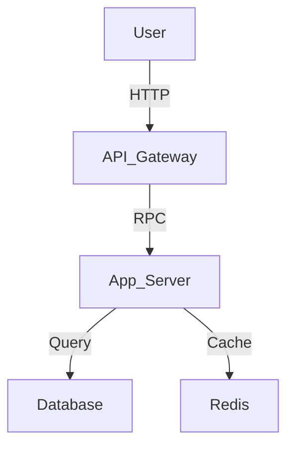

---
inclusion: always
priority: 1
description: "System design, component responsibilities, data flow."---

# Architecture Overview

## System Diagram

## Component Responsibilities

### Architecture Pattern: custom
Components: .Kiro, Docs, Hiveforge, Hiveforge Steering Mcp.Egg Info, Mcp Server, Scripts
- **Responsibility:** Architecture Pattern: custom
Components: .Kiro, Docs, Hiveforge, Hiveforge Steering Mcp.Egg Info, Mcp Server, Scripts
- **Interface:** Architecture Pattern: custom
Components: .Kiro, Docs, Hiveforge, Hiveforge Steering Mcp.Egg Info, Mcp Server, Scripts
- **Dependencies:** Architecture Pattern: custom
Components: .Kiro, Docs, Hiveforge, Hiveforge Steering Mcp.Egg Info, Mcp Server, Scripts

### Architecture Pattern: custom
Components: .Kiro, Docs, Hiveforge, Hiveforge Steering Mcp.Egg Info, Mcp Server, Scripts
- **Responsibility:** Architecture Pattern: custom
Components: .Kiro, Docs, Hiveforge, Hiveforge Steering Mcp.Egg Info, Mcp Server, Scripts
- **Interface:** Architecture Pattern: custom
Components: .Kiro, Docs, Hiveforge, Hiveforge Steering Mcp.Egg Info, Mcp Server, Scripts
- **Dependencies:** Architecture Pattern: custom
Components: .Kiro, Docs, Hiveforge, Hiveforge Steering Mcp.Egg Info, Mcp Server, Scripts

## Data Flow
1. {Step 1}
2. {Step 2}
3. {Step 3}

## Key Decisions

| Decision | Rationale | Trade-offs |
|----------|-----------|------------|
| {Decision} | {Why} | {What we gave up} |

## Scalability Considerations
- {How we handle growth}
- {Bottlenecks to watch}